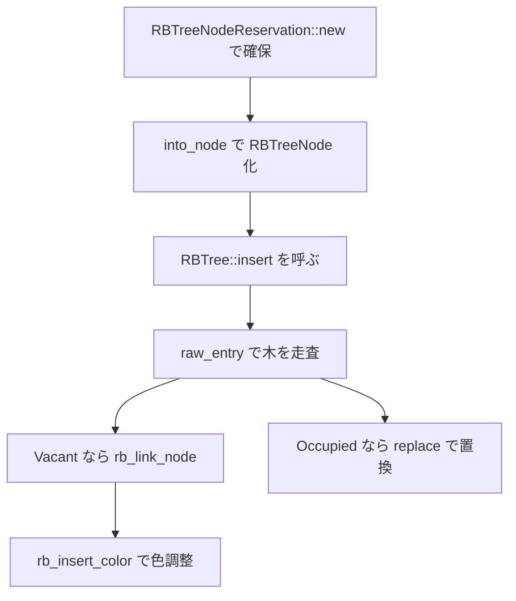

# 第15章 RBTree と木の所有権モデル

> 本章で読むソース
>
> - [`rust/kernel/rbtree.rs`](https://github.com/gregkh/linux/blob/v6.18.38/rust/kernel/rbtree.rs)

## この章の狙い

`RBTree<K, V>` が C の `rb_root` を包み、`RBTreeNodeReservation` で確保と挿入を型レベルで分離する設計を追う。
`insert` がロック内で `K::cmp` と置換 drop を走らせ得る点と、`Reservation` と `Node` の双方向線形所有権を機構レベルで示す。

## 前提

[第8章](../part02-memory-ownership/08-allocator-gfp.md) で `KBox` と `Flags` を読んでいること。
[第11章](../part03-synchronization/11-lock-mutex-spinlock.md) で `SpinLock` を読んでいること。

## RBTree の構造と C への委譲

`RBTree<K, V>` は `bindings::rb_root` を直接保持する。
ノードは `Node<K, V>` として `links: bindings::rb_node` を先頭フィールドに持つ intrusive 構造である。

[`rust/kernel/rbtree.rs` L171-L174](https://github.com/gregkh/linux/blob/v6.18.38/rust/kernel/rbtree.rs#L171-L174)

```rust
pub struct RBTree<K, V> {
    root: bindings::rb_root,
    _p: PhantomData<Node<K, V>>,
}
```

Rust 側は木のバランス回転ロジックを持たない。
リンク位置決定のみを担い、色調整とバランシングは C の `rb_insert_color` に委譲する。

## ノード事前確保とロック外への失敗追い出し

`RBTreeNodeReservation` は `KBox<MaybeUninit<Node<K, V>>>` としてメモリだけ先に確保する。

[`rust/kernel/rbtree.rs` L1036-L1071](https://github.com/gregkh/linux/blob/v6.18.38/rust/kernel/rbtree.rs#L1036-L1071)

```rust
pub struct RBTreeNodeReservation<K, V> {
    node: KBox<MaybeUninit<Node<K, V>>>,
}

impl<K, V> RBTreeNodeReservation<K, V> {
    /// Allocates memory for a node to be eventually initialised and inserted into the tree via a
    /// call to [`RBTree::insert`].
    pub fn new(flags: Flags) -> Result<RBTreeNodeReservation<K, V>> {
        Ok(RBTreeNodeReservation {
            node: KBox::new_uninit(flags)?,
        })
    }
}

impl<K, V> RBTreeNodeReservation<K, V> {
    /// Initialises a node reservation.
    ///
    /// It then becomes an [`RBTreeNode`] that can be inserted into a tree.
    pub fn into_node(self, key: K, value: V) -> RBTreeNode<K, V> {
        let node = KBox::write(
            self.node,
            Node {
                key,
                value,
                links: bindings::rb_node::default(),
            },
        );
        RBTreeNode { node }
    }
}
```

スピンロック下での挿入例は、ロック取得前に `RBTreeNode::new` でノードを確保し、ロック中は `insert` だけを呼ぶパターンである。

[`rust/kernel/rbtree.rs` L100-L112](https://github.com/gregkh/linux/blob/v6.18.38/rust/kernel/rbtree.rs#L100-L112)

```rust
/// use kernel::{alloc::flags, rbtree::{RBTree, RBTreeNode}, sync::SpinLock};
///
/// fn insert_test(tree: &SpinLock<RBTree<u32, u32>>) -> Result {
///     // Pre-allocate node. This may fail (as it allocates memory).
///     let node = RBTreeNode::new(10, 100, flags::GFP_KERNEL)?;
///
///     // Insert node while holding the lock. It is guaranteed to succeed with no allocation
///     // attempts.
///     let mut guard = tree.lock();
///     guard.insert(node);
///     Ok(())
/// }
```

`into_reservation` で削除したノードの確保を再利用できる。

[`rust/kernel/rbtree.rs` L1105-L1117](https://github.com/gregkh/linux/blob/v6.18.38/rust/kernel/rbtree.rs#L1105-L1117)

```rust
    /// Drop the key and value, but keep the allocation.
    ///
    /// It then becomes a reservation that can be re-initialised into a different node (i.e., with
    /// a different key and/or value).
    ///
    /// The existing key and value are dropped in-place as part of this operation, that is, memory
    /// may be freed (but only for the key/value; memory for the node itself is kept for reuse).
    pub fn into_reservation(self) -> RBTreeNodeReservation<K, V> {
        RBTreeNodeReservation {
            node: KBox::drop_contents(self.node),
        }
    }
```

### 高速化と最適化の工夫

`RBTreeNodeReservation` は「確保」と「挿入」を型レベルで分離する。
`insert` が保証するのは追加確保と失敗経路がないことである。

[`rust/kernel/rbtree.rs` L295-L309](https://github.com/gregkh/linux/blob/v6.18.38/rust/kernel/rbtree.rs#L295-L309)

```rust
    /// Inserts a new node into the tree.
    ///
    /// It overwrites a node if one already exists with the same key and returns it (containing the
    /// key/value pair). Returns [`None`] if a node with the same key didn't already exist.
    ///
    /// This function always succeeds.
    pub fn insert(&mut self, node: RBTreeNode<K, V>) -> Option<RBTreeNode<K, V>> {
        match self.raw_entry(&node.node.key) {
            RawEntry::Occupied(entry) => Some(entry.replace(node)),
            RawEntry::Vacant(entry) => {
                entry.insert(node);
                None
            }
        }
    }
```

ロック中は完全に無害ではない。
同一 key の置換では古い `RBTreeNode` が返り、ロック内で `drop` すれば `K`/`V` の destructor が走り得る。
`K::cmp` は `raw_entry` の木走査でロック内で実行される。

[`rust/kernel/rbtree.rs` L335-L354](https://github.com/gregkh/linux/blob/v6.18.38/rust/kernel/rbtree.rs#L335-L354)

```rust
        while !(*child_field_of_parent).is_null() {
            let curr = *child_field_of_parent;
            // SAFETY: All links fields we create are in a `Node<K, V>`.
            let node = unsafe { container_of!(curr, Node<K, V>, links) };

            // SAFETY: `node` is a non-null node so it is valid by the type invariants.
            match key.cmp(unsafe { &(*node).key }) {
                // SAFETY: `curr` is a non-null node so it is valid by the type invariants.
                Ordering::Less => child_field_of_parent = unsafe { &mut (*curr).rb_left },
                // SAFETY: `curr` is a non-null node so it is valid by the type invariants.
                Ordering::Greater => child_field_of_parent = unsafe { &mut (*curr).rb_right },
                Ordering::Equal => {
                    return RawEntry::Occupied(OccupiedEntry {
                        rbtree: self,
                        node_links: curr,
                    })
                }
            }
            parent = curr;
        }
```

`Reservation` と `Node` の間は `into_node` と `into_reservation` で双方向に遷移できる。

## raw_entry と rb_link_node

`raw_entry` は木を手動で辿り、`parent` と `child_field_of_parent` を決定する。
`RawVacantEntry::insert` が `rb_link_node` と `rb_insert_color` を呼ぶ。

[`rust/kernel/rbtree.rs` L1160-L1182](https://github.com/gregkh/linux/blob/v6.18.38/rust/kernel/rbtree.rs#L1160-L1182)

```rust
    fn insert(self, node: RBTreeNode<K, V>) -> &'a mut V {
        let node = KBox::into_raw(node.node);

        // SAFETY: `node` is valid at least until we call `KBox::from_raw`, which only happens when
        // the node is removed or replaced.
        let node_links = unsafe { addr_of_mut!((*node).links) };

        // INVARIANT: We are linking in a new node, which is valid. It remains valid because we
        // "forgot" it with `KBox::into_raw`.
        // SAFETY: The type invariants of `RawVacantEntry` are exactly the safety requirements of `rb_link_node`.
        unsafe { bindings::rb_link_node(node_links, self.parent, self.child_field_of_parent) };

        // SAFETY: All pointers are valid. `node` has just been inserted into the tree.
        unsafe { bindings::rb_insert_color(node_links, addr_of_mut!((*self.rbtree).root)) };

        // SAFETY: The node is valid until we remove it from the tree.
        unsafe { &mut (*node).value }
    }
```

同一 key の置換は `rb_replace_node` を使う。

[`rust/kernel/rbtree.rs` L1254-L1273](https://github.com/gregkh/linux/blob/v6.18.38/rust/kernel/rbtree.rs#L1254-L1273)

```rust
    fn replace(self, node: RBTreeNode<K, V>) -> RBTreeNode<K, V> {
        let node = KBox::into_raw(node.node);

        // SAFETY: `node` is valid at least until we call `KBox::from_raw`, which only happens when
        // the node is removed or replaced.
        let new_node_links = unsafe { addr_of_mut!((*node).links) };

        // SAFETY: This updates the pointers so that `new_node_links` is in the tree where
        // `self.node_links` used to be.
        unsafe {
            bindings::rb_replace_node(self.node_links, new_node_links, &mut self.rbtree.root)
        };

        // SAFETY:
        // - `self.node_ptr` produces a valid pointer to a node in the tree.
        // - Now that we removed this entry from the tree, we can convert the node to a box.
        let old_node = unsafe { KBox::from_raw(container_of!(self.node_links, Node<K, V>, links)) };

        RBTreeNode { node: old_node }
    }
```

### try_create_and_insert のフロー



## Drop と Cursor による所有権移動

`Drop for RBTree` は後順走査で全ノードを `KBox::from_raw` して解放する。

[`rust/kernel/rbtree.rs` L487-L507](https://github.com/gregkh/linux/blob/v6.18.38/rust/kernel/rbtree.rs#L487-L507)

```rust
impl<K, V> Drop for RBTree<K, V> {
    fn drop(&mut self) {
        // SAFETY: `root` is valid as it's embedded in `self` and we have a valid `self`.
        let mut next = unsafe { bindings::rb_first_postorder(&self.root) };

        // INVARIANT: The loop invariant is that all tree nodes from `next` in postorder are valid.
        while !next.is_null() {
            // SAFETY: All links fields we create are in a `Node<K, V>`.
            let this = unsafe { container_of!(next, Node<K, V>, links) };

            // Find out what the next node is before disposing of the current one.
            // SAFETY: `next` and all nodes in postorder are still valid.
            next = unsafe { bindings::rb_next_postorder(next) };

            // INVARIANT: This is the destructor, so we break the type invariant during clean-up,
            // but it is not observable. The loop invariant is still maintained.

            // SAFETY: `this` is valid per the loop invariant.
            unsafe { drop(KBox::from_raw(this)) };
        }
    }
}
```

`Cursor::remove_current` は `KBox::from_raw` でノードを取り戻し、`rb_erase` で木から切り離す。

[`rust/kernel/rbtree.rs` L765-L776](https://github.com/gregkh/linux/blob/v6.18.38/rust/kernel/rbtree.rs#L765-L776)

```rust
    pub fn remove_current(self) -> (Option<Self>, RBTreeNode<K, V>) {
        let prev = self.get_neighbor_raw(Direction::Prev);
        let next = self.get_neighbor_raw(Direction::Next);
        // SAFETY: By the type invariant of `Self`, all non-null `rb_node` pointers stored in `self`
        // point to the links field of `Node<K, V>` objects.
        let this = unsafe { container_of!(self.current.as_ptr(), Node<K, V>, links) };
        // SAFETY: `this` is valid by the type invariants as described above.
        let node = unsafe { KBox::from_raw(this) };
        let node = RBTreeNode { node };
        // SAFETY: The reference to the tree used to create the cursor outlives the cursor, so
        // the tree cannot change. By the tree invariant, all nodes are valid.
        unsafe { bindings::rb_erase(&mut (*this).links, addr_of_mut!(self.tree.root)) };
```

[`rust/kernel/rbtree.rs` L1276-L1280](https://github.com/gregkh/linux/blob/v6.18.38/rust/kernel/rbtree.rs#L1276-L1280)

```rust
struct Node<K, V> {
    links: bindings::rb_node,
    key: K,
    value: V,
}
```

## 7.1.3 との対比

rbtree.rs は 1280行から1433行へ増加した。
実質的な拡張は `Cursor` の分割が中心である。

v6.18.38 では `Cursor<'a, K, V>` が `&'a mut RBTree<K, V>` を保持する単一の可変カーソルだった。
v7.1.3 では読み取り専用の `Cursor` と可変操作を持つ `CursorMut` に分割された。

比較版 v7.1.3。

[`rust/kernel/rbtree.rs` L814-L817](https://github.com/gregkh/linux/blob/v7.1.3/rust/kernel/rbtree.rs#L814-L817)

```rust
pub struct Cursor<'a, K, V> {
    _tree: PhantomData<&'a RBTree<K, V>>,
    current: NonNull<bindings::rb_node>,
}
```

`cursor_front`/`cursor_back`/`cursor_lower_bound` は `&self` を取る読み取り専用版となり、可変版は `cursor_front_mut` 等へリネームされた。
`cursor_lower_bound` の共通ロジックは `find_best_match` ヘルパーに切り出された。

[`rust/kernel/rbtree.rs` L494-L512](https://github.com/gregkh/linux/blob/v7.1.3/rust/kernel/rbtree.rs#L494-L512)

```rust
    fn find_best_match(&self, key: &K) -> Option<NonNull<bindings::rb_node>> {
        let mut node = self.root.rb_node;
        let mut best_key: Option<&K> = None;
        let mut best_links: Option<NonNull<bindings::rb_node>> = None;
        while !node.is_null() {
            // SAFETY: By the type invariant of `Self`, all non-null `rb_node` pointers stored in `self`
            // point to the links field of `Node<K, V>` objects.
            let this = unsafe { container_of!(node, Node<K, V>, links) };
            // SAFETY: `this` is a non-null node so it is valid by the type invariants.
            let this_key = unsafe { &(*this).key };

            // SAFETY: `node` is a non-null node so it is valid by the type invariants.
            let node_ref = unsafe { &*node };

            match key.cmp(this_key) {
                Ordering::Equal => {
                    // SAFETY: `this` is a non-null node so it is valid by the type invariants.
                    best_links = Some(unsafe { NonNull::new_unchecked(&mut (*this).links) });
                    break;
                }
```

共有参照でも木を走査できる `Cursor` が新設された点が、6.18 からの実質拡張である。
`insert` と `RBTreeNodeReservation` の契約自体は不変である。

## まとめ

`RBTree` は C の赤黒木 API へリンク位置決定を委譲し、Rust 側は `KBox` によるノード所有権を管理する。
`RBTreeNodeReservation` は確保失敗をロック区間から追い出し、`insert` は追加確保なしで挿入する。
v7.1.3 では読み取り専用 `Cursor` と `CursorMut` への分割が主な差分である。

## 関連する章

- [第8章 アロケータと GFP フラグ](../part02-memory-ownership/08-allocator-gfp.md)
- [第11章 Lock 抽象と Mutex と SpinLock と locked_by](../part03-synchronization/11-lock-mutex-spinlock.md)
- [第14章 侵入型リストと ListArc](14-intrusive-list.md)
- [第16章 XArray と Maple Tree による索引](16-xarray-maple-tree.md)
