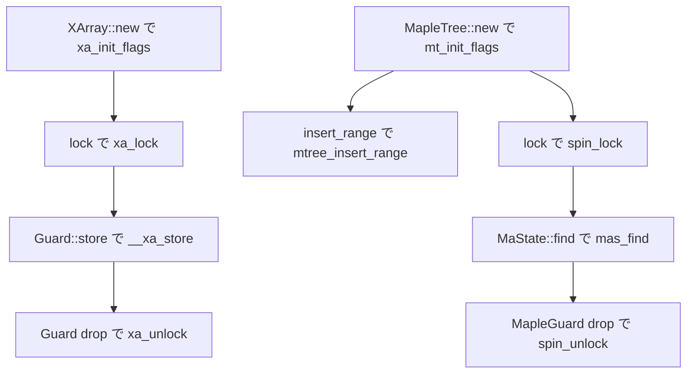

# 第16章 XArray と Maple Tree

> 本章で読むソース
>
> - [`rust/kernel/xarray.rs`](https://github.com/gregkh/linux/blob/v6.18.38/rust/kernel/xarray.rs)
> - [`rust/kernel/maple_tree.rs`](https://github.com/gregkh/linux/blob/v6.18.38/rust/kernel/maple_tree.rs)

## この章の狙い

本章では、整数インデックスをキーに値を保持する2つの C ラッパーを読む。
**XArray** は疎な整数インデックス向け、**Maple Tree** は重ならない範囲インデックス向けである。
どちらも [`ForeignOwnable`](../part01-language-foundation/06-types-opaque-aref.md) で Rust 所有権を C ポインタへ変換する。
XArray はロック取得に `Guard` を必須とするのに対し、Maple Tree の `insert_range`/`erase` は `&self` から C 側の `mtree_insert_range`/`mtree_erase` を直接呼び、内部ロックの扱いは C 側の通常 API に委ねる。
`MapleGuard` が必要になるのは `load` や `MaState` の可変借用を伴う経路であり、ガードの `!Send` 表現は経路が異なる点も押さえる。

## 前提

[第6章](../part01-language-foundation/06-types-opaque-aref.md) で `ForeignOwnable` を読んでいること。
[第9章](../part02-memory-ownership/09-kbox-kvec.md) で `KBox` を読んでいること。
[第11章](../part03-synchronization/11-lock-mutex-spinlock.md) でスピンロックの考え方を読んでいること。

## XArray の役割と型不変条件

`XArray<T>` は `bindings::xarray` を `Opaque` で包み、各エントリは `XA_ZERO_ENTRY` か `T::into_foreign` 由来のポインタである。

[`rust/kernel/xarray.rs` L16-L24](https://github.com/gregkh/linux/blob/v6.18.38/rust/kernel/xarray.rs#L16-L24)

```rust
/// An array which efficiently maps sparse integer indices to owned objects.
///
/// This is similar to a [`crate::alloc::kvec::Vec<Option<T>>`], but more efficient when there are
/// holes in the index space, and can be efficiently grown.
///
/// # Invariants
///
/// `self.xa` is always an initialized and valid [`bindings::xarray`] whose entries are either
/// `XA_ZERO_ENTRY` or came from `T::into_foreign`.
```

[`Vec<Option<T>>`](../part02-memory-ownership/09-kbox-kvec.md) は穴を `None` という実体要素で埋めるため、疎なインデックス空間ではメモリを消費する。
C の XArray 実装は `xa_node` を用いた多段インデックス木であり、穴を実体要素として持たずに疎なキー空間を表せる点が有利になる。
`AllocKind` で先頭インデックスを 0 か 1 に切り替えられる。

[`rust/kernel/xarray.rs` L55-L60](https://github.com/gregkh/linux/blob/v6.18.38/rust/kernel/xarray.rs#L55-L60)

```rust
#[pin_data(PinnedDrop)]
pub struct XArray<T: ForeignOwnable> {
    #[pin]
    xa: Opaque<bindings::xarray>,
    _p: PhantomData<T>,
}
```

## XArray のロックと Guard

`lock` は C の `xa_lock` を呼び、`Guard` を返す。
`Guard` は `NotThreadSafe` フィールドを持ち、スレッド間移動を型で抑止する。

[`rust/kernel/xarray.rs` L134-L153](https://github.com/gregkh/linux/blob/v6.18.38/rust/kernel/xarray.rs#L134-L153)

```rust
    /// Locks the [`XArray`] for exclusive access.
    pub fn lock(&self) -> Guard<'_, T> {
        // SAFETY: `self.xa` is always valid by the type invariant.
        unsafe { bindings::xa_lock(self.xa.xa.get()) };

        Guard {
            xa: self,
            _not_send: NotThreadSafe,
        }
    }
}

/// A lock guard.
///
/// The lock is unlocked when the guard goes out of scope.
#[must_use = "the lock unlocks immediately when the guard is unused"]
pub struct Guard<'a, T: ForeignOwnable> {
    xa: &'a XArray<T>,
    _not_send: NotThreadSafe,
}
```

`Drop` で `xa_unlock` が呼ばれ、スコープ終了と同時にロックが解放される。

## XArray の読み書きと StoreError

`load` は `xa_load` でポインタを取り、`T::borrow` へ渡す。
`store` は `into_foreign` 後に `__xa_store` を呼び、失敗時は値を `StoreError` に載せて返す。

[`rust/kernel/xarray.rs` L180-L196](https://github.com/gregkh/linux/blob/v6.18.38/rust/kernel/xarray.rs#L180-L196)

```rust
impl<'a, T: ForeignOwnable> Guard<'a, T> {
    fn load<F, U>(&self, index: usize, f: F) -> Option<U>
    where
        F: FnOnce(NonNull<c_void>) -> U,
    {
        // SAFETY: `self.xa.xa` is always valid by the type invariant.
        let ptr = unsafe { bindings::xa_load(self.xa.xa.get(), index) };
        let ptr = NonNull::new(ptr.cast())?;
        Some(f(ptr))
    }

    /// Provides a reference to the element at the given index.
    pub fn get(&self, index: usize) -> Option<T::Borrowed<'_>> {
        self.load(index, |ptr| {
            // SAFETY: `ptr` came from `T::into_foreign`.
            unsafe { T::borrow(ptr.as_ptr()) }
        })
    }
```

[`rust/kernel/xarray.rs` L227-L256](https://github.com/gregkh/linux/blob/v6.18.38/rust/kernel/xarray.rs#L227-L256)

```rust
    pub fn store(
        &mut self,
        index: usize,
        value: T,
        gfp: alloc::Flags,
    ) -> Result<Option<T>, StoreError<T>> {
        build_assert!(
            T::FOREIGN_ALIGN >= 4,
            "pointers stored in XArray must be 4-byte aligned"
        );
        let new = value.into_foreign();

        let old = {
            let new = new.cast();
            // SAFETY:
            // - `self.xa.xa` is always valid by the type invariant.
            // - The caller holds the lock.
            //
            // INVARIANT: `new` came from `T::into_foreign`.
            unsafe { bindings::__xa_store(self.xa.xa.get(), index, new, gfp.as_raw()) }
        };

        // SAFETY: `__xa_store` returns the old entry at this index on success or `xa_err` if an
        // error happened.
        let errno = unsafe { bindings::xa_err(old) };
        if errno != 0 {
            // SAFETY: `new` came from `T::into_foreign` and `__xa_store` does not take
            // ownership of the value on error.
            let value = unsafe { T::from_foreign(new) };
            Err(StoreError {
```

`__xa_store` はメモリ確保のため一時的にロックを手放すことがある。
コメントが示す通り、再取得後に操作が続く。

## Maple Tree の範囲挿入

`MapleTree<T>` は非重複範囲へ単一の `T` を束ねる。
`insert_range` は Rust の `RangeBounds` を `to_maple_range` で `(first, last)` に直し、`mtree_insert_range` へ渡す。

[`rust/kernel/maple_tree.rs` L22-L33](https://github.com/gregkh/linux/blob/v6.18.38/rust/kernel/maple_tree.rs#L22-L33)

```rust
/// A maple tree optimized for storing non-overlapping ranges.
///
/// # Invariants
///
/// Each range in the maple tree owns an instance of `T`.
#[pin_data(PinnedDrop)]
#[repr(transparent)]
pub struct MapleTree<T: ForeignOwnable> {
    #[pin]
    tree: Opaque<bindings::maple_tree>,
    _p: PhantomData<T>,
}
```

[`rust/kernel/maple_tree.rs` L169-L202](https://github.com/gregkh/linux/blob/v6.18.38/rust/kernel/maple_tree.rs#L169-L202)

```rust
    pub fn insert_range<R>(&self, range: R, value: T, gfp: Flags) -> Result<(), InsertError<T>>
    where
        R: RangeBounds<usize>,
    {
        let Some((first, last)) = to_maple_range(range) else {
            return Err(InsertError {
                value,
                cause: InsertErrorKind::InvalidRequest,
            });
        };

        let ptr = T::into_foreign(value);

        // SAFETY: The tree is valid, and we are passing a pointer to an owned instance of `T`.
        let res = to_result(unsafe {
            bindings::mtree_insert_range(self.tree.get(), first, last, ptr, gfp.as_raw())
        });

        if let Err(err) = res {
            // SAFETY: As `mtree_insert_range` failed, it is safe to take back ownership.
            let value = unsafe { T::from_foreign(ptr) };

            let cause = if err == ENOMEM {
                InsertErrorKind::AllocError(kernel::alloc::AllocError)
            } else if err == EEXIST {
                InsertErrorKind::Occupied
            } else {
                InsertErrorKind::InvalidRequest
            };
            Err(InsertError { value, cause })
        } else {
            Ok(())
        }
    }
```

失敗時は `T::from_foreign` で値を取り戻し、`InsertError` に原因と値を載せる。
`erase` は範囲全体を消すため、単一インデックスの削除でも隣接インデックスが消える。

## MapleGuard と MaState

Maple Tree のロックは内部 `spinlock_t` である。
`MapleGuard` は `&MapleTree` だけを保持し、`NotThreadSafe` は使わない。

[`rust/kernel/maple_tree.rs` L236-L244](https://github.com/gregkh/linux/blob/v6.18.38/rust/kernel/maple_tree.rs#L236-L244)

```rust
    /// Lock the internal spinlock.
    #[inline]
    pub fn lock(&self) -> MapleGuard<'_, T> {
        // SAFETY: It's safe to lock the spinlock in a maple tree.
        unsafe { bindings::spin_lock(self.ma_lock()) };

        // INVARIANT: We just took the spinlock.
        MapleGuard(self)
    }
```

[`rust/kernel/maple_tree.rs` L305-L318](https://github.com/gregkh/linux/blob/v6.18.38/rust/kernel/maple_tree.rs#L305-L318)

```rust
/// A reference to a [`MapleTree`] that owns the inner lock.
///
/// # Invariants
///
/// This guard owns the inner spinlock.
#[must_use = "if unused, the lock will be immediately unlocked"]
pub struct MapleGuard<'tree, T: ForeignOwnable>(&'tree MapleTree<T>);

impl<'tree, T: ForeignOwnable> Drop for MapleGuard<'tree, T> {
    #[inline]
    fn drop(&mut self) {
        // SAFETY: By the type invariants, we hold this spinlock.
        unsafe { bindings::spin_unlock(self.0.ma_lock()) };
    }
}
```

`MaState` は `mas_find` で走査し、可変借用を返す。

[`rust/kernel/maple_tree.rs` L571-L581](https://github.com/gregkh/linux/blob/v6.18.38/rust/kernel/maple_tree.rs#L571-L581)

```rust
    pub fn find(&mut self, max: usize) -> Option<T::BorrowedMut<'_>> {
        let ret = self.mas_find_raw(max);
        if ret.is_null() {
            return None;
        }

        // SAFETY: If the pointer is not null, then it references a valid instance of `T`. It's
        // safe to access it mutably as the returned reference borrows this `MaState`, and the
        // `MaState` has read/write access to the maple tree.
        Some(unsafe { T::borrow_mut(ret) })
    }
```

## 破棄経路と !Send の違い

`MapleTree` の `PinnedDrop` は `needs_drop::<T>()` を見て、Rust 側のデストラクタが必要なときだけ `free_all_entries` で全エントリを走査する。

[`rust/kernel/maple_tree.rs` L289-L302](https://github.com/gregkh/linux/blob/v6.18.38/rust/kernel/maple_tree.rs#L289-L302)

```rust
#[pinned_drop]
impl<T: ForeignOwnable> PinnedDrop for MapleTree<T> {
    #[inline]
    fn drop(mut self: Pin<&mut Self>) {
        // We only iterate the tree if the Rust value has a destructor.
        if core::mem::needs_drop::<T>() {
            // SAFETY: Other than the below `mtree_destroy` call, the tree will not be accessed
            // after this call.
            unsafe { self.as_mut().free_all_entries() };
        }

        // SAFETY: The tree is valid, and will not be accessed after this call.
        unsafe { bindings::mtree_destroy(self.tree.get()) };
    }
}
```

`!Send` の表現は次のとおり分かれる。

| 構造 | 手段 |
| --- | --- |
| `XArray::Guard` | `NotThreadSafe` フィールドを明示 |
| `MapleGuard` | `&MapleTree` のみ保持。`Opaque<maple_tree>` 経由で非 `Send` |

どちらもガードを別スレッドへ送らない意図は同じだが、型レベルの実装は別経路である。

## 処理の流れ



XArray は単一インデックスの置換が中心で、Maple Tree は範囲の重複検査が中心である。

## 高速化と最適化の工夫

XArray は疎インデックスを `xa_node` の多段ノードで保持し、穴を実体要素で埋めない分だけ `Vec<Option<T>>` より穴の多い空間でメモリを節約する。
Maple Tree は重ならない範囲を1つの `T` に束ねて渡すため、各インデックスへ同じ値を個別登録せず1つの範囲エントリとして検索できる。
ただし C 側の `maple_node` は複数の slot/pivot を持ち、挿入で分割や再配置が起こり得るため、1範囲が常に1ノードに対応するわけではない。
`insert` や `erase` の多くに `#[inline]` が付き、薄いラッパー呼び出しのコストを抑える。

## Linux 7.1.3 での差分

`maple_tree.rs` は v6.18.38 と行単位で同一である。
`xarray.rs` は 277 行となり、次の1箇所に `#[inline]` が追加されている。

[`rust/kernel/xarray.rs` L174-L178](https://github.com/gregkh/linux/blob/v7.1.3/rust/kernel/xarray.rs#L174-L178)

```rust
impl<T> From<StoreError<T>> for Error {
    #[inline]
    fn from(value: StoreError<T>) -> Self {
        value.error
    }
}
```

Maple Tree は v6.18.38 時点で既に Rust バインディングが存在する。
v7.1.3 でも API 形状は実質変わっていない。

## まとめ

XArray は `xa_lock` と `Guard` で疎整数インデックスを扱い、`NotThreadSafe` で `!Send` を明示する。
Maple Tree は範囲インデックスと `spin_lock` を使い、`MapleGuard` は参照保持のみで `!Send` を満たす。
どちらも `ForeignOwnable` とエラー型が値の返却を保証し、C 実装へ委譲する薄い層である。

## 関連する章

- [第6章 ForeignOwnable](../part01-language-foundation/06-types-opaque-aref.md)
- [第9章 KBox と KVec](../part02-memory-ownership/09-kbox-kvec.md)
- [第10章 Arc と参照カウント](../part03-synchronization/10-arc-refcount.md)
- [第11章 ロック](../part03-synchronization/11-lock-mutex-spinlock.md)
- [第15章 赤黒木](../part04-data-structures/15-rbtree.md)
- [第17章 CStr とフォーマット](17-str-cstr-fmt.md)
