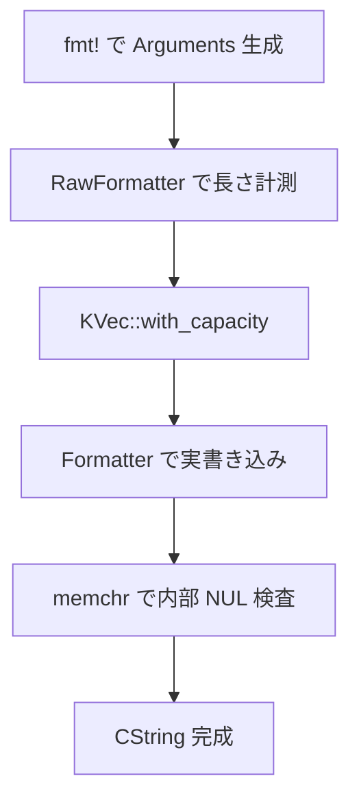

# 第17章 CStr、バイト列、フォーマット

> 本章で読むソース
>
> - [`rust/kernel/str.rs`](https://github.com/gregkh/linux/blob/v6.18.38/rust/kernel/str.rs)
> - [`rust/kernel/fmt.rs`](https://github.com/gregkh/linux/blob/v6.18.38/rust/kernel/fmt.rs)

## この章の狙い

本章では、カーネル Rust の文字列型とフォーマット経路を読む。
**CStr** は末尾 `NUL` 1個の C 互換文字列、**BStr** は UTF-8 保証のないバイト列である。
`c_str!` と `b_str!` のコンパイル時検査の非対称、`CString::try_from_fmt` の二段パス、v7.1.3 での `CStr` 移行と `fmt!` 格上げも扱う。

## 前提

[第8章](../part02-memory-ownership/08-allocator-gfp.md) で `GFP_KERNEL` とアロケータを読んでいること。
[第9章](../part02-memory-ownership/09-kbox-kvec.md) で `KVec` を読んでいること。

## CStr と BStr の型の違い

`CStr` は末尾にちょうど1個の `NUL` がある `[u8]` のラッパーである。
`BStr` は `NUL` 終端を要求せず、任意バイト列をそのまま包む。

[`rust/kernel/str.rs` L16-L18](https://github.com/gregkh/linux/blob/v6.18.38/rust/kernel/str.rs#L16-L18)

```rust
/// Byte string without UTF-8 validity guarantee.
#[repr(transparent)]
pub struct BStr([u8]);
```

[`rust/kernel/str.rs` L209-L214](https://github.com/gregkh/linux/blob/v6.18.38/rust/kernel/str.rs#L209-L214)

```rust
/// A string that is guaranteed to have exactly one `NUL` byte, which is at the
/// end.
///
/// Used for interoperability with kernel APIs that take C strings.
#[repr(transparent)]
pub struct CStr([u8]);
```

`from_bytes_with_nul` は終端 `NUL` と内部 `NUL` を検査する `const fn` である。
通常の呼び出しでは実行時に評価されるが、`c_str!` のように `const` 初期化の文脈で呼ばれるとコンパイル時に評価される。

[`rust/kernel/str.rs` L264-L282](https://github.com/gregkh/linux/blob/v6.18.38/rust/kernel/str.rs#L264-L282)

```rust
    pub const fn from_bytes_with_nul(bytes: &[u8]) -> Result<&Self, CStrConvertError> {
        if bytes.is_empty() {
            return Err(CStrConvertError::NotNulTerminated);
        }
        if bytes[bytes.len() - 1] != 0 {
            return Err(CStrConvertError::NotNulTerminated);
        }
        let mut i = 0;
        // `i + 1 < bytes.len()` allows LLVM to optimize away bounds checking,
        // while it couldn't optimize away bounds checks for `i < bytes.len() - 1`.
        while i + 1 < bytes.len() {
            if bytes[i] == 0 {
                return Err(CStrConvertError::InteriorNul);
            }
            i += 1;
        }
        // SAFETY: We just checked that all properties hold.
        Ok(unsafe { Self::from_bytes_with_nul_unchecked(bytes) })
    }
```

ループ条件は境界チェック除去のための書き方であり、検査ロジックそのものは単純である。

## c_str! と b_str! の非対称

`b_str!` はリテラルを `BStr::from_bytes` へ渡すだけで、内容検査は行わない。

[`rust/kernel/str.rs` L174-L181](https://github.com/gregkh/linux/blob/v6.18.38/rust/kernel/str.rs#L174-L181)

```rust
#[macro_export]
macro_rules! b_str {
    ($str:literal) => {{
        const S: &'static str = $str;
        const C: &'static $crate::str::BStr = $crate::str::BStr::from_bytes(S.as_bytes());
        C
    }};
}
```

`c_str!` は `concat!` で `NUL` を付け、`from_bytes_with_nul` をコンパイル時に実行する。
失敗時は `panic!` となる。
マクロの matcher 自体は `$str:expr` で `b_str!` の `$str:literal` より緩いが、展開先の `concat!` が文字列リテラルしか受け付けないため、実際に渡せるのは文字列リテラルに限られる。

[`rust/kernel/str.rs` L599-L609](https://github.com/gregkh/linux/blob/v6.18.38/rust/kernel/str.rs#L599-L609)

```rust
#[macro_export]
macro_rules! c_str {
    ($str:expr) => {{
        const S: &str = concat!($str, "\0");
        const C: &$crate::str::CStr = match $crate::str::CStr::from_bytes_with_nul(S.as_bytes()) {
            Ok(v) => v,
            Err(_) => panic!("string contains interior NUL"),
        };
        C
    }};
}
```

| マクロ | オペランド | コンパイル時検査 |
| --- | --- | --- |
| `b_str!` | 文字列リテラルのみ | なし |
| `c_str!` | 文字列リテラル。matcher は `expr` だが `concat!` が制限 | `NUL` 終端と内部 `NUL` |

C 文字列はカーネル API 境界で使われるため、静的生成時に不変条件を潰す設計になっている。

## Display と CString の二段パス

v6.18.38 の `kernel::fmt` は `core::fmt` の再エクスポートである。

[`rust/kernel/fmt.rs` L7](https://github.com/gregkh/linux/blob/v6.18.38/rust/kernel/fmt.rs#L7)

```rust
pub use core::fmt::{Arguments, Debug, Display, Error, Formatter, Result, Write};
```

`CStr` と `BStr` の `Display` は非 ASCII をエスケープする。

[`rust/kernel/str.rs` L463-L472](https://github.com/gregkh/linux/blob/v6.18.38/rust/kernel/str.rs#L463-L472)

```rust
impl fmt::Display for CStr {
    /// Formats printable ASCII characters, escaping the rest.
    ///
    /// ```
    /// # use kernel::c_str;
    /// # use kernel::prelude::fmt;
    /// # use kernel::str::CStr;
    /// # use kernel::str::CString;
    /// let penguin = c_str!("🐧");
    /// let s = CString::try_from_fmt(fmt!("{penguin}"))?;
```

`CString::try_from_fmt` は長さ計測と書き込みの二段になる。
1回目は `RawFormatter::new` で必要バイト数を数え、2回目は確保した `KVec` へ書き込む。

[`rust/kernel/str.rs` L1030-L1048](https://github.com/gregkh/linux/blob/v6.18.38/rust/kernel/str.rs#L1030-L1048)

```rust
impl CString {
    /// Creates an instance of [`CString`] from the given formatted arguments.
    pub fn try_from_fmt(args: fmt::Arguments<'_>) -> Result<Self, Error> {
        // Calculate the size needed (formatted string plus `NUL` terminator).
        let mut f = RawFormatter::new();
        f.write_fmt(args)?;
        f.write_str("\0")?;
        let size = f.bytes_written();

        // Allocate a vector with the required number of bytes, and write to it.
        let mut buf = KVec::with_capacity(size, GFP_KERNEL)?;
        // SAFETY: The buffer stored in `buf` is at least of size `size` and is valid for writes.
        let mut f = unsafe { Formatter::from_buffer(buf.as_mut_ptr(), size) };
        f.write_fmt(args)?;
        f.write_str("\0")?;
```

`RawFormatter` はバッファ末端を超えても失敗しない。
サイズ見積もり専用として動く。

[`rust/kernel/str.rs` L803-L826](https://github.com/gregkh/linux/blob/v6.18.38/rust/kernel/str.rs#L803-L826)

```rust
impl fmt::Write for RawFormatter {
    fn write_str(&mut self, s: &str) -> fmt::Result {
        // `pos` value after writing `len` bytes. This does not have to be bounded by `end`, but we
        // don't want it to wrap around to 0.
        let pos_new = self.pos.saturating_add(s.len());

        // Amount that we can copy. `saturating_sub` ensures we get 0 if `pos` goes past `end`.
        let len_to_copy = core::cmp::min(pos_new, self.end).saturating_sub(self.pos);

        if len_to_copy > 0 {
            // SAFETY: If `len_to_copy` is non-zero, then we know `pos` has not gone past `end`
            // yet, so it is valid for write per the type invariants.
            unsafe {
                core::ptr::copy_nonoverlapping(
                    s.as_bytes().as_ptr(),
                    self.pos as *mut u8,
                    len_to_copy,
                )
            };
        }

        self.pos = pos_new;
        Ok(())
    }
}
```

2回目の `Formatter` は溢れで `fmt::Error` を返す。
書き込み後は `memchr` で終端前の内部 `NUL` を拒否する。

## 処理の流れ



動的生成の `CString` は、長さ確定後に一度だけ [`KVec`](../part02-memory-ownership/09-kbox-kvec.md) を確保する。

## 高速化と最適化の工夫

`from_bytes_with_nul` のループ条件 `i + 1 < bytes.len()` は、LLVM が境界チェックを消せる形にしている。
`RawFormatter` は `saturating_add` と `saturating_sub` でポインタ演算のラップを避け、サイズ計測を安全に続ける。
`fmt::Arguments` が保持する引数式は生成時に一度だけ評価されるため、二段パスで再評価されるのは引数の値ではない。
代償は各 `Display`/`Debug` の整形処理そのものが2回実行されることであり、それと引き換えに過剰確保を避ける。

## Linux 7.1.3 での差分

### CStr の core::ffi 化

v7.1.3 では `CStr` が `core::ffi::CStr` の再エクスポートになる。

[`rust/ffi.rs` L50](https://github.com/gregkh/linux/blob/v7.1.3/rust/ffi.rs#L50)

```rust
pub use core::ffi::CStr;
```

カーネル固有メソッドは sealed な `CStrExt` へ移る。

[`rust/kernel/str.rs` L203-L214](https://github.com/gregkh/linux/blob/v7.1.3/rust/kernel/str.rs#L203-L214)

```rust
/// Extensions to [`CStr`].
pub trait CStrExt: private::Sealed {
    /// Wraps a raw C string pointer.
    ///
    /// # Safety
    ///
    /// `ptr` must be a valid pointer to a `NUL`-terminated C string, and it must
    /// last at least `'a`. When `CStr` is alive, the memory pointed by `ptr`
    /// must not be mutated.
    // This function exists to paper over the fact that `CStr::from_ptr` takes a `*const
    // core::ffi::c_char` rather than a `*const crate::ffi::c_char`.
    unsafe fn from_char_ptr<'a>(ptr: *const c_char) -> &'a Self;
```

v6.18.38 のコメントが示す `core::ffi::CStr` への置き換えが、この版で完了している。

### fmt! の proc マクロ化

`kernel::fmt` は `Adapter<T>` とローカル `Display` トレイトを持つ。

[`rust/kernel/fmt.rs` L9-L43](https://github.com/gregkh/linux/blob/v7.1.3/rust/kernel/fmt.rs#L9-L43)

```rust
/// Internal adapter used to route and allow implementations of formatting traits for foreign types.
///
/// It is inserted automatically by the [`fmt!`] macro and is not meant to be used directly.
///
/// [`fmt!`]: crate::prelude::fmt!
#[doc(hidden)]
pub struct Adapter<T>(pub T);

// ... (中略) ...

/// A copy of [`core::fmt::Display`] that allows us to implement it for foreign types.
///
/// Types should implement this trait rather than [`core::fmt::Display`]. Together with the
/// [`Adapter`] type and [`fmt!`] macro, it allows for formatting foreign types (e.g. types from
/// core) which do not implement [`core::fmt::Display`] directly.
///
/// [`fmt!`]: crate::prelude::fmt!
pub trait Display {
    /// Same as [`core::fmt::Display::fmt`].
    fn fmt(&self, f: &mut Formatter<'_>) -> Result;
}
```

`rust/macros/fmt.rs` の proc マクロが各引数を `Adapter` で包み、孤児ルールを回避する。

### parse_int の新設

`str/parse_int.rs` が追加され、`BStr` から整数を読む `ParseInt` が定義される。

[`rust/kernel/str/parse_int.rs` L79-L103](https://github.com/gregkh/linux/blob/v7.1.3/rust/kernel/str/parse_int.rs#L79-L103)

```rust
pub trait ParseInt: private::FromStrRadix + TryFrom<u64> {
    /// Parse a string according to the description in [`Self`].
    fn from_str(src: &BStr) -> Result<Self> {
        match src.deref() {
            [b'-', rest @ ..] => {
                let (radix, digits) = strip_radix(rest.as_ref());
                // 2's complement values range from -2^(b-1) to 2^(b-1)-1.
                // So if we want to parse negative numbers as positive and
                // later multiply by -1, we have to parse into a larger
                // integer. We choose `u64` as sufficiently large.
                //
                // NOTE: 128 bit integers are not available on all
                // platforms, hence the choice of 64 bits.
                let val =
                    u64::from_str_radix(core::str::from_utf8(digits).map_err(|_| EINVAL)?, radix)
                        .map_err(|_| EINVAL)?;
                Self::from_u64_negated(val)
            }
            _ => {
                let (radix, digits) = strip_radix(src);
                Self::from_str_radix(digits, radix).map_err(|_| EINVAL)
            }
        }
    }
}
```

`0x` や `0o` 接頭辞は `strip_radix` で基数を決め、C の `kstrtol` 系と整合する。

## まとめ

`CStr` は `NUL` 終端と内部 `NUL` 禁止を型不変条件に持ち、`c_str!` がコンパイル時に検査する。
`b_str!` はバイト列リテラル用で検査はない。
`CString::try_from_fmt` は `RawFormatter` と `Formatter` の二段で長さを確定してから [`KVec`](../part02-memory-ownership/09-kbox-kvec.md) を確保する。
v7.1.3 では `CStr` の標準化、`fmt!` の格上げ、`ParseInt` 追加が主な変化である。

## 関連する章

- [第8章 アロケータと GFP](../part02-memory-ownership/08-allocator-gfp.md)
- [第9章 KBox と KVec](../part02-memory-ownership/09-kbox-kvec.md)
- [第16章 XArray と Maple Tree](16-xarray-maple-tree.md)
