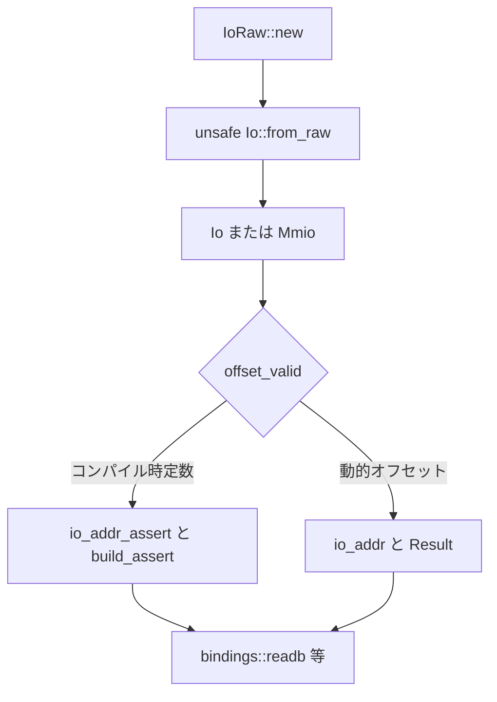

# 第18章 MMIO と IO 抽象

> 本章で読むソース
>
> - [`rust/kernel/io.rs`](https://github.com/gregkh/linux/blob/v6.18.38/rust/kernel/io.rs)
> - [`rust/kernel/io/mem.rs`](https://github.com/gregkh/linux/blob/v6.18.38/rust/kernel/io/mem.rs)
> - [`rust/kernel/io/resource.rs`](https://github.com/gregkh/linux/blob/v6.18.38/rust/kernel/io/resource.rs)

## この章の狙い

本章では、デバイスレジスタへアクセスする MMIO ラッパーを読む。
v6.18.38 では具体型 `Io<SIZE>` が幅別メソッドを直接持つ。
v7.1.3 では `Mmio` と `Io` トレイトへ再設計され、`register.rs` で型付きレジスタが加わる。
境界チェックのコンパイル時経路と実行時経路の分岐も押さえる。

## 前提

[第9章](../part02-memory-ownership/09-kbox-kvec.md) で `KBox` と `Devres` を読んでいること。
[第17章](../part04-data-structures/17-str-cstr-fmt.md) で `CString` を読んでいること。

## IoRaw と Io の二段構え

`IoRaw` はアドレスと最大サイズだけを持ち、マッピングの有効性は保証しない。
バス実装が `unsafe fn from_raw` で `Io` に変換したとき初めて、MMIO 領域として読み書きが safe になる。

[`rust/kernel/io.rs` L28-L39](https://github.com/gregkh/linux/blob/v6.18.38/rust/kernel/io.rs#L28-L39)

```rust
/// Raw representation of an MMIO region.
///
/// By itself, the existence of an instance of this structure does not provide any guarantees that
/// the represented MMIO region does exist or is properly mapped.
///
/// Instead, the bus specific MMIO implementation must convert this raw representation into an `Io`
/// instance providing the actual memory accessors. Only by the conversion into an `Io` structure
/// any guarantees are given.
pub struct IoRaw<const SIZE: usize = 0> {
    addr: usize,
    maxsize: usize,
}
```

[`rust/kernel/io.rs` L133-L134](https://github.com/gregkh/linux/blob/v6.18.38/rust/kernel/io.rs#L133-L134)

```rust
#[repr(transparent)]
pub struct Io<const SIZE: usize = 0>(IoRaw<SIZE>);
```

`IoRaw::new` は `maxsize < SIZE` を `EINVAL` で拒否する。

[`rust/kernel/io.rs` L41-L49](https://github.com/gregkh/linux/blob/v6.18.38/rust/kernel/io.rs#L41-L49)

```rust
impl<const SIZE: usize> IoRaw<SIZE> {
    /// Returns a new `IoRaw` instance on success, an error otherwise.
    pub fn new(addr: usize, maxsize: usize) -> Result<Self> {
        if maxsize < SIZE {
            return Err(EINVAL);
        }

        Ok(Self { addr, maxsize })
    }
```

## define_read と define_write による幅別 API 生成

v6.18.38 ではマクロが `read8` と `try_read8` のペアを機械生成する。
コンパイル時オフセット版は `io_addr_assert`、動的版は `io_addr` を使う。

[`rust/kernel/io.rs` L136-L162](https://github.com/gregkh/linux/blob/v6.18.38/rust/kernel/io.rs#L136-L162)

```rust
macro_rules! define_read {
    ($(#[$attr:meta])* $name:ident, $try_name:ident, $c_fn:ident -> $type_name:ty) => {
        /// Read IO data from a given offset known at compile time.
        ///
        /// Bound checks are performed on compile time, hence if the offset is not known at compile
        /// time, the build will fail.
        $(#[$attr])*
        // Always inline to optimize out error path of `io_addr_assert`.
        #[inline(always)]
        pub fn $name(&self, offset: usize) -> $type_name {
            let addr = self.io_addr_assert::<$type_name>(offset);

            // SAFETY: By the type invariant `addr` is a valid address for MMIO operations.
            unsafe { bindings::$c_fn(addr as *const c_void) }
        }

        /// Read IO data from a given offset.
        ///
        /// Bound checks are performed on runtime, it fails if the offset (plus the type size) is
        /// out of bounds.
        $(#[$attr])*
        pub fn $try_name(&self, offset: usize) -> Result<$type_name> {
            let addr = self.io_addr::<$type_name>(offset)?;

            // SAFETY: By the type invariant `addr` is a valid address for MMIO operations.
            Ok(unsafe { bindings::$c_fn(addr as *const c_void) })
        }
    };
}
```

`bindings::readb` 等の raw FFI は常に `unsafe` ブロック内に閉じ、型不変条件を根拠にする。

## offset_valid と二経路の境界チェック

`offset_valid` は `const fn` で範囲とアラインメントを検査する。
`io_addr` は実行時に `Result` を返し、`io_addr_assert` は `build_assert!` でビルド失敗にする。

[`rust/kernel/io.rs` L221-L248](https://github.com/gregkh/linux/blob/v6.18.38/rust/kernel/io.rs#L221-L248)

```rust
    #[inline]
    const fn offset_valid<U>(offset: usize, size: usize) -> bool {
        let type_size = core::mem::size_of::<U>();
        if let Some(end) = offset.checked_add(type_size) {
            end <= size && offset % type_size == 0
        } else {
            false
        }
    }

    #[inline]
    fn io_addr<U>(&self, offset: usize) -> Result<usize> {
        if !Self::offset_valid::<U>(offset, self.maxsize()) {
            return Err(EINVAL);
        }

        // Probably no need to check, since the safety requirements of `Self::new` guarantee that
        // this can't overflow.
        self.addr().checked_add(offset).ok_or(EINVAL)
    }

    // Always inline to optimize out error path of `build_assert`.
    #[inline(always)]
    fn io_addr_assert<U>(&self, offset: usize) -> usize {
        build_assert!(Self::offset_valid::<U>(offset, SIZE));

        self.addr() + offset
    }
```

コンパイル時定数オフセットではエラーパスが生成されず、動的オフセットだけ `EINVAL` 経路が残る。

## Resource と IoMem の RAII

`Region` は `__request_region` で得た領域を保持し、`Drop` で `IORESOURCE_MEM` に応じて解放関数を選ぶ。

[`rust/kernel/io/resource.rs` L43-L58](https://github.com/gregkh/linux/blob/v6.18.38/rust/kernel/io/resource.rs#L43-L58)

```rust
impl Drop for Region {
    fn drop(&mut self) {
        let (flags, start, size) = {
            let res = &**self;
            (res.flags(), res.start(), res.size())
        };

        let release_fn = if flags.contains(Flags::IORESOURCE_MEM) {
            bindings::release_mem_region
        } else {
            bindings::release_region
        };

        // SAFETY: Safe as per the invariant of `Region`.
        unsafe { release_fn(start, size) };
    }
}
```

`IoRequest::iomap_sized` は `ioremap` 後に `Devres<IoMem<SIZE>>` としてデバイス寿命へ追従する。

[`rust/kernel/io/mem.rs` L18-L22](https://github.com/gregkh/linux/blob/v6.18.38/rust/kernel/io/mem.rs#L18-L22)

```rust
/// An IO request for a specific device and resource.
pub struct IoRequest<'a> {
    device: &'a Device<Bound>,
    resource: &'a Resource,
}
```

[`rust/kernel/io/mem.rs` L77-L79](https://github.com/gregkh/linux/blob/v6.18.38/rust/kernel/io/mem.rs#L77-L79)

```rust
    pub fn iomap_sized<const SIZE: usize>(self) -> impl PinInit<Devres<IoMem<SIZE>>, Error> + 'a {
        IoMem::new(self)
    }
```

`ExclusiveIoMem` は `request_region` で排他リージョンを確保してから `ioremap` する。

## 処理の流れ



## 高速化と最適化の工夫

`offset_valid` を `const fn` にし、`io_addr_assert` が `build_assert!` 内で呼ぶ設計は、同一ロジックを凍結度に応じて2経路へ振り分ける。
`#[inline(always)]` と組み合わせ、定数オフセットの MMIO アクセスから境界チェックの実行時コストを消す。

## Linux 7.1.3 での再設計

### Io トレイトと Mmio への改名

`IoRaw` は `MmioRaw`、`Io<SIZE>` は `Mmio<SIZE>` へ改名される。
`Io` はトレイトとなり、MMIO 以外のバックエンドも同じ API で扱える。

[`rust/kernel/io.rs` L243-L261](https://github.com/gregkh/linux/blob/v7.1.3/rust/kernel/io.rs#L243-L261)

```rust
pub trait Io {
    /// Returns the base address of this mapping.
    fn addr(&self) -> usize;

    /// Returns the maximum size of this mapping.
    fn maxsize(&self) -> usize;

    /// Returns the absolute I/O address for a given `offset`,
    /// performing runtime bound checks.
    #[inline]
    fn io_addr<U>(&self, offset: usize) -> Result<usize> {
        if !offset_valid::<U>(offset, self.maxsize()) {
            return Err(EINVAL);
        }

        // Probably no need to check, since the safety requirements of `Self::new` guarantee that
        // this can't overflow.
        self.addr().checked_add(offset).ok_or(EINVAL)
    }
```

`Mmio` は `Io`、`IoKnownSize`、各幅の `IoCapable` を実装する。
`IoLoc` は `Mmio` ではなく、`usize` オフセットや `register!` 生成型が担う。

[`rust/kernel/io.rs` L164-L178](https://github.com/gregkh/linux/blob/v7.1.3/rust/kernel/io.rs#L164-L178)

```rust
pub trait IoCapable<T> {
    /// Performs an I/O read of type `T` at `address` and returns the result.
    ///
    /// # Safety
    ///
    /// The range `[address..address + size_of::<T>()]` must be within the bounds of `Self`.
    unsafe fn io_read(&self, address: usize) -> T;

    /// Performs an I/O write of `value` at `address`.
    ///
    /// # Safety
    ///
    /// The range `[address..address + size_of::<T>()]` must be within the bounds of `Self`.
    unsafe fn io_write(&self, value: T, address: usize);
}
```

[`rust/kernel/io.rs` L207-L217](https://github.com/gregkh/linux/blob/v7.1.3/rust/kernel/io.rs#L207-L217)

```rust
macro_rules! impl_usize_ioloc {
    ($($ty:ty),*) => {
        $(
            impl IoLoc<$ty> for usize {
                type IoType = $ty;

                #[inline(always)]
                fn offset(self) -> usize {
                    self
                }
            }
        )*
    }
}
```

### update と try_update の意味論

`try_update` と `update` は読み取り、クロージャ変換、書き戻しの read-modify-write である。
同期も原子性も提供しない。

[`rust/kernel/io.rs` L521-L558](https://github.com/gregkh/linux/blob/v7.1.3/rust/kernel/io.rs#L521-L558)

```rust
    /// Generic fallible update with runtime bounds check.
    ///
    /// Note: this does not perform any synchronization. The caller is responsible for ensuring
    /// exclusive access if required.
    // ... (中略) ...
    #[inline(always)]
    fn try_update<T, L, F>(&self, location: L, f: F) -> Result
    where
        L: IoLoc<T>,
        Self: IoCapable<L::IoType>,
        F: FnOnce(T) -> T,
    {
        let address = self.io_addr::<L::IoType>(location.offset())?;

        // SAFETY: `address` has been validated by `io_addr`.
        let value: T = unsafe { self.io_read(address) }.into();
        let io_value = f(value).into();

        // SAFETY: `address` has been validated by `io_addr`.
        unsafe { self.io_write(io_value, address) }

        Ok(())
    }
```

排他が必要なレジスタ更新は、呼び出し側がロックや割り込みマスクで保証する。

### RelaxedMmio と register.rs

v6.18.38 の `read32_relaxed` サフィックスは、v7.1.3 では `RelaxedMmio` ラッパーへ移る。
`Mmio::relaxed` は `repr(transparent)` の `transmute` で取得する。

[`rust/kernel/io.rs` L816-L841](https://github.com/gregkh/linux/blob/v7.1.3/rust/kernel/io.rs#L816-L841)

```rust
    pub fn relaxed(&self) -> &RelaxedMmio<SIZE> {
        // SAFETY: `RelaxedMmio` is `#[repr(transparent)]` over `Mmio`, so `Mmio<SIZE>` and
        // `RelaxedMmio<SIZE>` have identical layout.
        unsafe { core::mem::transmute(self) }
    }
```

`register.rs` は `register!` でビットフィールド付きレジスタ型を生成し、`IoLoc` 経由で `Io::read` へ接続する。

[`rust/kernel/io/register.rs` L15-L28](https://github.com/gregkh/linux/blob/v7.1.3/rust/kernel/io/register.rs#L15-L28)

```rust
//! register! {
//!     /// Basic information about the chip.
//!     pub BOOT_0(u32) @ 0x00000100 {
//!         /// Vendor ID.
//!         15:8 vendor_id;
//!         /// Major revision of the chip.
//!         7:4 major_revision;
//!         /// Minor revision of the chip.
//!         3:0 minor_revision;
//!     }
//! }
```

## まとめ

v6.18.38 の `Io<SIZE>` はマクロ生成メソッドで MMIO を薄く包む。
v7.1.3 は `Io` バックエンドと `IoLoc` 位置表現を分離し、PCI 設定空間など別バックエンドへ一般化する。
`offset_valid` の二経路設計は両版で共通の最適化核である。

## 関連する章

- [第9章 KBox と KVec](../part02-memory-ownership/09-kbox-kvec.md)
- [第11章 ロック](../part03-synchronization/11-lock-mutex-spinlock.md)
- [第17章 CStr とフォーマット](../part04-data-structures/17-str-cstr-fmt.md)
- [第19章 DMA コヒーレント確保](19-dma-coherent.md)
