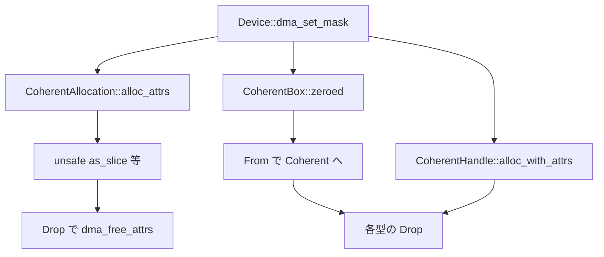

# 第19章 DMA コヒーレント確保

> 本章で読むソース
>
> - [`rust/kernel/dma.rs`](https://github.com/gregkh/linux/blob/v6.18.38/rust/kernel/dma.rs)

## この章の狙い

本章では、デバイスと CPU が共有するコヒーレント DMA メモリの Rust ラッパーを読む。
v6.18.38 では `CoherentAllocation<T>` が確保から読み書きまでを一手に担う。
v7.1.3 では `Coherent`、`CoherentBox`、`CoherentHandle` へ責務が分割される。
`ARef` が保証する範囲と、`read_volatile` の特例利用も明確にする。

## 前提

[第6章](../part01-language-foundation/06-types-opaque-aref.md) で `ARef` を読んでいること。
[第8章](../part02-memory-ownership/08-allocator-gfp.md) で `GFP_KERNEL` を読んでいること。
[第18章](18-mmio-io.md) でデバイス IO の文脈を読んでいること。

## Device トレイトとマスク設定

`Device` トレイトはバスデバイスが実装し、DMA アドレスマスクを `probe` 時に設定する。
各メソッドは `unsafe` で、確保やマッピングと並行呼び出ししてはならない。

[`rust/kernel/dma.rs` L32-L48](https://github.com/gregkh/linux/blob/v6.18.38/rust/kernel/dma.rs#L32-L48)

```rust
pub trait Device: AsRef<device::Device<Core>> {
    /// Set up the device's DMA streaming addressing capabilities.
    ///
    /// This method is usually called once from `probe()` as soon as the device capabilities are
    /// known.
    ///
    /// # Safety
    ///
    /// This method must not be called concurrently with any DMA allocation or mapping primitives,
    /// such as [`CoherentAllocation::alloc_attrs`].
    unsafe fn dma_set_mask(&self, mask: DmaMask) -> Result {
        // SAFETY:
        // - By the type invariant of `device::Device`, `self.as_ref().as_raw()` is valid.
        // - The safety requirement of this function guarantees that there are no concurrent calls
        //   to DMA allocation and mapping primitives using this mask.
        to_result(unsafe { bindings::dma_set_mask(self.as_ref().as_raw(), mask.value()) })
    }
```

`DmaMask::try_new` は 64 ビット超を `EINVAL` で拒否する。

[`rust/kernel/dma.rs` L154-L159](https://github.com/gregkh/linux/blob/v6.18.38/rust/kernel/dma.rs#L154-L159)

```rust
    pub const fn try_new(n: u32) -> Result<Self> {
        Ok(Self(match n {
            0 => 0,
            1..=64 => u64::MAX >> (64 - n),
            _ => return Err(EINVAL),
        }))
    }
```

## CoherentAllocation の構造と alloc_attrs

v6.18.38 では単一型が CPU ポインタ、DMA ハンドル、`count` を保持する。

[`rust/kernel/dma.rs` L343-L361](https://github.com/gregkh/linux/blob/v6.18.38/rust/kernel/dma.rs#L343-L361)

```rust
// TODO
//
// DMA allocations potentially carry device resources (e.g.IOMMU mappings), hence for soundness
// reasons DMA allocation would need to be embedded in a `Devres` container, in order to ensure
// that device resources can never survive device unbind.
//
// However, it is neither desirable nor necessary to protect the allocated memory of the DMA
// allocation from surviving device unbind; it would require RCU read side critical sections to
// access the memory, which may require subsequent unnecessary copies.
//
// Hence, find a way to revoke the device resources of a `CoherentAllocation`, but not the
// entire `CoherentAllocation` including the allocated memory itself.
pub struct CoherentAllocation<T: AsBytes + FromBytes> {
    dev: ARef<device::Device>,
    dma_handle: DmaAddress,
    count: usize,
    cpu_addr: *mut T,
    dma_attrs: Attrs,
}
```

`alloc_attrs` は `dma_alloc_attrs` を呼び、失敗時 `ENOMEM`、成功時 `dev.into()` で `ARef` を保持する。

[`rust/kernel/dma.rs` L377-L417](https://github.com/gregkh/linux/blob/v6.18.38/rust/kernel/dma.rs#L377-L417)

```rust
    pub fn alloc_attrs(
        dev: &device::Device<Bound>,
        count: usize,
        gfp_flags: kernel::alloc::Flags,
        dma_attrs: Attrs,
    ) -> Result<CoherentAllocation<T>> {
        build_assert!(
            core::mem::size_of::<T>() > 0,
            "It doesn't make sense for the allocated type to be a ZST"
        );

        let size = count
            .checked_mul(core::mem::size_of::<T>())
            .ok_or(EOVERFLOW)?;
        let mut dma_handle = 0;
        // SAFETY: Device pointer is guaranteed as valid by the type invariant on `Device`.
        let ret = unsafe {
            bindings::dma_alloc_attrs(
                dev.as_raw(),
                size,
                &mut dma_handle,
                gfp_flags.as_raw(),
                dma_attrs.as_raw(),
            )
        };
        if ret.is_null() {
            return Err(ENOMEM);
        }
        // INVARIANT:
        // - We just successfully allocated a coherent region which is accessible for
        //   `count` elements, hence the cpu address is valid. We also hold a refcounted reference
        //   to the device.
        // - The allocated `size` is equal to `size_of::<T> * count`.
        // - The allocated `size` fits into a `usize`.
        Ok(Self {
            dev: dev.into(),
            dma_handle,
            count,
            cpu_addr: ret.cast::<T>(),
            dma_attrs,
        })
    }
```

`ARef<Device>` が保証するのは `struct device` オブジェクトの参照寿命だけである。
IOMMU マッピング等の device resource が unbind 後も存続することは、現状の TODO が示す通り保証されない。
RAII の役割は解放忘れ防止とデバイスオブジェクト参照の保持に限定する。

## unsafe な CPU アクセス

`as_slice` はデバイスとの同時アクセスをコンパイラが検知できないため `unsafe` である。

[`rust/kernel/dma.rs` L492-L506](https://github.com/gregkh/linux/blob/v6.18.38/rust/kernel/dma.rs#L492-L506)

```rust
    /// # Safety
    ///
    /// * Callers must ensure that the device does not read/write to/from memory while the returned
    ///   slice is live.
    /// * Callers must ensure that this call does not race with a write to the same region while
    ///   the returned slice is live.
    pub unsafe fn as_slice(&self, offset: usize, count: usize) -> Result<&[T]> {
        self.validate_range(offset, count)?;
        // SAFETY:
        // - The pointer is valid due to type invariant on `CoherentAllocation`,
        //   we've just checked that the range and index is within bounds. The immutability of the
        //   data is also guaranteed by the safety requirements of the function.
        // - `offset + count` can't overflow since it is smaller than `self.count` and we've checked
        //   that `self.count` won't overflow early in the constructor.
        Ok(unsafe { core::slice::from_raw_parts(self.cpu_addr.add(offset), count) })
    }
```

`Drop` の直前コメントは、解放前に DMA デバイスを停止しておく契約を要求する。

[`rust/kernel/dma.rs` L627-L643](https://github.com/gregkh/linux/blob/v6.18.38/rust/kernel/dma.rs#L627-L643)

```rust
/// Note that the device configured to do DMA must be halted before this object is dropped.
impl<T: AsBytes + FromBytes> Drop for CoherentAllocation<T> {
    fn drop(&mut self) {
        let size = self.count * core::mem::size_of::<T>();
        // SAFETY: Device pointer is guaranteed as valid by the type invariant on `Device`.
        // The cpu address, and the dma handle are valid due to the type invariants on
        // `CoherentAllocation`.
        unsafe {
            bindings::dma_free_attrs(
                self.dev.as_raw(),
                size,
                self.cpu_addr.cast(),
                self.dma_handle,
                self.dma_attrs.as_raw(),
            )
        }
    }
}
```

## dma_read と dma_write の volatile 特例

`field_read` は `read_volatile` を使うが、これは外部ハードウェア競合に対する UB 回避の特例である。
カーネル関数同士の競合防止や原子性は提供しない。

[`rust/kernel/dma.rs` L589-L601](https://github.com/gregkh/linux/blob/v6.18.38/rust/kernel/dma.rs#L589-L601)

```rust
    pub unsafe fn field_read<F: FromBytes>(&self, field: *const F) -> F {
        // SAFETY:
        // - By the safety requirements field is valid.
        // - Using read_volatile() here is not sound as per the usual rules, the usage here is
        // a special exception with the following notes in place. When dealing with a potential
        // race from a hardware or code outside kernel (e.g. user-space program), we need that
        // read on a valid memory is not UB. Currently read_volatile() is used for this, and the
        // rationale behind is that it should generate the same code as READ_ONCE() which the
        // kernel already relies on to avoid UB on data races. Note that the usage of
        // read_volatile() is limited to this particular case, it cannot be used to prevent
        // the UB caused by racing between two kernel functions nor do they provide atomicity.
        unsafe { field.read_volatile() }
    }
```

v6.18.38 のマクロ構文は `alloc[idx].field` 形式である。

[`rust/kernel/dma.rs` L670-L688](https://github.com/gregkh/linux/blob/v6.18.38/rust/kernel/dma.rs#L670-L688)

```rust
#[macro_export]
macro_rules! dma_read {
    ($dma:expr, $idx: expr, $($field:tt)*) => {{
        (|| -> ::core::result::Result<_, $crate::error::Error> {
            let item = $crate::dma::CoherentAllocation::item_from_index(&$dma, $idx)?;
            // SAFETY: `item_from_index` ensures that `item` is always a valid pointer and can be
            // dereferenced. The compiler also further validates the expression on whether `field`
            // is a member of `item` when expanded by the macro.
            unsafe {
                let ptr_field = ::core::ptr::addr_of!((*item) $($field)*);
                ::core::result::Result::Ok(
                    $crate::dma::CoherentAllocation::field_read(&$dma, ptr_field)
                )
            }
        })()
    }};
```

## 処理の流れ



## 高速化と最適化の工夫

`CoherentBox` の `Deref` が safe として公開できるのは、DMA アドレスをまだデバイスへ渡していない型状態による。
CPU 排他期間を所有権とは別の型で表し、初期化中に `DerefMut` で安全に書ける。

[`rust/kernel/dma.rs` L536-L557](https://github.com/gregkh/linux/blob/v7.1.3/rust/kernel/dma.rs#L536-L557)

```rust
impl<T: KnownSize + ?Sized> Deref for CoherentBox<T> {
    type Target = T;

    #[inline]
    fn deref(&self) -> &Self::Target {
        // SAFETY:
        // - We have not exposed the DMA address yet, so there can't be any concurrent access by a
        //   device.
        // - We have exclusive access to `self.0`.
        unsafe { self.0.as_ref() }
    }
}

impl<T: AsBytes + FromBytes + KnownSize + ?Sized> DerefMut for CoherentBox<T> {
    #[inline]
    fn deref_mut(&mut self) -> &mut Self::Target {
        // SAFETY:
        // - We have not exposed the DMA address yet, so there can't be any concurrent access by a
        //   device.
        // - We have exclusive access to `self.0`.
        unsafe { self.0.as_mut() }
    }
}
```

`From<CoherentBox<T>> for Coherent<T>` でデバイス共有状態へ遷移する。

[`rust/kernel/dma.rs` L560-L565](https://github.com/gregkh/linux/blob/v7.1.3/rust/kernel/dma.rs#L560-L565)

```rust
impl<T: AsBytes + FromBytes + KnownSize + ?Sized> From<CoherentBox<T>> for Coherent<T> {
    #[inline]
    fn from(value: CoherentBox<T>) -> Self {
        value.0
    }
}
```

## Linux 7.1.3 での再設計

### KnownSize による DST 対応

`KnownSize` は `T` と `[T]` の両方に実装され、スライス長からバイト数を算出する。

[`rust/kernel/ptr.rs` L237-L253](https://github.com/gregkh/linux/blob/v7.1.3/rust/kernel/ptr.rs#L237-L253)

```rust
pub trait KnownSize {
    /// Get the size of an object of this type in bytes, with the metadata of the given pointer.
    fn size(p: *const Self) -> usize;
}

impl<T> KnownSize for T {
    #[inline(always)]
    fn size(_: *const Self) -> usize {
        size_of::<T>()
    }
}

impl<T> KnownSize for [T] {
    #[inline(always)]
    fn size(p: *const Self) -> usize {
        p.len() * size_of::<T>()
    }
}
```

`Coherent<T>` は `count` フィールドの代わりに `T::size` でサイズを得る。

[`rust/kernel/dma.rs` L595-L607](https://github.com/gregkh/linux/blob/v7.1.3/rust/kernel/dma.rs#L595-L607)

```rust
pub struct Coherent<T: KnownSize + ?Sized> {
    dev: ARef<device::Device>,
    dma_handle: DmaAddress,
    cpu_addr: NonNull<T>,
    dma_attrs: Attrs,
}

impl<T: KnownSize + ?Sized> Coherent<T> {
    /// Returns the size in bytes of this allocation.
    #[inline]
    pub fn size(&self) -> usize {
        T::size(self.cpu_addr.as_ptr())
    }
```

### CoherentHandle

`CoherentHandle` は `DMA_ATTR_NO_KERNEL_MAPPING` を常に付与し、CPU マッピングを持たない。

[`rust/kernel/dma.rs` L1049-L1083](https://github.com/gregkh/linux/blob/v7.1.3/rust/kernel/dma.rs#L1049-L1083)

```rust
    pub fn alloc_with_attrs(
        dev: &device::Device<Bound>,
        size: usize,
        gfp_flags: kernel::alloc::Flags,
        dma_attrs: Attrs,
    ) -> Result<Self> {
        if size == 0 {
            return Err(EINVAL);
        }

        let dma_attrs = dma_attrs | Attrs(bindings::DMA_ATTR_NO_KERNEL_MAPPING);
        let mut dma_handle = 0;
        // SAFETY: `dev.as_raw()` is valid by the type invariant on `device::Device`.
        let cpu_handle = unsafe {
            bindings::dma_alloc_attrs(
                dev.as_raw(),
                size,
                &mut dma_handle,
                gfp_flags.as_raw(),
                dma_attrs.as_raw(),
            )
        };

        let cpu_handle = NonNull::new(cpu_handle).ok_or(ENOMEM)?;

        // INVARIANT: `cpu_handle` is the opaque handle from a successful `dma_alloc_attrs` call
        // with `DMA_ATTR_NO_KERNEL_MAPPING`, `dma_handle` is the corresponding DMA address,
        // and we hold a refcounted reference to the device.
        Ok(Self {
            dev: dev.into(),
            dma_handle,
            cpu_handle,
            size,
            dma_attrs,
        })
    }
```

`unsafe impl Send` と `Sync` は CPU アクセス手段がないことを型で示す。

### マクロ構文と Device トレイトの差分

`dma_read!` は `ptr::project!` ベースの `alloc, [2]?.field` 形式へ変わる。

[`rust/kernel/dma.rs` L1159-L1168](https://github.com/gregkh/linux/blob/v7.1.3/rust/kernel/dma.rs#L1159-L1168)

```rust
macro_rules! dma_read {
    ($dma:expr, $($proj:tt)*) => {{
        let dma = &$dma;
        let ptr = $crate::ptr::project!(
            $crate::dma::Coherent::as_ptr(dma), $($proj)*
        );
        // SAFETY: The pointer created by the projection is within the DMA region.
        unsafe { $crate::dma::Coherent::field_read(dma, ptr) }
    }};
}
```

`Attrs` と `DataDirection` は v6.18.38 から実質不変である。
`Device` トレイトには `dma_set_max_seg_size` が追加される。

[`rust/kernel/dma.rs` L106-L121](https://github.com/gregkh/linux/blob/v7.1.3/rust/kernel/dma.rs#L106-L121)

```rust
    /// Set the maximum size of a single DMA segment the device may request.
    ///
    /// This method is usually called once from `probe()` as soon as the device capabilities are
    /// known.
    ///
    /// # Safety
    ///
    /// This method must not be called concurrently with any DMA allocation or mapping primitives,
    /// such as [`Coherent::zeroed`].
    unsafe fn dma_set_max_seg_size(&self, size: u32) {
        // SAFETY:
        // - By the type invariant of `device::Device`, `self.as_ref().as_raw()` is valid.
        // - The safety requirement of this function guarantees that there are no concurrent calls
        //   to DMA allocation and mapping primitives using this parameter.
        unsafe { bindings::dma_set_max_seg_size(self.as_ref().as_raw(), size) }
    }
```

ストリーミング DMA の `dma_map_single` 等は v7.1.3 時点でも `dma.rs` には存在しない。

## まとめ

v6.18.38 の `CoherentAllocation` は確保、ハンドル、CPU アクセスを1型に集約する。
v7.1.3 は `CoherentBox` で公開前の CPU 排他、`Coherent` でデバイス共有、`CoherentHandle` で CPU 非マッピング確保へ分割する。
`ARef` はデバイスオブジェクト寿命のみを担い、volatile アクセスは外部 HW 競合の UB 回避に限定される。

## 関連する章

- [第6章 型の基盤](../part01-language-foundation/06-types-opaque-aref.md)
- [第8章 アロケータと GFP](../part02-memory-ownership/08-allocator-gfp.md)
- [第18章 MMIO と IO 抽象](18-mmio-io.md)
