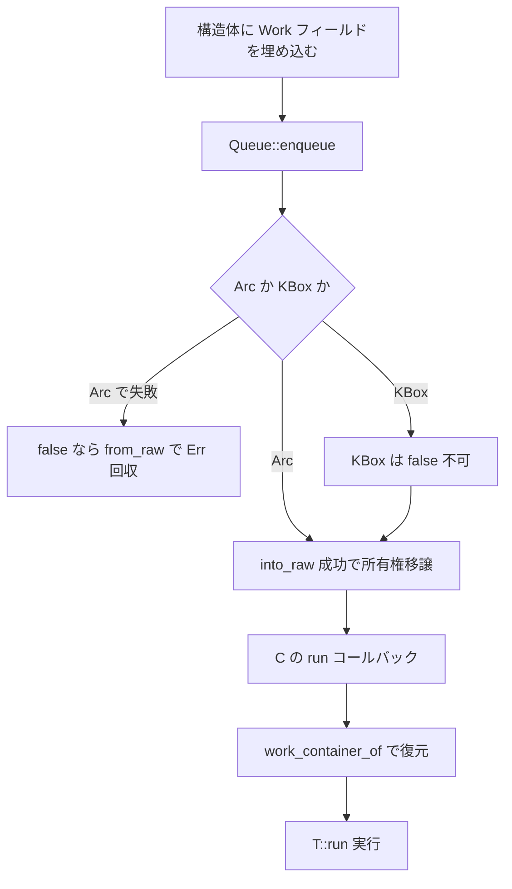

# 第20章 workqueue と非同期実行

> 本章で読むソース
>
> - [`rust/kernel/workqueue.rs`](https://github.com/gregkh/linux/blob/v6.18.38/rust/kernel/workqueue.rs)

## この章の狙い

本章では、カーネル workqueue への Rust バインディングを読む。
`Work<T, ID>` が C の `work_struct` を包み、enqueue 成功時に所有権をコールバックへ移す。
`Arc` と `Pin<KBox<T>>` の非対称、ID const generic の役割、`HasWork` マクロの offset 変換も扱う。

## 前提

[第6章](../part01-language-foundation/06-types-opaque-aref.md) で `ARef` と参照カウントを読んでいること。
[第9章](../part02-memory-ownership/09-kbox-kvec.md) で `KBox` を読んでいること。
[第10章](../part03-synchronization/10-arc-refcount.md) で `Arc` を読んでいること。

## ID const generic の設計

1つの構造体に複数の `work_struct` フィールドを持たせるため、各フィールドに異なる `ID` を付ける。
ID はコンパイル時のみ使われ、実行バイナリには残らない。

[`rust/kernel/workqueue.rs` L7-L11](https://github.com/gregkh/linux/blob/v6.18.38/rust/kernel/workqueue.rs#L7-L11)

```rust
//! One pattern that is used in both APIs is the `ID` const generic, which exists to allow a single
//! type to define multiple `work_struct` fields. This is done by choosing an id for each field,
//! and using that id to specify which field you wish to use. (The actual value doesn't matter, as
//! long as you use different values for different fields of the same struct.) Since these IDs are
//! generic, they are used only at compile-time, so they shouldn't exist in the final binary.
```

ID はどの `WorkItemPointer` 実装とどの `Work` フィールドを選ぶかを決めるだけである。
生ポインタの寿命と所有権の正しさは、`RawWorkItem` と各 `unsafe impl` の契約が担う。

## Work の初期化と WorkItem トレイト

`Work<T, ID>` は `#[pin_data]` と `#[repr(transparent)]` で `Opaque<work_struct>` を包む。

[`rust/kernel/workqueue.rs` L477-L483](https://github.com/gregkh/linux/blob/v6.18.38/rust/kernel/workqueue.rs#L477-L483)

```rust
#[pin_data]
#[repr(transparent)]
pub struct Work<T: ?Sized, const ID: u64 = 0> {
    #[pin]
    work: Opaque<bindings::work_struct>,
    _inner: PhantomData<T>,
}
```

`Work::new` は `init_work_with_key` に `T::Pointer::run` を渡す。

[`rust/kernel/workqueue.rs` L497-L513](https://github.com/gregkh/linux/blob/v6.18.38/rust/kernel/workqueue.rs#L497-L513)

```rust
    pub fn new(name: &'static CStr, key: Pin<&'static LockClassKey>) -> impl PinInit<Self>
    where
        T: WorkItem<ID>,
    {
        pin_init!(Self {
            work <- Opaque::ffi_init(|slot| {
                // SAFETY: The `WorkItemPointer` implementation promises that `run` can be used as
                // the work item function.
                unsafe {
                    bindings::init_work_with_key(
                        slot,
                        Some(T::Pointer::run),
                        false,
                        name.as_char_ptr(),
                        key.as_ptr(),
                    )
                }
            }),
            _inner: PhantomData,
        })
    }
```

`WorkItem` はユーザーが実装する実行本体、`WorkItemPointer` は C から呼ばれる `extern "C" fn run` を担う。

[`rust/kernel/workqueue.rs` L458-L465](https://github.com/gregkh/linux/blob/v6.18.38/rust/kernel/workqueue.rs#L458-L465)

```rust
pub trait WorkItem<const ID: u64 = 0> {
    /// The pointer type that this struct is wrapped in. This will typically be `Arc<Self>` or
    /// `Pin<KBox<Self>>`.
    type Pointer: WorkItemPointer<ID>;

    /// The method that should be called when this work item is executed.
    fn run(this: Self::Pointer);
}
```

## HasWork と impl_has_work マクロ

`HasWork` は `raw_get_work` と `work_container_of` の逆変換ペアを提供する public unsafe trait である。
通常は安全な `impl_has_work!` マクロを使う。
手動実装する場合は、2つの変換が真の逆関数になっていることを実装者が unsafe で保証する契約を負う。

[`rust/kernel/workqueue.rs` L565-L579](https://github.com/gregkh/linux/blob/v6.18.38/rust/kernel/workqueue.rs#L565-L579)

```rust
pub unsafe trait HasWork<T, const ID: u64 = 0> {
    /// Returns a pointer to the [`Work<T, ID>`] field.
    ///
    /// # Safety
    ///
    /// The provided pointer must point at a valid struct of type `Self`.
    unsafe fn raw_get_work(ptr: *mut Self) -> *mut Work<T, ID>;

    /// Returns a pointer to the struct containing the [`Work<T, ID>`] field.
    ///
    /// # Safety
    ///
    /// The pointer must point at a [`Work<T, ID>`] field in a struct of type `Self`.
    unsafe fn work_container_of(ptr: *mut Work<T, ID>) -> *mut Self;
}
```

[`rust/kernel/workqueue.rs` L608-L624](https://github.com/gregkh/linux/blob/v6.18.38/rust/kernel/workqueue.rs#L608-L624)

```rust
        unsafe impl$(<$($generics)+>)? $crate::workqueue::HasWork<$work_type $(, $id)?> for $self {
            #[inline]
            unsafe fn raw_get_work(ptr: *mut Self) -> *mut $crate::workqueue::Work<$work_type $(, $id)?> {
                // SAFETY: The caller promises that the pointer is not dangling.
                unsafe {
                    ::core::ptr::addr_of_mut!((*ptr).$field)
                }
            }

            #[inline]
            unsafe fn work_container_of(
                ptr: *mut $crate::workqueue::Work<$work_type $(, $id)?>,
            ) -> *mut Self {
                // SAFETY: The caller promises that the pointer points at a field of the right type
                // in the right kind of struct.
                unsafe { $crate::container_of!(ptr, Self, $field) }
            }
        }
```

## RawWorkItem と所有権の移譲

`__enqueue` はクロージャが `true` を返した場合、所有権が `run` まで有効であることを保証する。
これは一時借用ではなく、コールバック実行までの所有権移譲である。

[`rust/kernel/workqueue.rs` L389-L413](https://github.com/gregkh/linux/blob/v6.18.38/rust/kernel/workqueue.rs#L389-L413)

```rust
pub unsafe trait RawWorkItem<const ID: u64> {
    /// The return type of [`Queue::enqueue`].
    type EnqueueOutput;

    /// Enqueues this work item on a queue using the provided `queue_work_on` method.
    ///
    /// # Guarantees
    ///
    /// If this method calls the provided closure, then the raw pointer is guaranteed to point at a
    /// valid `work_struct` for the duration of the call to the closure. If the closure returns
    /// true, then it is further guaranteed that the pointer remains valid until someone calls the
    /// function pointer stored in the `work_struct`.
    // ... (中略) ...
    unsafe fn __enqueue<F>(self, queue_work_on: F) -> Self::EnqueueOutput
    where
        F: FnOnce(*mut bindings::work_struct) -> bool;
}
```

## Arc と KBox の非対称

`Arc<T>` は `into_raw` で参照カウント1つを明け渡す。
enqueue 済みの場合は `false` が返り、`from_raw` で `Err(self)` として回収できる。

[`rust/kernel/workqueue.rs` L839-L864](https://github.com/gregkh/linux/blob/v6.18.38/rust/kernel/workqueue.rs#L839-L864)

```rust
unsafe impl<T, const ID: u64> RawWorkItem<ID> for Arc<T>
where
    T: WorkItem<ID, Pointer = Self>,
    T: HasWork<T, ID>,
{
    type EnqueueOutput = Result<(), Self>;

    unsafe fn __enqueue<F>(self, queue_work_on: F) -> Self::EnqueueOutput
    where
        F: FnOnce(*mut bindings::work_struct) -> bool,
    {
        // Casting between const and mut is not a problem as long as the pointer is a raw pointer.
        let ptr = Arc::into_raw(self).cast_mut();

        // SAFETY: Pointers into an `Arc` point at a valid value.
        let work_ptr = unsafe { T::raw_get_work(ptr) };
        // SAFETY: `raw_get_work` returns a pointer to a valid value.
        let work_ptr = unsafe { Work::raw_get(work_ptr) };

        if queue_work_on(work_ptr) {
            Ok(())
        } else {
            // SAFETY: The work queue has not taken ownership of the pointer.
            Err(unsafe { Arc::from_raw(ptr) })
        }
    }
}
```

`Pin<KBox<T>>` は一意所有なので enqueue 済みは起こりえず、`false` 時は `unreachable_unchecked` となる。

[`rust/kernel/workqueue.rs` L898-L924](https://github.com/gregkh/linux/blob/v6.18.38/rust/kernel/workqueue.rs#L898-L924)

```rust
unsafe impl<T, const ID: u64> RawWorkItem<ID> for Pin<KBox<T>>
where
    T: WorkItem<ID, Pointer = Self>,
    T: HasWork<T, ID>,
{
    type EnqueueOutput = ();

    unsafe fn __enqueue<F>(self, queue_work_on: F) -> Self::EnqueueOutput
    where
        F: FnOnce(*mut bindings::work_struct) -> bool,
    {
        // SAFETY: We're not going to move `self` or any of its fields, so its okay to temporarily
        // remove the `Pin` wrapper.
        let boxed = unsafe { Pin::into_inner_unchecked(self) };
        let ptr = KBox::into_raw(boxed);

        // SAFETY: Pointers into a `KBox` point at a valid value.
        let work_ptr = unsafe { T::raw_get_work(ptr) };
        // SAFETY: `raw_get_work` returns a pointer to a valid value.
        let work_ptr = unsafe { Work::raw_get(work_ptr) };

        if !queue_work_on(work_ptr) {
            // SAFETY: This method requires exclusive ownership of the box, so it cannot be in a
            // workqueue.
            unsafe { ::core::hint::unreachable_unchecked() }
        }
    }
}
```

C 側 `run` は `work_container_of` で復元し、`from_raw` で所有権を取り戻す。

[`rust/kernel/workqueue.rs` L820-L829](https://github.com/gregkh/linux/blob/v6.18.38/rust/kernel/workqueue.rs#L820-L829)

```rust
    unsafe extern "C" fn run(ptr: *mut bindings::work_struct) {
        // The `__enqueue` method always uses a `work_struct` stored in a `Work<T, ID>`.
        let ptr = ptr.cast::<Work<T, ID>>();
        // SAFETY: This computes the pointer that `__enqueue` got from `Arc::into_raw`.
        let ptr = unsafe { T::work_container_of(ptr) };
        // SAFETY: This pointer comes from `Arc::into_raw` and we've been given back ownership.
        let arc = unsafe { Arc::from_raw(ptr) };

        T::run(arc)
    }
```

`Pin<KBox<T>>` 向け `WorkItemPointer` の SAFETY コメントはソース上 TODO のままである。

## Queue と DelayedWork

`Queue::enqueue` は `queue_work_on` を `WORK_CPU_UNBOUND` で呼ぶ。

[`rust/kernel/workqueue.rs` L267-L293](https://github.com/gregkh/linux/blob/v6.18.38/rust/kernel/workqueue.rs#L267-L293)

```rust
    pub fn enqueue<W, const ID: u64>(&self, w: W) -> W::EnqueueOutput
    where
        W: RawWorkItem<ID> + Send + 'static,
    {
        let queue_ptr = self.0.get();

        // SAFETY: We only return `false` if the `work_struct` is already in a workqueue. The other
        // `__enqueue` requirements are not relevant since `W` is `Send` and static.
        // ... (中略) ...
        unsafe {
            w.__enqueue(move |work_ptr| {
                bindings::queue_work_on(
                    bindings::wq_misc_consts_WORK_CPU_UNBOUND as ffi::c_int,
                    queue_ptr,
                    work_ptr,
                )
            })
        }
    }
```

`enqueue_delayed` は `container_of!` で `work_struct` から `delayed_work` を導く。

[`rust/kernel/workqueue.rs` L300-L328](https://github.com/gregkh/linux/blob/v6.18.38/rust/kernel/workqueue.rs#L300-L328)

```rust
    pub fn enqueue_delayed<W, const ID: u64>(&self, w: W, delay: Jiffies) -> W::EnqueueOutput
    where
        W: RawDelayedWorkItem<ID> + Send + 'static,
    {
        let queue_ptr = self.0.get();

        // SAFETY: We only return `false` if the `work_struct` is already in a workqueue.
        // ... (中略) ...
        unsafe {
            w.__enqueue(move |work_ptr| {
                bindings::queue_delayed_work_on(
                    bindings::wq_misc_consts_WORK_CPU_UNBOUND as ffi::c_int,
                    queue_ptr,
                    container_of!(work_ptr, bindings::delayed_work, work),
                    delay,
                )
            })
        }
    }
```

## 処理の流れ



## 高速化と最適化の工夫

`Work` を `#[pin]` フィールドとして構造体に埋め込み、C が保持する生ポインタと Rust 所有権を1対1に対応させる。
ID const generic はコンパイル時にフィールド選択を固定し、実行時の分岐を消す。
`#[inline]` 付きの `raw_get_work` は offset 計算を呼び出し点へ展開しやすい。

## Linux 7.1.3 での差分

既存の `Arc` と `Pin<KBox<T>>` 実装に変更はない。
`AlwaysRefCounted` を実装する型向けに `ARef<T>` の3実装が追加される。

[`rust/kernel/workqueue.rs` L188-L202](https://github.com/gregkh/linux/blob/v7.1.3/rust/kernel/workqueue.rs#L188-L202)

```rust
use crate::{
    alloc::{AllocError, Flags},
    container_of,
    prelude::*,
    sync::{
        aref::{
            ARef,
            AlwaysRefCounted, //
        },
        Arc,
        LockClassKey, //
    },
    time::Jiffies,
    types::Opaque,
};
```

`ARef` の `__enqueue` は `Arc` と同様に `Result<(), Self>` を返す。

[`rust/kernel/workqueue.rs` L988-L1013](https://github.com/gregkh/linux/blob/v7.1.3/rust/kernel/workqueue.rs#L988-L1013)

```rust
unsafe impl<T, const ID: u64> RawWorkItem<ID> for ARef<T>
where
    T: AlwaysRefCounted,
    T: WorkItem<ID, Pointer = Self>,
    T: HasWork<T, ID>,
{
    type EnqueueOutput = Result<(), Self>;

    unsafe fn __enqueue<F>(self, queue_work_on: F) -> Self::EnqueueOutput
    where
        F: FnOnce(*mut bindings::work_struct) -> bool,
    {
        let ptr = ARef::into_raw(self);

        // SAFETY: Pointers from ARef::into_raw are valid and non-null.
        let work_ptr = unsafe { T::raw_get_work(ptr.as_ptr()) };
        // SAFETY: `raw_get_work` returns a pointer to a valid value.
        let work_ptr = unsafe { Work::raw_get(work_ptr) };

        if queue_work_on(work_ptr) {
            Ok(())
        } else {
            // SAFETY: The work queue has not taken ownership of the pointer.
            Err(unsafe { ARef::from_raw(ptr) })
        }
    }
}
```

## まとめ

workqueue は `Work` 埋め込みと `HasWork` マクロで C の `work_struct` と Rust 構造体を結ぶ。
enqueue 成功時の所有権移譲は `into_raw` と `run` 内の `from_raw` で閉じる。
`Arc` は二重 enqueue を `Err` で回収でき、`KBox` は一意所有で失敗経路がない。

## 関連する章

- [第6章 型の基盤](../part01-language-foundation/06-types-opaque-aref.md)
- [第9章 KBox と KVec](../part02-memory-ownership/09-kbox-kvec.md)
- [第10章 Arc と参照カウント](../part03-synchronization/10-arc-refcount.md)
- [第21章 hrtimer](21-hrtimer.md)
