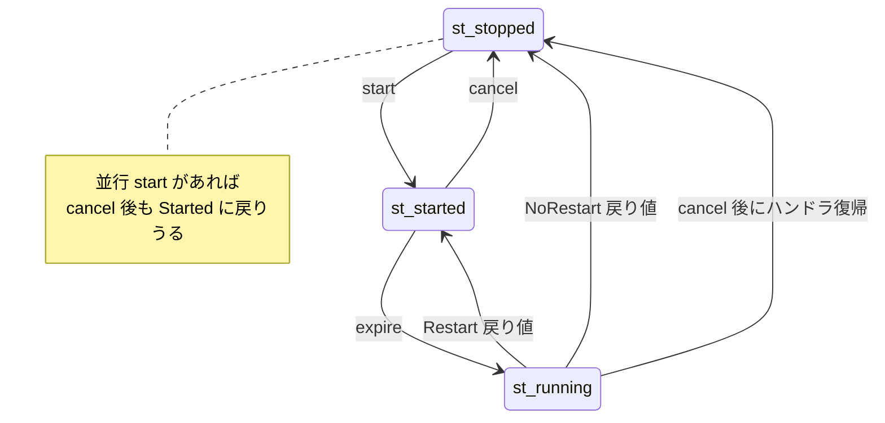
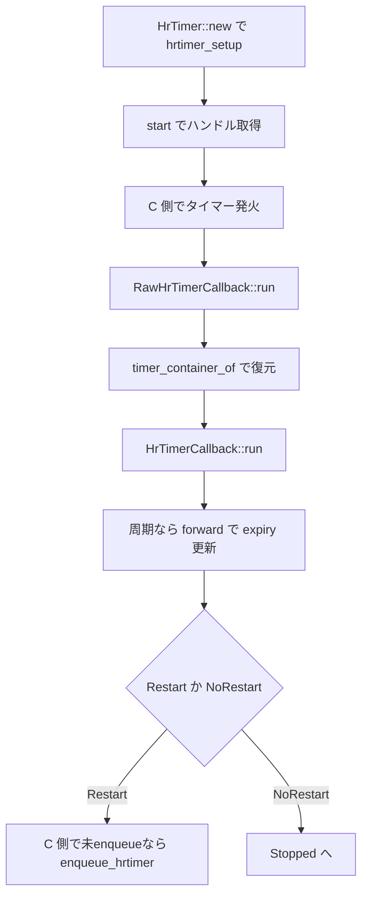

# 第21章 hrtimer と高分解能タイマー抽象

> 本章で読むソース
>
> - [`rust/kernel/time/hrtimer.rs`](https://github.com/gregkh/linux/blob/v6.18.38/rust/kernel/time/hrtimer.rs)
> - [`rust/kernel/time/hrtimer/arc.rs`](https://github.com/gregkh/linux/blob/v6.18.38/rust/kernel/time/hrtimer/arc.rs)

## この章の狙い

本章では、割り込み文脈で動く高分解能タイマーの Rust ラッパーを読む。
`HrTimerMode` の12型は期限表現（絶対時刻・相対遅延）と CPU ピン留めを型で固定する。
このうち実行文脈（hard irq か soft irq か）まで明示的に固定するのは、SOFT 系と HARD 系の8型だけである。
`HrTimerRestart::Restart` は期限を自動加算せず、周期実行では `forward` で expiry を進める。

## 前提

[第6章](../part01-language-foundation/06-types-opaque-aref.md) で `ARef` を読んでいること。
[第10章](../part03-synchronization/10-arc-refcount.md) で `Arc` を読んでいること。
[第20章](20-workqueue.md) で workqueue の埋め込みパターンを読んでいること。

## 状態遷移と restart の二義性

タイマーは Stopped、Started、Running の3状態を持つ。
running 中の cancel や restart は、ハンドラ復帰後に効力を持つ。

[`rust/kernel/time/hrtimer.rs` L52-L68](https://github.com/gregkh/linux/blob/v6.18.38/rust/kernel/time/hrtimer.rs#L52-L68)

```rust
//! A timer is initialized in the **stopped** state. A stopped timer can be
//! **started** by the `start` operation, with an **expiry** time. After the
//! `start` operation, the timer is in the **started** state. When the timer
//! **expires**, the timer enters the **running** state and the handler is
//! executed. After the handler has returned, the timer may enter the
//! **started* or **stopped** state, depending on the return value of the
//! handler. A timer in the **started** or **running** state may be **canceled**
//! by the `cancel` operation. A timer that is cancelled enters the **stopped**
//! state.
//!
//! A `cancel` or `restart` operation on a timer in the **running** state takes
//! effect after the handler has returned and the timer has transitioned
//! out of the **running** state.
//!
//! A `restart` operation on a timer in the **stopped** state is equivalent to a
//! `start` operation.
```

独立した `restart` メソッドはなく、started 状態での `start` 再呼び出しが再設定に相当する。
一方、コールバック戻り値 `HrTimerRestart::Restart` は現在の expiry のまま再武装するだけである。
周期実行では `HrTimerCallbackContext::forward` で期限を先へ進めてから `Restart` を返す。

[`rust/kernel/time/hrtimer.rs` L499-L504](https://github.com/gregkh/linux/blob/v6.18.38/rust/kernel/time/hrtimer.rs#L499-L504)

```rust
pub enum HrTimerRestart {
    /// Timer should not be restarted.
    NoRestart = bindings::hrtimer_restart_HRTIMER_NORESTART,
    /// Timer should be restarted.
    Restart = bindings::hrtimer_restart_HRTIMER_RESTART,
}
```

[`rust/kernel/time/hrtimer.rs` L714-L731](https://github.com/gregkh/linux/blob/v6.18.38/rust/kernel/time/hrtimer.rs#L714-L731)

```rust
    pub fn forward(&mut self, now: HrTimerInstant<T>, interval: Delta) -> u64 {
        // SAFETY:
        // - We are guaranteed to be within the context of a timer callback by our type invariants
        // - By our type invariants, `self.0` always points to a valid `HrTimer<T>`
        unsafe { HrTimer::<T>::raw_forward(self.0.as_ptr(), now, interval) }
    }

    /// Conditionally forward the timer.
    ///
    /// This is a variant of [`HrTimerCallbackContext::forward()`] that uses an interval after the
    /// current time of the base clock for the [`HrTimer`].
    pub fn forward_now(&mut self, duration: Delta) -> u64 {
        self.forward(HrTimerInstant::<T>::now(), duration)
    }
```

## HrTimer の初期化

`HrTimer<T>` は `#[repr(C)]` で `Opaque<hrtimer>` を包む。
`HrTimer::new` は `hrtimer_setup` にコールバックと `C_MODE` を渡す。

[`rust/kernel/time/hrtimer.rs` L85-L91](https://github.com/gregkh/linux/blob/v6.18.38/rust/kernel/time/hrtimer.rs#L85-L91)

```rust
#[pin_data]
#[repr(C)]
pub struct HrTimer<T> {
    #[pin]
    timer: Opaque<bindings::hrtimer>,
    _t: PhantomData<T>,
}
```

[`rust/kernel/time/hrtimer.rs` L108-L120](https://github.com/gregkh/linux/blob/v6.18.38/rust/kernel/time/hrtimer.rs#L108-L120)

```rust
            timer <- Opaque::ffi_init(move |place: *mut bindings::hrtimer| {
                // SAFETY: By design of `pin_init!`, `place` is a pointer to a
                // live allocation. hrtimer_setup will initialize `place` and
                // does not require `place` to be initialized prior to the call.
                unsafe {
                    bindings::hrtimer_setup(
                        place,
                        Some(T::Pointer::run),
                        <<T as HasHrTimer<T>>::TimerMode as HrTimerMode>::Clock::ID,
                        <T as HasHrTimer<T>>::TimerMode::C_MODE,
                    );
```

## HrTimerMode の12型

`HrTimerMode` は sealed トレイトで、12個の具体型だけが実装する。
各型は `C_MODE`、`Clock`、`Expires` を持ち、絶対時刻か相対遅延かを型で固定する。

[`rust/kernel/time/hrtimer.rs` L555-L565](https://github.com/gregkh/linux/blob/v6.18.38/rust/kernel/time/hrtimer.rs#L555-L565)

```rust
/// Operational mode of [`HrTimer`].
pub trait HrTimerMode: private::Sealed {
    /// The C representation of hrtimer mode.
    const C_MODE: bindings::hrtimer_mode;

    /// Type representing the clock source.
    type Clock: ClockSource;

    /// Type representing the expiration specification (absolute or relative time).
    type Expires: HrTimerExpires;
}
```

絶対時刻モードは `Instant<C>`、相対モードは `Delta` を `Expires` に使う。

[`rust/kernel/time/hrtimer.rs` L567-L585](https://github.com/gregkh/linux/blob/v6.18.38/rust/kernel/time/hrtimer.rs#L567-L585)

```rust
/// Timer that expires at a fixed point in time.
pub struct AbsoluteMode<C: ClockSource>(PhantomData<C>);

impl<C: ClockSource> HrTimerMode for AbsoluteMode<C> {
    const C_MODE: bindings::hrtimer_mode = bindings::hrtimer_mode_HRTIMER_MODE_ABS;

    type Clock = C;
    type Expires = Instant<C>;
}

/// Timer that expires after a delay from now.
pub struct RelativeMode<C: ClockSource>(PhantomData<C>);

impl<C: ClockSource> HrTimerMode for RelativeMode<C> {
    const C_MODE: bindings::hrtimer_mode = bindings::hrtimer_mode_HRTIMER_MODE_REL;

    type Clock = C;
    type Expires = Delta;
}
```

hard irq と soft irq は `AbsoluteHardMode` と `AbsoluteSoftMode` などで `C_MODE` が分かれる。

[`rust/kernel/time/hrtimer.rs` L605-L620](https://github.com/gregkh/linux/blob/v6.18.38/rust/kernel/time/hrtimer.rs#L605-L620)

```rust
/// Timer with absolute expiration, handled in soft irq context.
pub struct AbsoluteSoftMode<C: ClockSource>(PhantomData<C>);
impl<C: ClockSource> HrTimerMode for AbsoluteSoftMode<C> {
    const C_MODE: bindings::hrtimer_mode = bindings::hrtimer_mode_HRTIMER_MODE_ABS_SOFT;

    type Clock = C;
    type Expires = Instant<C>;
}

/// Timer with relative expiration, handled in soft irq context.
pub struct RelativeSoftMode<C: ClockSource>(PhantomData<C>);
impl<C: ClockSource> HrTimerMode for RelativeSoftMode<C> {
    const C_MODE: bindings::hrtimer_mode = bindings::hrtimer_mode_HRTIMER_MODE_REL_SOFT;

    type Clock = C;
    type Expires = Delta;
}
```

## コールバックの二層と所有方式

`RawHrTimerCallback::run` は C から呼ばれる `extern "C" fn` である。
`HrTimerCallback::run` はユーザーが実装する安全な本体で、`HrTimerCallbackContext` を受け取る。

[`rust/kernel/time/hrtimer.rs` L365-L393](https://github.com/gregkh/linux/blob/v6.18.38/rust/kernel/time/hrtimer.rs#L365-L393)

```rust
pub trait RawHrTimerCallback {
    /// Type of the parameter passed to [`HrTimerCallback::run`]. It may be
    /// [`Self`], or a pointer type derived from [`Self`].
    type CallbackTarget<'a>;

    /// Callback to be called from C when timer fires.
    ///
    /// # Safety
    ///
    /// Only to be called by C code in the `hrtimer` subsystem. `this` must point
    /// to the `bindings::hrtimer` structure that was used to start the timer.
    unsafe extern "C" fn run(this: *mut bindings::hrtimer) -> bindings::hrtimer_restart;
}

/// Implemented by structs that can be the target of a timer callback.
pub trait HrTimerCallback {
    /// The type whose [`RawHrTimerCallback::run`] method will be invoked when
    /// the timer expires.
    type Pointer<'a>: RawHrTimerCallback;

    /// Called by the timer logic when the timer fires.
    fn run(
        this: <Self::Pointer<'_> as RawHrTimerCallback>::CallbackTarget<'_>,
        ctx: HrTimerCallbackContext<'_, Self>,
    ) -> HrTimerRestart
    where
        Self: Sized,
        Self: HasHrTimer<Self>;
}
```

`Arc<T>` ではコールバックへ `ArcBorrow` が渡される。

[`rust/kernel/time/hrtimer/arc.rs` L74-L109](https://github.com/gregkh/linux/blob/v6.18.38/rust/kernel/time/hrtimer/arc.rs#L74-L109)

```rust
impl<T> RawHrTimerCallback for Arc<T>
where
    T: 'static,
    T: HasHrTimer<T>,
    T: for<'a> HrTimerCallback<Pointer<'a> = Self>,
{
    type CallbackTarget<'a> = ArcBorrow<'a, T>;

    unsafe extern "C" fn run(ptr: *mut bindings::hrtimer) -> bindings::hrtimer_restart {
        // `HrTimer` is `repr(C)`
        let timer_ptr = ptr.cast::<super::HrTimer<T>>();

        // SAFETY: By C API contract `ptr` is the pointer we passed when
        // queuing the timer, so it is a `HrTimer<T>` embedded in a `T`.
        let data_ptr = unsafe { T::timer_container_of(timer_ptr) };

        // SAFETY:
        //  - `data_ptr` is derived form the pointer to the `T` that was used to
        //    queue the timer.
        // ... (中略) ...
        let receiver = unsafe { ArcBorrow::from_raw(data_ptr) };

        // SAFETY:
        // - By C API contract `timer_ptr` is the pointer that we passed when queuing the timer, so
        //   it is a valid pointer to a `HrTimer<T>` embedded in a `T`.
        // - We are within `RawHrTimerCallback::run`
        let context = unsafe { HrTimerCallbackContext::from_raw(timer_ptr) };

        T::run(receiver, context).into_c()
    }
}
```

| 所有方式 | コールバック引数 |
| --- | --- |
| `Arc<T>` | `ArcBorrow<'a, T>` |
| `Pin<&'a T>` | `Pin<&'a T>` |
| `Pin<&'a mut T>` | `Pin<&'a mut T>` |
| `Pin<Box<T, A>>` | `Pin<&'a mut T>` |

## cancel の並行性と HrTimerHandle

`raw_cancel` は実行中ハンドラの復帰を待つが、並行 `start` があれば stopped にならない場合がある。

[`rust/kernel/time/hrtimer.rs` L142-L169](https://github.com/gregkh/linux/blob/v6.18.38/rust/kernel/time/hrtimer.rs#L142-L169)

```rust
    /// Cancel an initialized and potentially running timer.
    ///
    /// If the timer handler is running, this function will block until the
    /// handler returns.
    ///
    /// Note that the timer might be started by a concurrent start operation. If
    /// so, the timer might not be in the **stopped** state when this function
    /// returns.
    // ... (中略) ...
    pub(crate) unsafe fn raw_cancel(this: *const Self) -> bool {
        // SAFETY: `this` points to an allocation of at least `HrTimer` size.
        let c_timer_ptr = unsafe { HrTimer::raw_get(this) };

        // If the handler is running, this will wait for the handler to return
        // before returning.
        // SAFETY: `c_timer_ptr` is initialized and valid. Synchronization is
        // handled on the C side.
        unsafe { bindings::hrtimer_cancel(c_timer_ptr) != 0 }
    }
```

`HrTimerHandle` の drop は cancel を呼び、ハンドラ復帰まで待つ契約を持つ。

[`rust/kernel/time/hrtimer.rs` L407-L416](https://github.com/gregkh/linux/blob/v6.18.38/rust/kernel/time/hrtimer.rs#L407-L416)

```rust
pub unsafe trait HrTimerHandle {
    /// Cancel the timer. If the timer is in the running state, block till the
    /// handler has returned.
    ///
    /// Note that the timer might be started by a concurrent start operation. If
    /// so, the timer might not be in the **stopped** state when this function
    /// returns.
    ///
    /// Returns `true` if the timer was running.
    fn cancel(&mut self) -> bool;
```

## HasHrTimer と impl_has_hr_timer

`HasHrTimer` は `raw_get_timer` と `timer_container_of` を提供する public unsafe trait である。
通常は `impl_has_hr_timer!` マクロを使う。
手動実装する場合は、両メソッドが同じ `HrTimer` フィールドに対して動作することを実装者が保証する契約を負う。

[`rust/kernel/time/hrtimer.rs` L430-L444](https://github.com/gregkh/linux/blob/v6.18.38/rust/kernel/time/hrtimer.rs#L430-L444)

```rust
pub unsafe trait HasHrTimer<T> {
    /// The operational mode associated with this timer.
    ///
    /// This defines how the expiration value is interpreted.
    type TimerMode: HrTimerMode;

    /// Return a pointer to the [`HrTimer`] within `Self`.
    ///
    /// This function is useful to get access to the value without creating
    /// intermediate references.
    ///
    /// # Safety
    ///
    /// `this` must be a valid pointer.
    unsafe fn raw_get_timer(this: *const Self) -> *const HrTimer<T>;
```

## 状態遷移図



## 処理の流れ



## 高速化と最適化の工夫

4つの所有方式ごとに `HrTimerPointer` と `RawHrTimerCallback` を分離し、コールバック引数型をコンパイル時に固定する。
`HrTimerCallbackContext` はコールバック文脈だけが持てる特権型として `forward` を提供し、誤用を型で防ぐ。
`HrTimerMode` の sealed 設計は、誤った `C_MODE` や `Expires` の組み合わせをコンパイル時に排除する。

## Linux 7.1.3 での差分

`hrtimer.rs` の実装 API は変わらず、モジュール doc に使用例が追加された。
`arc.rs`、`pin.rs`、`pin_mut.rs`、`tbox.rs` は v6.18.38 と同一である。

started 状態での `start` が restart と等価である旨が doc に明文化された。

[`rust/kernel/time/hrtimer.rs` L70-L72](https://github.com/gregkh/linux/blob/v7.1.3/rust/kernel/time/hrtimer.rs#L70-L72)

```rust
//! When a type implements both `HrTimerPointer` and `Clone`, it is possible to
//! issue the `start` operation while the timer is in the **started** state. In
//! this case the `start` operation is equivalent to the `restart` operation.
```

追加 doc には Box、Arc、スタック上 `Pin<&Self>`、`Pin<&mut Self>` の4パターンが完全なコード例で示される。
各例は既存の4実装を documentation test として説明する構成である。

## まとめ

hrtimer は `HrTimerMode` の12型で期限表現と pinning を固定し、SOFT/HARD の8型だけが実行文脈を明示的に固定する。
`Restart` 戻り値だけでは期限は進まず、周期実行は `forward` が担う。
`HasHrTimer` と workqueue の `HasWork` は同型の埋め込みパターンである。

## 関連する章

- [第6章 型の基盤](../part01-language-foundation/06-types-opaque-aref.md)
- [第10章 Arc と参照カウント](../part03-synchronization/10-arc-refcount.md)
- [第20章 workqueue](20-workqueue.md)
