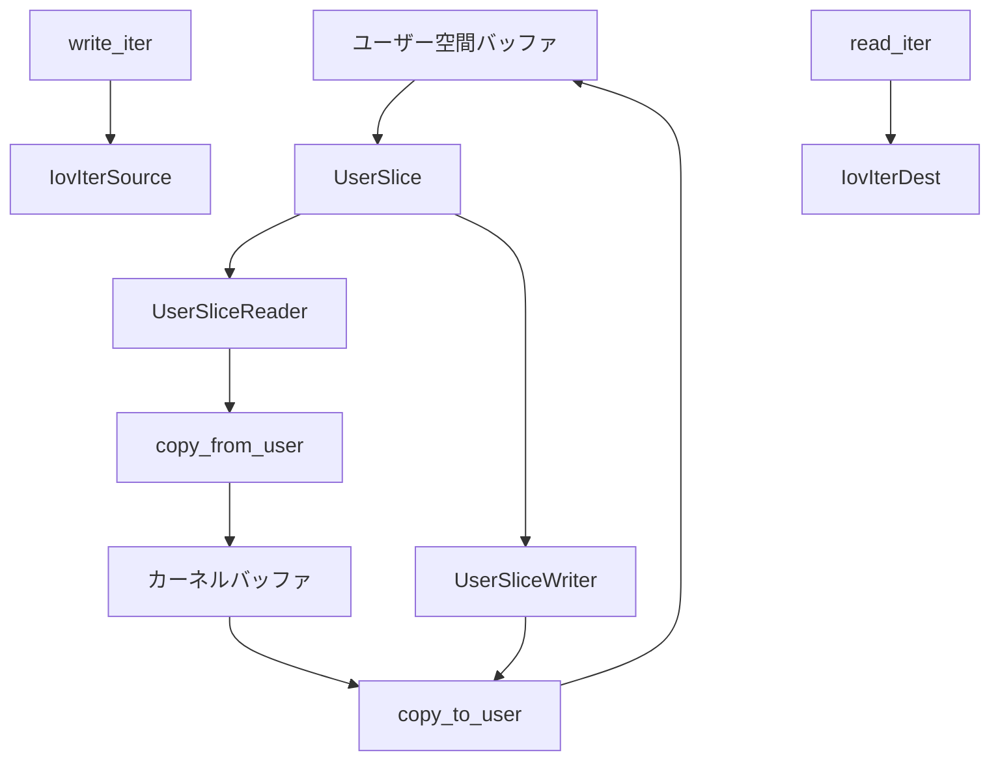

# 第22章 ファイル、uaccess、IovIter

> 本章で読むソース
>
> - [`rust/kernel/fs/file.rs`](https://github.com/gregkh/linux/blob/v6.18.38/rust/kernel/fs/file.rs)
> - [`rust/kernel/uaccess.rs`](https://github.com/gregkh/linux/blob/v6.18.38/rust/kernel/uaccess.rs)
> - [`rust/kernel/iov.rs`](https://github.com/gregkh/linux/blob/v6.18.38/rust/kernel/iov.rs)
> - [`rust/kernel/fs/kiocb.rs`](https://github.com/gregkh/linux/blob/v6.18.38/rust/kernel/fs/kiocb.rs)
> - [`rust/kernel/mm/virt.rs`](https://github.com/gregkh/linux/blob/v6.18.38/rust/kernel/mm/virt.rs)

## この章の狙い

本章では、ユーザー空間とカーネルがデータをやり取りする基礎型を読む。
`File` と `ARef`、境界を越える `UserSlice`、`IovIter` の方向分離、`Kiocb`、`VmaNew` を扱う。
`MiscDevice::mmap` への接続は [第23章](23-miscdevice-ioctl-poll.md) に譲る。

## 前提

[第6章](../part01-language-foundation/06-types-opaque-aref.md) で `ARef` と `AlwaysRefCounted` を読んでいること。
[第9章](../part02-memory-ownership/09-kbox-kvec.md) で `KVec` を読んでいること。

## File と LocalFile の参照カウント

`File` は C の `struct file` を包み、`ARef<File>` が通常の参照カウントを所有する。
`AlwaysRefCounted` は `get_file` と `fput` に対応する。

[`rust/kernel/fs/file.rs` L110-L114](https://github.com/gregkh/linux/blob/v6.18.38/rust/kernel/fs/file.rs#L110-L114)

```rust
/// # Refcounting
///
/// Instances of this type are reference-counted. The reference count is incremented by the
/// `fget`/`get_file` functions and decremented by `fput`. The Rust type `ARef<File>` represents a
/// pointer that owns a reference count on the file.
```

[`rust/kernel/fs/file.rs` L193-L207](https://github.com/gregkh/linux/blob/v6.18.38/rust/kernel/fs/file.rs#L193-L207)

```rust
unsafe impl AlwaysRefCounted for File {
    #[inline]
    fn inc_ref(&self) {
        // SAFETY: The existence of a shared reference means that the refcount is nonzero.
        unsafe { bindings::get_file(self.as_ptr()) };
    }

    #[inline]
    unsafe fn dec_ref(obj: ptr::NonNull<File>) {
        // SAFETY: To call this method, the caller passes us ownership of a normal refcount, so we
        // may drop it. The cast is okay since `File` has the same representation as `struct file`.
        unsafe { bindings::fput(obj.cast().as_ptr()) }
    }
}
```

light refcount は `fdget` で取得し、fd テーブルが共有されていなければ refcount を増やさない最適化である。
`&File` は light refcount に似た借用モデルを持つ。

## LocalFile と assume_no_fdget_pos

`LocalFile` は `fdget_pos` によるファイル位置ロック省略が起こりうるファイルを表す。
`assume_no_fdget_pos` は unsafe で、他スレッドの `fdget_pos` が無いことを呼び出し側が保証する。

[`rust/kernel/fs/file.rs` L210-L221](https://github.com/gregkh/linux/blob/v6.18.38/rust/kernel/fs/file.rs#L210-L221)

```rust
/// Wraps the kernel's `struct file`. Not thread safe.
///
/// This type represents a file that is not known to be safe to transfer across thread boundaries.
/// To obtain a thread-safe [`File`], use the [`assume_no_fdget_pos`] conversion.
///
/// See the documentation for [`File`] for more information.
///
/// # Invariants
///
/// * All instances of this type are refcounted using the `f_count` field.
/// * If there is an active call to `fdget_pos` that did not take the `f_pos_lock` mutex, then it
///   must be on the same thread as this file.
```

[`rust/kernel/fs/file.rs` L286-L308](https://github.com/gregkh/linux/blob/v6.18.38/rust/kernel/fs/file.rs#L286-L308)

```rust
    /// Assume that there are no active `fdget_pos` calls that prevent us from sharing this file.
    ///
    /// This makes it safe to transfer this file to other threads. No checks are performed, and
    /// using it incorrectly may lead to a data race on the file position if the file is shared
    /// with another thread.
    // ... (中略) ...
    #[inline]
    pub unsafe fn assume_no_fdget_pos(me: ARef<LocalFile>) -> ARef<File> {
        // INVARIANT: There are no `fdget_pos` calls on the current thread, and by the type
        // invariants, if there is a `fdget_pos` call on another thread, then it took the
        // `f_pos_lock` mutex.
        //
        // SAFETY: `LocalFile` and `File` have the same layout.
        unsafe { ARef::from_raw(ARef::into_raw(me).cast()) }
    }
```

## FileDescriptorReservation の二段コミット

fd は `get_unused_fd_flags` で予約し、`fd_install` で確定する。
`NotThreadSafe` が `current` タスク間の移動を防ぐ。

[`rust/kernel/fs/file.rs` L386-L395](https://github.com/gregkh/linux/blob/v6.18.38/rust/kernel/fs/file.rs#L386-L395)

```rust
pub struct FileDescriptorReservation {
    fd: u32,
    /// Prevent values of this type from being moved to a different task.
    ///
    /// The `fd_install` and `put_unused_fd` functions assume that the value of `current` is
    /// unchanged since the call to `get_unused_fd_flags`. By adding this marker to this type, we
    /// prevent it from being moved across task boundaries, which ensures that `current` does not
    /// change while this value exists.
    _not_send: NotThreadSafe,
}
```

[`rust/kernel/fs/file.rs` L417-L438](https://github.com/gregkh/linux/blob/v6.18.38/rust/kernel/fs/file.rs#L417-L438)

```rust
    /// Commits the reservation.
    ///
    /// The previously reserved file descriptor is bound to `file`. This method consumes the
    /// [`FileDescriptorReservation`], so it will not be usable after this call.
    #[inline]
    pub fn fd_install(self, file: ARef<File>) {
        // SAFETY: `self.fd` was previously returned by `get_unused_fd_flags`. We have not yet used
        // the fd, so it is still valid, and `current` still refers to the same task, as this type
        // cannot be moved across task boundaries.
        // ... (中略) ...
        unsafe { bindings::fd_install(self.fd, file.as_ptr()) };

        // `fd_install` consumes both the file descriptor and the file reference, so we cannot run
        // the destructors.
        core::mem::forget(self);
        core::mem::forget(file);
    }
```

## UserSlice と TOCTOU 抑止

`UserSlice` はユーザー空間への任意 deref を禁じ、`copy_from_user` と `copy_to_user` 経由のみ許す。
`reader` と `writer` は `self` を consume し、読み取り位置を前進させる。

[`rust/kernel/uaccess.rs` L74-L83](https://github.com/gregkh/linux/blob/v6.18.38/rust/kernel/uaccess.rs#L74-L83)

```rust
/// These APIs are designed to make it difficult to accidentally write TOCTOU (time-of-check to
/// time-of-use) bugs. Every time a memory location is read, the reader's position is advanced by
/// the read length and the next read will start from there. This helps prevent accidentally reading
/// the same location twice and causing a TOCTOU bug.
///
/// Creating a [`UserSliceReader`] and/or [`UserSliceWriter`] consumes the `UserSlice`, helping
/// ensure that there aren't multiple readers or writers to the same location.
///
/// If double-fetching a memory location is necessary for some reason, then that is done by creating
/// multiple readers to the same memory location, e.g. using [`clone_reader`].
```

これは完全防止ではない。
`reader_writer`、`clone_reader`、同じ `UserPtr` からの再 `new` は意図的に可能である。
読み取り後はカーネル側コピーを検証する責任が呼び出し側にある。

[`rust/kernel/uaccess.rs` L175-L205](https://github.com/gregkh/linux/blob/v6.18.38/rust/kernel/uaccess.rs#L175-L205)

```rust
    pub fn reader(self) -> UserSliceReader {
        UserSliceReader {
            ptr: self.ptr,
            length: self.length,
        }
    }

    /// Constructs a [`UserSliceWriter`].
    pub fn writer(self) -> UserSliceWriter {
        UserSliceWriter {
            ptr: self.ptr,
            length: self.length,
        }
    }

    /// Constructs both a [`UserSliceReader`] and a [`UserSliceWriter`].
    ///
    /// Usually when this is used, you will first read the data, and then overwrite it afterwards.
    pub fn reader_writer(self) -> (UserSliceReader, UserSliceWriter) {
        (
            UserSliceReader {
                ptr: self.ptr,
                length: self.length,
            },
            UserSliceWriter {
                ptr: self.ptr,
                length: self.length,
            },
        )
    }
```

[`rust/kernel/uaccess.rs` L262-L276](https://github.com/gregkh/linux/blob/v6.18.38/rust/kernel/uaccess.rs#L262-L276)

```rust
    pub fn read_raw(&mut self, out: &mut [MaybeUninit<u8>]) -> Result {
        let len = out.len();
        let out_ptr = out.as_mut_ptr().cast::<c_void>();
        if len > self.length {
            return Err(EFAULT);
        }
        // SAFETY: `out_ptr` points into a mutable slice of length `len`, so we may write
        // that many bytes to it.
        let res = unsafe { bindings::copy_from_user(out_ptr, self.ptr.as_const_ptr(), len) };
        if res != 0 {
            return Err(EFAULT);
        }
        self.ptr = self.ptr.wrapping_byte_add(len);
        self.length -= len;
        Ok(())
    }
```

## IovIter の方向分離

`IovIterSource` と `IovIterDest` は `ITER_SOURCE` と `ITER_DEST` で型を分ける。
FFI 境界の `from_raw` は unsafe で、`assert_eq!` が実行時に方向を検査する。

[`rust/kernel/iov.rs` L18-L27](https://github.com/gregkh/linux/blob/v6.18.38/rust/kernel/iov.rs#L18-L27)

```rust
const ITER_SOURCE: bool = bindings::ITER_SOURCE != 0;
const ITER_DEST: bool = bindings::ITER_DEST != 0;

// Compile-time assertion for the above constants.
const _: () = {
    build_assert!(
        ITER_SOURCE != ITER_DEST,
        "ITER_DEST and ITER_SOURCE should be different."
    );
};
```

[`rust/kernel/iov.rs` L61-L71](https://github.com/gregkh/linux/blob/v6.18.38/rust/kernel/iov.rs#L61-L71)

```rust
    pub unsafe fn from_raw<'iov>(ptr: *mut bindings::iov_iter) -> &'iov mut IovIterSource<'data> {
        // SAFETY: The caller ensures that `ptr` is valid.
        let data_source = unsafe { (*ptr).data_source };
        assert_eq!(data_source, ITER_SOURCE);

        // SAFETY: The caller ensures the type invariants for the right durations, and
        // `IovIterSource` is layout compatible with `struct iov_iter`.
        unsafe { &mut *ptr.cast::<IovIterSource<'data>>() }
    }
```

入口は unsafe 契約と runtime assert、通過後は別型としてコンパイル時に方向取り違えを防ぐ。

## IovIter のデータ経路

方向チェックを通過した後の実データ移動は `IovIterSource::copy_from_iter` と `IovIterDest::copy_to_iter` が担う。
`copy_from_iter` は `copy_from_iter_raw` に委譲する薄いラッパーである。

[`rust/kernel/iov.rs` L129-L135](https://github.com/gregkh/linux/blob/v6.18.38/rust/kernel/iov.rs#L129-L135)

```rust
    pub fn copy_from_iter(&mut self, out: &mut [u8]) -> usize {
        // SAFETY: `Self::copy_from_iter_raw` guarantees that it will not write any uninitialized
        // bytes in the provided buffer, so `out` is still a valid `u8` slice after this call.
        let out = unsafe { &mut *(ptr::from_mut(out) as *mut [MaybeUninit<u8>]) };

        self.copy_from_iter_raw(out).len()
    }
```

`copy_from_iter_raw` は初期化前メモリ `MaybeUninit<u8>` を受け取る。
C 側の `_copy_from_iter` を呼んだうえで、実際に書き込まれた範囲だけを初期化済みスライスとして返す。

[`rust/kernel/iov.rs` L164-L179](https://github.com/gregkh/linux/blob/v6.18.38/rust/kernel/iov.rs#L164-L179)

```rust
    pub fn copy_from_iter_raw(&mut self, out: &mut [MaybeUninit<u8>]) -> &mut [u8] {
        let capacity = out.len();
        let out = out.as_mut_ptr().cast::<u8>();

        // GUARANTEES: The C API guarantees that it does not write uninitialized bytes to the
        // provided buffer.
        // SAFETY:
        // * By the type invariants, it is still valid to read from this IO vector.
        // * `out` is valid for writing for `capacity` bytes because it comes from a slice of
        //   that length.
        let len = unsafe { bindings::_copy_from_iter(out.cast(), capacity, self.as_raw()) };

        // SAFETY: The underlying C api guarantees that initialized bytes have been written to the
        // first `len` bytes of the spare capacity.
        unsafe { slice::from_raw_parts_mut(out, len) }
    }
```

逆方向の `IovIterDest::copy_to_iter` は C 側の `_copy_to_iter` を直接呼び、書き込めたバイト数を返す。
要求量より短ければ、そこでイテレータの終端に達したことを意味する。

[`rust/kernel/iov.rs` L281-L286](https://github.com/gregkh/linux/blob/v6.18.38/rust/kernel/iov.rs#L281-L286)

```rust
    pub fn copy_to_iter(&mut self, input: &[u8]) -> usize {
        // SAFETY:
        // * By the type invariants, it is still valid to write to this IO vector.
        // * `input` is valid for `input.len()` bytes.
        unsafe { bindings::_copy_to_iter(input.as_ptr().cast(), input.len(), self.as_raw()) }
    }
```

`simple_read_from_buffer` はこの `copy_to_iter` を使い、`read_iter` 実装向けにファイル位置の更新まで面倒を見るユーティリティである。
`ppos` を検査し、`contents` のうち `pos` 以降を渡して `copy_to_iter` を呼び、実際に書き込めたバイト数だけ `ppos` を進める。
コピーが要求量より短くても `ppos` は書き込んだ分だけ前進するため、次回の呼び出しは続きから再開できる。

[`rust/kernel/iov.rs` L295-L313](https://github.com/gregkh/linux/blob/v6.18.38/rust/kernel/iov.rs#L295-L313)

```rust
    pub fn simple_read_from_buffer(&mut self, ppos: &mut i64, contents: &[u8]) -> Result<usize> {
        if *ppos < 0 {
            return Err(EINVAL);
        }
        let Ok(pos) = usize::try_from(*ppos) else {
            return Ok(0);
        };
        if pos >= contents.len() {
            return Ok(0);
        }

        // BOUNDS: We just checked that `pos < contents.len()` above.
        let num_written = self.copy_to_iter(&contents[pos..]);

        // OVERFLOW: `pos+num_written <= contents.len() <= isize::MAX <= i64::MAX`.
        *ppos = (pos + num_written) as i64;

        Ok(num_written)
    }
```

## Kiocb と VmaNew

`Kiocb` は `struct kiocb` とファイル位置、プライベートデータへの薄いラッパーである。

[`rust/kernel/fs/kiocb.rs` L23-L55](https://github.com/gregkh/linux/blob/v6.18.38/rust/kernel/fs/kiocb.rs#L23-L55)

```rust
pub struct Kiocb<'a, T> {
    inner: NonNull<bindings::kiocb>,
    _phantom: PhantomData<&'a T>,
}

impl<'a, T: ForeignOwnable> Kiocb<'a, T> {
    /// Create a `Kiocb` from a raw pointer.
    // ... (中略) ...
    pub unsafe fn from_raw(kiocb: *mut bindings::kiocb) -> Self {
        Self {
            // SAFETY: If a pointer is valid it is not null.
            inner: unsafe { NonNull::new_unchecked(kiocb) },
            _phantom: PhantomData,
        }
    }

    /// Get the filesystem or driver specific data associated with the file.
    pub fn file(&self) -> <T as ForeignOwnable>::Borrowed<'a> {
        // SAFETY: We have shared access to this kiocb and hence the underlying file, so we can
        // read the file's private data.
        let private = unsafe { (*(*self.as_raw()).ki_filp).private_data };
        // SAFETY: The kiocb has shared access to the private data.
        unsafe { <T as ForeignOwnable>::borrow(private) }
    }
```

`VmaNew` は mmap 初期化中だけ有効な型で、`!Sync` と未共有の状況証拠でフラグ変更を safe にする。

[`rust/kernel/mm/virt.rs` L201-L214](https://github.com/gregkh/linux/blob/v6.18.38/rust/kernel/mm/virt.rs#L201-L214)

```rust
/// A configuration object for setting up a VMA in an `f_ops->mmap()` hook.
///
/// The `f_ops->mmap()` hook is called when a new VMA is being created, and the hook is able to
/// configure the VMA in various ways to fit the driver that owns it. Using `VmaNew` indicates that
/// you are allowed to perform operations on the VMA that can only be performed before the VMA is
/// fully initialized.
// ... (中略) ...
#[repr(transparent)]
pub struct VmaNew {
    vma: VmaRef,
}
```

[`rust/kernel/mm/virt.rs` L245-L278](https://github.com/gregkh/linux/blob/v6.18.38/rust/kernel/mm/virt.rs#L245-L278)

```rust
    unsafe fn update_flags(&self, set: vm_flags_t, unset: vm_flags_t) {
        let mut flags = self.flags();
        flags |= set;
        flags &= !unset;

        // SAFETY: This is not a data race: the vma is undergoing initial setup, so it's not yet
        // shared. Additionally, `VmaNew` is `!Sync`, so it cannot be used to write in parallel.
        // The caller promises that this does not set the flags to an invalid value.
        unsafe { (*self.as_ptr()).__bindgen_anon_2.__vm_flags = flags };
    }

    /// Set the `VM_MIXEDMAP` flag on this vma.
    // ... (中略) ...
    pub fn set_mixedmap(&self) -> &VmaMixedMap {
        // SAFETY: We don't yet provide a way to set VM_PFNMAP, so this cannot put the flags in an
        // invalid state.
        unsafe { self.update_flags(flags::MIXEDMAP, 0) };

        // SAFETY: We just set `VM_MIXEDMAP` on the vma.
        unsafe { VmaMixedMap::from_raw(self.vma.as_ptr()) }
    }

    /// Set the `VM_IO` flag on this vma.
    // ... (中略) ...
    pub fn set_io(&self) {
        // SAFETY: Setting the VM_IO flag is always okay.
        unsafe { self.update_flags(flags::IO, 0) };
    }
```

## 処理の流れ



## 高速化と最適化の工夫

`self` を consume するのは `UserSlice::reader`/`writer` を呼び出す `UserSlice` 自身であり、通常の入口では偶発的な重複生成を作りにくくするが、`reader_writer` や `clone_reader` による明示的な複製は可能である。
生成後の `UserSliceReader::read_raw` 等は `&mut self` を取り、コピーが全量成功したときだけ `ptr` と `length` を進めるため、失敗した読み取りが位置を狂わせない。
`IovIter` は `ITER_SOURCE` と `ITER_DEST` の compile-time assert でタグ定数の整合を保ち、通過後の API を型で分離する。
`LocalFile` と `File` の分離は、ファイル位置ロック省略の最適化を型で表現する。

## Linux 7.1.3 での差分

`fs/file.rs` に `pub type Offset` が追加された。

[`rust/kernel/fs/file.rs` L20-L23](https://github.com/gregkh/linux/blob/v7.1.3/rust/kernel/fs/file.rs#L20-L23)

```rust
/// Primitive type representing the offset within a [`File`].
///
/// Type alias for `bindings::loff_t`.
pub type Offset = bindings::loff_t;
```

`uaccess.rs` には `read_slice_file`、`write_dma` 等が追加された。
`write_dma` は DMA コヒーレントメモリを `&[u8]` にせず生ポインタ経由で `copy_to_user` する。

[`rust/kernel/uaccess.rs` L510-L552](https://github.com/gregkh/linux/blob/v7.1.3/rust/kernel/uaccess.rs#L510-L552)

```rust
    /// Note: The memory may be concurrently modified by hardware (e.g., DMA). In such cases,
    /// the copied data may be inconsistent, but this does not cause undefined behavior.
    // ... (中略) ...
    pub fn write_dma<T: KnownSize + AsBytes + ?Sized>(
        &mut self,
        alloc: &Coherent<T>,
        offset: usize,
        count: usize,
    ) -> Result {
        let len = alloc.size();
        if offset.checked_add(count).ok_or(EOVERFLOW)? > len {
            return Err(ERANGE);
        }

        if count > self.len() {
            return Err(ERANGE);
        }

        // SAFETY: `as_ptr()` returns a valid pointer to a memory region of `count()` bytes, as
        // guaranteed by the `Coherent` invariants. The check above ensures `offset + count <= len`.
        let src_ptr = unsafe { alloc.as_ptr().cast::<u8>().add(offset) };

        // Note: Use `write_raw` instead of `write_slice` because the allocation is coherent
        // memory that hardware may modify (e.g., DMA); we cannot form a `&[u8]` slice over
        // such volatile memory.
        //
        // SAFETY: `src_ptr` points into the allocation and is valid for `count` bytes (see above).
        unsafe { self.write_raw(src_ptr, count) }
    }
```

`mm/virt.rs` では `zap_page_range_single` が `zap_vma_range` に改名された。
`kiocb.rs` と `iov.rs` は v6.18.38 から無変更である。

## まとめ

`File` と `UserSlice` は C の refcount と uaccess を Rust の型契約へ写像する。
`IovIter` は FFI 入口の runtime assert と通過後の型分離で方向安全性を二段階で担う。
`VmaNew` は mmap 初期化中の排他アクセスを型で表す基礎である。

## 関連する章

- [第6章 型の基盤](../part01-language-foundation/06-types-opaque-aref.md)
- [第9章 KBox と KVec](../part02-memory-ownership/09-kbox-kvec.md)
- [第19章 DMA コヒーレント確保](../part05-io-dma-async/19-dma-coherent.md)
- [第23章 miscdevice と ioctl](23-miscdevice-ioctl-poll.md)
