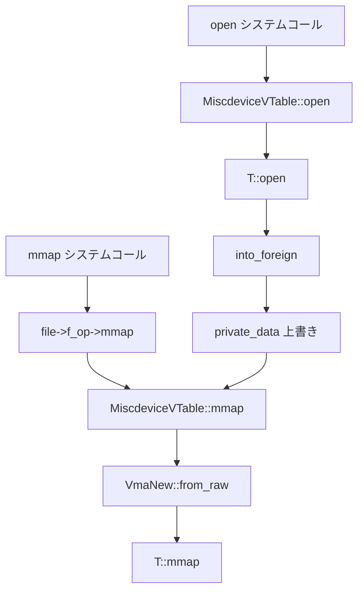

# 第23章 miscdevice、ioctl、poll、seq_file

> 本章で読むソース
>
> - [`rust/kernel/miscdevice.rs`](https://github.com/gregkh/linux/blob/v6.18.38/rust/kernel/miscdevice.rs)
> - [`rust/kernel/ioctl.rs`](https://github.com/gregkh/linux/blob/v6.18.38/rust/kernel/ioctl.rs)
> - [`rust/kernel/sync/poll.rs`](https://github.com/gregkh/linux/blob/v6.18.38/rust/kernel/sync/poll.rs)
> - [`rust/kernel/seq_file.rs`](https://github.com/gregkh/linux/blob/v6.18.38/rust/kernel/seq_file.rs)

## この章の狙い

本章では、[第22章](22-file-uaccess-iov.md) の基礎型が C の `file_operations` へどう橋渡しされるかを読む。
`MiscDevice` トレイト、`ioctl` 番号エンコード、`PollTable`、 `SeqFile` を扱う。
`MiscDevice` には poll コールバックは存在せず、poll は binder 等が独自に使う。

## 前提

[第22章](22-file-uaccess-iov.md) で `File`、`UserSlice`、`IovIter`、`Kiocb`、`VmaNew` を読んでいること。
[第6章](../part01-language-foundation/06-types-opaque-aref.md) で `ForeignOwnable` を読んでいること。

## MiscDeviceRegistration の RAII

`register` は `try_pin_init!` で `misc_register` を呼び、`PinnedDrop` で `misc_deregister` する。

[`rust/kernel/miscdevice.rs` L55-L61](https://github.com/gregkh/linux/blob/v6.18.38/rust/kernel/miscdevice.rs#L55-L61)

```rust
#[repr(transparent)]
#[pin_data(PinnedDrop)]
pub struct MiscDeviceRegistration<T> {
    #[pin]
    inner: Opaque<bindings::miscdevice>,
    _t: PhantomData<T>,
}
```

[`rust/kernel/miscdevice.rs` L70-L87](https://github.com/gregkh/linux/blob/v6.18.38/rust/kernel/miscdevice.rs#L70-L87)

```rust
    pub fn register(opts: MiscDeviceOptions) -> impl PinInit<Self, Error> {
        try_pin_init!(Self {
            inner <- Opaque::try_ffi_init(move |slot: *mut bindings::miscdevice| {
                // SAFETY: The initializer can write to the provided `slot`.
                unsafe { slot.write(opts.into_raw::<T>()) };

                // SAFETY: We just wrote the misc device options to the slot. The miscdevice will
                // get unregistered before `slot` is deallocated because the memory is pinned and
                // the destructor of this type deallocates the memory.
                // INVARIANT: If this returns `Ok(())`, then the `slot` will contain a registered
                // misc device.
                to_result(unsafe { bindings::misc_register(slot) })
            }),
            _t: PhantomData,
        })
    }
```

[`rust/kernel/miscdevice.rs` L105-L110](https://github.com/gregkh/linux/blob/v6.18.38/rust/kernel/miscdevice.rs#L105-L110)

```rust
#[pinned_drop]
impl<T> PinnedDrop for MiscDeviceRegistration<T> {
    fn drop(self: Pin<&mut Self>) {
        // SAFETY: We know that the device is registered by the type invariants.
        unsafe { bindings::misc_deregister(self.inner.get()) };
    }
}
```

## MiscDevice トレイトと vtable 生成

`MiscDevice` は安全な Rust メソッド群を提供する。
`#[vtable]` マクロが `HAS_MMAP` 等の定数を生成し、未実装コールバックは `None` になる。

[`rust/kernel/miscdevice.rs` L113-L153](https://github.com/gregkh/linux/blob/v6.18.38/rust/kernel/miscdevice.rs#L113-L153)

```rust
/// Trait implemented by the private data of an open misc device.
#[vtable]
pub trait MiscDevice: Sized {
    /// What kind of pointer should `Self` be wrapped in.
    type Ptr: ForeignOwnable + Send + Sync;

    /// Called when the misc device is opened.
    ///
    /// The returned pointer will be stored as the private data for the file.
    fn open(_file: &File, _misc: &MiscDeviceRegistration<Self>) -> Result<Self::Ptr>;

    /// Called when the misc device is released.
    fn release(device: Self::Ptr, _file: &File) {
        drop(device);
    }

    /// Handle for mmap.
    // ... (中略) ...
    fn mmap(
        _device: <Self::Ptr as ForeignOwnable>::Borrowed<'_>,
        _file: &File,
        _vma: &VmaNew,
    ) -> Result {
        build_error!(VTABLE_DEFAULT_ERROR)
    }

    /// Read from this miscdevice.
    fn read_iter(_kiocb: Kiocb<'_, Self::Ptr>, _iov: &mut IovIterDest<'_>) -> Result<usize> {
        build_error!(VTABLE_DEFAULT_ERROR)
    }

    /// Write to this miscdevice.
    fn write_iter(_kiocb: Kiocb<'_, Self::Ptr>, _iov: &mut IovIterSource<'_>) -> Result<usize> {
        build_error!(VTABLE_DEFAULT_ERROR)
    }
```

poll メソッドはトレイトに存在しない。

[`rust/kernel/miscdevice.rs` L391-L422](https://github.com/gregkh/linux/blob/v6.18.38/rust/kernel/miscdevice.rs#L391-L422)

```rust
    const VTABLE: bindings::file_operations = bindings::file_operations {
        open: Some(Self::open),
        release: Some(Self::release),
        mmap: if T::HAS_MMAP { Some(Self::mmap) } else { None },
        read_iter: if T::HAS_READ_ITER {
            Some(Self::read_iter)
        } else {
            None
        },
        write_iter: if T::HAS_WRITE_ITER {
            Some(Self::write_iter)
        } else {
            None
        },
        unlocked_ioctl: if T::HAS_IOCTL {
            Some(Self::ioctl)
        } else {
            None
        },
        #[cfg(CONFIG_COMPAT)]
        compat_ioctl: if T::HAS_COMPAT_IOCTL {
            Some(Self::compat_ioctl)
        } else if T::HAS_IOCTL {
            Some(bindings::compat_ptr_ioctl)
        } else {
            None
        },
        show_fdinfo: if T::HAS_SHOW_FDINFO {
            Some(Self::show_fdinfo)
        } else {
            None
        },
        // SAFETY: All zeros is a valid value for `bindings::file_operations`.
        ..unsafe { MaybeUninit::zeroed().assume_init() }
    };
```

## open と private_data の型変化

`misc_open` が一時的に `MiscDeviceRegistration` へのポインタを置き、`T::open` の戻り値で上書きする。

[`rust/kernel/miscdevice.rs` L204-L238](https://github.com/gregkh/linux/blob/v6.18.38/rust/kernel/miscdevice.rs#L204-L238)

```rust
    unsafe extern "C" fn open(inode: *mut bindings::inode, raw_file: *mut bindings::file) -> c_int {
        // SAFETY: The pointers are valid and for a file being opened.
        let ret = unsafe { bindings::generic_file_open(inode, raw_file) };
        if ret != 0 {
            return ret;
        }

        // SAFETY: The open call of a file can access the private data.
        let misc_ptr = unsafe { (*raw_file).private_data };

        // SAFETY: This is a miscdevice, so `misc_open()` set the private data to a pointer to the
        // associated `struct miscdevice` before calling into this method. Furthermore,
        // `misc_open()` ensures that the miscdevice can't be unregistered and freed during this
        // call to `fops_open`.
        let misc = unsafe { &*misc_ptr.cast::<MiscDeviceRegistration<T>>() };

        // SAFETY:
        // * This underlying file is valid for (much longer than) the duration of `T::open`.
        // * There is no active fdget_pos region on the file on this thread.
        let file = unsafe { File::from_raw_file(raw_file) };

        let ptr = match T::open(file, misc) {
            Ok(ptr) => ptr,
            Err(err) => return err.to_errno(),
        };

        // This overwrites the private data with the value specified by the user, changing the type
        // of this file's private data. All future accesses to the private data is performed by
        // other fops_* methods in this file, which all correctly cast the private data to the new
        // type.
        //
        // SAFETY: The open call of a file can access the private data.
        unsafe { (*raw_file).private_data = ptr.into_foreign() };

        0
    }
```

## read_iter、write_iter、mmap の接続

`read_iter` は `Kiocb::from_raw` と `IovIterDest::from_raw` で ch22 の型を再構築する。

[`rust/kernel/miscdevice.rs` L263-L276](https://github.com/gregkh/linux/blob/v6.18.38/rust/kernel/miscdevice.rs#L263-L276)

```rust
    unsafe extern "C" fn read_iter(
        kiocb: *mut bindings::kiocb,
        iter: *mut bindings::iov_iter,
    ) -> isize {
        // SAFETY: The caller provides a valid `struct kiocb` associated with a
        // `MiscDeviceRegistration<T>` file.
        let kiocb = unsafe { Kiocb::from_raw(kiocb) };
        // SAFETY: This is a valid `struct iov_iter` for writing.
        let iov = unsafe { IovIterDest::from_raw(iter) };

        match T::read_iter(kiocb, iov) {
            Ok(res) => res as isize,
            Err(err) => err.to_errno() as isize,
        }
    }
```

`mmap` は `VmaNew::from_raw` を呼び、ch22 で導入した型がここで初めて使われる。

[`rust/kernel/miscdevice.rs` L303-L323](https://github.com/gregkh/linux/blob/v6.18.38/rust/kernel/miscdevice.rs#L303-L323)

```rust
    unsafe extern "C" fn mmap(
        file: *mut bindings::file,
        vma: *mut bindings::vm_area_struct,
    ) -> c_int {
        // SAFETY: The mmap call of a file can access the private data.
        let private = unsafe { (*file).private_data };
        // SAFETY: This is a Rust Miscdevice, so we call `into_foreign` in `open` and
        // `from_foreign` in `release`, and `fops_mmap` is guaranteed to be called between those
        // two operations.
        let device = unsafe { <T::Ptr as ForeignOwnable>::borrow(private.cast()) };
        // SAFETY: The caller provides a vma that is undergoing initial VMA setup.
        let area = unsafe { VmaNew::from_raw(vma) };
        // SAFETY:
        // * The file is valid for the duration of this call.
        // * There is no active fdget_pos region on the file on this thread.
        let file = unsafe { File::from_raw_file(file) };

        match T::mmap(device, file, area) {
            Ok(()) => 0,
            Err(err) => err.to_errno(),
        }
    }
```

## ioctl 番号のエンコード

`_IOC` は C マクロと同じビットレイアウトを持ち、`build_assert!` で範囲をコンパイル時検査する。

[`rust/kernel/ioctl.rs` L11-L23](https://github.com/gregkh/linux/blob/v6.18.38/rust/kernel/ioctl.rs#L11-L23)

```rust
/// Build an ioctl number, analogous to the C macro of the same name.
#[inline(always)]
const fn _IOC(dir: u32, ty: u32, nr: u32, size: usize) -> u32 {
    build_assert!(dir <= uapi::_IOC_DIRMASK);
    build_assert!(ty <= uapi::_IOC_TYPEMASK);
    build_assert!(nr <= uapi::_IOC_NRMASK);
    build_assert!(size <= (uapi::_IOC_SIZEMASK as usize));

    (dir << uapi::_IOC_DIRSHIFT)
        | (ty << uapi::_IOC_TYPESHIFT)
        | (nr << uapi::_IOC_NRSHIFT)
        | ((size as u32) << uapi::_IOC_SIZESHIFT)
}
```

[`rust/kernel/ioctl.rs` L31-L40](https://github.com/gregkh/linux/blob/v6.18.38/rust/kernel/ioctl.rs#L31-L40)

```rust
/// Build an ioctl number for a read-only ioctl.
#[inline(always)]
pub const fn _IOR<T>(ty: u32, nr: u32) -> u32 {
    _IOC(uapi::_IOC_READ, ty, nr, core::mem::size_of::<T>())
}

/// Build an ioctl number for a write-only ioctl.
#[inline(always)]
pub const fn _IOW<T>(ty: u32, nr: u32) -> u32 {
    _IOC(uapi::_IOC_WRITE, ty, nr, core::mem::size_of::<T>())
}
```

サンプルでは `_IOR` と `UserSlice` が ioctl 引数の読み書きに使われる。

[`samples/rust/rust_misc_device.rs` L113-L115](https://github.com/gregkh/linux/blob/v6.18.38/samples/rust/rust_misc_device.rs#L113-L115)

```rust
const RUST_MISC_DEV_HELLO: u32 = _IO('|' as u32, 0x80);
const RUST_MISC_DEV_GET_VALUE: u32 = _IOR::<i32>('|' as u32, 0x81);
const RUST_MISC_DEV_SET_VALUE: u32 = _IOW::<i32>('|' as u32, 0x82);
```

[`samples/rust/rust_misc_device.rs` L214-L216](https://github.com/gregkh/linux/blob/v6.18.38/samples/rust/rust_misc_device.rs#L214-L216)

```rust
        match cmd {
            RUST_MISC_DEV_GET_VALUE => me.get_value(UserSlice::new(arg, size).writer())?,
            RUST_MISC_DEV_SET_VALUE => me.set_value(UserSlice::new(arg, size).reader())?,
```

## ioctl と file_operations の橋渡し

`MiscDevice::ioctl` はカーネル側から渡された `device`、`file`、`cmd`、`arg` を受け取り、`Result<isize>` を返すトレイトメソッドである。

[`rust/kernel/miscdevice.rs` L160-L167](https://github.com/gregkh/linux/blob/v6.18.38/rust/kernel/miscdevice.rs#L160-L167)

```rust
    fn ioctl(
        _device: <Self::Ptr as ForeignOwnable>::Borrowed<'_>,
        _file: &File,
        _cmd: u32,
        _arg: usize,
    ) -> Result<isize> {
        build_error!(VTABLE_DEFAULT_ERROR)
    }
```

`file_operations.unlocked_ioctl` が指す `MiscdeviceVTable::ioctl` は、`private_data` を borrow して `T::Ptr` を得たあと `File` を再構築し、`T::ioctl` を呼ぶ。
戻り値の `Result<isize>` は `Ok` なら `c_long` へそのままキャストし、`Err` なら `to_errno` で errno（負の値）に変換して C 側の `long` 戻り値へ写像する。

[`rust/kernel/miscdevice.rs` L329-L344](https://github.com/gregkh/linux/blob/v6.18.38/rust/kernel/miscdevice.rs#L329-L344)

```rust
    unsafe extern "C" fn ioctl(file: *mut bindings::file, cmd: c_uint, arg: c_ulong) -> c_long {
        // SAFETY: The ioctl call of a file can access the private data.
        let private = unsafe { (*file).private_data };
        // SAFETY: Ioctl calls can borrow the private data of the file.
        let device = unsafe { <T::Ptr as ForeignOwnable>::borrow(private) };

        // SAFETY:
        // * The file is valid for the duration of this call.
        // * There is no active fdget_pos region on the file on this thread.
        let file = unsafe { File::from_raw_file(file) };

        match T::ioctl(device, file, cmd, arg) {
            Ok(ret) => ret as c_long,
            Err(err) => err.to_errno() as c_long,
        }
    }
```

## poll と PollCondVar

`PollTable::register_wait` は `poll_wait` で file と `PollCondVar` を結びつける。
miscdevice からは配線されない。

[`rust/kernel/sync/poll.rs` L50-L62](https://github.com/gregkh/linux/blob/v6.18.38/rust/kernel/sync/poll.rs#L50-L62)

```rust
    /// Register this [`PollTable`] with the provided [`PollCondVar`], so that it can be notified
    /// using the condition variable.
    pub fn register_wait(&self, file: &File, cv: &PollCondVar) {
        // SAFETY:
        // * `file.as_ptr()` references a valid file for the duration of this call.
        // * `self.table` is null or references a valid poll_table for the duration of this call.
        // * Since `PollCondVar` is pinned, its destructor is guaranteed to run before the memory
        //   containing `cv.wait_queue_head` is invalidated. Since the destructor clears all
        //   waiters and then waits for an rcu grace period, it's guaranteed that
        //   `cv.wait_queue_head` remains valid for at least an rcu grace period after the removal
        //   of the last waiter.
        unsafe { bindings::poll_wait(file.as_ptr(), cv.wait_queue_head.get(), self.table) }
    }
```

`PollCondVar` の drop は `__wake_up_pollfree` と `synchronize_rcu` で待機者の安全な解放を保証する。

[`rust/kernel/sync/poll.rs` L92-L105](https://github.com/gregkh/linux/blob/v6.18.38/rust/kernel/sync/poll.rs#L92-L105)

```rust
#[pinned_drop]
impl PinnedDrop for PollCondVar {
    #[inline]
    fn drop(self: Pin<&mut Self>) {
        // Clear anything registered using `register_wait`.
        //
        // SAFETY: The pointer points at a valid `wait_queue_head`.
        unsafe { bindings::__wake_up_pollfree(self.inner.wait_queue_head.get()) };

        // Wait for epoll items to be properly removed.
        //
        // SAFETY: Just an FFI call.
        unsafe { bindings::synchronize_rcu() };
    }
}
```

poll を使うドライバは miscdevice を経由せず、自前の `file_operations` を組む必要がある。
実例は Android binder ドライバである。

## SeqFile と show_fdinfo

`show_fdinfo` は `SeqFile::from_raw` 経由で `T::show_fdinfo` へ渡す。

[`rust/kernel/miscdevice.rs` L375-L388](https://github.com/gregkh/linux/blob/v6.18.38/rust/kernel/miscdevice.rs#L375-L388)

```rust
    unsafe extern "C" fn show_fdinfo(seq_file: *mut bindings::seq_file, file: *mut bindings::file) {
        // SAFETY: The release call of a file owns the private data.
        let private = unsafe { (*file).private_data };
        // SAFETY: Ioctl calls can borrow the private data of the file.
        let device = unsafe { <T::Ptr as ForeignOwnable>::borrow(private) };
        // SAFETY:
        // * The file is valid for the duration of this call.
        // * There is no active fdget_pos region on the file on this thread.
        let file = unsafe { File::from_raw_file(file) };
        // SAFETY: The caller ensures that the pointer is valid and exclusive for the duration in
        // which this method is called.
        let m = unsafe { SeqFile::from_raw(seq_file) };

        T::show_fdinfo(device, m, file);
    }
```

`seq_print!` は `seq_printf` に `%pA` で `fmt::Arguments` を渡す。

[`rust/kernel/seq_file.rs` L32-L43](https://github.com/gregkh/linux/blob/v6.18.38/rust/kernel/seq_file.rs#L32-L43)

```rust
    /// Used by the [`seq_print`] macro.
    #[inline]
    pub fn call_printf(&self, args: fmt::Arguments<'_>) {
        // SAFETY: Passing a void pointer to `Arguments` is valid for `%pA`.
        unsafe {
            bindings::seq_printf(
                self.inner.get(),
                c_str!("%pA").as_char_ptr(),
                core::ptr::from_ref(&args).cast::<crate::ffi::c_void>(),
            );
        }
    }
```

## 処理の流れ



## 高速化と最適化の工夫

`HAS_*` 定数による条件付き vtable 生成は、未実装コールバックをコンパイル時に `None` として除外する。
`_IOC` の `build_assert!` は C マクロにないコンパイル時範囲検査を追加する。
`PollCondVar` の drop 時 `synchronize_rcu` はダングリング待機を防ぐ。

## Linux 7.1.3 での差分

`miscdevice.rs` では `MaybeUninit::zeroed().assume_init()` が `pin_init::zeroed()` に置き換わった。

[`rust/kernel/miscdevice.rs` L34-L39](https://github.com/gregkh/linux/blob/v7.1.3/rust/kernel/miscdevice.rs#L34-L39)

```rust
    pub const fn into_raw<T: MiscDevice>(self) -> bindings::miscdevice {
        let mut result: bindings::miscdevice = pin_init::zeroed();
        result.minor = bindings::MISC_DYNAMIC_MINOR as ffi::c_int;
        result.name = crate::str::as_char_ptr_in_const_context(self.name);
        result.fops = MiscdeviceVTable::<T>::build();
        result
    }
```

`compat_ioctl` のフォールバックは `Some(bindings::compat_ptr_ioctl)` から `bindings::compat_ptr_ioctl` へ変わった。

[`rust/kernel/miscdevice.rs` L409-L422](https://github.com/gregkh/linux/blob/v7.1.3/rust/kernel/miscdevice.rs#L409-L422)

```rust
        #[cfg(CONFIG_COMPAT)]
        compat_ioctl: if T::HAS_COMPAT_IOCTL {
            Some(Self::compat_ioctl)
        } else if T::HAS_IOCTL {
            bindings::compat_ptr_ioctl
        } else {
            None
        },
        show_fdinfo: if T::HAS_SHOW_FDINFO {
            Some(Self::show_fdinfo)
        } else {
            None
        },
        ..pin_init::zeroed()
    };
```

`seq_file.rs` では `c_str!("%pA")` が `c"%pA"` と `CStrExt::as_char_ptr` に変わった。

[`rust/kernel/seq_file.rs` L34-L42](https://github.com/gregkh/linux/blob/v7.1.3/rust/kernel/seq_file.rs#L34-L42)

```rust
    pub fn call_printf(&self, args: fmt::Arguments<'_>) {
        // SAFETY: Passing a void pointer to `Arguments` is valid for `%pA`.
        unsafe {
            bindings::seq_printf(
                self.inner.get(),
                c"%pA".as_char_ptr(),
                core::ptr::from_ref(&args).cast::<crate::ffi::c_void>(),
            );
        }
    }
```

`ioctl.rs` と `sync/poll.rs` は v6.18.38 から無変更である。

## まとめ

miscdevice は `MiscDevice` トレイトと `#[vtable]` で C の `file_operations` を型安全に生成する。
ch22 の `Kiocb`、`IovIter`、`VmaNew` は vtable の C コールバックから再構築される。
poll は miscdevice の一部ではなく、binder 等が `PollTable` を直接使う汎用機構である。

## 関連する章

- [第6章 型の基盤](../part01-language-foundation/06-types-opaque-aref.md)
- [第17章 CStr とフォーマット](../part04-data-structures/17-str-cstr-fmt.md)
- [第22章 ファイルと uaccess](22-file-uaccess-iov.md)
