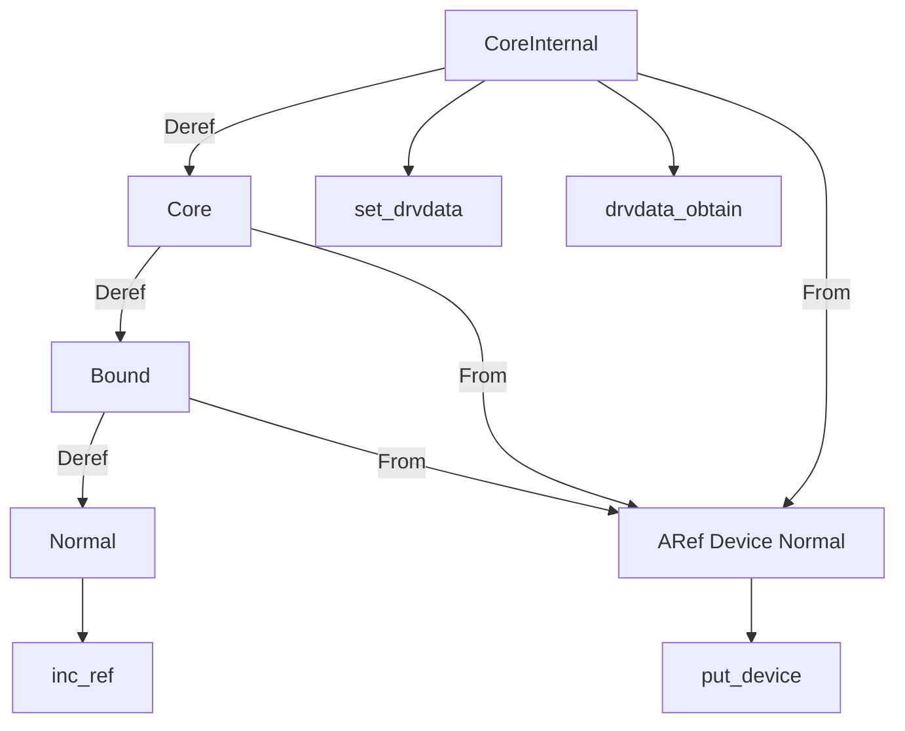

# 第24章 Device と参照カウントと状態型

> 本章で読むソース
>
> - [`rust/kernel/device.rs`](https://github.com/gregkh/linux/blob/v6.18.38/rust/kernel/device.rs)
> - [`rust/kernel/device/property.rs`](https://github.com/gregkh/linux/blob/v6.18.38/rust/kernel/device/property.rs)
> - [`rust/kernel/device_id.rs`](https://github.com/gregkh/linux/blob/v6.18.38/rust/kernel/device_id.rs)

## この章の狙い

本章では、C の `struct device` を包む `Device<Ctx>` と、その参照カウント、状態型、`set_drvdata` による private data の所有権移譲を読む。
`IdArray` によるデバイス ID テーブル構築も扱う。
probe コールバックとの接続は [第25章](25-driver-registration-probe.md) に譲る。

## 前提

[第6章](../part01-language-foundation/06-types-opaque-aref.md) で `ARef` と `AlwaysRefCounted` を読んでいること。
[第9章](../part02-memory-ownership/09-kbox-kvec.md) で `KBox` と `ForeignOwnable` を読んでいること。

## Device とゼロコストの状態型

`Device<Ctx>` は `#[repr(transparent)]` で C の `struct device` を包み、`PhantomData<Ctx>` で状態を表す。
`Ctx` が変わっても実体のレイアウトは同一なので、状態遷移はポインタキャストだけで実現される。

[`rust/kernel/device.rs` L160-L161](https://github.com/gregkh/linux/blob/v6.18.38/rust/kernel/device.rs#L160-L161)

```rust
#[repr(transparent)]
pub struct Device<Ctx: DeviceContext = Normal>(Opaque<bindings::device>, PhantomData<Ctx>);
```

`get_device` は C の参照カウント契約に依拠する unsafe 関数である。
呼び出し側はポインタの有効性と非ゼロ参照カウントを保証し、`release` が任意スレッドから呼べることを前提とする。

[`rust/kernel/device.rs` L164-L177](https://github.com/gregkh/linux/blob/v6.18.38/rust/kernel/device.rs#L164-L177)

```rust
    /// Creates a new reference-counted abstraction instance of an existing `struct device` pointer.
    ///
    /// # Safety
    ///
    /// Callers must ensure that `ptr` is valid, non-null, and has a non-zero reference count,
    /// i.e. it must be ensured that the reference count of the C `struct device` `ptr` points to
    /// can't drop to zero, for the duration of this function call.
    ///
    /// It must also be ensured that `bindings::device::release` can be called from any thread.
    /// While not officially documented, this should be the case for any `struct device`.
    pub unsafe fn get_device(ptr: *mut bindings::device) -> ARef<Self> {
        // SAFETY: By the safety requirements ptr is valid
        unsafe { Self::from_raw(ptr) }.into()
    }
```

C 側の `get_device` と `put_device` が参照カウントの実体を担い、Rust 側はその薄いラッパーである。
`bindings::device::release` が任意スレッドから呼べるため、`ARef<Device>` はどのスレッドからでも drop できる。

## DeviceContext の階層と Deref

`DeviceContext` は `private::Sealed` で封印されたマーカートレイトである。
階層は `CoreInternal` から `Core`、 `Bound`、 `Normal` へ一方向に弱まる。

[`rust/kernel/device.rs` L440-L442](https://github.com/gregkh/linux/blob/v6.18.38/rust/kernel/device.rs#L440-L442)

```rust
/// - [`CoreInternal`] => [`Core`] => [`Bound`] => [`Normal`]
```

`impl_device_context_deref!` マクロは `Deref` を機械生成し、実行時はポインタキャストに等しい。

[`rust/kernel/device.rs` L519-L537](https://github.com/gregkh/linux/blob/v6.18.38/rust/kernel/device.rs#L519-L537)

```rust
macro_rules! __impl_device_context_deref {
    (unsafe { $device:ident, $src:ty => $dst:ty }) => {
        impl ::core::ops::Deref for $device<$src> {
            type Target = $device<$dst>;

            fn deref(&self) -> &Self::Target {
                let ptr: *const Self = self;

                // CAST: `$device<$src>` and `$device<$dst>` transparently wrap the same type by the
                // safety requirement of the macro.
                let ptr = ptr.cast::<Self::Target>();

                // SAFETY: `ptr` was derived from `&self`.
                unsafe { &*ptr }
            }
        }
    };
}
```

`Bound` はドライバに束縛されている間だけ有効な参照を表す。
`dma::CoherentAllocation` や `Devres` は bound 前提の API である。

[`rust/kernel/device.rs` L482-L493](https://github.com/gregkh/linux/blob/v6.18.38/rust/kernel/device.rs#L482-L493)

```rust
/// The [`Bound`] context is the [`DeviceContext`] of a bus specific device when it is guaranteed to
/// be bound to a driver.
///
/// The bound context indicates that for the entire duration of the lifetime of a [`Device<Bound>`]
/// reference, the [`Device`] is guaranteed to be bound to a driver.
///
/// Some APIs, such as [`dma::CoherentAllocation`] or [`Devres`] rely on the [`Device`] to be bound,
/// which can be proven with the [`Bound`] device context.
///
/// Any abstraction that can guarantee a scope where the corresponding bus device is bound, should
/// provide a [`Device<Bound>`] reference to its users for this scope. This allows users to benefit
/// from optimizations for accessing device resources, see also [`Devres::access`].
```

## AlwaysRefCounted と ARef への型消去

`AlwaysRefCounted` は `Device`、すなわち `Device<Normal>` にのみ実装される。
`inc_ref` と `dec_ref` は `get_device` と `put_device` を呼ぶ。

[`rust/kernel/device.rs` L409-L419](https://github.com/gregkh/linux/blob/v6.18.38/rust/kernel/device.rs#L409-L419)

```rust
unsafe impl crate::sync::aref::AlwaysRefCounted for Device {
    fn inc_ref(&self) {
        // SAFETY: The existence of a shared reference guarantees that the refcount is non-zero.
        unsafe { bindings::get_device(self.as_raw()) };
    }

    unsafe fn dec_ref(obj: ptr::NonNull<Self>) {
        // SAFETY: The safety requirements guarantee that the refcount is non-zero.
        unsafe { bindings::put_device(obj.cast().as_ptr()) }
    }
}
```

`CoreInternal`、`Core`、`Bound` から `ARef<Device>` へ変換する `From` 実装が別途用意される。
各実装は `(&**dev).into()` で一度 `Normal` へ弱めてから参照カウントを取得する。

[`rust/kernel/device.rs` L572-L592](https://github.com/gregkh/linux/blob/v6.18.38/rust/kernel/device.rs#L572-L592)

```rust
macro_rules! __impl_device_context_into_aref {
    ($src:ty, $device:tt) => {
        impl ::core::convert::From<&$device<$src>> for $crate::sync::aref::ARef<$device> {
            fn from(dev: &$device<$src>) -> Self {
                (&**dev).into()
            }
        }
    };
}

/// Implement [`core::convert::From`], such that all `&Device<Ctx>` can be converted to an
/// `ARef<Device>`.
#[macro_export]
macro_rules! impl_device_context_into_aref {
    ($device:tt) => {
        ::kernel::__impl_device_context_into_aref!($crate::device::CoreInternal, $device);
        ::kernel::__impl_device_context_into_aref!($crate::device::Core, $device);
        ::kernel::__impl_device_context_into_aref!($crate::device::Bound, $device);
    };
}
```

狙いは「callback スコープ限定や bound といった強い状態保証を `ARef` に持ち出さない」ことである。
取得した `ARef<Device<Normal>>` は bound などをもはや保証しない。

## set_drvdata と drvdata の所有権

`set_drvdata` は `ForeignOwnable::into_foreign` で所有権そのものを C 側ポインタへ移譲する。
Rust 側は `drvdata_obtain` で回収するまで所有権を持たない。

[`rust/kernel/device.rs` L199-L223](https://github.com/gregkh/linux/blob/v6.18.38/rust/kernel/device.rs#L199-L223)

```rust
impl Device<CoreInternal> {
    /// Store a pointer to the bound driver's private data.
    pub fn set_drvdata(&self, data: impl ForeignOwnable) {
        // SAFETY: By the type invariants, `self.as_raw()` is a valid pointer to a `struct device`.
        unsafe { bindings::dev_set_drvdata(self.as_raw(), data.into_foreign().cast()) }
    }

    /// Take ownership of the private data stored in this [`Device`].
    ///
    /// # Safety
    ///
    /// - Must only be called once after a preceding call to [`Device::set_drvdata`].
    /// - The type `T` must match the type of the `ForeignOwnable` previously stored by
    ///   [`Device::set_drvdata`].
    pub unsafe fn drvdata_obtain<T: ForeignOwnable>(&self) -> T {
        // SAFETY: By the type invariants, `self.as_raw()` is a valid pointer to a `struct device`.
        let ptr = unsafe { bindings::dev_get_drvdata(self.as_raw()) };

        // SAFETY:
        // - By the safety requirements of this function, `ptr` comes from a previous call to
        //   `into_foreign()`.
        // - `dev_get_drvdata()` guarantees to return the same pointer given to `dev_set_drvdata()`
        //   in `into_foreign()`.
        unsafe { T::from_foreign(ptr.cast()) }
    }
```

6.18.38 の `drvdata_obtain` は `dev_set_drvdata(NULL)` を行わない。
「`set_drvdata` の後に一回だけ呼ぶこと」「型 `T` が格納時と一致すること」は呼び出し側の unsafe 契約であり、コンパイラでは強制されない。
呼び出し元は platform 一つではない。
6.18.38 では platform、PCI、USB、auxiliary の各 bus adapter が、probe 成功後にのみ呼ばれる remove または unbind 経路（`remove_callback` や `disconnect_callback`）で `drvdata_obtain` を呼び、この契約を満たす。
この一般化は [第25章](25-driver-registration-probe.md) で接続する。

## FwNode と fwnode

`Device::fwnode` は `__dev_fwnode` で取得したハンドルを借用する。
refcount を増やさないため `ARef` ではなく参照を返す。

[`rust/kernel/device.rs` L388-L400](https://github.com/gregkh/linux/blob/v6.18.38/rust/kernel/device.rs#L388-L400)

```rust
    pub fn fwnode(&self) -> Option<&property::FwNode> {
        // SAFETY: `self` is valid.
        let fwnode_handle = unsafe { bindings::__dev_fwnode(self.as_raw()) };
        if fwnode_handle.is_null() {
            return None;
        }
        // SAFETY: `fwnode_handle` is valid. Its lifetime is tied to `&self`. We
        // return a reference instead of an `ARef<FwNode>` because `dev_fwnode()`
        // doesn't increment the refcount. It is safe to cast from a
        // `struct fwnode_handle*` to a `*const FwNode` because `FwNode` is
        // defined as a `#[repr(transparent)]` wrapper around `fwnode_handle`.
        Some(unsafe { &*fwnode_handle.cast() })
    }
```

`FwNode` は `#[repr(transparent)]` で `fwnode_handle` を包む。
`is_of_node` は OF ノードかどうかを C 側に問い合わせる。

[`rust/kernel/device/property.rs` L65-L70](https://github.com/gregkh/linux/blob/v6.18.38/rust/kernel/device/property.rs#L65-L70)

```rust
    /// Returns `true` if `&self` is an OF node, `false` otherwise.
    pub fn is_of_node(&self) -> bool {
        // SAFETY: The type invariant of `Self` guarantees that `self.as_raw() is a pointer to a
        // valid `struct fwnode_handle`.
        unsafe { bindings::is_of_node(self.as_raw()) }
    }
```

## IdArray と module_device_table

`RawDeviceId` は C 側 ID 型とレイアウト互換であることを unsafe で保証する。

[`rust/kernel/device_id.rs` L26-L31](https://github.com/gregkh/linux/blob/v6.18.38/rust/kernel/device_id.rs#L26-L31)

```rust
pub unsafe trait RawDeviceId {
    /// The raw type that holds the device id.
    ///
    /// Id tables created from [`Self`] are going to hold this type in its zero-terminated array.
    type RawType: Copy;
}
```

`IdArray::build` は const unsafe fn で `MaybeUninit` 配列を段階初期化し、`driver_data` オフセットへインデックスを書き込む。

[`rust/kernel/device_id.rs` L88-L107](https://github.com/gregkh/linux/blob/v6.18.38/rust/kernel/device_id.rs#L88-L107)

```rust
    const unsafe fn build(ids: [(T, U); N], data_offset: Option<usize>) -> Self {
        let mut raw_ids = [const { MaybeUninit::<T::RawType>::uninit() }; N];
        let mut infos = [const { MaybeUninit::uninit() }; N];

        let mut i = 0usize;
        while i < N {
            // SAFETY: by the safety requirement of `RawDeviceId`, we're guaranteed that `T` is
            // layout-wise compatible with `RawType`.
            raw_ids[i] = unsafe { core::mem::transmute_copy(&ids[i].0) };
            if let Some(data_offset) = data_offset {
                // SAFETY: by the safety requirement of this function, this would be effectively
                // `raw_ids[i].driver_data = i;`.
                unsafe {
                    raw_ids[i]
                        .as_mut_ptr()
                        .byte_add(data_offset)
                        .cast::<usize>()
                        .write(i);
                }
            }
            // ... (中略) ...
```

`module_device_table!` は modpost 用のシンボルをエクスポートする。

[`rust/kernel/device_id.rs` L193-L205](https://github.com/gregkh/linux/blob/v6.18.38/rust/kernel/device_id.rs#L193-L205)

```rust
macro_rules! module_device_table {
    ($table_type: literal, $module_table_name:ident, $table_name:ident) => {
        #[rustfmt::skip]
        #[export_name =
            concat!("__mod_device_table__", line!(),
                    "__kmod_", module_path!(),
                    "__", $table_type,
                    "__", stringify!($table_name))
        ]
        static $module_table_name: [::core::mem::MaybeUninit<u8>; $table_name.raw_ids().size()] =
            unsafe { ::core::mem::transmute_copy($table_name.raw_ids()) };
    };
}
```

## 処理の流れ



## 高速化と最適化の工夫

`impl_device_context_deref!` が生成する `Deref` は実行時コストゼロのポインタキャストである。
コンパイル時には「このスコープでは bound である」といった保証を型で与える。
`#[repr(transparent)]` と `PhantomData<Ctx>` によりレイアウトが `Ctx` に依存しないことが、キャストの安全性の根拠である。

## Linux 7.1.3 での差分

`set_drvdata` は `impl PinInit<T, Error>` を受け取り、`KBox::pin_init` で確保してから `dev_set_drvdata` する。

[`rust/kernel/device.rs` L225-L233](https://github.com/gregkh/linux/blob/v7.1.3/rust/kernel/device.rs#L225-L233)

```rust
    pub fn set_drvdata<T: 'static>(&self, data: impl PinInit<T, Error>) -> Result {
        let data = KBox::pin_init(data, GFP_KERNEL)?;

        // SAFETY: By the type invariants, `self.as_raw()` is a valid pointer to a `struct device`.
        unsafe { bindings::dev_set_drvdata(self.as_raw(), data.into_foreign().cast()) };
        self.set_type_id::<T>();

        Ok(())
    }
```

`drvdata_obtain` は `dev_set_drvdata(NULL)` の後 `Option<Pin<KBox<T>>>` を返す。
二重回収の防止が実装側で表現される。

[`rust/kernel/device.rs` L242-L257](https://github.com/gregkh/linux/blob/v7.1.3/rust/kernel/device.rs#L242-L257)

```rust
    pub(crate) unsafe fn drvdata_obtain<T: 'static>(&self) -> Option<Pin<KBox<T>>> {
        // SAFETY: By the type invariants, `self.as_raw()` is a valid pointer to a `struct device`.
        let ptr = unsafe { bindings::dev_get_drvdata(self.as_raw()) };

        // SAFETY: By the type invariants, `self.as_raw()` is a valid pointer to a `struct device`.
        unsafe { bindings::dev_set_drvdata(self.as_raw(), core::ptr::null_mut()) };

        if ptr.is_null() {
            return None;
        }

        // SAFETY:
        // - If `ptr` is not NULL, it comes from a previous call to `into_foreign()`.
        // - `dev_get_drvdata()` guarantees to return the same pointer given to `dev_set_drvdata()`
        //   in `into_foreign()`.
        Some(unsafe { Pin::<KBox<T>>::from_foreign(ptr.cast()) })
    }
```

`Device<Bound>::drvdata<T>` は `TypeId` を実行時検査し、型不一致なら `EINVAL`、未格納なら `ENOENT` を返す。

[`rust/kernel/device.rs` L320-L333](https://github.com/gregkh/linux/blob/v7.1.3/rust/kernel/device.rs#L320-L333)

```rust
    pub fn drvdata<T: 'static>(&self) -> Result<Pin<&T>> {
        // SAFETY: By the type invariants, `self.as_raw()` is a valid pointer to a `struct device`.
        if unsafe { bindings::dev_get_drvdata(self.as_raw()) }.is_null() {
            return Err(ENOENT);
        }

        self.match_type_id::<T>()?;

        // SAFETY:
        // - The above check of `dev_get_drvdata()` guarantees that we are called after
        //   `set_drvdata()`.
        // - We've just checked that the type of the driver's private data is in fact `T`.
        Ok(unsafe { self.drvdata_unchecked() })
    }
```

`name` メソッドが `bindings::dev_name` 経由で追加された。

[`rust/kernel/device.rs` L498-L501](https://github.com/gregkh/linux/blob/v7.1.3/rust/kernel/device.rs#L498-L501)

```rust
    pub fn name(&self) -> &CStr {
        // SAFETY: By its type invariant `self.as_raw()` is a valid pointer to a `struct device`.
        // The returned string is valid for the lifetime of the device.
        unsafe { CStr::from_char_ptr(bindings::dev_name(self.as_raw())) }
```

## まとめ

`Device<Ctx>` は C の `struct device` にゼロコストで状態型を重ねる。
参照カウントの実体は C 側にあり、Rust は `get_device` と `put_device` で橋渡しする。
`set_drvdata` は所有権移譲であり、6.18.38 では回収契約が呼び出し側に残る。

## 関連する章

- [第6章 型の基盤](../part01-language-foundation/06-types-opaque-aref.md)
- [第9章 KBox と KVec](../part02-memory-ownership/09-kbox-kvec.md)
- [第25章 Driver と登録と probe](25-driver-registration-probe.md)
