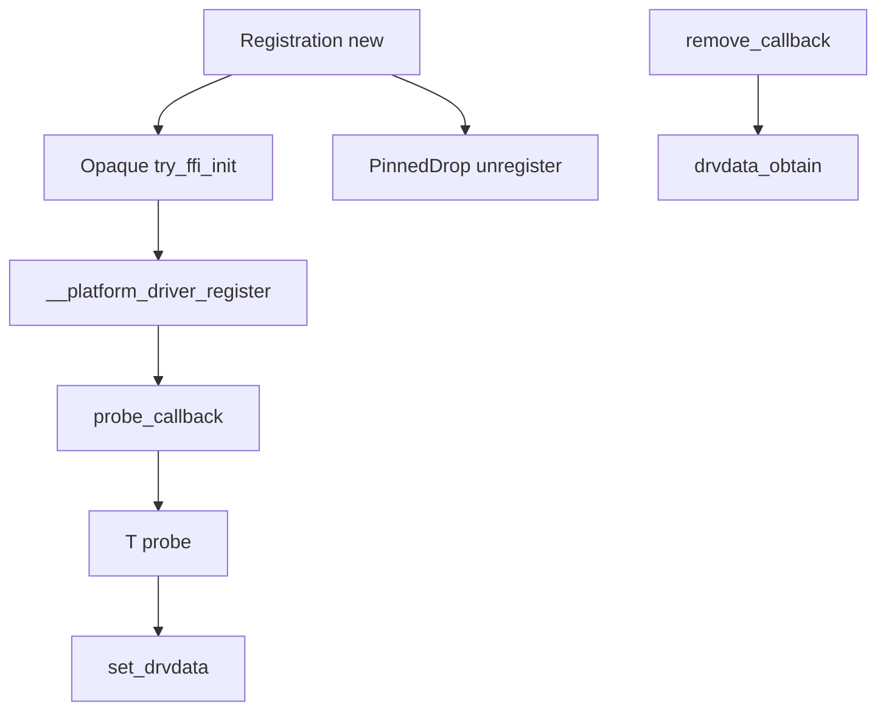

# 第25章 Driver と登録と probe

> 本章で読むソース
>
> - [`rust/kernel/driver.rs`](https://github.com/gregkh/linux/blob/v6.18.38/rust/kernel/driver.rs)
> - [`rust/kernel/platform.rs`](https://github.com/gregkh/linux/blob/v6.18.38/rust/kernel/platform.rs)

## この章の狙い

本章では、bus 共通のドライバ登録インフラと、platform bus を例にした probe 橋渡しを読む。
`driver.rs` に bus 共通の `Driver` トレイト実体はなく、`RegistrationOps` と `Registration` が RAII 登録を担う。
[第24章](24-device-refcount.md) の `set_drvdata` と `drvdata_obtain` が probe と remove でどう使われるかを接続する。

## 前提

[第24章](24-device-refcount.md) で `Device<CoreInternal>` と `set_drvdata` を読んでいること。
[第6章](../part01-language-foundation/06-types-opaque-aref.md) で `PinInit` の概念を読んでいること。

## driver.rs に共通 Driver トレイトは無い

`driver.rs` 冒頭の `Driver` トレイトはモジュール doc コメント内の `ignore` 付き擬似コード例である。
実際の `probe` シグネチャは `platform::Driver` 等、bus 別トレイトが持つ。

[`rust/kernel/driver.rs` L11-L33](https://github.com/gregkh/linux/blob/v6.18.38/rust/kernel/driver.rs#L11-L33)

```rust
//! # Driver Trait
//!
//! The main driver interface is defined by a bus specific driver trait. For instance:
//!
//! ```ignore
//! pub trait Driver: Send {
//!     /// The type holding information about each device ID supported by the driver.
//!     type IdInfo: 'static;
//!
//!     /// The table of OF device ids supported by the driver.
//!     const OF_ID_TABLE: Option<of::IdTable<Self::IdInfo>> = None;
//!
//!     /// The table of ACPI device ids supported by the driver.
//!     const ACPI_ID_TABLE: Option<acpi::IdTable<Self::IdInfo>> = None;
//!
//!     /// Driver probe.
//!     fn probe(dev: &Device<device::Core>, id_info: &Self::IdInfo) -> Result<Pin<KBox<Self>>>;
//!
//!     /// Driver unbind (optional).
//!     fn unbind(dev: &Device<device::Core>, this: Pin<&Self>) {
//!         let _ = (dev, this);
//!     }
//! }
//! ```
```

platform bus の実 `Driver` トレイトは `Result<Pin<KBox<Self>>>` を返す `probe` を定義する。

[`rust/kernel/platform.rs` L189-L194](https://github.com/gregkh/linux/blob/v6.18.38/rust/kernel/platform.rs#L189-L194)

```rust
    /// Platform driver probe.
    ///
    /// Called when a new platform device is added or discovered.
    /// Implementers should attempt to initialize the device here.
    fn probe(dev: &Device<device::Core>, id_info: Option<&Self::IdInfo>)
        -> Result<Pin<KBox<Self>>>;
```

## RegistrationOps と Registration の RAII

`RegistrationOps` は bus ごとに `RegType` と `register`/`unregister` を定義する unsafe トレイトである。
`unregister` は先行する成功した `register` の後にだけ有効である。

[`rust/kernel/driver.rs` L114-L137](https://github.com/gregkh/linux/blob/v6.18.38/rust/kernel/driver.rs#L114-L137)

```rust
pub unsafe trait RegistrationOps {
    /// The type that holds information about the registration. This is typically a struct defined
    /// by the C portion of the kernel.
    type RegType: Default;

    /// Registers a driver.
    ///
    /// # Safety
    ///
    /// On success, `reg` must remain pinned and valid until the matching call to
    /// [`RegistrationOps::unregister`].
    unsafe fn register(
        reg: &Opaque<Self::RegType>,
        name: &'static CStr,
        module: &'static ThisModule,
    ) -> Result;

    /// Unregisters a driver previously registered with [`RegistrationOps::register`].
    ///
    /// # Safety
    ///
    /// Must only be called after a preceding successful call to [`RegistrationOps::register`] for
    /// the same `reg`.
    unsafe fn unregister(reg: &Opaque<Self::RegType>);
}
```

`Registration::new` は `try_pin_init!` と `Opaque::try_ffi_init` で確保先アドレス上に直接 `default()` を書き込み、続けて `register` を呼ぶ。
スタックで組み立ててからコピーするのではなく、最終アドレス上で in-place 初期化する。

[`rust/kernel/driver.rs` L160-L176](https://github.com/gregkh/linux/blob/v6.18.38/rust/kernel/driver.rs#L160-L176)

```rust
    pub fn new(name: &'static CStr, module: &'static ThisModule) -> impl PinInit<Self, Error> {
        try_pin_init!(Self {
            reg <- Opaque::try_ffi_init(|ptr: *mut T::RegType| {
                // SAFETY: `try_ffi_init` guarantees that `ptr` is valid for write.
                unsafe { ptr.write(T::RegType::default()) };

                // SAFETY: `try_ffi_init` guarantees that `ptr` is valid for write, and it has
                // just been initialised above, so it's also valid for read.
                let drv = unsafe { &*(ptr as *const Opaque<T::RegType>) };

                // SAFETY: `drv` is guaranteed to be pinned until `T::unregister`.
                unsafe { T::register(drv, name, module) }
            }),
        })
    }
```

`PinnedDrop` の `drop` が `unregister` を呼ぶ。
`Registration` の生存期間そのものが「登録されている」不変条件を表す。

[`rust/kernel/driver.rs` L179-L185](https://github.com/gregkh/linux/blob/v6.18.38/rust/kernel/driver.rs#L179-L185)

```rust
impl<T: RegistrationOps> PinnedDrop for Registration<T> {
    fn drop(self: Pin<&mut Self>) {
        // SAFETY: The existence of `self` guarantees that `self.reg` has previously been
        // successfully registered with `T::register`
        unsafe { T::unregister(&self.reg) };
    }
}
```

## platform Adapter による C コールバック登録

`platform::Adapter<T>` の `register` は `struct platform_driver` の関数ポインタへ extern C コールバックを埋め込む。

[`rust/kernel/platform.rs` L48-L58](https://github.com/gregkh/linux/blob/v6.18.38/rust/kernel/platform.rs#L48-L58)

```rust
        // SAFETY: It's safe to set the fields of `struct platform_driver` on initialization.
        unsafe {
            (*pdrv.get()).driver.name = name.as_char_ptr();
            (*pdrv.get()).probe = Some(Self::probe_callback);
            (*pdrv.get()).remove = Some(Self::remove_callback);
            (*pdrv.get()).driver.of_match_table = of_table;
            (*pdrv.get()).driver.acpi_match_table = acpi_table;
        }

        // SAFETY: `pdrv` is guaranteed to be a valid `RegType`.
        to_result(unsafe { bindings::__platform_driver_register(pdrv.get(), module.0) })
```

`probe_callback` は C から渡された `platform_device` を `Device<CoreInternal>` へキャストし、`T::probe` を呼んで `set_drvdata` する。

[`rust/kernel/platform.rs` L67-L81](https://github.com/gregkh/linux/blob/v6.18.38/rust/kernel/platform.rs#L67-L81)

```rust
    extern "C" fn probe_callback(pdev: *mut bindings::platform_device) -> kernel::ffi::c_int {
        // SAFETY: The platform bus only ever calls the probe callback with a valid pointer to a
        // `struct platform_device`.
        //
        // INVARIANT: `pdev` is valid for the duration of `probe_callback()`.
        let pdev = unsafe { &*pdev.cast::<Device<device::CoreInternal>>() };
        let info = <Self as driver::Adapter>::id_info(pdev.as_ref());

        from_result(|| {
            let data = T::probe(pdev, info)?;

            pdev.as_ref().set_drvdata(data);
            Ok(0)
        })
    }
```

`remove_callback` は `drvdata_obtain` で所有権を回収し、`T::unbind` の後に drop する。
probe で確保し remove で解放する対称性がここで完結する。

[`rust/kernel/platform.rs` L84-L97](https://github.com/gregkh/linux/blob/v6.18.38/rust/kernel/platform.rs#L84-L97)

```rust
    extern "C" fn remove_callback(pdev: *mut bindings::platform_device) {
        // SAFETY: The platform bus only ever calls the remove callback with a valid pointer to a
        // `struct platform_device`.
        //
        // INVARIANT: `pdev` is valid for the duration of `probe_callback()`.
        let pdev = unsafe { &*pdev.cast::<Device<device::CoreInternal>>() };

        // SAFETY: `remove_callback` is only ever called after a successful call to
        // `probe_callback`, hence it's guaranteed that `Device::set_drvdata()` has been called
        // and stored a `Pin<KBox<T>>`.
        let data = unsafe { pdev.as_ref().drvdata_obtain::<Pin<KBox<T>>>() };

        T::unbind(pdev, data.as_ref());
    }
```

## driver::Adapter と ID テーブル探索

`driver::Adapter` は bus 非依存の ID 探索を提供する。
`id_info` は ACPI を先に試し、続けて OF を試す。

[`rust/kernel/driver.rs` L309-L320](https://github.com/gregkh/linux/blob/v6.18.38/rust/kernel/driver.rs#L309-L320)

```rust
    fn id_info(dev: &device::Device) -> Option<&'static Self::IdInfo> {
        let id = Self::acpi_id_info(dev);
        if id.is_some() {
            return id;
        }

        let id = Self::of_id_info(dev);
        if id.is_some() {
            return id;
        }

        None
    }
```

`acpi_id_info` は `acpi_match_device` の戻り値を `acpi::DeviceId` へキャストし、`RawDeviceIdIndex::index` で `IdArray` 内の `IdInfo` を引く。

[`rust/kernel/driver.rs` L246-L263](https://github.com/gregkh/linux/blob/v6.18.38/rust/kernel/driver.rs#L246-L263)

```rust
        #[cfg(CONFIG_ACPI)]
        {
            let table = Self::acpi_id_table()?;

            // SAFETY:
            // - `table` has static lifetime, hence it's valid for read,
            // - `dev` is guaranteed to be valid while it's alive, and so is `dev.as_raw()`.
            let raw_id = unsafe { bindings::acpi_match_device(table.as_ptr(), dev.as_raw()) };

            if raw_id.is_null() {
                None
            } else {
                // SAFETY: `DeviceId` is a `#[repr(transparent)]` wrapper of `struct acpi_device_id`
                // and does not add additional invariants, so it's safe to transmute.
                let id = unsafe { &*raw_id.cast::<acpi::DeviceId>() };

                Some(table.info(<acpi::DeviceId as crate::device_id::RawDeviceIdIndex>::index(id)))
            }
        }
```

## module_driver と module_platform_driver

`module_driver!` は `Registration<Ops<T>>` を1個持つモジュール型を生成する。

[`rust/kernel/driver.rs` L192-L220](https://github.com/gregkh/linux/blob/v6.18.38/rust/kernel/driver.rs#L192-L220)

```rust
macro_rules! module_driver {
    (<$gen_type:ident>, $driver_ops:ty, { type: $type:ty, $($f:tt)* }) => {
        type Ops<$gen_type> = $driver_ops;

        #[$crate::prelude::pin_data]
        struct DriverModule {
            #[pin]
            _driver: $crate::driver::Registration<Ops<$type>>,
        }

        impl $crate::InPlaceModule for DriverModule {
            fn init(
                module: &'static $crate::ThisModule
            ) -> impl ::pin_init::PinInit<Self, $crate::error::Error> {
                $crate::try_pin_init!(Self {
                    _driver <- $crate::driver::Registration::new(
                        <Self as $crate::ModuleMetadata>::NAME,
                        module,
                    ),
                })
            }
        }

        $crate::prelude::module! {
            type: DriverModule,
            $($f)*
        }
    }
}
```

`module_platform_driver!` は `platform::Adapter<T>` へ特化した薄いラッパーである。

[`rust/kernel/platform.rs` L126-L129](https://github.com/gregkh/linux/blob/v6.18.38/rust/kernel/platform.rs#L126-L129)

```rust
macro_rules! module_platform_driver {
    ($($f:tt)*) => {
        $crate::module_driver!(<T>, $crate::platform::Adapter<T>, { $($f)* });
    };
}
```

## 処理の流れ



## 高速化と最適化の工夫

`Registration::new` の in-place 初期化は、登録後に C 側が保持し続ける `platform_driver` がムーブされないことを型で満たす。
`Pin` と `try_ffi_init` の組み合わせが、最終アドレス上での組み立てを強制する。
`HAS_*` に相当する条件付き vtable 生成は本章の対象外だが、bus Adapter は未使用コールバックを `None` にせず関数ポインタを直接埋める。

## Linux 7.1.3 での差分

`probe` の戻り値は `Result<Pin<KBox<Self>>>` から `impl PinInit<Self, Error>` へ変わった。
driver.rs の doc 例と `platform::Driver` の双方に及ぶ。

[`rust/kernel/driver.rs` L26-L27](https://github.com/gregkh/linux/blob/v7.1.3/rust/kernel/driver.rs#L26-L27)

```rust
//!     /// Driver probe.
//!     fn probe(dev: &Device<device::Core>, id_info: &Self::IdInfo) -> impl PinInit<Self, Error>;
```

[`rust/kernel/platform.rs` L225-L228](https://github.com/gregkh/linux/blob/v7.1.3/rust/kernel/platform.rs#L225-L228)

```rust
    fn probe(
        dev: &Device<device::Core>,
        id_info: Option<&Self::IdInfo>,
    ) -> impl PinInit<Self, Error>;
```

7.1.3 の `probe_callback` は initializer をそのまま `set_drvdata` へ渡す。
`set_drvdata` 内部の `KBox::pin_init` で初めて実体化し、失敗は `?` 経由で probe の errno になる。

[`rust/kernel/platform.rs` L103-L107](https://github.com/gregkh/linux/blob/v7.1.3/rust/kernel/platform.rs#L103-L107)

```rust
        from_result(|| {
            let data = T::probe(pdev, info);

            pdev.as_ref().set_drvdata(data)?;
            Ok(0)
        })
```

`RegistrationOps` は `DriverLayout` を継承し、`callbacks_attach` が `post_unbind_rust` を登録する。
`post_unbind_callback` は remove と devres 完了後に `drvdata_obtain` で private data を drop する。

[`rust/kernel/driver.rs` L200-L214](https://github.com/gregkh/linux/blob/v7.1.3/rust/kernel/driver.rs#L200-L214)

```rust
    fn callbacks_attach(drv: &Opaque<T::DriverType>) {
        let ptr = drv.get().cast::<u8>();

        // SAFETY:
        // - `drv.get()` yields a valid pointer to `Self::DriverType`.
        // - Adding `DEVICE_DRIVER_OFFSET` yields the address of the embedded `struct device_driver`
        //   as guaranteed by the safety requirements of the `Driver` trait.
        let base = unsafe { ptr.add(T::DEVICE_DRIVER_OFFSET) };

        // CAST: `base` points to the offset of the embedded `struct device_driver`.
        let base = base.cast::<bindings::device_driver>();

        // SAFETY: It is safe to set the fields of `struct device_driver` on initialization.
        unsafe { (*base).p_cb.post_unbind_rust = Some(Self::post_unbind_callback) };
    }
```

[`rust/kernel/driver.rs` L185-L197](https://github.com/gregkh/linux/blob/v7.1.3/rust/kernel/driver.rs#L185-L197)

```rust
    extern "C" fn post_unbind_callback(dev: *mut bindings::device) {
        // SAFETY: The driver core only ever calls the post unbind callback with a valid pointer to
        // a `struct device`.
        //
        // INVARIANT: `dev` is valid for the duration of the `post_unbind_callback()`.
        let dev = unsafe { &*dev.cast::<device::Device<device::CoreInternal>>() };

        // `remove()` and all devres callbacks have been completed at this point, hence drop the
        // driver's device private data.
        //
        // SAFETY: By the safety requirements of the `Driver` trait, `T::DriverData` is the
        // driver's device private data type.
        drop(unsafe { dev.drvdata_obtain::<T::DriverData>() });
    }
```

6.18.38 で `remove_callback` が担っていた private data 回収の一部は、7.1.3 では driver core の post-unbind フックへ移った。

## まとめ

`driver.rs` は bus 共通の登録 RAII と ID 探索を提供し、`probe` の型付き実装は各 bus トレイトが持つ。
platform の `probe_callback` が C と Rust の境界であり、[第24章](24-device-refcount.md) の `set_drvdata` が probe 成功時の帰着点である。

## 関連する章

- [第6章 型の基盤](../part01-language-foundation/06-types-opaque-aref.md)
- [第9章 KBox と KVec](../part02-memory-ownership/09-kbox-kvec.md)
- [第24章 Device と参照カウント](24-device-refcount.md)
