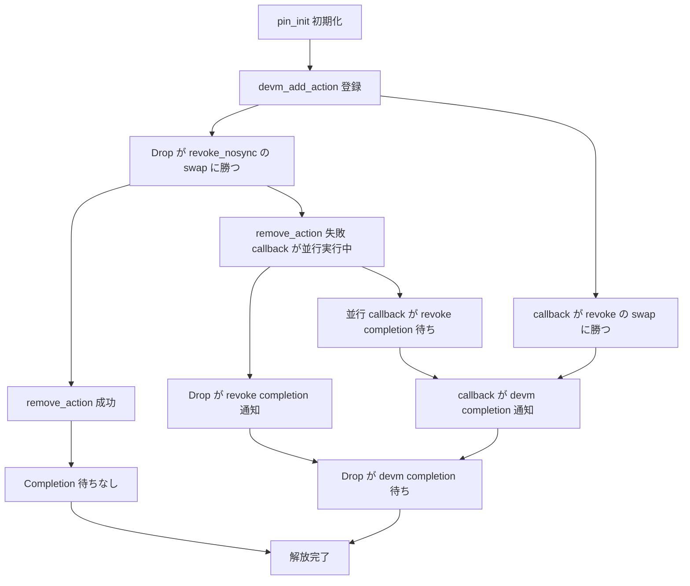

# 第26章 devres と Revocable によるリソース管理

> 本章で読むソース
>
> - [`rust/kernel/revocable.rs`](https://github.com/gregkh/linux/blob/v6.18.38/rust/kernel/revocable.rs)
> - [`rust/kernel/devres.rs`](https://github.com/gregkh/linux/blob/v6.18.38/rust/kernel/devres.rs)
> - [`rust/kernel/pci.rs`](https://github.com/gregkh/linux/blob/v6.18.38/rust/kernel/pci.rs)

## この章の狙い

本章では、実行時に失効しうる `Revocable<T>` と、device 束縛リソースを管理する `Devres<T>` を読む。
unbind と Rust スコープ終了のどちらが先でも、解放が一度だけ正しく行われる仕組みを追う。
IRQ 登録への接続は [第27章](27-irq-request.md) に譲る。

## 前提

[第24章](24-device-refcount.md) で `Device<Bound>` を読んでいること。
[第25章](25-driver-registration-probe.md) で probe と unbind のライフサイクルを読んでいること。

## Revocable と RCU による二段構え

`Revocable<T>` は `AtomicBool` の `is_available` と `Opaque<T>` を持つ。
失効後のアクセスは `Option<RevocableGuard>` と実行時チェックで防ぐ。

[`rust/kernel/revocable.rs` L66-L71](https://github.com/gregkh/linux/blob/v6.18.38/rust/kernel/revocable.rs#L66-L71)

```rust
#[pin_data(PinnedDrop)]
pub struct Revocable<T> {
    is_available: AtomicBool,
    #[pin]
    data: Opaque<T>,
}
```

`try_access` は RCU read-side lock を取得してから `is_available` を確認する。
lock を握っている間は `revoke` 側の `synchronize_rcu` がブロックされるため、guard 存続中は data が drop されない。

[`rust/kernel/revocable.rs` L99-L107](https://github.com/gregkh/linux/blob/v6.18.38/rust/kernel/revocable.rs#L99-L107)

```rust
    pub fn try_access(&self) -> Option<RevocableGuard<'_, T>> {
        let guard = rcu::read_lock();
        if self.is_available.load(Ordering::Relaxed) {
            // Since `self.is_available` is true, data is initialised and has to remain valid
            // because the RCU read side lock prevents it from being dropped.
            Some(RevocableGuard::new(self.data.get(), guard))
        } else {
            None
        }
    }
```

`RevocableGuard` は `&'a T` ではなく `*const T` を保持する。
関数引数として渡したあと guard が drop されると参照が dangling になりうるためである。

[`rust/kernel/revocable.rs` L235-L242](https://github.com/gregkh/linux/blob/v6.18.38/rust/kernel/revocable.rs#L235-L242)

```rust
pub struct RevocableGuard<'a, T> {
    // This can't use the `&'a T` type because references that appear in function arguments must
    // not become dangling during the execution of the function, which can happen if the
    // `RevocableGuard` is passed as a function argument and then dropped during execution of the
    // function.
    data_ref: *const T,
    _rcu_guard: rcu::Guard,
    _p: PhantomData<&'a ()>,
}
```

## revoke_internal と swap による一回性

`revoke_internal` は `is_available.swap(false, Relaxed)` の**旧値**で winner を決める。
旧値が true だった CPU だけが `synchronize_rcu` と `drop_in_place` を実行する。
loser は旧値 false を受け取り、winner の drop 完了を待たない。

[`rust/kernel/revocable.rs` L159-L173](https://github.com/gregkh/linux/blob/v6.18.38/rust/kernel/revocable.rs#L159-L173)

```rust
    unsafe fn revoke_internal<const SYNC: bool>(&self) -> bool {
        let revoke = self.is_available.swap(false, Ordering::Relaxed);

        if revoke {
            if SYNC {
                // SAFETY: Just an FFI call, there are no further requirements.
                unsafe { bindings::synchronize_rcu() };
            }

            // SAFETY: We know `self.data` is valid because only one CPU can succeed the
            // `compare_exchange` above that takes `is_available` from `true` to `false`.
            unsafe { drop_in_place(self.data.get()) };
        }

        revoke
    }
```

`revoke` は `SYNC=true` で grace period を待つ安全版である。
`revoke_nosync` は呼び出し側が同時アクセスの不在を保証する高速版である。

[`rust/kernel/revocable.rs` L204-L207](https://github.com/gregkh/linux/blob/v6.18.38/rust/kernel/revocable.rs#L204-L207)

```rust
    pub fn revoke(&self) -> bool {
        // SAFETY: By passing `true` we ask `revoke_internal` to wait for the grace period to
        // finish.
        unsafe { self.revoke_internal::<true>() }
```

loser が待たない非待機性が、`Devres` 側で `Completion` による別途ハンドシェイクを要する理由になる。

## Devres の構造と devm_add_action

`Devres<T>` は内部に `Revocable<T>` と `Completion` 2本を持つ `Inner<T>` を包む。
作成時に `devm_add_action` で C 側 devres リストへコールバックを登録する。

[`rust/kernel/devres.rs` L22-L33](https://github.com/gregkh/linux/blob/v6.18.38/rust/kernel/devres.rs#L22-L33)

```rust
#[pin_data]
struct Inner<T: Send> {
    #[pin]
    data: Revocable<T>,
    /// Tracks whether [`Devres::callback`] has been completed.
    #[pin]
    devm: Completion,
    /// Tracks whether revoking [`Self::data`] has been completed.
    #[pin]
    revoke: Completion,
}
```

[`rust/kernel/devres.rs` L172-L174](https://github.com/gregkh/linux/blob/v6.18.38/rust/kernel/devres.rs#L172-L174)

```rust
                to_result(unsafe {
                    bindings::devm_add_action(dev.as_raw(), Some(*callback), inner.cast())
                }).inspect_err(|_| {
```

`devres_callback` は unbind 時に C から呼ばれ、`ScopeGuard` で `devm.complete_all` を保証しつつ `data.revoke` を試みる。

[`rust/kernel/devres.rs` L195-L209](https://github.com/gregkh/linux/blob/v6.18.38/rust/kernel/devres.rs#L195-L209)

```rust
    unsafe extern "C" fn devres_callback(ptr: *mut kernel::ffi::c_void) {
        // SAFETY: In `Self::new` we've passed a valid pointer to `Inner` to `devm_add_action()`,
        // hence `ptr` must be a valid pointer to `Inner`.
        let inner = unsafe { &*ptr.cast::<Inner<T>>() };

        // Ensure that `inner` can't be used anymore after we signal completion of this callback.
        let inner = ScopeGuard::new_with_data(inner, |inner| inner.devm.complete_all());

        if !inner.data.revoke() {
            // If `revoke()` returns false, it means that `Devres::drop` already started revoking
            // `data` for us. Hence we have to wait until `Devres::drop` signals that it
            // completed revoking `data`.
            inner.revoke.wait_for_completion();
        }
    }
```

## try_access と access の二経路

`try_access` は `Revocable` 経由で RCU lock を取り、sleep 不可のコンテキスト向けである。
`access` は同一 `Device<Bound>` の提示により revoke されていないことを型で示し、RCU を省略する。

[`rust/kernel/devres.rs` L259-L268](https://github.com/gregkh/linux/blob/v6.18.38/rust/kernel/devres.rs#L259-L268)

```rust
    pub fn access<'a>(&'a self, dev: &'a Device<Bound>) -> Result<&'a T> {
        if self.dev.as_raw() != dev.as_raw() {
            return Err(EINVAL);
        }

        // SAFETY: `dev` being the same device as the device this `Devres` has been created for
        // proves that `self.data` hasn't been revoked and is guaranteed to not be revoked as long
        // as `dev` lives; `dev` lives at least as long as `self`.
        Ok(unsafe { self.data().access() })
    }
```

## PinnedDrop と解放競合の分岐

`Devres::drop` は `revoke_nosync` の戻り値で分岐する。
Drop が勝ち、`remove_action` が成功すれば Completion 待ちなしの fast path である。

[`rust/kernel/devres.rs` L292-L316](https://github.com/gregkh/linux/blob/v6.18.38/rust/kernel/devres.rs#L292-L316)

```rust
impl<T: Send> PinnedDrop for Devres<T> {
    fn drop(self: Pin<&mut Self>) {
        // SAFETY: When `drop` runs, it is guaranteed that nobody is accessing the revocable data
        // anymore, hence it is safe not to wait for the grace period to finish.
        if unsafe { self.data().revoke_nosync() } {
            // We revoked `self.data` before the devres action did, hence try to remove it.
            if !self.remove_action() {
                // We could not remove the devres action, which means that it now runs concurrently,
                // hence signal that `self.data` has been revoked by us successfully.
                self.inner().revoke.complete_all();

                // Wait for `Self::devres_callback` to be done using this object.
                self.inner().devm.wait_for_completion();
            }
        } else {
            // `Self::devres_callback` revokes `self.data` for us, hence wait for it to be done
            // using this object.
            self.inner().devm.wait_for_completion();
        }

        // INVARIANT: At this point it is guaranteed that `inner` can't be accessed any more.
        //
        // SAFETY: `inner` is valid for dropping.
        unsafe { core::ptr::drop_in_place(self.inner.get()) };
    }
}
```

callback が先に revoke に勝った場合、callback は revoke の完了を待たずに `data` を drop し、`ScopeGuard` の `devm.complete_all` で Drop 側に通知する。
Drop 側はこの通知を `devm.wait_for_completion` で待つ。
Drop が `revoke_nosync` に勝った後 `remove_action` に失敗した場合は、callback が並行して実行中であることを意味する。
この場合 Drop は `revoke.complete_all` で自分が revoke 済みであることを通知し、並行実行中の callback 側が `revoke.wait_for_completion` で Drop の revoke 完了を待つ。

## register と利用例

`register_foreign` と公開 `register` は `devm_add_action_or_reset` を使う別経路である。
`Devres<T>` の node 登録経路とは区別する。

[`rust/kernel/devres.rs` L336-L340](https://github.com/gregkh/linux/blob/v6.18.38/rust/kernel/devres.rs#L336-L340)

```rust
    to_result(unsafe {
        // `devm_add_action_or_reset()` also calls `callback` on failure, such that the
        // `ForeignOwnable` is released eventually.
        bindings::devm_add_action_or_reset(dev.as_raw(), Some(callback::<P>), ptr.cast())
    })
```

`pci::Device::iomap_region` は `Devres<Bar>` を返す実例である。

[`rust/kernel/pci.rs` L530-L537](https://github.com/gregkh/linux/blob/v6.18.38/rust/kernel/pci.rs#L530-L537)

```rust
    /// Mapps an entire PCI-BAR after performing a region-request on it.
    pub fn iomap_region<'a>(
        &'a self,
        bar: u32,
        name: &'a CStr,
    ) -> impl PinInit<Devres<Bar>, Error> + 'a {
        self.iomap_region_sized::<0>(bar, name)
    }
```

## 処理の流れ



## 高速化と最適化の工夫

`Revocable::try_access` は RCU read-side lock と `AtomicBool` を組み合わせ、ロックフリーな読み取りと安全な解放を両立する。
`revoke_internal` の `swap` は旧値 true の CPU だけが drop する一回性を保証する。
`access` は `Device<Bound>` 提示により実行時 RCU チェックを省略する最適化である。

## Linux 7.1.3 での差分

`revocable.rs` は 6.18.38 と完全に同一である。

`devres.rs` は `Inner<T>` が `#[repr(C)]` で `devres_node` を先頭に持つ形へ変わる。
`Devres<T>` 登録経路だけが `devres_node_init` と `devres_node_add` を使う。

[`rust/kernel/devres.rs` L33-L40](https://github.com/gregkh/linux/blob/v7.1.3/rust/kernel/devres.rs#L33-L40)

```rust
#[repr(C)]
#[pin_data]
struct Inner<T> {
    #[pin]
    node: Opaque<bindings::devres_node>,
    #[pin]
    data: Revocable<T>,
}
```

`Devres::new` は `impl PinInit` ではなく `Result<Self>` を直接返す。
pin-init の blanket impl により `try_pin_init!` 内の呼び出し構文は保たれる。

[`rust/kernel/devres.rs` L192-L195](https://github.com/gregkh/linux/blob/v7.1.3/rust/kernel/devres.rs#L192-L195)

```rust
    pub fn new<E>(dev: &Device<Bound>, data: impl PinInit<T, E>) -> Result<Self>
    where
        Error: From<E>,
    {
```

[`rust/pin-init/src/lib.rs` L1387-L1391](https://github.com/gregkh/linux/blob/v7.1.3/rust/pin-init/src/lib.rs#L1387-L1391)

```rust
unsafe impl<T, E> PinInit<T, E> for Result<T, E> {
    unsafe fn __pinned_init(self, slot: *mut T) -> Result<(), E> {
        // SAFETY: `slot` is valid for writes by the safety requirements of this function.
        unsafe { slot.write(self?) };
        Ok(())
```

自前の `Completion` 2本は廃止され、`Arc<Inner<T>>` と `devres_node_remove` で所有権を管理する。
`PinnedDrop` は通常の `Drop` に変わる。

[`rust/kernel/devres.rs` L352-L364](https://github.com/gregkh/linux/blob/v7.1.3/rust/kernel/devres.rs#L352-L364)

```rust
impl<T: Send> Drop for Devres<T> {
    fn drop(&mut self) {
        // SAFETY: When `drop` runs, it is guaranteed that nobody is accessing the revocable data
        // anymore, hence it is safe not to wait for the grace period to finish.
        if unsafe { self.data().revoke_nosync() } {
            // We revoked `self.data` before devres did, hence try to remove it.
            if self.remove_node() {
                // SAFETY: In `Self::new` we have taken an additional reference count of `self.data`
                // for `devres_node_add()`. Since `remove_node()` was successful, we have to drop
                // this additional reference count.
                drop(unsafe { Arc::from_raw(Arc::as_ptr(&self.inner)) });
            }
        }
    }
}
```

`register_foreign` と `register` は両版とも `devm_add_action_or_reset` を使い続ける。

[`rust/kernel/devres.rs` L384-L388](https://github.com/gregkh/linux/blob/v7.1.3/rust/kernel/devres.rs#L384-L388)

```rust
    to_result(unsafe {
        // `devm_add_action_or_reset()` also calls `callback` on failure, such that the
        // `ForeignOwnable` is released eventually.
        bindings::devm_add_action_or_reset(dev.as_raw(), Some(callback::<P>), ptr.cast())
    })
```

## まとめ

6.18.38 の `Devres` は `Completion` 2本の手作りハンドシェイクで unbind 競合を解決する。
`Revocable` の `swap` による loser 非待機性が、その設計の動機である。
7.1.3 では C 側 `devres_node_*` API と `Arc` 参照カウントへ整理された。

## 関連する章

- [第24章 Device と参照カウント](24-device-refcount.md)
- [第25章 Driver と登録と probe](25-driver-registration-probe.md)
- [第27章 IRQ 要求とスレッド化ハンドラ](27-irq-request.md)
