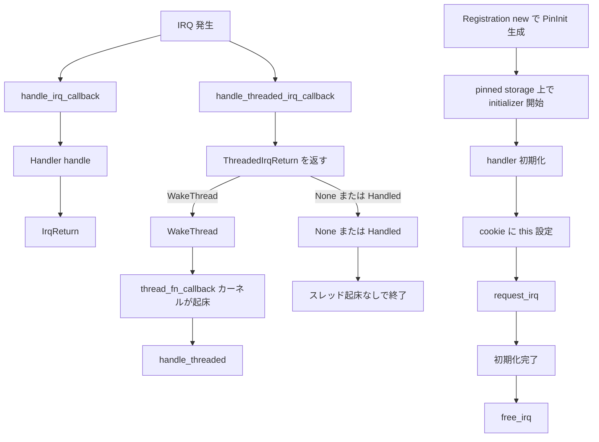

# 第27章 IRQ 要求とスレッド化ハンドラ

> 本章で読むソース
>
> - [`rust/kernel/irq.rs`](https://github.com/gregkh/linux/blob/v6.18.38/rust/kernel/irq.rs)
> - [`rust/kernel/irq/request.rs`](https://github.com/gregkh/linux/blob/v6.18.38/rust/kernel/irq/request.rs)
> - [`rust/kernel/irq/flags.rs`](https://github.com/gregkh/linux/blob/v6.18.38/rust/kernel/irq/flags.rs)
> - [`rust/kernel/platform.rs`](https://github.com/gregkh/linux/blob/v6.18.38/rust/kernel/platform.rs)
> - [`rust/kernel/pci.rs`](https://github.com/gregkh/linux/blob/v6.18.38/rust/kernel/pci.rs)

## この章の狙い

本章では、IRQ ハンドラ登録の RAII と、hard IRQ 経路とスレッド化経路の型分離を読む。
`IrqRequest` の token 意味、`Registration` の cookie 設計、[第26章](26-devres-revocable.md) の `Devres` 連携を扱う。
PCI 割り込みの詳細は第29章に委譲する。

## 前提

[第26章](26-devres-revocable.md) で `Devres` と `Revocable` を読んでいること。
[第24章](24-device-refcount.md) で `Device<Bound>` を読んでいること。

## irq モジュールの構成

`irq.rs` は `flags` と `request` を re-export する薄いモジュール定義である。
6.18.38 の時点で既に `pub mod irq` として公開されている。

[`rust/kernel/irq.rs` L13-L23](https://github.com/gregkh/linux/blob/v6.18.38/rust/kernel/irq.rs#L13-L23)

```rust
/// Flags to be used when registering IRQ handlers.
mod flags;

/// IRQ allocation and handling.
mod request;

pub use flags::Flags;

pub use request::{
    Handler, IrqRequest, IrqReturn, Registration, ThreadedHandler, ThreadedIrqReturn,
    ThreadedRegistration,
};
```

## Handler と IrqReturn

`Handler::handle` は割り込みコンテキストで実行される。
sleep 不可の制約がコメントに明記されている。

[`rust/kernel/irq/request.rs` L30-L39](https://github.com/gregkh/linux/blob/v6.18.38/rust/kernel/irq/request.rs#L30-L39)

```rust
pub trait Handler: Sync {
    /// The hard IRQ handler.
    ///
    /// This is executed in interrupt context, hence all corresponding
    /// limitations do apply.
    ///
    /// All work that does not necessarily need to be executed from
    /// interrupt context, should be deferred to a threaded handler.
    /// See also [`ThreadedRegistration`].
    fn handle(&self, device: &Device<Bound>) -> IrqReturn;
```

`IrqReturn` は C の `irqreturn_t` に対応する列挙体である。

[`rust/kernel/irq/request.rs` L20-L27](https://github.com/gregkh/linux/blob/v6.18.38/rust/kernel/irq/request.rs#L20-L27)

```rust
#[repr(u32)]
pub enum IrqReturn {
    /// The interrupt was not from this device or was not handled.
    None = bindings::irqreturn_IRQ_NONE,

    /// The interrupt was handled by this device.
    Handled = bindings::irqreturn_IRQ_HANDLED,
}
```

## IrqRequest と move-only token

`IrqRequest<'a>` は `dev` と `irq` の組を表す move-only な token である。
「IRQ line が globally 未登録」や「token が一意に発行される」ことは保証しない。
防ぐのは同一 token の二重消費だけである。

[`rust/kernel/irq/request.rs` L97-L106](https://github.com/gregkh/linux/blob/v6.18.38/rust/kernel/irq/request.rs#L97-L106)

```rust
/// A request for an IRQ line for a given device.
///
/// # Invariants
///
/// - `ìrq` is the number of an interrupt source of `dev`.
/// - `irq` has not been registered yet.
pub struct IrqRequest<'a> {
    dev: &'a Device<Bound>,
    irq: u32,
}
```

構築は `pub(crate) unsafe fn new` で crate 内に閉じる。
platform や PCI の helper が safe な入口として `IrqRequest` を返す。

[`rust/kernel/platform.rs` L343-L353](https://github.com/gregkh/linux/blob/v6.18.38/rust/kernel/platform.rs#L343-L353)

```rust
    pub fn irq_by_index(&self, index: u32) -> Result<IrqRequest<'_>> {
        // SAFETY: `self.as_raw` returns a valid pointer to a `struct platform_device`.
        let irq = unsafe { bindings::platform_get_irq(self.as_raw(), index) };

        if irq < 0 {
            return Err(Error::from_errno(irq));
        }

        // SAFETY: `irq` is guaranteed to be a valid IRQ number for `&self`.
        Ok(unsafe { IrqRequest::new(self.as_ref(), irq as u32) })
    }
```

## Registration の RAII と初期化順序

`Registration<T>` は `RegistrationInner` を `Devres` 越しに保持する。
IRQ 解除も [第26章](26-devres-revocable.md) の revoke 機構に一本化される。

[`rust/kernel/irq/request.rs` L184-L196](https://github.com/gregkh/linux/blob/v6.18.38/rust/kernel/irq/request.rs#L184-L196)

```rust
#[pin_data]
pub struct Registration<T: Handler + 'static> {
    #[pin]
    inner: Devres<RegistrationInner>,

    #[pin]
    handler: T,

    /// Pinned because we need address stability so that we can pass a pointer
    /// to the callback.
    #[pin]
    _pin: PhantomPinned,
}
```

`Registration::new` は `handler` を先に初期化し、`cookie` に `this` を設定してから `request_irq` を呼ぶ。
`request_irq` は初期化途中に呼ばれうるため、この順序が必須である。

[`rust/kernel/irq/request.rs` L206-L230](https://github.com/gregkh/linux/blob/v6.18.38/rust/kernel/irq/request.rs#L206-L230)

```rust
        try_pin_init!(&this in Self {
            handler <- handler,
            inner <- Devres::new(
                request.dev,
                try_pin_init!(RegistrationInner {
                    // INVARIANT: `this` is a valid pointer to the `Registration` instance
                    cookie: this.as_ptr().cast::<c_void>(),
                    irq: {
                        // SAFETY:
                        // - The callbacks are valid for use with request_irq.
                        // - If this succeeds, the slot is guaranteed to be valid until the
                        //   destructor of Self runs, which will deregister the callbacks
                        //   before the memory location becomes invalid.
                        // - When request_irq is called, everything that handle_irq_callback will
                        //   touch has already been initialized, so it's safe for the callback to
                        //   be called immediately.
                        to_result(unsafe {
                            bindings::request_irq(
                                request.irq,
                                Some(handle_irq_callback::<T>),
                                flags.into_inner(),
                                name.as_char_ptr(),
                                this.as_ptr().cast::<c_void>(),
                            )
                        })?;
                        request.irq
                    }
                })
            ),
```

`RegistrationInner` の `PinnedDrop` は `free_irq` を呼び、ハンドラ完了までブロックする。

[`rust/kernel/irq/request.rs` L73-L87](https://github.com/gregkh/linux/blob/v6.18.38/rust/kernel/irq/request.rs#L73-L87)

```rust
#[pinned_drop]
impl PinnedDrop for RegistrationInner {
    fn drop(self: Pin<&mut Self>) {
        // SAFETY:
        //
        // Safe as per the invariants of `RegistrationInner` and:
        //
        // - The containing struct is `!Unpin` and was initialized using
        // pin-init, so it occupied the same memory location for the entirety of
        // its lifetime.
        //
        // Notice that this will block until all handlers finish executing,
        // i.e.: at no point will &self be invalid while the handler is running.
        unsafe { bindings::free_irq(self.irq, self.cookie) };
    }
}
```

## cookie とアドレス安定性

`handle_irq_callback` は cookie から `&Registration<T>` を復元し、`Device<Bound>` を得る。

[`rust/kernel/irq/request.rs` L264-L274](https://github.com/gregkh/linux/blob/v6.18.38/rust/kernel/irq/request.rs#L264-L274)

```rust
unsafe extern "C" fn handle_irq_callback<T: Handler + 'static>(
    _irq: i32,
    ptr: *mut c_void,
) -> c_uint {
    // SAFETY: `ptr` is a pointer to `Registration<T>` set in `Registration::new`
    let registration = unsafe { &*(ptr as *const Registration<T>) };
    // SAFETY: The irq callback is removed before the device is unbound, so the fact that the irq
    // callback is running implies that the device has not yet been unbound.
    let device = unsafe { registration.inner.device().as_bound() };

    T::handle(&registration.handler, device) as c_uint
}
```

アドレス安定性は `PhantomPinned` 単独では担保されない。
`impl PinInit` 返却と呼び出し側の `Arc::pin_init` 等による実 pin の組合せで成立する。

## ThreadedHandler と二段コールバック

`ThreadedHandler` は hard IRQ 側 `handle` と kthread 側 `handle_threaded` に分かれる。
デフォルトの `handle` は `WakeThread` を返す。

[`rust/kernel/irq/request.rs` L290-L309](https://github.com/gregkh/linux/blob/v6.18.38/rust/kernel/irq/request.rs#L290-L309)

```rust
pub trait ThreadedHandler: Sync {
    /// The hard IRQ handler.
    // ... (中略) ...
    #[expect(unused_variables)]
    fn handle(&self, device: &Device<Bound>) -> ThreadedIrqReturn {
        ThreadedIrqReturn::WakeThread
    }

    /// The threaded IRQ handler.
    ///
    /// This is executed in process context. The kernel creates a dedicated
    /// `kthread` for this purpose.
    fn handle_threaded(&self, device: &Device<Bound>) -> IrqReturn;
}
```

`ThreadedRegistration::new` は `request_threaded_irq` に2つのコールバックを渡す。

[`rust/kernel/irq/request.rs` L443-L451](https://github.com/gregkh/linux/blob/v6.18.38/rust/kernel/irq/request.rs#L443-L451)

```rust
                        to_result(unsafe {
                            bindings::request_threaded_irq(
                                request.irq,
                                Some(handle_threaded_irq_callback::<T>),
                                Some(thread_fn_callback::<T>),
                                flags.into_inner(),
                                name.as_char_ptr(),
                                this.as_ptr().cast::<c_void>(),
                            )
                        })?;
```

## Flags とコンパイル時検査

`Flags` は `IRQF_*` 定数を型で包み、`build_assert!` で `c_ulong` 収容を検査する。

[`rust/kernel/irq/flags.rs` L26-L27](https://github.com/gregkh/linux/blob/v6.18.38/rust/kernel/irq/flags.rs#L26-L27)

```rust
#[derive(Clone, Copy, PartialEq, Eq)]
pub struct Flags(c_ulong);
```

[`rust/kernel/irq/flags.rs` L99-L104](https://github.com/gregkh/linux/blob/v6.18.38/rust/kernel/irq/flags.rs#L99-L104)

```rust
    #[inline(always)]
    const fn new(value: u32) -> Self {
        build_assert!(value as u64 <= c_ulong::MAX as u64);
        Self(value as c_ulong)
    }
```

## PCI 経路の利用例

`pci::Device::irq_vector` は vector index から `IrqRequest` を構築する。
`request_irq` はそのまま `Registration::new` へ橋渡しする。

[`rust/kernel/pci.rs` L539-L561](https://github.com/gregkh/linux/blob/v6.18.38/rust/kernel/pci.rs#L539-L561)

```rust
    pub fn irq_vector(&self, index: u32) -> Result<IrqRequest<'_>> {
        // SAFETY: `self.as_raw` returns a valid pointer to a `struct pci_dev`.
        let irq = unsafe { crate::bindings::pci_irq_vector(self.as_raw(), index) };
        if irq < 0 {
            return Err(crate::error::Error::from_errno(irq));
        }
        // SAFETY: `irq` is guaranteed to be a valid IRQ number for `&self`.
        Ok(unsafe { IrqRequest::new(self.as_ref(), irq as u32) })
    }

    /// Returns a [`kernel::irq::Registration`] for the IRQ vector at the given
    /// index.
    pub fn request_irq<'a, T: crate::irq::Handler + 'static>(
        &'a self,
        index: u32,
        flags: irq::Flags,
        name: &'static CStr,
        handler: impl PinInit<T, Error> + 'a,
    ) -> Result<impl PinInit<irq::Registration<T>, Error> + 'a> {
        let request = self.irq_vector(index)?;

        Ok(irq::Registration::<T>::new(request, flags, name, handler))
    }
```

## 処理の流れ



## 高速化と最適化の工夫

cookie に自身のアドレスを渡す設計は、`PhantomPinned`、`Arc::pin_init` 等の実 pin、`try_pin_init!` の初期化順序の3点でアドレス安定性が成立する。
`RegistrationInner` を `Devres` 越しに保持することで、IRQ 解除と device リソース解放の順序を ch26 に一本化する。
`free_irq` はハンドラ完了を待つ C 側の同期点である。

## Linux 7.1.3 での差分

`irq.rs` と `irq/flags.rs` は 6.18.38 と完全に同一である。

`Handler` トレイトに `Sync + 'static` 境界が追加され、構造体定義側からは `+ 'static` が外れる。
同じ変更が `ThreadedHandler` と `ThreadedRegistration` にも入る。

[`rust/kernel/irq/request.rs` L30-L30](https://github.com/gregkh/linux/blob/v7.1.3/rust/kernel/irq/request.rs#L30-L30)

```rust
pub trait Handler: Sync + 'static {
```

[`rust/kernel/irq/request.rs` L184-L184](https://github.com/gregkh/linux/blob/v7.1.3/rust/kernel/irq/request.rs#L184-L184)

```rust
pub struct Registration<T: Handler> {
```

[`rust/kernel/irq/request.rs` L287-L287](https://github.com/gregkh/linux/blob/v7.1.3/rust/kernel/irq/request.rs#L287-L287)

```rust
pub trait ThreadedHandler: Sync + 'static {
```

[`rust/kernel/irq/request.rs` L401-L401](https://github.com/gregkh/linux/blob/v7.1.3/rust/kernel/irq/request.rs#L401-L401)

```rust
pub struct ThreadedRegistration<T: ThreadedHandler> {
```

`irq/request.rs` 側は `Devres::new` と `try_access`/`access` を同じ API で呼ぶだけなので、ロジックは変わらない。
内部実装の devres 刷新は [第26章](26-devres-revocable.md) の 7.x 対比を参照する。

IRQ 取得層には 7.1.3 で変更がある。
platform の helper は `pin_init_scope` で `impl PinInit` を返し、lookup 失敗判定が initializer 実行時へ遅延する。

[`rust/kernel/platform.rs` L342-L351](https://github.com/gregkh/linux/blob/v7.1.3/rust/kernel/platform.rs#L342-L351)

```rust
        ) -> impl PinInit<irq::$reg_type<T>, Error> + 'a {
            pin_init::pin_init_scope(move || {
                let request = self.$request_fn(index)?;

                Ok(irq::$reg_type::<T>::new(
                    request,
                    flags,
                    name,
                    handler,
                ))
            })
```

PCI 経路では `rust/kernel/pci/irq.rs` が新設され、`IrqVector` と `alloc_irq_vectors` の RAII 化が追加される。
詳細は第29章に委譲する。

## まとめ

`IrqRequest` は dev と irq の組と token 消費を表し、line 全体の未登録性は追跡しない。
`Registration` は cookie と pin-init 順序で C コールバックから Rust ハンドラへ戻る。
`Devres` 連携により unbind とスコープ終了のどちらが先でも IRQ 解除が安全になる。

## 関連する章

- [第24章 Device と参照カウント](24-device-refcount.md)
- [第26章 devres と Revocable](26-devres-revocable.md)
- 第29章 PCI ドライバ抽象と BAR と IRQ
