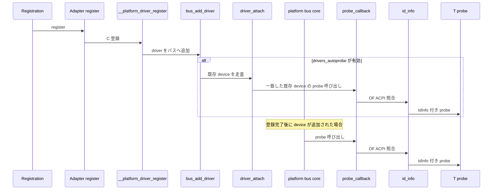

# 第28章 platform デバイスと OF マッチング

> 本章で読むソース
>
> - [`rust/kernel/platform.rs`](https://github.com/gregkh/linux/blob/v6.18.38/rust/kernel/platform.rs)
> - [`rust/kernel/of.rs`](https://github.com/gregkh/linux/blob/v6.18.38/rust/kernel/of.rs)
> - [`rust/kernel/device_id.rs`](https://github.com/gregkh/linux/blob/v6.18.38/rust/kernel/device_id.rs)

## この章の狙い

本章では、[第25章](../part07-device-model-irq/25-driver-registration-probe.md) の `RegistrationOps` と `Adapter` の上に積まれる platform バス固有の実装を読む。
OF マッチング、`Device<Bound>` 専用の MMIO 入口、IRQ アクセサ12関数を扱う。

## 前提

[第25章](../part07-device-model-irq/25-driver-registration-probe.md) で `driver::Registration` と `platform::Adapter` の骨格を読んでいること。
[第24章](../part07-device-model-irq/24-device-refcount.md) で `DeviceContext` を読んでいること。
[第27章](../part07-device-model-irq/27-irq-request.md) で `IrqRequest` と `irq::Registration` を読んでいること。

## Adapter と登録経路

`module_platform_driver!` は `module_driver!` を `platform::Adapter<T>` に特化した薄いラッパーである。

[`rust/kernel/platform.rs` L126-L129](https://github.com/gregkh/linux/blob/v6.18.38/rust/kernel/platform.rs#L126-L129)

```rust
macro_rules! module_platform_driver {
    ($($f:tt)*) => {
        $crate::module_driver!(<T>, $crate::platform::Adapter<T>, { $($f)* });
    };
}
```

`Adapter::register` は `struct platform_driver` の関数ポインタとマッチテーブルを設定し、`__platform_driver_register` を呼ぶ。

[`rust/kernel/platform.rs` L48-L58](https://github.com/gregkh/linux/blob/v6.18.38/rust/kernel/platform.rs#L48-L58)

```rust
        // SAFETY: It's safe to set the fields of `struct platform_driver` on initialization.
        unsafe {
            (*pdrv.get()).driver.name = name.as_char_ptr();
            (*pdrv.get()).probe = Some(Self::probe_callback);
            (*pdrv.get()).remove = Some(Self::remove_callback);
            (*pdrv.get()).driver.of_match_table = of_table;
            (*pdrv.get()).driver.acpi_match_table = acpi_table;
        }

        // SAFETY: `pdrv` is guaranteed to be a valid `RegType`.
        to_result(unsafe { bindings::__platform_driver_register(pdrv.get(), module.0) })
```

## probe_callback と C 境界

`probe_callback` は C から渡された `*mut platform_device` を `Device<CoreInternal>` へキャストする。
`driver::Adapter::id_info` で一致した `IdInfo` を取得してから `T::probe` を呼ぶ。

[`rust/kernel/platform.rs` L68-L81](https://github.com/gregkh/linux/blob/v6.18.38/rust/kernel/platform.rs#L68-L81)

```rust
    extern "C" fn probe_callback(pdev: *mut bindings::platform_device) -> kernel::ffi::c_int {
        // SAFETY: The platform bus only ever calls the probe callback with a valid pointer to a
        // `struct platform_device`.
        //
        // INVARIANT: `pdev` is valid for the duration of `probe_callback()`.
        let pdev = unsafe { &*pdev.cast::<Device<device::CoreInternal>>() };
        let info = <Self as driver::Adapter>::id_info(pdev.as_ref());

        from_result(|| {
            let data = T::probe(pdev, info)?;

            pdev.as_ref().set_drvdata(data);
            Ok(0)
        })
    }
```

`id_info` の解決ロジックは [第25章](../part07-device-model-irq/25-driver-registration-probe.md) で説明済みである。

## Driver トレイトとリソースアクセス

`platform::Driver` は OF と ACPI の二重 ID テーブルを持つ。

[`rust/kernel/platform.rs` L183-L194](https://github.com/gregkh/linux/blob/v6.18.38/rust/kernel/platform.rs#L183-L194)

```rust
    /// The table of OF device ids supported by the driver.
    const OF_ID_TABLE: Option<of::IdTable<Self::IdInfo>> = None;

    /// The table of ACPI device ids supported by the driver.
    const ACPI_ID_TABLE: Option<acpi::IdTable<Self::IdInfo>> = None;

    /// Platform driver probe.
    ///
    /// Called when a new platform device is added or discovered.
    /// Implementers should attempt to initialize the device here.
    fn probe(dev: &Device<device::Core>, id_info: Option<&Self::IdInfo>)
        -> Result<Pin<KBox<Self>>>;
```

`resource_by_index` は任意の `Ctx` で呼べる。
`io_request_by_index` は `Device<Bound>` 専用だが、これは probe 中だけに限られたスコープではない。
`Bound` は driver への bind が保証されるスコープ全体を指し、probe と unbind の双方を含む。
`Device<Core>` は `Deref` で `Device<Bound>` へ変換でき、`platform::Driver::unbind` のドキュメントも `Device<Bound>` 参照による I/O のグレースフルなテアダウンを想定している。

[`rust/kernel/platform.rs` L233-L246](https://github.com/gregkh/linux/blob/v6.18.38/rust/kernel/platform.rs#L233-L246)

```rust
    pub fn resource_by_index(&self, index: u32) -> Option<&Resource> {
        // SAFETY: `self.as_raw()` returns a valid pointer to a `struct platform_device`.
        let resource = unsafe {
            bindings::platform_get_resource(self.as_raw(), bindings::IORESOURCE_MEM, index)
        };

        if resource.is_null() {
            return None;
        }

        // SAFETY: `resource` is a valid pointer to a `struct resource` as
        // returned by `platform_get_resource`.
        Some(unsafe { Resource::from_raw(resource) })
    }
```

[`rust/kernel/platform.rs` L270-L277](https://github.com/gregkh/linux/blob/v6.18.38/rust/kernel/platform.rs#L270-L277)

```rust
impl Device<Bound> {
    /// Returns an `IoRequest` for the resource at `index`, if any.
    pub fn io_request_by_index(&self, index: u32) -> Option<IoRequest<'_>> {
        self.resource_by_index(index)
            // SAFETY: `resource` is a valid resource for `&self` during the
            // lifetime of the `IoRequest`.
            .map(|resource| unsafe { IoRequest::new(self.as_ref(), resource) })
    }
```

`unbind` コールバックのドキュメントも `&Device<Core>` あるいは `&Device<Bound>` 参照によるグレースフルな I/O テアダウンを明記しており、`Device<Bound>` 専用 API が probe 以外からも使える根拠になっている。

[`rust/kernel/platform.rs` L196-L208](https://github.com/gregkh/linux/blob/v6.18.38/rust/kernel/platform.rs#L196-L208)

```rust
    /// Platform driver unbind.
    ///
    /// Called when a [`Device`] is unbound from its bound [`Driver`]. Implementing this callback
    /// is optional.
    ///
    /// This callback serves as a place for drivers to perform teardown operations that require a
    /// `&Device<Core>` or `&Device<Bound>` reference. For instance, drivers may try to perform I/O
    /// operations to gracefully tear down the device.
    ///
    /// Otherwise, release operations for driver resources should be performed in `Self::drop`.
    fn unbind(dev: &Device<device::Core>, this: Pin<&Self>) {
        let _ = (dev, this);
    }
```

## OF マッチングと IdArray

`of::DeviceId::new` は const fn で compatible 文字列をバイト単位で C 配列へコピーする。

[`rust/kernel/of.rs` L34-L49](https://github.com/gregkh/linux/blob/v6.18.38/rust/kernel/of.rs#L34-L49)

```rust
impl DeviceId {
    /// Create a new device id from an OF 'compatible' string.
    pub const fn new(compatible: &'static CStr) -> Self {
        let src = compatible.to_bytes_with_nul();
        // Replace with `bindings::of_device_id::default()` once stabilized for `const`.
        // SAFETY: FFI type is valid to be zero-initialized.
        let mut of: bindings::of_device_id = unsafe { core::mem::zeroed() };

        // TODO: Use `copy_from_slice` once stabilized for `const`.
        let mut i = 0;
        while i < src.len() {
            of.compatible[i] = src[i];
            i += 1;
        }

        Self(of)
    }
}
```

`of_device_table!` は `IdArray::new` と `module_device_table!` を同時生成する。

[`rust/kernel/of.rs` L55-L64](https://github.com/gregkh/linux/blob/v6.18.38/rust/kernel/of.rs#L55-L64)

```rust
macro_rules! of_device_table {
    ($table_name:ident, $module_table_name:ident, $id_info_type: ty, $table_data: expr) => {
        const $table_name: $crate::device_id::IdArray<
            $crate::of::DeviceId,
            $id_info_type,
            { $table_data.len() },
        > = $crate::device_id::IdArray::new($table_data);

        $crate::module_device_table!("of", $module_table_name, $table_name);
    };
}
```

`IdArray::build` はコンパイル時に `DRIVER_DATA_OFFSET` へインデックス `i` を書き込む。
C 側が返す生ポインタから Rust 側の `id_infos` 配列を O(1) で引ける。

[`rust/kernel/device_id.rs` L97-L106](https://github.com/gregkh/linux/blob/v6.18.38/rust/kernel/device_id.rs#L97-L106)

```rust
            if let Some(data_offset) = data_offset {
                // SAFETY: by the safety requirement of this function, this would be effectively
                // `raw_ids[i].driver_data = i;`.
                unsafe {
                    raw_ids[i]
                        .as_mut_ptr()
                        .byte_add(data_offset)
                        .cast::<usize>()
                        .write(i);
                }
            }
```

`of::DeviceId::index` は書き込まれた値を読み戻す薄いアクセサである。

[`rust/kernel/of.rs` L26-L31](https://github.com/gregkh/linux/blob/v6.18.38/rust/kernel/of.rs#L26-L31)

```rust
unsafe impl RawDeviceIdIndex for DeviceId {
    const DRIVER_DATA_OFFSET: usize = core::mem::offset_of!(bindings::of_device_id, data);

    fn index(&self) -> usize {
        self.0.data as usize
    }
}
```

## IRQ アクセサ12関数

生の `IrqRequest` を返す4関数がある。
`define_irq_accessor_by_index!` と `define_irq_accessor_by_name!` が残り8関数を展開する。

[`rust/kernel/platform.rs` L343-L353](https://github.com/gregkh/linux/blob/v6.18.38/rust/kernel/platform.rs#L343-L353)

```rust
    pub fn irq_by_index(&self, index: u32) -> Result<IrqRequest<'_>> {
        // SAFETY: `self.as_raw` returns a valid pointer to a `struct platform_device`.
        let irq = unsafe { bindings::platform_get_irq(self.as_raw(), index) };

        if irq < 0 {
            return Err(Error::from_errno(irq));
        }

        // SAFETY: `irq` is guaranteed to be a valid IRQ number for `&self`.
        Ok(unsafe { IrqRequest::new(self.as_ref(), irq as u32) })
    }
```

[`rust/kernel/platform.rs` L288-L311](https://github.com/gregkh/linux/blob/v6.18.38/rust/kernel/platform.rs#L288-L311)

```rust
macro_rules! define_irq_accessor_by_index {
    (
        $(#[$meta:meta])* $fn_name:ident,
        $request_fn:ident,
        $reg_type:ident,
        $handler_trait:ident
    ) => {
        $(#[$meta])*
        pub fn $fn_name<'a, T: irq::$handler_trait + 'static>(
            &'a self,
            flags: irq::Flags,
            index: u32,
            name: &'static CStr,
            handler: impl PinInit<T, Error> + 'a,
        ) -> Result<impl PinInit<irq::$reg_type<T>, Error> + 'a> {
            let request = self.$request_fn(index)?;

            Ok(irq::$reg_type::<T>::new(
                request,
                flags,
                name,
                handler,
            ))
        }
    };
}
```

## 処理の流れ



## 高速化と最適化の工夫

`IdArray::build` は実行時ハッシュマップなしで照合テーブルを構築する。
`of::DeviceId::new` の const fn コピーは実行時コストゼロで C 互換テーブルを作る。
IRQ アクセサマクロは同一パターンの8関数を機械生成し冗長を排除する。

## Linux 7.1.3 での差分

`of.rs` は 6.18.38 と byte-for-byte で同一である。
OF マッチングの仕組みは不変である。

`Adapter` は `driver::DriverLayout` を追加実装する。

[`rust/kernel/platform.rs` L51-L55](https://github.com/gregkh/linux/blob/v7.1.3/rust/kernel/platform.rs#L51-L55)

```rust
unsafe impl<T: Driver + 'static> driver::DriverLayout for Adapter<T> {
    type DriverType = bindings::platform_driver;
    type DriverData = T;
    const DEVICE_DRIVER_OFFSET: usize = core::mem::offset_of!(Self::DriverType, driver);
}
```

`probe` の戻り値は `impl PinInit<Self, Error>` となり、`set_drvdata` 側でエラーを処理する。

[`rust/kernel/platform.rs` L103-L107](https://github.com/gregkh/linux/blob/v7.1.3/rust/kernel/platform.rs#L103-L107)

```rust
        from_result(|| {
            let data = T::probe(pdev, info);

            pdev.as_ref().set_drvdata(data)?;
            Ok(0)
        })
```

`remove_callback` は `drvdata_borrow` のみ行い、DriverData の drop は `post_unbind_callback` が担う。

[`rust/kernel/platform.rs` L121-L123](https://github.com/gregkh/linux/blob/v7.1.3/rust/kernel/platform.rs#L121-L123)

```rust
        let data = unsafe { pdev.as_ref().drvdata_borrow::<T>() };

        T::unbind(pdev, data);
```

[`rust/kernel/driver.rs` L185-L197](https://github.com/gregkh/linux/blob/v7.1.3/rust/kernel/driver.rs#L185-L197)

```rust
    extern "C" fn post_unbind_callback(dev: *mut bindings::device) {
        // SAFETY: The driver core only ever calls the post unbind callback with a valid pointer to
        // a `struct device`.
        //
        // INVARIANT: `dev` is valid for the duration of the `post_unbind_callback()`.
        let dev = unsafe { &*dev.cast::<device::Device<device::CoreInternal>>() };

        // `remove()` and all devres callbacks have been completed at this point, hence drop the
        // driver's device private data.
        //
        // SAFETY: By the safety requirements of the `Driver` trait, `T::DriverData` is the
        // driver's device private data type.
        drop(unsafe { dev.drvdata_obtain::<T::DriverData>() });
    }
```

IRQ helper は `pin_init_scope` で `impl PinInit` を返し、IRQ 取得の失敗判定が initializer 実行時へ遅延する。

[`rust/kernel/platform.rs` L342-L351](https://github.com/gregkh/linux/blob/v7.1.3/rust/kernel/platform.rs#L342-L351)

```rust
        ) -> impl PinInit<irq::$reg_type<T>, Error> + 'a {
            pin_init::pin_init_scope(move || {
                let request = self.$request_fn(index)?;

                Ok(irq::$reg_type::<T>::new(
                    request,
                    flags,
                    name,
                    handler,
                ))
            })
```

## まとめ

platform バスは ch25 の Adapter パターンに OF と ACPI の二重テーブルを載せる。
`Device<Bound>` 専用 API が MMIO と IRQ の型制約を担う。
7.1.3 では DriverLayout 分離と post-unbind による所有権回収の移管が主な変化である。

## 関連する章

- [第24章 Device と参照カウント](../part07-device-model-irq/24-device-refcount.md)
- [第25章 Driver と登録と probe](../part07-device-model-irq/25-driver-registration-probe.md)
- [第27章 IRQ 要求とスレッド化ハンドラ](../part07-device-model-irq/27-irq-request.md)
- [第29章 PCI ドライバ抽象と BAR と IRQ](29-pci-driver.md)
