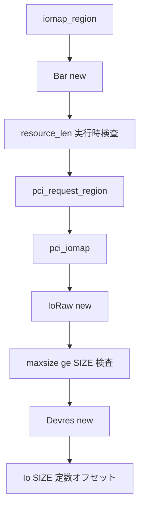

# 第29章 PCI ドライバ抽象と BAR と IRQ

> 本章で読むソース
>
> - [`rust/kernel/pci.rs`](https://github.com/gregkh/linux/blob/v6.18.38/rust/kernel/pci.rs)
> - [`rust/kernel/pci/id.rs`](https://github.com/gregkh/linux/blob/v6.18.38/rust/kernel/pci/id.rs)
> - [`rust/kernel/io.rs`](https://github.com/gregkh/linux/blob/v6.18.38/rust/kernel/io.rs)

## この章の狙い

本章では、PCI バスの `Adapter` 登録、`DeviceId` マッチング、`Bar` による MMIO、IRQ 橋渡しを読む。
[第28章](28-platform-of.md) と同型の Adapter パターンを PCI 固有の差分として扱う。

## 前提

[第18章](../part05-io-dma-async/18-mmio-io.md) で `Io` と `IoRaw` を読んでいること。
[第26章](../part07-device-model-irq/26-devres-revocable.md) で `Devres` を読んでいること。
[第27章](../part07-device-model-irq/27-irq-request.md) で `IrqRequest` と `irq::Registration` を読んでいること。
[第28章](28-platform-of.md) で platform の Adapter パターンを読んでいること。

## Adapter と単一 ID テーブル

PCI は OF と ACPI の二重テーブルを持たず、`T::ID_TABLE` 単一である。
登録経路は platform と同型である。

[`rust/kernel/pci.rs` L44-L55](https://github.com/gregkh/linux/blob/v6.18.38/rust/kernel/pci.rs#L44-L55)

```rust
        // SAFETY: It's safe to set the fields of `struct pci_driver` on initialization.
        unsafe {
            (*pdrv.get()).name = name.as_char_ptr();
            (*pdrv.get()).probe = Some(Self::probe_callback);
            (*pdrv.get()).remove = Some(Self::remove_callback);
            (*pdrv.get()).id_table = T::ID_TABLE.as_ptr();
        }

        // SAFETY: `pdrv` is guaranteed to be a valid `RegType`.
        to_result(unsafe {
            bindings::__pci_register_driver(pdrv.get(), module.0, name.as_char_ptr())
        })
```

`probe_callback` は C から渡された `pci_device_id` から `IdInfo` を引く。

[`rust/kernel/pci.rs` L65-L85](https://github.com/gregkh/linux/blob/v6.18.38/rust/kernel/pci.rs#L65-L85)

```rust
    extern "C" fn probe_callback(
        pdev: *mut bindings::pci_dev,
        id: *const bindings::pci_device_id,
    ) -> c_int {
        // SAFETY: The PCI bus only ever calls the probe callback with a valid pointer to a
        // `struct pci_dev`.
        //
        // INVARIANT: `pdev` is valid for the duration of `probe_callback()`.
        let pdev = unsafe { &*pdev.cast::<Device<device::CoreInternal>>() };

        // SAFETY: `DeviceId` is a `#[repr(transparent)]` wrapper of `struct pci_device_id` and
        // does not add additional invariants, so it's safe to transmute.
        let id = unsafe { &*id.cast::<DeviceId>() };
        let info = T::ID_TABLE.info(id.index());

        from_result(|| {
            let data = T::probe(pdev, info)?;

            pdev.as_ref().set_drvdata(data);
            Ok(0)
        })
    }
```

## DeviceId と const fn マッチング

`from_id` は C の `PCI_DEVICE` マクロ相当を型安全に再実装する。
`PCI_ANY_ID` は `!0` によるワイルドカードである。

[`rust/kernel/pci.rs` L131-L148](https://github.com/gregkh/linux/blob/v6.18.38/rust/kernel/pci.rs#L131-L148)

```rust
impl DeviceId {
    const PCI_ANY_ID: u32 = !0;

    /// Equivalent to C's `PCI_DEVICE` macro.
    ///
    /// Create a new `pci::DeviceId` from a vendor and device ID.
    #[inline]
    pub const fn from_id(vendor: Vendor, device: u32) -> Self {
        Self(bindings::pci_device_id {
            vendor: vendor.as_raw() as u32,
            device,
            subvendor: DeviceId::PCI_ANY_ID,
            subdevice: DeviceId::PCI_ANY_ID,
            class: 0,
            class_mask: 0,
            driver_data: 0,
            override_only: 0,
        })
    }
```

[`rust/kernel/pci.rs` L212-L221](https://github.com/gregkh/linux/blob/v6.18.38/rust/kernel/pci.rs#L212-L221)

```rust
macro_rules! pci_device_table {
    ($table_name:ident, $module_table_name:ident, $id_info_type: ty, $table_data: expr) => {
        const $table_name: $crate::device_id::IdArray<
            $crate::pci::DeviceId,
            $id_info_type,
            { $table_data.len() },
        > = $crate::device_id::IdArray::new($table_data);

        $crate::module_device_table!("pci", $module_table_name, $table_name);
    };
}
```

## Bar と SIZE の二段検査

`Bar<const SIZE>` の `SIZE` は実 BAR 長ではなく、コンパイル時に保証したい最小利用可能長である。
`Bar::new` は `resource_len` で実長を得て `IoRaw::new` に渡す。

[`rust/kernel/pci.rs` L320-L352](https://github.com/gregkh/linux/blob/v6.18.38/rust/kernel/pci.rs#L320-L352)

```rust
    fn new(pdev: &Device, num: u32, name: &CStr) -> Result<Self> {
        let len = pdev.resource_len(num)?;
        if len == 0 {
            return Err(ENOMEM);
        }

        // Convert to `i32`, since that's what all the C bindings use.
        let num = i32::try_from(num)?;

        // SAFETY:
        // `pdev` is valid by the invariants of `Device`.
        // `num` is checked for validity by a previous call to `Device::resource_len`.
        // `name` is always valid.
        let ret = unsafe { bindings::pci_request_region(pdev.as_raw(), num, name.as_char_ptr()) };
        if ret != 0 {
            return Err(EBUSY);
        }

        // SAFETY:
        // `pdev` is valid by the invariants of `Device`.
        // `num` is checked for validity by a previous call to `Device::resource_len`.
        // `name` is always valid.
        let ioptr: usize = unsafe { bindings::pci_iomap(pdev.as_raw(), num, 0) } as usize;
        if ioptr == 0 {
            // SAFETY:
            // `pdev` valid by the invariants of `Device`.
            // `num` is checked for validity by a previous call to `Device::resource_len`.
            unsafe { bindings::pci_release_region(pdev.as_raw(), num) };
            return Err(ENOMEM);
        }

        let io = match IoRaw::new(ioptr, len as usize) {
```

`IoRaw::new` は `maxsize < SIZE` なら `EINVAL` を返す実行時検査である。
通過後の定数オフセットアクセスは `SIZE` を上限にコンパイル時境界検査される。

[`rust/kernel/io.rs` L43-L48](https://github.com/gregkh/linux/blob/v6.18.38/rust/kernel/io.rs#L43-L48)

```rust
    pub fn new(addr: usize, maxsize: usize) -> Result<Self> {
        if maxsize < SIZE {
            return Err(EINVAL);
        }

        Ok(Self { addr, maxsize })
    }
```

失敗時は `do_release` で request と iomap の途中状態を巻き戻す。

[`rust/kernel/pci.rs` L352-L361](https://github.com/gregkh/linux/blob/v6.18.38/rust/kernel/pci.rs#L352-L361)

```rust
        let io = match IoRaw::new(ioptr, len as usize) {
            Ok(io) => io,
            Err(err) => {
                // SAFETY:
                // `pdev` is valid by the invariants of `Device`.
                // `ioptr` is guaranteed to be the start of a valid I/O mapped memory region.
                // `num` is checked for validity by a previous call to `Device::resource_len`.
                unsafe { Self::do_release(pdev, ioptr, num) };
                return Err(err);
            }
        };
```

`Deref` は `Io<SIZE>` を返し、ch18 の型付きアクセサへ接続する。

[`rust/kernel/pci.rs` L405-L411](https://github.com/gregkh/linux/blob/v6.18.38/rust/kernel/pci.rs#L405-L411)

```rust
impl<const SIZE: usize> Deref for Bar<SIZE> {
    type Target = Io<SIZE>;

    fn deref(&self) -> &Self::Target {
        // SAFETY: By the type invariant of `Self`, the MMIO range in `self.io` is properly mapped.
        unsafe { Io::from_raw(&self.io) }
    }
}
```

## devres 登録と IRQ 橋渡し

`iomap_region` は `Devres::new` で `Bar` を device 束縛リソースへ登録する。

[`rust/kernel/pci.rs` L522-L527](https://github.com/gregkh/linux/blob/v6.18.38/rust/kernel/pci.rs#L522-L527)

```rust
    pub fn iomap_region_sized<'a, const SIZE: usize>(
        &'a self,
        bar: u32,
        name: &'a CStr,
    ) -> impl PinInit<Devres<Bar<SIZE>>, Error> + 'a {
        Devres::new(self.as_ref(), Bar::<SIZE>::new(self, bar, name))
    }
```

`irq_vector` と `request_irq` は ch27 の型へ橋渡しする。

[`rust/kernel/pci.rs` L539-L561](https://github.com/gregkh/linux/blob/v6.18.38/rust/kernel/pci.rs#L539-L561)

```rust
    pub fn irq_vector(&self, index: u32) -> Result<IrqRequest<'_>> {
        // SAFETY: `self.as_raw` returns a valid pointer to a `struct pci_dev`.
        let irq = unsafe { crate::bindings::pci_irq_vector(self.as_raw(), index) };
        if irq < 0 {
            return Err(crate::error::Error::from_errno(irq));
        }
        // SAFETY: `irq` is guaranteed to be a valid IRQ number for `&self`.
        Ok(unsafe { IrqRequest::new(self.as_ref(), irq as u32) })
    }

    /// Returns a [`kernel::irq::Registration`] for the IRQ vector at the given
    /// index.
    pub fn request_irq<'a, T: crate::irq::Handler + 'static>(
        &'a self,
        index: u32,
        flags: irq::Flags,
        name: &'static CStr,
        handler: impl PinInit<T, Error> + 'a,
    ) -> Result<impl PinInit<irq::Registration<T>, Error> + 'a> {
        let request = self.irq_vector(index)?;

        Ok(irq::Registration::<T>::new(request, flags, name, handler))
    }
```

`pci_irq_vector` は、対象の vector が `pci_alloc_irq_vectors` 等によってあらかじめ確保済みであることを前提とする C 関数である。
6.18.38 の `rust/kernel/pci.rs` にはこの確保を行う allocator が存在せず、`irq_vector` は確保済みの vector 番号から `IrqRequest` を作るだけの薄いラッパーにとどまる。
Rust 側から vector 確保そのものを行う API は 7.1.3 の `alloc_irq_vectors` で初めて追加される。

## DeviceContext と Core 操作

`enable_device_mem` と `set_master` は `Device<Core>` に置かれる。
probe と unbind の双方から呼べる Core callback context の型制約である。

[`rust/kernel/pci.rs` L581-L593](https://github.com/gregkh/linux/blob/v6.18.38/rust/kernel/pci.rs#L581-L593)

```rust
impl Device<device::Core> {
    /// Enable memory resources for this device.
    pub fn enable_device_mem(&self) -> Result {
        // SAFETY: `self.as_raw` is guaranteed to be a pointer to a valid `struct pci_dev`.
        to_result(unsafe { bindings::pci_enable_device_mem(self.as_raw()) })
    }

    /// Enable bus-mastering for this device.
    #[inline]
    pub fn set_master(&self) {
        // SAFETY: `self.as_raw` is guaranteed to be a pointer to a valid `struct pci_dev`.
        unsafe { bindings::pci_set_master(self.as_raw()) };
    }
}
```

## 処理の流れ



## 高速化と最適化の工夫

`Bar<const SIZE>` は実行時の一度きり長さ検査と、以降のコンパイル時境界検査の二段構えである。
`Bar::new` の `do_release` は request と iomap の対称的巻き戻しを保証する。
`Devres` 登録により unbind 時の BAR 解放をドライバの明示 remove なしに保証する。

## Linux 7.1.3 での差分

6.18.38 の `rust/kernel/pci/` には `id.rs` のみが存在し、`io.rs` と `irq.rs` は無い。
7.1.3 では `pci/io.rs` が303行、`pci/irq.rs` が252行で新設された。

`pci.rs` は `mod io` と `mod irq` を宣言し re-export する。

[`rust/kernel/pci.rs` L34-L55](https://github.com/gregkh/linux/blob/v7.1.3/rust/kernel/pci.rs#L34-L55)

```rust
mod id;
mod io;
mod irq;

pub use self::id::{
    Class,
    ClassMask,
    Vendor, //
};
pub use self::io::{
    Bar,
    ConfigSpace,
    ConfigSpaceKind,
    ConfigSpaceSize,
    Extended,
    Normal, //
};
pub use self::irq::{
    IrqType,
    IrqTypes,
    IrqVector, //
};
```

`ConfigSpace` と `impl_config_space_io_capable!` は config space への safe API を初めて提供する。
C 関数の戻り値は infallible API として意図的に無視される。

[`rust/kernel/pci/io.rs` L90-L111](https://github.com/gregkh/linux/blob/v7.1.3/rust/kernel/pci/io.rs#L90-L111)

```rust
            unsafe fn io_read(&self, address: usize) -> $ty {
                let mut val: $ty = 0;

                // Return value from C function is ignored in infallible accessors.
                let _ret =
                    // SAFETY: By the type invariant `self.pdev` is a valid address.
                    // CAST: The offset is cast to `i32` because the C functions expect a 32-bit
                    // signed offset parameter. PCI configuration space size is at most 4096 bytes,
                    // so the value always fits within `i32` without truncation or sign change.
                    unsafe { bindings::$read_fn(self.pdev.as_raw(), address as i32, &mut val) };

                val
            }

            unsafe fn io_write(&self, value: $ty, address: usize) {
                // Return value from C function is ignored in infallible accessors.
                let _ret =
                    // SAFETY: By the type invariant `self.pdev` is a valid address.
                    // CAST: The offset is cast to `i32` because the C functions expect a 32-bit
                    // signed offset parameter. PCI configuration space size is at most 4096 bytes,
                    // so the value always fits within `i32` without truncation or sign change.
                    unsafe { bindings::$write_fn(self.pdev.as_raw(), address as i32, value) };
            }
```

`alloc_irq_vectors` は MSI-X、MSI、INTx のうち許可された方式を優先順位順に試し、最初に成功した一方式の vector 集合を確保する高レベル API である。

[`rust/kernel/pci/irq.rs` L244-L250](https://github.com/gregkh/linux/blob/v7.1.3/rust/kernel/pci/irq.rs#L244-L250)

```rust
    pub fn alloc_irq_vectors(
        &self,
        min_vecs: u32,
        max_vecs: u32,
        irq_types: IrqTypes,
    ) -> Result<RangeInclusive<IrqVector<'_>>> {
        IrqVectorRegistration::register(self, min_vecs, max_vecs, irq_types)
    }
```

`request_irq` は `IrqVector` を引数に取り、`pin_init_scope` で変換を遅延する。

[`rust/kernel/pci/irq.rs` L176-L187](https://github.com/gregkh/linux/blob/v7.1.3/rust/kernel/pci/irq.rs#L176-L187)

```rust
    pub fn request_irq<'a, T: crate::irq::Handler + 'static>(
        &'a self,
        vector: IrqVector<'a>,
        flags: irq::Flags,
        name: &'static CStr,
        handler: impl PinInit<T, Error> + 'a,
    ) -> impl PinInit<irq::Registration<T>, Error> + 'a {
        pin_init::pin_init_scope(move || {
            let request = vector.try_into()?;

            Ok(irq::Registration::<T>::new(request, flags, name, handler))
        })
    }
```

`DriverLayout` 分離と `probe` の `PinInit` 化は [第28章](28-platform-of.md) と同型の変化である。

## まとめ

6.18.38 の PCI 抽象は `pci.rs` 単一ファイルに BAR と IRQ を同居させていた。
7.1.3 では `pci/io.rs` と `pci/irq.rs` への分割と config space、優先順位順に一方式を選んで確保する IRQ allocator が追加された。
`Bar` の `SIZE` は最小利用可能長であり、実行時検査とコンパイル時境界検査の二段構えである。

## 関連する章

- [第18章 MMIO と IO 抽象](../part05-io-dma-async/18-mmio-io.md)
- [第26章 devres と Revocable](../part07-device-model-irq/26-devres-revocable.md)
- [第27章 IRQ 要求とスレッド化ハンドラ](../part07-device-model-irq/27-irq-request.md)
- [第28章 platform デバイスと OF マッチング](28-platform-of.md)
