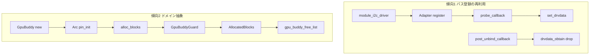

# 第30章 7.x での拡大と新規サブシステムの設計傾向

> 本章で読むソース（すべて **v7.1.3**）
>
> - [`rust/kernel/i2c.rs`](https://github.com/gregkh/linux/blob/v7.1.3/rust/kernel/i2c.rs)
> - [`rust/kernel/driver.rs`](https://github.com/gregkh/linux/blob/v7.1.3/rust/kernel/driver.rs)
> - [`rust/kernel/gpu/buddy.rs`](https://github.com/gregkh/linux/blob/v7.1.3/rust/kernel/gpu/buddy.rs)

## この章の狙い

本章は本分冊の最終章であり、6.18.38 に存在しない v7.1.3 新規サブシステムの設計傾向に絞る。
代表2系統を実引用で深掘りし、残りは索引表で示す。
全新規モジュールの網羅説明は行わない。

## 前提

[第25章](../part07-device-model-irq/25-driver-registration-probe.md) で `DriverLayout` と `post_unbind_callback` を読んでいること。
[第28章](28-platform-of.md) と [第29章](29-pci-driver.md) で platform と PCI の Adapter パターンを読んでいること。
[第26章](../part07-device-model-irq/26-devres-revocable.md) で `Devres` を読んでいること。

## 代表A: i2c バス登録抽象

`i2c.rs` は 6.18.38 に存在せず v7.1.3 で596行として新設された。
[第28章](28-platform-of.md) と [第29章](29-pci-driver.md) と同じ `DriverLayout` と `RegistrationOps` を再利用する。

[`rust/kernel/i2c.rs` L99-L103](https://github.com/gregkh/linux/blob/v7.1.3/rust/kernel/i2c.rs#L99-L103)

```rust
unsafe impl<T: Driver + 'static> driver::DriverLayout for Adapter<T> {
    type DriverType = bindings::i2c_driver;
    type DriverData = T;
    const DEVICE_DRIVER_OFFSET: usize = core::mem::offset_of!(Self::DriverType, driver);
}
```

`register` は3種の ID テーブルのうち最低1つを `build_assert!` で強制し、`i2c_register_driver` を呼ぶ。

[`rust/kernel/i2c.rs` L113-L145](https://github.com/gregkh/linux/blob/v7.1.3/rust/kernel/i2c.rs#L113-L145)

```rust
        build_assert!(
            T::ACPI_ID_TABLE.is_some() || T::OF_ID_TABLE.is_some() || T::I2C_ID_TABLE.is_some(),
            "At least one of ACPI/OF/Legacy tables must be present when registering an i2c driver"
        );

        let i2c_table = match T::I2C_ID_TABLE {
            Some(table) => table.as_ptr(),
            None => core::ptr::null(),
        };
        // ... (中略) ...
        // SAFETY: `idrv` is guaranteed to be a valid `DriverType`.
        to_result(unsafe { bindings::i2c_register_driver(module.0, idrv.get()) })
```

### id_info の二段解決

`probe_callback` はまず `i2c_id_info` で I2C 表を調べ、失敗時のみ `driver::Adapter::id_info` へフォールバックする。
照合順は I2C、ACPI、OF の最大3表である。

[`rust/kernel/i2c.rs` L155-L170](https://github.com/gregkh/linux/blob/v7.1.3/rust/kernel/i2c.rs#L155-L170)

```rust
    extern "C" fn probe_callback(idev: *mut bindings::i2c_client) -> kernel::ffi::c_int {
        // SAFETY: The I2C bus only ever calls the probe callback with a valid pointer to a
        // `struct i2c_client`.
        //
        // INVARIANT: `idev` is valid for the duration of `probe_callback()`.
        let idev = unsafe { &*idev.cast::<I2cClient<device::CoreInternal>>() };

        let info =
            Self::i2c_id_info(idev).or_else(|| <Self as driver::Adapter>::id_info(idev.as_ref()));

        from_result(|| {
            let data = T::probe(idev, info);

            idev.as_ref().set_drvdata(data)?;
            Ok(0)
        })
    }
```

[`rust/kernel/i2c.rs` L205-L221](https://github.com/gregkh/linux/blob/v7.1.3/rust/kernel/i2c.rs#L205-L221)

```rust
    fn i2c_id_info(dev: &I2cClient) -> Option<&'static <Self as driver::Adapter>::IdInfo> {
        let table = Self::i2c_id_table()?;

        // SAFETY:
        // - `table` has static lifetime, hence it's valid for reads
        // - `dev` is guaranteed to be valid while it's alive, and so is `dev.as_raw()`.
        let raw_id = unsafe { bindings::i2c_match_id(table.as_ptr(), dev.as_raw()) };

        if raw_id.is_null() {
            return None;
        }

        // SAFETY: `DeviceId` is a `#[repr(transparent)` wrapper of `struct i2c_device_id` and
        // does not add additional invariants, so it's safe to transmute.
        let id = unsafe { &*raw_id.cast::<DeviceId>() };

        Some(table.info(<DeviceId as RawDeviceIdIndex>::index(id)))
    }
```

`driver::Adapter::id_info` のフォールバック側は ACPI を先に、続けて OF を調べる。

[`rust/kernel/driver.rs` L367-L378](https://github.com/gregkh/linux/blob/v7.1.3/rust/kernel/driver.rs#L367-L378)

```rust
    fn id_info(dev: &device::Device) -> Option<&'static Self::IdInfo> {
        let id = Self::acpi_id_info(dev);
        if id.is_some() {
            return id;
        }

        let id = Self::of_id_info(dev);
        if id.is_some() {
            return id;
        }

        None
    }
```

### remove と post_unbind による所有権回収

`remove_callback` は `drvdata_borrow` で借用するだけであり、ここでは drop しない。

[`rust/kernel/i2c.rs` L173-L182](https://github.com/gregkh/linux/blob/v7.1.3/rust/kernel/i2c.rs#L173-L182)

```rust
    extern "C" fn remove_callback(idev: *mut bindings::i2c_client) {
        // SAFETY: `idev` is a valid pointer to a `struct i2c_client`.
        let idev = unsafe { &*idev.cast::<I2cClient<device::CoreInternal>>() };

        // SAFETY: `remove_callback` is only ever called after a successful call to
        // `probe_callback`, hence it's guaranteed that `I2cClient::set_drvdata()` has been called
        // and stored a `Pin<KBox<T>>`.
        let data = unsafe { idev.as_ref().drvdata_borrow::<T>() };

        T::unbind(idev, data);
    }
```

private data の最終回収は汎用の `post_unbind_callback` が担う。
remove と全 devres 完了後に `drvdata_obtain` で drop する。

[`rust/kernel/driver.rs` L185-L197](https://github.com/gregkh/linux/blob/v7.1.3/rust/kernel/driver.rs#L185-L197)

```rust
    extern "C" fn post_unbind_callback(dev: *mut bindings::device) {
        // SAFETY: The driver core only ever calls the post unbind callback with a valid pointer to
        // a `struct device`.
        //
        // INVARIANT: `dev` is valid for the duration of the `post_unbind_callback()`.
        let dev = unsafe { &*dev.cast::<device::Device<device::CoreInternal>>() };

        // `remove()` and all devres callbacks have been completed at this point, hence drop the
        // driver's device private data.
        //
        // SAFETY: By the safety requirements of the `Driver` trait, `T::DriverData` is the
        // driver's device private data type.
        drop(unsafe { dev.drvdata_obtain::<T::DriverData>() });
    }
```

手動 I2C client の `i2c::Registration` は別経路である。
`Registration` が所有するのは `i2c_client` 自体であり、ドライバの private data ではない。
ただし削除時の因果経路は無関係ではない。
`Drop` が呼ぶ `i2c_unregister_device` は `device_unregister` → `device_del` → `bus_remove_device` → `device_release_driver` と進む。
client が既にドライバへ bound 済みであれば、この経路が `remove_callback` と devres 解放を経て `post_unbind_callback` を誘発し、結果として private data を回収する。

[`rust/kernel/i2c.rs` L561-L567](https://github.com/gregkh/linux/blob/v7.1.3/rust/kernel/i2c.rs#L561-L567)

```rust
    pub fn new<'a>(
        i2c_adapter: &I2cAdapter,
        i2c_board_info: &I2cBoardInfo,
        parent_dev: &'a device::Device<device::Bound>,
    ) -> impl PinInit<Devres<Self>, Error> + 'a {
        Devres::new(parent_dev, Self::try_new(i2c_adapter, i2c_board_info))
    }
```

[`rust/kernel/i2c.rs` L583-L588](https://github.com/gregkh/linux/blob/v7.1.3/rust/kernel/i2c.rs#L583-L588)

```rust
impl Drop for Registration {
    fn drop(&mut self) {
        // SAFETY: `Drop` is only called for a valid `Registration`, which by invariant
        // always contains a non-null pointer to an `i2c_client`.
        unsafe { bindings::i2c_unregister_device(self.0.as_ptr()) }
    }
}
```

## 代表B: gpu buddy アロケータ

`gpu/buddy.rs` は 6.18.38 に存在せず v7.1.3 で614行として新設された。
`drm/` は 6.18.38 から存在する既存サブシステムの拡張であり、代表Bには採らない。
7.1.3 では `drm/gem/shmem.rs` が新設されたが、DRM 全体の新規追加ではない。

`GpuBuddyInner` は `Opaque` と `Mutex` で C の同期契約を型に押し込む。

[`rust/kernel/gpu/buddy.rs` L317-L328](https://github.com/gregkh/linux/blob/v7.1.3/rust/kernel/gpu/buddy.rs#L317-L328)

```rust
#[pin_data(PinnedDrop)]
struct GpuBuddyInner {
    #[pin]
    inner: Opaque<bindings::gpu_buddy>,

    // TODO: Replace `Mutex<()>` with `Mutex<Opaque<..>>` once `Mutex::new()`
    // accepts `impl PinInit<T>`.
    #[pin]
    lock: Mutex<()>,
    /// Cached creation parameters (do not change after init).
    params: GpuBuddyParams,
}
```

`alloc_blocks` は `Arc::clone` 後に `buddy.lock()` を取り、C 側確保を pin-init に畳み込む。

[`rust/kernel/gpu/buddy.rs` L439-L480](https://github.com/gregkh/linux/blob/v7.1.3/rust/kernel/gpu/buddy.rs#L439-L480)

```rust
    pub fn alloc_blocks(
        &self,
        mode: GpuBuddyAllocMode,
        size: u64,
        min_block_size: Alignment,
        flags: impl Into<GpuBuddyAllocFlags>,
    ) -> impl PinInit<AllocatedBlocks, Error> {
        let buddy_arc = Arc::clone(&self.0);
        let (start, end) = mode.range();
        let mode_flags = mode.as_flags();
        let modifier_flags = flags.into();

        // Create pin-initializer that initializes list and allocates blocks.
        try_pin_init!(AllocatedBlocks {
            buddy: buddy_arc,
            list <- CListHead::new(),
            _: {
                // Reject zero-sized or inverted ranges.
                if let GpuBuddyAllocMode::Range(range) = &mode {
                    if range.is_empty() {
                        Err::<(), Error>(EINVAL)?;
                    }
                }

                // Lock while allocating to serialize with concurrent frees.
                let guard = buddy.lock();

                // SAFETY: Per the type invariant, `inner` contains an initialized
                // allocator. `guard` provides exclusive access.
                to_result(unsafe {
                    bindings::gpu_buddy_alloc_blocks(
                        guard.as_raw(),
                        start,
                        end,
                        size,
                        min_block_size.as_usize() as u64,
                        list.as_raw(),
                        mode_flags | usize::from(modifier_flags),
                    )
                })?
            }
        })
    }
```

`AllocatedBlocks` は `Arc<GpuBuddyInner>` を所有し、`Drop` で同じロック経路から `gpu_buddy_free_list` を呼ぶ。
`iter` は `AllocatedBlock` を借用するだけであり、所有権は `AllocatedBlocks` に残る。

[`rust/kernel/gpu/buddy.rs` L493-L498](https://github.com/gregkh/linux/blob/v7.1.3/rust/kernel/gpu/buddy.rs#L493-L498)

```rust
#[pin_data(PinnedDrop)]
pub struct AllocatedBlocks {
    #[pin]
    list: CListHead,
    buddy: Arc<GpuBuddyInner>,
}
```

[`rust/kernel/gpu/buddy.rs` L533-L542](https://github.com/gregkh/linux/blob/v7.1.3/rust/kernel/gpu/buddy.rs#L533-L542)

```rust
impl PinnedDrop for AllocatedBlocks {
    fn drop(self: Pin<&mut Self>) {
        let guard = self.buddy.lock();

        // SAFETY:
        // - list is valid per the type's invariants.
        // - guard provides exclusive access to the allocator.
        unsafe {
            bindings::gpu_buddy_free_list(guard.as_raw(), self.list.as_raw(), 0);
        }
    }
}
```

## 処理の流れ



ch28 の platform 登録シーケンスと傾向1は同型の構造である。

## 高速化と最適化の工夫

i2c の3表照合は実行時ハッシュマップなしで、ch24 の `IdArray` インデックス書き込みを再利用する。
gpu buddy は `Arc` により `GpuBuddy` 本体が先に手放されても `AllocatedBlocks` の `Drop` までアロケータが生存する。

## 7.x 新規サブシステム索引

`wc -l` で v7.1.3 の行数を実測した。

| サブシステム | 主なファイル | 行数 | 一言 |
|---|---|---:|---|
| iommu | `iommu/mod.rs` / `iommu/pgtable.rs` | 5 / 279 | IOMMU ページテーブル抽象 |
| soc | `soc.rs` | 135 | `soc_device_register` の pin 初期化ラッパー |
| num | `num.rs` / `num/bounded.rs` | 79 / 1121 | 範囲制約付き整数の共通化 |
| interop | `interop.rs` / `interop/list.rs` | 9 / 339 | C `list_head` 相互運用の低レベル API |
| pwm | `pwm.rs` | 741 | `pwm_chip` と `PwmOps` vtable のコントローラ抽象。binding は platform Adapter を流用 |
| module_param | `module_param.rs` | 182 | 型付きモジュールパラメータ。ch4 で深掘り済み |
| impl_flags | `impl_flags.rs` | 272 | ビットフラグ生成マクロ |
| safety | `safety.rs` | 53 | `unsafe_precondition_assert!` |

`usb.rs` は 6.18.38 から存在するため本章の新規対象外である。
`ptr/projection.rs` と `str/parse_int.rs` は既存モジュールの拡張であり主題外である。

## まとめ

傾向1は i2c のように既存の `DriverLayout` と Adapter 骨格を新バスへ複製する方向である。
pwm は新規バスの追加ではなく、`pwm_chip` と `PwmOps` vtable を持つコントローラフレームワークである。
`module_pwm_platform_driver!` は `module_platform_driver!` を再利用するため、device binding には platform の Adapter パターンも使われる。
チップ操作を差し替える `PwmOps` vtable が i2c 固有の Adapter とは異なるパターンである点が両者の比較範囲である。
傾向2は gpu buddy のように `Arc`、`Mutex`、`Opaque`、`PinnedDrop` を組み合わせる方向である。
共通するのは C 側の同期と寿命契約を Rust の型境界へ押し込むという本分冊全体の原則である。

## 関連する章

- [第25章 Driver と登録と probe](../part07-device-model-irq/25-driver-registration-probe.md)
- [第28章 platform デバイスと OF マッチング](28-platform-of.md)
- [第29章 PCI ドライバ抽象と BAR と IRQ](29-pci-driver.md)
