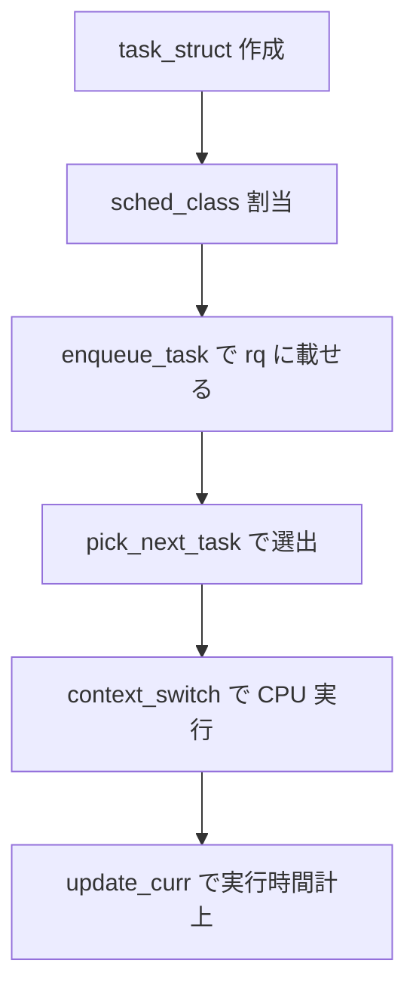

# 第1章 task_struct の構造

> **本章で読むソース**
>
> - [`include/linux/sched.h` L104-L150](https://github.com/gregkh/linux/blob/v6.18.38/include/linux/sched.h#L104-L150)
> - [`include/linux/sched.h` L820-L878](https://github.com/gregkh/linux/blob/v6.18.38/include/linux/sched.h#L820-L878)
> - [`include/linux/sched.h` L920-L963](https://github.com/gregkh/linux/blob/v6.18.38/include/linux/sched.h#L920-L963)
> - [`kernel/sched/core.c` L552-L555](https://github.com/gregkh/linux/blob/v6.18.38/kernel/sched/core.c#L552-L555)
> - [`kernel/sched/sched.h` L2405-L2432](https://github.com/gregkh/linux/blob/v6.18.38/kernel/sched/sched.h#L2405-L2432)
> - [`init/main.c` L978-L983](https://github.com/gregkh/linux/blob/v6.18.38/init/main.c#L978-L983)

## この章の狙い

カーネルが**タスク**を表す `task_struct` の主要フィールドと、スケジューラが参照する部分の配置を押さえる。

## 前提

- [全体像と横断基盤](../../foundation/README.md) の第0部でソースツリーの地図を読んでいること。

## タスク状態と exit 状態の分離

`task_struct` の実行可否は `__state` に、終了フェーズは `exit_state` に分かれている。
コメントが示す通り、一方を更新しても他方を誤って書き換えないよう、ビットマスクを分離している。

[`include/linux/sched.h` L104-L150](https://github.com/gregkh/linux/blob/v6.18.38/include/linux/sched.h#L104-L150)

```c
#define TASK_RUNNING			0x00000000
#define TASK_INTERRUPTIBLE		0x00000001
#define TASK_UNINTERRUPTIBLE		0x00000002
#define __TASK_STOPPED			0x00000004
#define __TASK_TRACED			0x00000008
/* Used in tsk->exit_state: */
#define EXIT_DEAD			0x00000010
#define EXIT_ZOMBIE			0x00000020
#define EXIT_TRACE			(EXIT_ZOMBIE | EXIT_DEAD)
/* Used in tsk->__state again: */
#define TASK_PARKED			0x00000040
#define TASK_DEAD			0x00000080
// ... (中略) ...
#define TASK_NORMAL			(TASK_INTERRUPTIBLE | TASK_UNINTERRUPTIBLE)

#define TASK_REPORT			(TASK_RUNNING | TASK_INTERRUPTIBLE | \
					 TASK_UNINTERRUPTIBLE | __TASK_STOPPED | \
					 __TASK_TRACED | EXIT_DEAD | EXIT_ZOMBIE | \
					 TASK_PARKED)

#define task_is_running(task)		(READ_ONCE((task)->__state) == TASK_RUNNING)
```

`TASK_RUNNING` は 0 である点に注意する。
`/proc` の状態表示（`fs/proc/array.c` の `get_task_state`）も同じビット定義に依存する。

## スケジューラ関連フィールドの配置

`task_struct` 先頭付近にはスケジューリングに直結するメンバが集約される。
`sched_entity`、`sched_rt_entity`、`sched_dl_entity` が並び、`sched_class` ポインタでどのクラスが担当するかを示す。

[`include/linux/sched.h` L820-L878](https://github.com/gregkh/linux/blob/v6.18.38/include/linux/sched.h#L820-L878)

```c
struct task_struct {
#ifdef CONFIG_THREAD_INFO_IN_TASK
	struct thread_info		thread_info;
#endif
	unsigned int			__state;
	unsigned int			saved_state;
	randomized_struct_fields_start
	void				*stack;
	refcount_t			usage;
	unsigned int			flags;
	unsigned int			ptrace;
	int				on_cpu;
	struct __call_single_node	wake_entry;
	unsigned int			wakee_flips;
	unsigned long			wakee_flip_decay_ts;
	struct task_struct		*last_wakee;
	int				recent_used_cpu;
	int				wake_cpu;
	int				on_rq;
	int				prio;
	int				static_prio;
	int				normal_prio;
	unsigned int			rt_priority;
	struct sched_entity		se;
	struct sched_rt_entity		rt;
	struct sched_dl_entity		dl;
	struct sched_dl_entity		*dl_server;
	const struct sched_class	*sched_class;
```

**最適化の工夫**：ランダム化対象フィールドの直前にスケジューリングクリティカルな項目を置く。
レイアウト変更は wake-up 経路のキャッシュ局所性に直結するため、コメントで「scheduling-critical items should be added above here」と明示されている。

## メモリ空間とポリシー

ユーザー空間の仮想アドレス空間は `mm` と `active_mm` で表現する。
カーネルスレッドは `mm == NULL` で、borrow した `active_mm` だけを持つ。

[`include/linux/sched.h` L920-L963](https://github.com/gregkh/linux/blob/v6.18.38/include/linux/sched.h#L920-L963)

```c
	unsigned int			policy;
	unsigned long			max_allowed_capacity;
	int				nr_cpus_allowed;
	const cpumask_t			*cpus_ptr;
	cpumask_t			*user_cpus_ptr;
	cpumask_t			cpus_mask;
	void				*migration_pending;
	unsigned short			migration_disabled;
	unsigned short			migration_flags;
	struct sched_info		sched_info;
	struct list_head		tasks;
	struct plist_node		pushable_tasks;
	struct rb_node			pushable_dl_tasks;
	struct mm_struct		*mm;
	struct mm_struct		*active_mm;
```

`policy` は `SCHED_NORMAL`、`SCHED_FIFO`、`SCHED_DEADLINE` 等のスケジューリングポリシーを保持する。
`cpus_ptr` は実行可能 CPU 集合へのポインタで、マイグレーションと affinity の両方がここを参照する。

## sched_class 仮想関数テーブル

各スケジューリングクラスは `sched_class` の関数ポインタ集合として実装される。
`enqueue_task`、`dequeue_task`、`pick_next_task` がランキュー操作の中核である。

[`kernel/sched/sched.h` L2405-L2432](https://github.com/gregkh/linux/blob/v6.18.38/kernel/sched/sched.h#L2405-L2432)

```c
struct sched_class {

#ifdef CONFIG_UCLAMP_TASK
	int uclamp_enabled;
#endif

	void (*enqueue_task) (struct rq *rq, struct task_struct *p, int flags);
	bool (*dequeue_task) (struct rq *rq, struct task_struct *p, int flags);
	void (*yield_task)   (struct rq *rq);
	bool (*yield_to_task)(struct rq *rq, struct task_struct *p);

	void (*wakeup_preempt)(struct rq *rq, struct task_struct *p, int flags);

	int (*balance)(struct rq *rq, struct task_struct *prev, struct rq_flags *rf);
	struct task_struct *(*pick_task)(struct rq *rq);
	struct task_struct *(*pick_next_task)(struct rq *rq, struct task_struct *prev);

	void (*put_prev_task)(struct rq *rq, struct task_struct *p, struct task_struct *next);
	void (*set_next_task)(struct rq *rq, struct task_struct *p, bool first);
```

クラスは優先度順にチェーンされ、idle 以外のクラスが `pick_next_task` で次の実行タスクを返す。

## init_task と sched_init

起動時、`start_kernel` は割り込みを有効にする前に `sched_init` を呼ぶ。
`init_task` が最初の `task_struct` として存在し、以降 fork されたタスクは同じ構造体レイアウトを共有する。

[`init/main.c` L978-L983](https://github.com/gregkh/linux/blob/v6.18.38/init/main.c#L978-L983)

```c
	/*
	 * Set up the scheduler prior starting any interrupts (such as the
	 * timer interrupt). Full topology setup happens at smp_init()
	 * time - but meanwhile we still have a functioning scheduler.
	 */
	sched_init();
```

[`kernel/sched/core.c` L552-L555](https://github.com/gregkh/linux/blob/v6.18.38/kernel/sched/core.c#L552-L555)

```c
 * Normal scheduling state is serialized by rq->lock. __schedule() takes the
 * local CPU's rq->lock, it optionally removes the task from the runqueue and
 * always looks at the local rq data structures to find the most eligible task
 * to run next.
```

`rq->lock` が per-CPU ランキューの直列化点である。
`task_struct` の `on_rq`、`on_cpu` は wake-up と schedule の間でメモリ順序契約を持つ。

## 処理の流れ：タスクが CPU 上で走るまで



1. fork または wake-up で `task_struct` が生成または Runnable になる。
2. `sched_class->enqueue_task` が per-CPU `rq` のクラス別キューへ載せる。
3. `__schedule` が `pick_next_task` を呼び、次タスクを決める。
4. `context_switch` でレジスタと MM を切り替える。

## まとめ

`task_struct` はプロセス属性、メモリ、スケジューリングの三層を1構造体にまとめる。
スケジューラは `se`、`rt`、`dl` と `sched_class` を通じてクラス別ロジックへ委譲する。
状態ビットの分離とフィールド配置は、wake-up 頻度の高い経路の性能と正しさの両方に効く。

## 関連する章

- 次章：[fork とプロセス生成（copy_process）](02-fork-copy-process.md)
- [ランキューとスケジューリングクラスの階層](../part01-core/07-runqueue-sched-class.md)
- [全体像と横断基盤：kernel_init から init プロセス起動まで](../../foundation/part01-boot/05-kernel-init-to-init.md)
