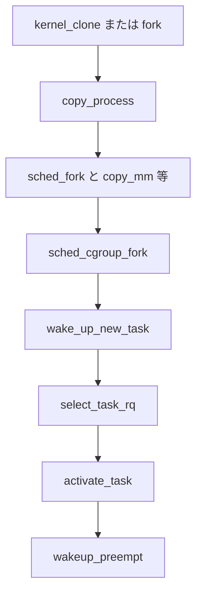

# 第2章 fork とプロセス生成（copy_process）

> **本章で読むソース**
>
> - [`kernel/fork.c` L1929-L1965](https://github.com/gregkh/linux/blob/v6.18.38/kernel/fork.c#L1929-L1965)
> - [`kernel/fork.c` L1996-L2012](https://github.com/gregkh/linux/blob/v6.18.38/kernel/fork.c#L1996-L2012)
> - [`kernel/fork.c` L2153-L2195](https://github.com/gregkh/linux/blob/v6.18.38/kernel/fork.c#L2153-L2195)
> - [`kernel/fork.c` L2255-L2300](https://github.com/gregkh/linux/blob/v6.18.38/kernel/fork.c#L2255-L2300)
> - [`kernel/fork.c` L2610-L2641](https://github.com/gregkh/linux/blob/v6.18.38/kernel/fork.c#L2610-L2641)
> - [`kernel/fork.c` L2690-L2702](https://github.com/gregkh/linux/blob/v6.18.38/kernel/fork.c#L2690-L2702)
> - [`kernel/sched/core.c` L4819-L4854](https://github.com/gregkh/linux/blob/v6.18.38/kernel/sched/core.c#L4819-L4854)

## この章の狙い

`fork`、`clone`、`vfork` が共通で通る `copy_process` が、親タスクから子 `task_struct` を組み立て、スケジューラへ載せるまでの手順を追う。

## 前提

[第1章 task_struct の構造](01-task-struct.md) を読んでいること。

## copy_process の入口と clone フラグ検証

`copy_process` は `kernel_clone_args` と `clone_flags` を受け取り、不整合なフラグ組合せを早期に拒否する。

[`kernel/fork.c` L1929-L1965](https://github.com/gregkh/linux/blob/v6.18.38/kernel/fork.c#L1929-L1965)

```c
__latent_entropy struct task_struct *copy_process(
					struct pid *pid,
					int trace,
					int node,
					struct kernel_clone_args *args)
{
	int pidfd = -1, retval;
	struct task_struct *p;
	struct multiprocess_signals delayed;
	struct file *pidfile = NULL;
	const u64 clone_flags = args->flags;
	struct nsproxy *nsp = current->nsproxy;

	if ((clone_flags & (CLONE_NEWNS|CLONE_FS)) == (CLONE_NEWNS|CLONE_FS))
		return ERR_PTR(-EINVAL);

	if ((clone_flags & (CLONE_NEWUSER|CLONE_FS)) == (CLONE_NEWUSER|CLONE_FS))
		return ERR_PTR(-EINVAL);

	if ((clone_flags & CLONE_THREAD) && !(clone_flags & CLONE_SIGHAND))
		return ERR_PTR(-EINVAL);

	if ((clone_flags & CLONE_SIGHAND) && !(clone_flags & CLONE_VM))
		return ERR_PTR(-EINVAL);
```

> **7.x 系での変化**
> [`kernel/fork.c` L2036-L2066](https://github.com/gregkh/linux/blob/v7.1.3/kernel/fork.c#L2036-L2066) では `CLONE_AUTOREAP`、`CLONE_NNP`、`CLONE_PIDFD_AUTOKILL` の検証が追加されている。
> いずれも権限昇格や pidfd 寿命と絡むため、clone フラグの入口検証が拡張されている。

## マルチプロセス fork 中のシグナル遅延

fork 中に親子へ同時に届くシグナルは `multiprocess_signals` リストへ遅延する。
子生成完了後に配送順序を保証する正しさの機構である。

[`kernel/fork.c` L1996-L2012](https://github.com/gregkh/linux/blob/v6.18.38/kernel/fork.c#L1996-L2012)

```c
	sigemptyset(&delayed.signal);
	INIT_HLIST_NODE(&delayed.node);

	spin_lock_irq(&current->sighand->siglock);
	if (!(clone_flags & CLONE_THREAD))
		hlist_add_head(&delayed.node, &current->signal->multiprocess);
	recalc_sigpending();
	spin_unlock_irq(&current->sighand->siglock);
	retval = -ERESTARTNOINTR;
	if (task_sigpending(current))
		goto fork_out;
```

## sched_fork とリソース複製

`dup_task_struct` の後、`sched_fork` で CPU 配置とスケジューリング属性を初期化する。
続いて `copy_files`、`copy_fs`、`copy_sighand`、`copy_signal`、`copy_mm`、`copy_namespaces`、`copy_io`、`copy_thread` が `clone_flags` に応じて共有または複製する。

[`kernel/fork.c` L2153-L2195](https://github.com/gregkh/linux/blob/v6.18.38/kernel/fork.c#L2153-L2195)

```c
	/* Perform scheduler related setup. Assign this task to a CPU. */
	retval = sched_fork(clone_flags, p);
	if (retval)
		goto bad_fork_cleanup_policy;

	retval = perf_event_init_task(p, clone_flags);
	if (retval)
		goto bad_fork_sched_cancel_fork;
	retval = audit_alloc(p);
	if (retval)
		goto bad_fork_cleanup_perf;
	shm_init_task(p);
	retval = security_task_alloc(p, clone_flags);
	if (retval)
		goto bad_fork_cleanup_audit;
	retval = copy_semundo(clone_flags, p);
	if (retval)
		goto bad_fork_cleanup_security;
	retval = copy_files(clone_flags, p, args->no_files);
	if (retval)
		goto bad_fork_cleanup_semundo;
	retval = copy_fs(clone_flags, p);
	if (retval)
		goto bad_fork_cleanup_files;
	retval = copy_sighand(clone_flags, p);
	if (retval)
		goto bad_fork_cleanup_fs;
	retval = copy_signal(clone_flags, p);
	if (retval)
		goto bad_fork_cleanup_sighand;
	retval = copy_mm(clone_flags, p);
	if (retval)
		goto bad_fork_cleanup_signal;
	retval = copy_namespaces(clone_flags, p);
	if (retval)
		goto bad_fork_cleanup_mm;
	retval = copy_io(clone_flags, p);
	if (retval)
		goto bad_fork_cleanup_namespaces;
	retval = copy_thread(p, args);
	if (retval)
		goto bad_fork_cleanup_io;
```

**最適化の工夫**：`sched_fork` を `copy_files` や `copy_mm` より前に置くことで、スケジューラ側の拒否（帯域、cgroup 制限等）が起きたときにページテーブル複製や fd 表複製を省略できる。
失敗時は `bad_fork_sched_cancel_fork` で scheduler 状態だけを片付け、高コストな複製を避ける。

## PID 公開と cgroup fork

PID 割当後、`sched_cgroup_fork` で cgroup 所属を確定する。

[`kernel/fork.c` L2255-L2300](https://github.com/gregkh/linux/blob/v6.18.38/kernel/fork.c#L2255-L2300)

```c
	p->pid = pid_nr(pid);
	if (clone_flags & CLONE_THREAD) {
		p->group_leader = current->group_leader;
		p->tgid = current->tgid;
	} else {
		p->group_leader = p;
		p->tgid = p->pid;
	}

	p->nr_dirtied = 0;
	p->nr_dirtied_pause = 128 >> (PAGE_SHIFT - 10);
	p->dirty_paused_when = 0;

	p->pdeath_signal = 0;
	p->task_works = NULL;
	clear_posix_cputimers_work(p);

	retval = cgroup_can_fork(p, args);
	if (retval)
		goto bad_fork_put_pidfd;

	retval = sched_cgroup_fork(p, args);
	if (retval)
		goto bad_fork_cancel_cgroup;
```

失敗時は `bad_fork_*` ラベル群が逆順で unwind し、`copy_process` は `ERR_PTR` を返す。

## kernel_clone と wake_up_new_task

[`kernel/fork.c` L2610-L2641](https://github.com/gregkh/linux/blob/v6.18.38/kernel/fork.c#L2610-L2641)

```c
	p = copy_process(NULL, trace, NUMA_NO_NODE, args);
	if (IS_ERR(p))
		return PTR_ERR(p);

	trace_sched_process_fork(current, p);

	pid = get_task_pid(p, PIDTYPE_PID);
	nr = pid_vnr(pid);

	if (clone_flags & CLONE_VFORK) {
		p->vfork_done = &vfork;
		init_completion(&vfork);
		get_task_struct(p);
	}

	wake_up_new_task(p);
```

`wake_up_new_task` は `try_to_wake_up` を呼ばない。
`select_task_rq` で CPU を選び、`activate_task` と `wakeup_preempt` で直接 Runnable 化する。

[`kernel/sched/core.c` L4819-L4854](https://github.com/gregkh/linux/blob/v6.18.38/kernel/sched/core.c#L4819-L4854)

```c
void wake_up_new_task(struct task_struct *p)
{
	struct rq_flags rf;
	struct rq *rq;
	int wake_flags = WF_FORK;

	raw_spin_lock_irqsave(&p->pi_lock, rf.flags);
	WRITE_ONCE(p->__state, TASK_RUNNING);
	p->recent_used_cpu = task_cpu(p);
	rseq_migrate(p);
	__set_task_cpu(p, select_task_rq(p, task_cpu(p), &wake_flags));
	rq = __task_rq_lock(p, &rf);
	update_rq_clock(rq);
	post_init_entity_util_avg(p);

	activate_task(rq, p, ENQUEUE_NOCLOCK | ENQUEUE_INITIAL);
	trace_sched_wakeup_new(p);
	wakeup_preempt(rq, p, wake_flags);
	if (p->sched_class->task_woken) {
		rq_unpin_lock(rq, &rf);
		p->sched_class->task_woken(rq, p);
		rq_repin_lock(rq, &rf);
	}
	task_rq_unlock(rq, p, &rf);
}
```

## fork システムコール

[`kernel/fork.c` L2690-L2702](https://github.com/gregkh/linux/blob/v6.18.38/kernel/fork.c#L2690-L2702)

```c
SYSCALL_DEFINE0(fork)
{
#ifdef CONFIG_MMU
	struct kernel_clone_args args = {
		.exit_signal = SIGCHLD,
	};

	return kernel_clone(&args);
#else
	return -EINVAL;
#endif
}
```

## 処理の流れ



## まとめ

プロセス生成の中核は `copy_process` であり、検証、複製、スケジューラ初期化、cgroup 所属、Runnable 化が一連の流れになる。
`wake_up_new_task` は enqueue 経路の入口であり、`try_to_wake_up` とは別経路である。

## 関連する章

- 前章：[task_struct の構造](01-task-struct.md)
- 次章：[exec とプログラム実行](03-exec-program.md)
- [enqueue と dequeue と pick_next_task](../part02-eevdf/12-enqueue-dequeue-pick.md)
