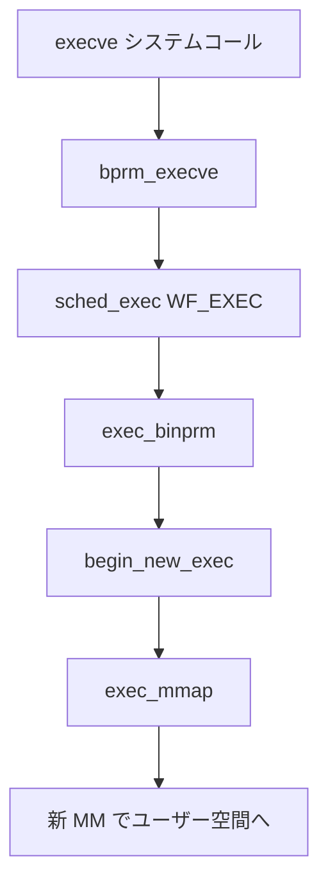

# 第3章 exec とプログラム実行

> **本章で読むソース**
>
> - [`fs/exec.c` L1730-L1782](https://github.com/gregkh/linux/blob/v6.18.38/fs/exec.c#L1730-L1782)
> - [`kernel/sched/core.c` L5446-L5467](https://github.com/gregkh/linux/blob/v6.18.38/kernel/sched/core.c#L5446-L5467)
> - [`fs/exec.c` L1099-L1160](https://github.com/gregkh/linux/blob/v6.18.38/fs/exec.c#L1099-L1160)
> - [`fs/exec.c` L845-L880](https://github.com/gregkh/linux/blob/v6.18.38/fs/exec.c#L845-L880)
> - [`fs/exec.c` L1685-L1706](https://github.com/gregkh/linux/blob/v6.18.38/fs/exec.c#L1685-L1706)
> - [`fs/exec.c` L2005-L2011](https://github.com/gregkh/linux/blob/v6.18.38/fs/exec.c#L2005-L2011)

## この章の狙い

`execve` が既存プロセスのメモリイメージを差し替え、同一 PID で新プログラムを走らせる経路を追う。

## 前提

[fork とプロセス生成（copy_process）](02-fork-copy-process.md) を読んでいること。

## bprm_execve と sched_exec

`bprm_execve` は資格情報の準備、`sched_exec`、バイナリローダ呼び出し、成功後の後処理を順に行う。
失敗時は「point of no return」を越えた後はユーザー空間へ戻さない。

[`fs/exec.c` L1730-L1782](https://github.com/gregkh/linux/blob/v6.18.38/fs/exec.c#L1730-L1782)

```c
static int bprm_execve(struct linux_binprm *bprm)
{
	int retval;

	retval = prepare_bprm_creds(bprm);
	if (retval)
		return retval;

	check_unsafe_exec(bprm);
	current->in_execve = 1;
	sched_mm_cid_before_execve(current);

	sched_exec();

	retval = security_bprm_creds_for_exec(bprm);
	if (retval || bprm->is_check)
		goto out;

	retval = exec_binprm(bprm);
	if (retval < 0)
		goto out;

	sched_mm_cid_after_execve(current);
	rseq_execve(current);
	current->in_execve = 0;
	user_events_execve(current);
	acct_update_integrals(current);
	task_numa_free(current, false);
	return retval;

out:
	if (bprm->point_of_no_return && !fatal_signal_pending(current))
		force_fatal_sig(SIGSEGV);

	sched_mm_cid_after_execve(current);
	rseq_set_notify_resume(current);
	current->in_execve = 0;

	return retval;
}

```

`sched_exec` は load balance を止める処理ではない。
コメントが示すとおり execve はキャッシュフットプリントが最小のタイミングであり、`WF_EXEC` 付きで `select_task_rq` を呼び、より適した CPU へ移す機会として使われる。

[`kernel/sched/core.c` L5446-L5467](https://github.com/gregkh/linux/blob/v6.18.38/kernel/sched/core.c#L5446-L5467)

```c
/*
 * sched_exec - execve() is a valuable balancing opportunity, because at
 * this point the task has the smallest effective memory and cache footprint.
 */
void sched_exec(void)
{
	struct task_struct *p = current;
	struct migration_arg arg;
	int dest_cpu;

	scoped_guard (raw_spinlock_irqsave, &p->pi_lock) {
		dest_cpu = p->sched_class->select_task_rq(p, task_cpu(p), WF_EXEC);
		if (dest_cpu == smp_processor_id())
			return;

		if (unlikely(!cpu_active(dest_cpu)))
			return;

		arg = (struct migration_arg){ p, dest_cpu };
	}
	stop_one_cpu(task_cpu(p), migration_cpu_stop, &arg);
}
```

**最適化の工夫**：exec 直前は旧 MM のページがまだ残るが、新イメージ展開前の短い区間ではワーキングセットが小さい。
`WF_EXEC` で `select_task_rq` を呼び、負荷の低い実行可能 CPU へ移す機会として使う。

> **7.x 系での変化**
> [`fs/exec.c` L1784-L1810](https://github.com/gregkh/linux/blob/v7.1.3/fs/exec.c#L1784-L1810) 付近では `do_execveat_common` が `CLASS` スコープ付き cleanup に整理されている。
> [`fs/exec.c` L845-L880](https://github.com/gregkh/linux/blob/v7.1.3/fs/exec.c#L845-L880) では `exec_mmap` 内の MM CID 更新が再設計されている。

## begin_new_exec と exec_mmap

MM の差し替え本体は binfmt ハンドラ成功後の `begin_new_exec` で行われる。
`exec_mmap` が旧 MM を解放し、新 MM を `current->mm` に載せる。

[`fs/exec.c` L1099-L1160](https://github.com/gregkh/linux/blob/v6.18.38/fs/exec.c#L1099-L1160)

```c
int begin_new_exec(struct linux_binprm * bprm)
{
	struct task_struct *me = current;
	int retval;

	retval = bprm_creds_from_file(bprm);
	if (retval)
		return retval;

	trace_sched_prepare_exec(current, bprm);

	bprm->point_of_no_return = true;

	retval = de_thread(me);
	if (retval)
		goto out;
	current->fs->in_exec = 0;
	io_uring_task_cancel();

	retval = unshare_files();
	if (retval)
		goto out;

	retval = set_mm_exe_file(bprm->mm, bprm->file);
	if (retval)
		goto out;

	would_dump(bprm, bprm->file);
	if (bprm->have_execfd)
		would_dump(bprm, bprm->executable);

	acct_arg_size(bprm, 0);
	retval = exec_mmap(bprm->mm);
	if (retval)
		goto out;

	bprm->mm = NULL;
```

[`fs/exec.c` L845-L880](https://github.com/gregkh/linux/blob/v6.18.38/fs/exec.c#L845-L880)

```c
static int exec_mmap(struct mm_struct *mm)
{
	struct task_struct *tsk;
	struct mm_struct *old_mm, *active_mm;
	int ret;

	tsk = current;
	old_mm = current->mm;
	exec_mm_release(tsk, old_mm);

	ret = down_write_killable(&tsk->signal->exec_update_lock);
	if (ret)
		return ret;

	if (old_mm) {
		ret = mmap_read_lock_killable(old_mm);
		if (ret) {
			up_write(&tsk->signal->exec_update_lock);
			return ret;
		}
	}

	task_lock(tsk);
	membarrier_exec_mmap(mm);

	local_irq_disable();
	active_mm = tsk->active_mm;
	tsk->active_mm = mm;
	tsk->mm = mm;
	mm_init_cid(mm, tsk);
```

## exec_binprm とフォーマットプローブ

[`fs/exec.c` L1685-L1706](https://github.com/gregkh/linux/blob/v6.18.38/fs/exec.c#L1685-L1706)

```c
static int exec_binprm(struct linux_binprm *bprm)
{
	pid_t old_pid, old_vpid;
	int ret, depth;

	old_pid = current->pid;
	rcu_read_lock();
	old_vpid = task_pid_nr_ns(current, task_active_pid_ns(current->parent));
	rcu_read_unlock();

	for (depth = 0;; depth++) {
		struct file *exec;
		if (depth > 5)
			return -ELOOP;

		ret = search_binary_handler(bprm);
		if (ret < 0)
			return ret;
		if (!bprm->interpreter)
			break;
```

## execve システムコール

[`fs/exec.c` L2005-L2011](https://github.com/gregkh/linux/blob/v6.18.38/fs/exec.c#L2005-L2011)

```c
SYSCALL_DEFINE3(execve,
		const char __user *, filename,
		const char __user *const __user *, argv,
		const char __user *const __user *, envp)
{
	return do_execve(getname(filename), argv, envp);
}
```

## 処理の流れ



## まとめ

exec は fork とは独立した「同一 task_struct で中身を差し替える」操作である。
`sched_exec` は CPU 再配置の機会であり、MM 差替えは `begin_new_exec` と `exec_mmap` が担う。

## 関連する章

- 前章：[fork とプロセス生成（copy_process）](02-fork-copy-process.md)
- 次章：[exit と wait](04-exit-wait.md)
- [__schedule とコンテキストスイッチ](../part01-core/06-schedule-context-switch.md)
