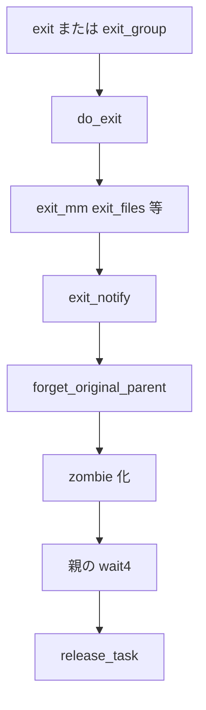

# 第4章 exit と wait

> **本章で読むソース**
>
> - [`kernel/exit.c` L898-L970](https://github.com/gregkh/linux/blob/v6.18.38/kernel/exit.c#L898-L970)
> - [`kernel/exit.c` L699-L731](https://github.com/gregkh/linux/blob/v6.18.38/kernel/exit.c#L699-L731)
> - [`kernel/exit.c` L738-L770](https://github.com/gregkh/linux/blob/v6.18.38/kernel/exit.c#L738-L770)
> - [`include/linux/sched.h` L110-L113](https://github.com/gregkh/linux/blob/v6.18.38/include/linux/sched.h#L110-L113)
> - [`kernel/exit.c` L244-L266](https://github.com/gregkh/linux/blob/v6.18.38/kernel/exit.c#L244-L266)
> - [`kernel/exit.c` L1902-L1913](https://github.com/gregkh/linux/blob/v6.18.38/kernel/exit.c#L1902-L1913)

## この章の狙い

タスク終了の `do_exit` と、親プロセスが子の終了を回収する `wait4` の連携を追う。

## 前提

[exec とプログラム実行](03-exec-program.md) を読んでいること。

## do_exit の段階的解放

`do_exit` は `PF_EXITING` を立て、スレッドグループの生存数を減らし、リソースを順次解放する。
最後にスケジューラへ制御を渡し、戻らない。

[`kernel/exit.c` L898-L970](https://github.com/gregkh/linux/blob/v6.18.38/kernel/exit.c#L898-L970)

```c
void __noreturn do_exit(long code)
{
	struct task_struct *tsk = current;
	struct kthread *kthread;
	int group_dead;

	WARN_ON(irqs_disabled());
	WARN_ON(tsk->plug);

	kthread = tsk_is_kthread(tsk);
	if (unlikely(kthread))
		kthread_do_exit(kthread, code);

	kcov_task_exit(tsk);
	kmsan_task_exit(tsk);

	synchronize_group_exit(tsk, code);
	ptrace_event(PTRACE_EVENT_EXIT, code);
	user_events_exit(tsk);

	io_uring_files_cancel();
	exit_signals(tsk);  /* sets PF_EXITING */

	seccomp_filter_release(tsk);

	acct_update_integrals(tsk);
	group_dead = atomic_dec_and_test(&tsk->signal->live);
	if (group_dead) {
		if (unlikely(is_global_init(tsk)))
			panic("Attempted to kill init! exitcode=0x%08x\n",
				tsk->signal->group_exit_code ?: (int)code);
	}
	acct_collect(code, group_dead);
	tsk->exit_code = code;
	taskstats_exit(tsk, group_dead);
	trace_sched_process_exit(tsk, group_dead);

	perf_event_exit_task(tsk);

	exit_mm();
```

`perf_event_exit_task` を `exit_mm` より前に置くのは、サンプリングが `mm` を触る use-after-free を避けるための正しさの順序である。

## forget_original_parent と reparent

親が先に死んだ子は `exit_notify` 内の `forget_original_parent` で新しい reaper へ引き取られる。
`find_new_reaper` で subreaper または init を選び、`reparent_leader` で子プロセス列を移す。

[`kernel/exit.c` L699-L731](https://github.com/gregkh/linux/blob/v6.18.38/kernel/exit.c#L699-L731)

```c
static void forget_original_parent(struct task_struct *father,
					struct list_head *dead)
{
	struct task_struct *p, *t, *reaper;

	if (unlikely(!list_empty(&father->ptraced)))
		exit_ptrace(father, dead);

	reaper = find_child_reaper(father, dead);
	if (list_empty(&father->children))
		return;

	reaper = find_new_reaper(father, reaper);
	list_for_each_entry(p, &father->children, sibling) {
		for_each_thread(p, t) {
			RCU_INIT_POINTER(t->real_parent, reaper);
			BUG_ON((!t->ptrace) != (rcu_access_pointer(t->parent) == father));
			if (likely(!t->ptrace))
				t->parent = t->real_parent;
			if (t->pdeath_signal)
				group_send_sig_info(t->pdeath_signal,
						    SEND_SIG_NOINFO, t,
						    PIDTYPE_TGID);
		}
		if (!same_thread_group(reaper, father))
			reparent_leader(father, p, dead);
	}
	list_splice_tail_init(&father->children, &reaper->children);
}
```

## exit_notify と zombie 化

[`kernel/exit.c` L738-L770](https://github.com/gregkh/linux/blob/v6.18.38/kernel/exit.c#L738-L770)

```c
static void exit_notify(struct task_struct *tsk, int group_dead)
{
	bool autoreap;
	struct task_struct *p, *n;
	LIST_HEAD(dead);

	write_lock_irq(&tasklist_lock);
	forget_original_parent(tsk, &dead);

	if (group_dead)
		kill_orphaned_pgrp(tsk->group_leader, NULL);

	tsk->exit_state = EXIT_ZOMBIE;

	if (unlikely(tsk->ptrace)) {
		int sig = thread_group_leader(tsk) &&
				thread_group_empty(tsk) &&
				!ptrace_reparented(tsk) ?
			tsk->exit_signal : SIGCHLD;
		autoreap = do_notify_parent(tsk, sig);
	} else if (thread_group_leader(tsk)) {
		autoreap = thread_group_empty(tsk) &&
			do_notify_parent(tsk, tsk->exit_signal);
	} else {
		autoreap = true;
		/* untraced sub-thread */
		do_notify_pidfd(tsk);
	}

	if (autoreap) {
		tsk->exit_state = EXIT_DEAD;
		list_add(&tsk->ptrace_entry, &dead);
	}
```

`exit_state` は `__state` とは別ビット集合である。

[`include/linux/sched.h` L110-L113](https://github.com/gregkh/linux/blob/v6.18.38/include/linux/sched.h#L110-L113)

```c
#define EXIT_DEAD			0x00000010
#define EXIT_ZOMBIE			0x00000020
#define EXIT_TRACE			(EXIT_ZOMBIE | EXIT_DEAD)
```

## release_task と wait4

親が `wait` すると `release_task` で `task_struct` が解放される。

[`kernel/exit.c` L244-L266](https://github.com/gregkh/linux/blob/v6.18.38/kernel/exit.c#L244-L266)

```c
void release_task(struct task_struct *p)
{
	struct release_task_post post;
	struct task_struct *leader;
	struct pid *thread_pid;
	int zap_leader;
repeat:
	memset(&post, 0, sizeof(post));

	rcu_read_lock();
	dec_rlimit_ucounts(task_ucounts(p), UCOUNT_RLIMIT_NPROC, 1);
	rcu_read_unlock();

	pidfs_exit(p);
	cgroup_release(p);

	thread_pid = task_pid(p);

	write_lock_irq(&tasklist_lock);
	ptrace_release_task(p);
```

[`kernel/exit.c` L1902-L1913](https://github.com/gregkh/linux/blob/v6.18.38/kernel/exit.c#L1902-L1913)

```c
SYSCALL_DEFINE4(wait4, pid_t, upid, int __user *, stat_addr,
		int, options, struct rusage __user *, ru)
{
	struct rusage r;
	long err = kernel_wait4(upid, stat_addr, options, ru ? &r : NULL);

	if (err > 0) {
		if (ru && copy_to_user(ru, &r, sizeof(struct rusage)))
			return -EFAULT;
	}
	return err;
}
```

**最適化の工夫**：`forget_original_parent` は全子の parent 更新後、`list_splice_tail_init` で children リスト自体の付け替えを各要素の再リンクなしに O(1) で行う。
走査後に追加の O(n) リスト移送を発生させない（reparent 全体の parent 更新走査は O(n) のまま）。

## 処理の流れ



## まとめ

終了はリソース解放、reparent、親への通知、zombie 期間、回収の流れで進む。
reparent は `forget_original_parent` から `find_new_reaper`、`reparent_leader` へ続く。

## 関連する章

- 前章：[exec とプログラム実行](03-exec-program.md)
- [__schedule とコンテキストスイッチ](../part01-core/06-schedule-context-switch.md)
- [PSI と統計](../part04-smp-obs/14-psi-stats.md)
