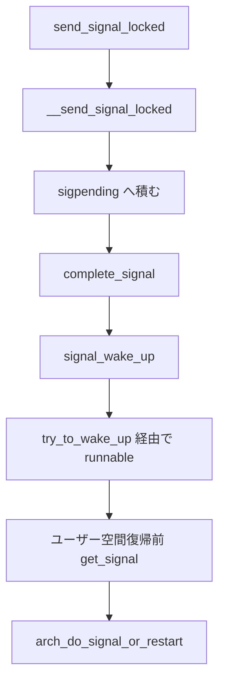
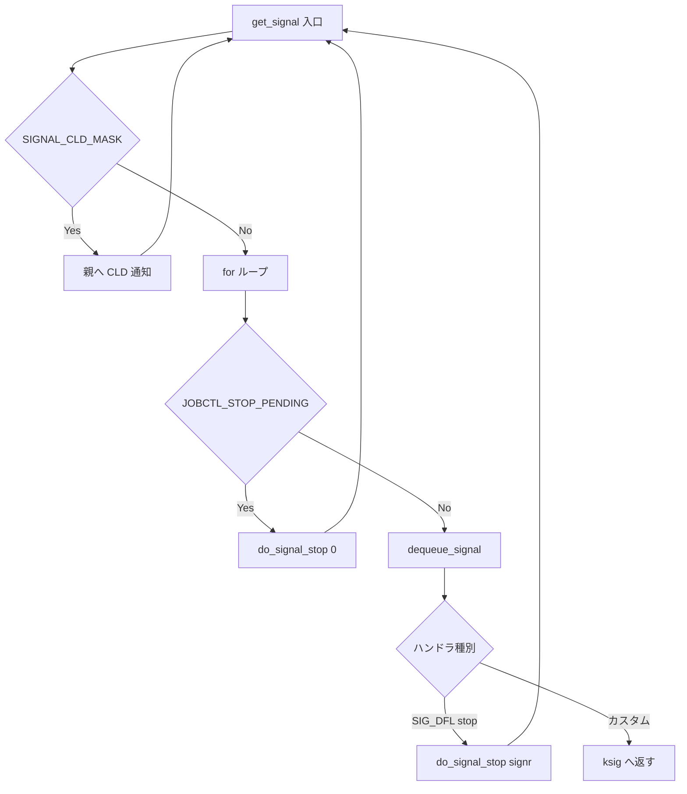

# 第5章 シグナル配送

> **本章で読むソース**
>
> - [`include/linux/signal_types.h` L32-L35](https://github.com/gregkh/linux/blob/v6.18.38/include/linux/signal_types.h#L32-L35)
> - [`kernel/signal.c` L1183-L1217](https://github.com/gregkh/linux/blob/v6.18.38/kernel/signal.c#L1183-L1217)
> - [`kernel/signal.c` L1042-L1157](https://github.com/gregkh/linux/blob/v6.18.38/kernel/signal.c#L1042-L1157)
> - [`kernel/signal.c` L946-L961](https://github.com/gregkh/linux/blob/v6.18.38/kernel/signal.c#L946-L961)
> - [`kernel/signal.c` L963-L1035](https://github.com/gregkh/linux/blob/v6.18.38/kernel/signal.c#L963-L1035)
> - [`kernel/signal.c` L721-L736](https://github.com/gregkh/linux/blob/v6.18.38/kernel/signal.c#L721-L736)
> - [`kernel/signal.c` L892-L932](https://github.com/gregkh/linux/blob/v6.18.38/kernel/signal.c#L892-L932)
> - [`kernel/signal.c` L2800-L2860](https://github.com/gregkh/linux/blob/v6.18.38/kernel/signal.c#L2800-L2860)
> - [`kernel/signal.c` L2881-L2883](https://github.com/gregkh/linux/blob/v6.18.38/kernel/signal.c#L2881-L2883)
> - [`kernel/signal.c` L2912-L2995](https://github.com/gregkh/linux/blob/v6.18.38/kernel/signal.c#L2912-L2995)
> - [`kernel/signal.c` L2551-L2607](https://github.com/gregkh/linux/blob/v6.18.38/kernel/signal.c#L2551-L2607)
> - [`kernel/entry/common.c` L19-L40](https://github.com/gregkh/linux/blob/v6.18.38/kernel/entry/common.c#L19-L40)

## この章の狙い

`kill` や `tgkill` からカーネル内部の `send_signal_locked` までを追い、sigpending キューへの積み上げ、`complete_signal` による wakeup、ユーザー空間復帰前の `get_signal` とハンドラ起動の接続を読む。
job control の stop と continue の基本も押さえる。
ptrace による配送の書き換えは補強計画 P2 の担当であり、本章では境界だけ示す。

## 前提

[exit と wait](04-exit-wait.md) を読んでいること。
`try_to_wake_up` による runnable 化は [try_to_wake_up と wakeup の中核](../part01-core/09-try-to-wake-up.md) の担当である。

## sigpending と配送キュー

**sigpending** は、タスクごとの未処理シグナル集合を表す。
`sigset_t signal` にビットマスクを持ち、リアルタイムシグナルや詳細な `siginfo` が必要な場合は `list` に `sigqueue` を積む。

[`include/linux/signal_types.h` L32-L35](https://github.com/gregkh/linux/blob/v6.18.38/include/linux/signal_types.h#L32-L35)

```c
struct sigpending {
	struct list_head list;
	sigset_t signal;
};
```

スレッドグループ共有のシグナルは `signal_struct::shared_pending` に積み、スレッド個別のものは `task_struct::pending` に積む。
`__send_signal_locked` は `type` に応じてキューを選ぶ。

## send_signal_locked から __send_signal_locked

`send_signal_locked` は `force` フラグを決めてから `__send_signal_locked` へ委譲する入口である。
`SIGKILL` と `SIGSTOP` は無視設定を貫通する必要があり、pid namespace の祖先からの配送や `SI_KERNEL` 由来は `force` になる。

[`kernel/signal.c` L1183-L1217](https://github.com/gregkh/linux/blob/v6.18.38/kernel/signal.c#L1183-L1217)

```c
int send_signal_locked(int sig, struct kernel_siginfo *info,
		       struct task_struct *t, enum pid_type type)
{
	/* Should SIGKILL or SIGSTOP be received by a pid namespace init? */
	bool force = false;

	if (info == SEND_SIG_NOINFO) {
		/* Force if sent from an ancestor pid namespace */
		force = !task_pid_nr_ns(current, task_active_pid_ns(t));
	} else if (info == SEND_SIG_PRIV) {
		/* Don't ignore kernel generated signals */
		force = true;
	} else if (has_si_pid_and_uid(info)) {
		// ... (中略) ...
		force = (info->si_code == SI_KERNEL);
		// ... (中略) ...
		if (!task_pid_nr_ns(current, task_active_pid_ns(t))) {
			info->si_pid = 0;
			force = true;
		}
	}
	return __send_signal_locked(sig, info, t, type, force);
}
```

`__send_signal_locked` は `sighand->siglock` 保持下で `prepare_signal` により無視判定を行い、legacy シグナルの重複を抑え、必要なら `sigqueue` を割り当てて `pending` に積む。
最後に `complete_signal` を呼ぶ。

[`kernel/signal.c` L1042-L1157](https://github.com/gregkh/linux/blob/v6.18.38/kernel/signal.c#L1042-L1157)

```c
static int __send_signal_locked(int sig, struct kernel_siginfo *info,
				struct task_struct *t, enum pid_type type, bool force)
{
	struct sigpending *pending;
	struct sigqueue *q;
	int override_rlimit;
	int ret = 0, result;

	lockdep_assert_held(&t->sighand->siglock);

	result = TRACE_SIGNAL_IGNORED;
	if (!prepare_signal(sig, t, force))
		goto ret;

	pending = (type != PIDTYPE_PID) ? &t->signal->shared_pending : &t->pending;
	// ... (中略) ...
	if ((sig == SIGKILL) || (t->flags & PF_KTHREAD))
		goto out_set;
	// ... (中略) ...
	q = sigqueue_alloc(sig, t, GFP_ATOMIC, override_rlimit);

	if (q) {
		list_add_tail(&q->list, &pending->list);
		// ... (中略) ...
	} else if (!is_si_special(info) &&
		   sig >= SIGRTMIN && info->si_code != SI_USER) {
		result = TRACE_SIGNAL_OVERFLOW_FAIL;
		ret = -EAGAIN;
		goto ret;
	}
	// ... (中略) ...

out_set:
	signalfd_notify(t, sig);
	sigaddset(&pending->signal, sig);
	// ... (中略) ...

	complete_signal(sig, t, type);
ret:
	trace_signal_generate(sig, info, t, type != PIDTYPE_PID, result);
	return ret;
}
```

**最適化の工夫**：`SIGKILL` とカーネルスレッド（`PF_KTHREAD`）では `sigqueue` 割り当てを省略し、`sigset` へのビットセットだけで済ませる。
リアルタイムシグナルほど詳細な `siginfo` が必要だが、`SIGKILL`（とカーネルスレッド宛て）ではキュー走査コストを省ける。

## wants_signal と complete_signal

共有 pending から配送するとき、どのスレッドを wakeup するかは `wants_signal` で決まる。
`blocked` に入っているシグナル、`PF_EXITING`、stopped または traced 状態のタスクは候補から外れる。
`SIGKILL` は常に許可され、それ以外は「実行中」か「まだ pending が無い」スレッドだけが選ばれる。

[`kernel/signal.c` L946-L961](https://github.com/gregkh/linux/blob/v6.18.38/kernel/signal.c#L946-L961)

```c
static inline bool wants_signal(int sig, struct task_struct *p)
{
	if (sigismember(&p->blocked, sig))
		return false;

	if (p->flags & PF_EXITING)
		return false;

	if (sig == SIGKILL)
		return true;

	if (task_is_stopped_or_traced(p))
		return false;

	return task_curr(p) || !task_sigpending(p);
}
```

`complete_signal` はまず提案ターゲット `p` を試し、ダメなら `signal->curr_target` から `next_thread` で巡回する。
どのスレッドも `wants_signal` を満たさなければ wakeup せず、キューに積んだまま各スレッドが後で dequeue する。

## complete_signal と wakeup

配送先スレッドがブロック中なら wakeup が必要である。
`complete_signal` は上記 `wants_signal` で受け取り可能なスレッドを選び、致命シグナルならグループ全体へ `SIGKILL` を波及させる。

[`kernel/signal.c` L963-L1035](https://github.com/gregkh/linux/blob/v6.18.38/kernel/signal.c#L963-L1035)

```c
static void complete_signal(int sig, struct task_struct *p, enum pid_type type)
{
	struct signal_struct *signal = p->signal;
	struct task_struct *t;

	if (wants_signal(sig, p))
		t = p;
	else if ((type == PIDTYPE_PID) || thread_group_empty(p))
		return;
	else {
		t = signal->curr_target;
		while (!wants_signal(sig, t)) {
			t = next_thread(t);
			if (t == signal->curr_target)
				return;
		}
		signal->curr_target = t;
	}

	if (sig_fatal(p, sig) &&
	    (signal->core_state || !(signal->flags & SIGNAL_GROUP_EXIT)) &&
	    !sigismember(&t->real_blocked, sig) &&
	    (sig == SIGKILL || !p->ptrace)) {
		if (!sig_kernel_coredump(sig)) {
			signal->flags = SIGNAL_GROUP_EXIT;
			signal->group_exit_code = sig;
			signal->group_stop_count = 0;
			__for_each_thread(signal, t) {
				task_clear_jobctl_pending(t, JOBCTL_PENDING_MASK);
				sigaddset(&t->pending.signal, SIGKILL);
				signal_wake_up(t, 1);
			}
			return;
		}
	}

	signal_wake_up(t, sig == SIGKILL);
	return;
}
```

`signal_wake_up` は `TIF_SIGPENDING` を立て、`wake_up_state` でスケジューラへ runnable 化を依頼する。
`SIGKILL` では `TASK_WAKEKILL` 相当の state を渡し、stopped 状態でも死亡処理へ進める。

[`kernel/signal.c` L721-L736](https://github.com/gregkh/linux/blob/v6.18.38/kernel/signal.c#L721-L736)

```c
void signal_wake_up_state(struct task_struct *t, unsigned int state)
{
	lockdep_assert_held(&t->sighand->siglock);

	set_tsk_thread_flag(t, TIF_SIGPENDING);

	if (!wake_up_state(t, state | TASK_INTERRUPTIBLE))
		kick_process(t);
}
```

### 配送から受信までの流れ



## get_signal とハンドラ起動

カーネルからユーザー空間へ戻る直前、`exit_to_user_mode_loop` が `_TIF_SIGPENDING` を見て `arch_do_signal_or_restart` を呼ぶ。
アーキテクチャ実装（x86 では `setup_rt_frame` 等）の詳細は本章の範囲外とし、共通入口だけ示す。

[`kernel/entry/common.c` L19-L40](https://github.com/gregkh/linux/blob/v6.18.38/kernel/entry/common.c#L19-L40)

```c
__always_inline unsigned long exit_to_user_mode_loop(struct pt_regs *regs,
						     unsigned long ti_work)
{
	/*
	 * Before returning to user space ensure that all pending work
	 * items have been completed.
	 */
	while (ti_work & EXIT_TO_USER_MODE_WORK) {

		local_irq_enable_exit_to_user(ti_work);

		if (ti_work & (_TIF_NEED_RESCHED | _TIF_NEED_RESCHED_LAZY))
			schedule();

		if (ti_work & _TIF_UPROBE)
			uprobe_notify_resume(regs);

		if (ti_work & _TIF_PATCH_PENDING)
			klp_update_patch_state(current);

		if (ti_work & (_TIF_SIGPENDING | _TIF_NOTIFY_SIGNAL))
			arch_do_signal_or_restart(regs);
```

`get_signal` は `sighand->siglock` 下の `for (;;)` ループで pending を処理する。
入口で `task_sigpending` を確認し、`SIGNAL_CLD_MASK` が立っていれば親へ `CLD_STOPPED` または `CLD_CONTINUED` を通知してからループへ戻る。
この通知は `prepare_signal(SIGCONT)` が `signal_set_stop_flags` で積んだフラグを消費する経路である。

[`kernel/signal.c` L2800-L2860](https://github.com/gregkh/linux/blob/v6.18.38/kernel/signal.c#L2800-L2860)

```c
bool get_signal(struct ksignal *ksig)
{
	struct sighand_struct *sighand = current->sighand;
	struct signal_struct *signal = current->signal;
	int signr;

	clear_notify_signal();
	if (unlikely(task_work_pending(current)))
		task_work_run();

	if (!task_sigpending(current))
		return false;

	if (unlikely(uprobe_deny_signal()))
		return false;

	try_to_freeze();

relock:
	spin_lock_irq(&sighand->siglock);

	if (unlikely(signal->flags & SIGNAL_CLD_MASK)) {
		int why;

		if (signal->flags & SIGNAL_CLD_CONTINUED)
			why = CLD_CONTINUED;
		else
			why = CLD_STOPPED;

		signal->flags &= ~SIGNAL_CLD_MASK;

		spin_unlock_irq(&sighand->siglock);

		read_lock(&tasklist_lock);
		do_notify_parent_cldstop(current, false, why);

		if (ptrace_reparented(current->group_leader))
			do_notify_parent_cldstop(current->group_leader,
						true, why);
		read_unlock(&tasklist_lock);

		goto relock;
	}
```

`SIGCONT` による実際の継続処理は配送時の `prepare_signal` で行われる。
全スレッドの stop キューを flush し、`JOBCTL_STOPPED` を解除して wakeup し、停止していたなら `SIGNAL_CLD_CONTINUED` を `signal_struct` に積む。

[`kernel/signal.c` L892-L932](https://github.com/gregkh/linux/blob/v6.18.38/kernel/signal.c#L892-L932)

```c
	} else if (sig == SIGCONT) {
		unsigned int why;
		/*
		 * Remove all stop signals from all queues, wake all threads.
		 */
		siginitset(&flush, SIG_KERNEL_STOP_MASK);
		flush_sigqueue_mask(p, &flush, &signal->shared_pending);
		for_each_thread(p, t) {
			flush_sigqueue_mask(p, &flush, &t->pending);
			task_clear_jobctl_pending(t, JOBCTL_STOP_PENDING);
			if (likely(!(t->ptrace & PT_SEIZED))) {
				t->jobctl &= ~JOBCTL_STOPPED;
				wake_up_state(t, __TASK_STOPPED);
			} else
				ptrace_trap_notify(t);
		}

		/*
		 * Notify the parent with CLD_CONTINUED if we were stopped.
		 *
		 * If we were in the middle of a group stop, we pretend it
		 * was already finished, and then continued. Since SIGCHLD
		 * doesn't queue we report only CLD_STOPPED, as if the next
		 * CLD_CONTINUED was dropped.
		 */
		why = 0;
		if (signal->flags & SIGNAL_STOP_STOPPED)
			why |= SIGNAL_CLD_CONTINUED;
		else if (signal->group_stop_count)
			why |= SIGNAL_CLD_STOPPED;

		if (why) {
			/*
			 * The first thread which returns from do_signal_stop()
			 * will take ->siglock, notice SIGNAL_CLD_MASK, and
			 * notify its parent. See get_signal().
			 */
			signal_set_stop_flags(signal, why | SIGNAL_STOP_CONTINUED);
			signal->group_stop_count = 0;
			signal->group_exit_code = 0;
		}
	}
```

ループ内では `JOBCTL_STOP_PENDING` が残っていれば `do_signal_stop(0)` でグループ停止を継続し、dequeue したシグナルがカスタムハンドラなら `ksig` に詰めて break する。
デフォルト動作の stop 系シグナルは `do_signal_stop(signr)` を呼ぶ。

[`kernel/signal.c` L2881-L2883](https://github.com/gregkh/linux/blob/v6.18.38/kernel/signal.c#L2881-L2883)

```c
		if (unlikely(current->jobctl & JOBCTL_STOP_PENDING) &&
		    do_signal_stop(0))
			goto relock;
```

[`kernel/signal.c` L2912-L2995](https://github.com/gregkh/linux/blob/v6.18.38/kernel/signal.c#L2912-L2995)

```c
		type = PIDTYPE_PID;
		signr = dequeue_synchronous_signal(&ksig->info);
		if (!signr)
			signr = dequeue_signal(&current->blocked, &ksig->info, &type);

		if (!signr)
			break; /* will return 0 */

		if (unlikely(current->ptrace) && (signr != SIGKILL) &&
		    !(sighand->action[signr -1].sa.sa_flags & SA_IMMUTABLE)) {
			signr = ptrace_signal(signr, &ksig->info, type);
			if (!signr)
				continue;
		}

		ka = &sighand->action[signr-1];

		/* Trace actually delivered signals. */
		trace_signal_deliver(signr, &ksig->info, ka);

		if (ka->sa.sa_handler == SIG_IGN) /* Do nothing.  */
			continue;
		if (ka->sa.sa_handler != SIG_DFL) {
			/* Run the handler.  */
			ksig->ka = *ka;

			if (ka->sa.sa_flags & SA_ONESHOT)
				ka->sa.sa_handler = SIG_DFL;

			break; /* will return non-zero "signr" value */
		}

		/*
		 * Now we are doing the default action for this signal.
		 */
		if (sig_kernel_ignore(signr)) /* Default is nothing. */
			continue;
		// ... (中略) ...
		if (sig_kernel_stop(signr)) {
			// ... (中略) ...
			if (signr != SIGSTOP) {
				spin_unlock_irq(&sighand->siglock);

				if (is_current_pgrp_orphaned())
					goto relock;

				spin_lock_irq(&sighand->siglock);
			}

			if (likely(do_signal_stop(signr))) {
				goto relock;
			}

			continue;
		}
```

ptrace 下では `ptrace_signal` が番号を書き換えるが、詳細は P2 で扱う。

### get_signal の処理の流れ



## job control の stop と continue

`SIGSTOP`、`SIGTSTP`、`SIGTTIN`、`SIGTTOU` は `sig_kernel_stop` として扱われ、デフォルト動作では `get_signal` ループから `do_signal_stop(signr)` が呼ばれる。
`SIGCONT` のキュー flush と wakeup は `prepare_signal` が配送時に行い、`get_signal` 冒頭はその結果として積まれた `SIGNAL_CLD_MASK` を消費して親へ通知する。

[`kernel/signal.c` L2551-L2607](https://github.com/gregkh/linux/blob/v6.18.38/kernel/signal.c#L2551-L2607)

```c
static bool do_signal_stop(int signr)
	__releases(&current->sighand->siglock)
{
	struct signal_struct *sig = current->signal;

	if (!(current->jobctl & JOBCTL_STOP_PENDING)) {
		unsigned long gstop = JOBCTL_STOP_PENDING | JOBCTL_STOP_CONSUME;
		struct task_struct *t;

		/* signr will be recorded in task->jobctl for retries */
		WARN_ON_ONCE(signr & ~JOBCTL_STOP_SIGMASK);

		if (!likely(current->jobctl & JOBCTL_STOP_DEQUEUED) ||
		    unlikely(sig->flags & SIGNAL_GROUP_EXIT) ||
		    unlikely(sig->group_exec_task))
			return false;
		/*
		 * There is no group stop already in progress.  We must
		 * initiate one now.
		 *
		 * While ptraced, a task may be resumed while group stop is
		 * still in effect and then receive a stop signal and
		 * initiate another group stop.  This deviates from the
		 * usual behavior as two consecutive stop signals can't
		 * cause two group stops when !ptraced.  That is why we
		 * also check !task_is_stopped(t) below.
		 *
		 * The condition can be distinguished by testing whether
		 * SIGNAL_STOP_STOPPED is already set.  Don't generate
		 * group_exit_code in such case.
		 *
		 * This is not necessary for SIGNAL_STOP_CONTINUED because
		 * an intervening stop signal is required to cause two
		 * continued events regardless of ptrace.
		 */
		if (!(sig->flags & SIGNAL_STOP_STOPPED))
			sig->group_exit_code = signr;

		sig->group_stop_count = 0;
		if (task_set_jobctl_pending(current, signr | gstop))
			sig->group_stop_count++;

		for_other_threads(current, t) {
			/*
			 * Setting state to TASK_STOPPED for a group
			 * stop is always done with the siglock held,
			 * so this check has no races.
			 */
			if (!task_is_stopped(t) &&
			    task_set_jobctl_pending(t, signr | gstop)) {
				sig->group_stop_count++;
				if (likely(!(t->ptrace & PT_SEIZED)))
					signal_wake_up(t, 0);
				else
					ptrace_trap_notify(t);
			}
		}
	}
```

orphaned プロセスグループでは `SIGTSTP` 系は黙殺され、`SIGSTOP` だけが効く。
ptrace 下では `JOBCTL_TRAP_STOP` が先行し、`do_signal_stop` は直接停止しない。

## まとめ

シグナル配送は `__send_signal_locked` で sigpending に積み、`complete_signal` が受信可能スレッドを選んで `signal_wake_up` する。
ユーザー空間復帰ループが `get_signal` を間接的に駆動し、ハンドラまたはデフォルト動作へ分岐する。
stop と continue は `jobctl` と `signal_struct` フラグでグループ単位に協調する。

## 関連する章

- [try_to_wake_up と wakeup の中核](../part01-core/09-try-to-wake-up.md)
- [__schedule とコンテキストスイッチ](../part01-core/08-schedule-context-switch.md)
- [exit と wait](04-exit-wait.md)
