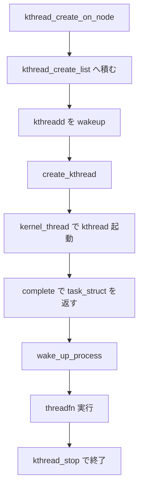

# 第6章 カーネルスレッド（kthread）

> **本章で読むソース**
>
> - [`kernel/kthread.c` L472-L521](https://github.com/gregkh/linux/blob/v6.18.38/kernel/kthread.c#L472-L521)
> - [`kernel/kthread.c` L447-L469](https://github.com/gregkh/linux/blob/v6.18.38/kernel/kthread.c#L447-L469)
> - [`kernel/kthread.c` L380-L435](https://github.com/gregkh/linux/blob/v6.18.38/kernel/kthread.c#L380-L435)
> - [`kernel/kthread.c` L786-L823](https://github.com/gregkh/linux/blob/v6.18.38/kernel/kthread.c#L786-L823)
> - [`kernel/kthread.c` L259-L291](https://github.com/gregkh/linux/blob/v6.18.38/kernel/kthread.c#L259-L291)
> - [`kernel/kthread.c` L702-L728](https://github.com/gregkh/linux/blob/v6.18.38/kernel/kthread.c#L702-L728)
> - [`kernel/kthread.c` L746-L765](https://github.com/gregkh/linux/blob/v6.18.38/kernel/kthread.c#L746-L765)
> - [`kernel/kthread.c` L618-L632](https://github.com/gregkh/linux/blob/v6.18.38/kernel/kthread.c#L618-L632)
> - [`kernel/smpboot.c` L102-L163](https://github.com/gregkh/linux/blob/v6.18.38/kernel/smpboot.c#L102-L163)
> - [`kernel/smpboot.c` L165-L207](https://github.com/gregkh/linux/blob/v6.18.38/kernel/smpboot.c#L165-L207)

## この章の狙い

`kthread_create` から `kthreadd` による実生成、`threadfn` の実行、`kthread_stop` と `kthread_park` による停止制御、per-CPU kthread（smpboot）までを追う。
カーネル内のバックグラウンド処理が、通常プロセスと同じ `task_struct` 上でどう動くかを押さえる。

## 前提

[fork とプロセス生成（copy_process）](02-fork-copy-process.md) と [シグナル配送](05-signal-delivery.md) を読んでいること。
kthread は `PF_KTHREAD` を持ち、シグナル配送の多くを省略する。

## kthread_create と kthreadd

`kthread_create_on_node` は `kthread_create_info` をリストに積み、`kthreadd` を wakeup してから `completion` で生成完了を待つ。
呼び出し側は `wake_up_process` または `kthread_stop` まで threadfn は走らない（初期状態は `TASK_UNINTERRUPTIBLE`）。

[`kernel/kthread.c` L472-L521](https://github.com/gregkh/linux/blob/v6.18.38/kernel/kthread.c#L472-L521)

```c
struct task_struct *__kthread_create_on_node(int (*threadfn)(void *data),
						    void *data, int node,
						    const char namefmt[],
						    va_list args)
{
	DECLARE_COMPLETION_ONSTACK(done);
	struct task_struct *task;
	struct kthread_create_info *create = kmalloc(sizeof(*create),
						     GFP_KERNEL);

	if (!create)
		return ERR_PTR(-ENOMEM);
	create->threadfn = threadfn;
	create->data = data;
	create->node = node;
	create->done = &done;
	create->full_name = kvasprintf(GFP_KERNEL, namefmt, args);
	// ... (中略) ...

	spin_lock(&kthread_create_lock);
	list_add_tail(&create->list, &kthread_create_list);
	spin_unlock(&kthread_create_lock);

	wake_up_process(kthreadd_task);
	// ... (中略) ...
	if (unlikely(wait_for_completion_killable(&done))) {
		// ... (中略) ...
		wait_for_completion(&done);
	}
	task = create->result;
free_create:
	kfree(create);
	return task;
}
```

`kthreadd` は専用カーネルスレッドで、リストから要求を取り出して `create_kthread` を呼ぶ。
`kernel_thread` で `kthread` エントリ関数を起動し、親である `kthreadd` はシグナルを無視する設定のまま子を生成する。

[`kernel/kthread.c` L786-L823](https://github.com/gregkh/linux/blob/v6.18.38/kernel/kthread.c#L786-L823)

```c
int kthreadd(void *unused)
{
	static const char comm[TASK_COMM_LEN] = "kthreadd";
	struct task_struct *tsk = current;

	set_task_comm(tsk, comm);
	ignore_signals(tsk);
	set_cpus_allowed_ptr(tsk, housekeeping_cpumask(HK_TYPE_KTHREAD));
	set_mems_allowed(node_states[N_MEMORY]);

	current->flags |= PF_NOFREEZE;
	cgroup_init_kthreadd();

	for (;;) {
		set_current_state(TASK_INTERRUPTIBLE);
		if (list_empty(&kthread_create_list))
			schedule();
		__set_current_state(TASK_RUNNING);

		spin_lock(&kthread_create_lock);
		while (!list_empty(&kthread_create_list)) {
			struct kthread_create_info *create;

			create = list_entry(kthread_create_list.next,
					    struct kthread_create_info, list);
			list_del_init(&create->list);
			spin_unlock(&kthread_create_lock);

			create_kthread(create);

			spin_lock(&kthread_create_lock);
		}
		spin_unlock(&kthread_create_lock);
	}

	return 0;
}
```

[`kernel/kthread.c` L447-L469](https://github.com/gregkh/linux/blob/v6.18.38/kernel/kthread.c#L447-L469)

```c
static void create_kthread(struct kthread_create_info *create)
{
	int pid;

#ifdef CONFIG_NUMA
	current->pref_node_fork = create->node;
#endif
	pid = kernel_thread(kthread, create, create->full_name,
			    CLONE_FS | CLONE_FILES | SIGCHLD);
	if (pid < 0) {
		struct completion *done = xchg(&create->done, NULL);

		kfree(create->full_name);
		if (!done) {
			kfree(create);
			return;
		}
		create->result = ERR_PTR(pid);
		complete(done);
	}
}
```

**最適化の工夫**：生成要求を `kthreadd` に集約し、`kernel_thread` の重い初期化を単一スレッドで直列化する。
呼び出し側は `completion` で結果だけ受け取り、fork 相当の作業を各サブシステムが重複実装しない。

## kthread エントリと threadfn

子スレッドの `kthread` 関数は、生成完了を `complete` したあと一度 `schedule` して停止状態を維持する。
`wake_up_process` 後に `threadfn` が走り、`kthread_should_stop` が立つまでループするのが典型パターンである。

[`kernel/kthread.c` L380-L435](https://github.com/gregkh/linux/blob/v6.18.38/kernel/kthread.c#L380-L435)

```c
static int kthread(void *_create)
{
	static const struct sched_param param = { .sched_priority = 0 };
	struct kthread_create_info *create = _create;
	int (*threadfn)(void *data) = create->threadfn;
	void *data = create->data;
	struct completion *done;
	struct kthread *self;
	int ret;

	self = to_kthread(current);
	// ... (中略) ...

	self->full_name = create->full_name;
	self->threadfn = threadfn;
	self->data = data;

	sched_setscheduler_nocheck(current, SCHED_NORMAL, &param);

	__set_current_state(TASK_UNINTERRUPTIBLE);
	create->result = current;
	preempt_disable();
	complete(done);
	schedule_preempt_disabled();
	preempt_enable();

	self->started = 1;

	if (!(current->flags & PF_NO_SETAFFINITY) && !self->preferred_affinity)
		kthread_affine_node();

	ret = -EINTR;
	if (!test_bit(KTHREAD_SHOULD_STOP, &self->flags)) {
		cgroup_kthread_ready();
		__kthread_parkme(self);
		ret = threadfn(data);
	}
	kthread_exit(ret);
}
```

`kthread` 構造体は `task_struct` の `worker_private` にぶら下がり、`KTHREAD_SHOULD_STOP` と `KTHREAD_SHOULD_PARK` フラグで寿命を制御する。

### 生成から実行までの流れ



## kthread_park と kthread_stop

`kthread_park` は `KTHREAD_SHOULD_PARK` を立てて対象を wakeup するだけであり、`TASK_PARKED` へ遷移するのは threadfn 側の協調である。
threadfn はループ内で `kthread_should_park()` を見て、必要なら `ht->park` 等の cleanup のあと `kthread_parkme()` を呼ぶ。
`kthread_parkme` は `TASK_PARKED` に入り `parked` completion を完了してから `schedule` する。

[`kernel/kthread.c` L259-L291](https://github.com/gregkh/linux/blob/v6.18.38/kernel/kthread.c#L259-L291)

```c
static void __kthread_parkme(struct kthread *self)
{
	for (;;) {
		/*
		 * TASK_PARKED is a special state; we must serialize against
		 * possible pending wakeups to avoid store-store collisions on
		 * task->state.
		 *
		 * Such a collision might possibly result in the task state
		 * changin from TASK_PARKED and us failing the
		 * wait_task_inactive() in kthread_park().
		 */
		set_special_state(TASK_PARKED);
		if (!test_bit(KTHREAD_SHOULD_PARK, &self->flags))
			break;

		/*
		 * Thread is going to call schedule(), do not preempt it,
		 * or the caller of kthread_park() may spend more time in
		 * wait_task_inactive().
		 */
		preempt_disable();
		complete(&self->parked);
		schedule_preempt_disabled();
		preempt_enable();
	}
	__set_current_state(TASK_RUNNING);
}

void kthread_parkme(void)
{
	__kthread_parkme(to_kthread(current));
}
```

呼び出し側の `kthread_park` はこの `parked` completion と `wait_task_inactive(TASK_PARKED)` で停止完了を待つ。

[`kernel/kthread.c` L702-L728](https://github.com/gregkh/linux/blob/v6.18.38/kernel/kthread.c#L702-L728)

```c
int kthread_park(struct task_struct *k)
{
	struct kthread *kthread = to_kthread(k);

	if (WARN_ON(k->flags & PF_EXITING))
		return -ENOSYS;

	if (WARN_ON_ONCE(test_bit(KTHREAD_SHOULD_PARK, &kthread->flags)))
		return -EBUSY;

	set_bit(KTHREAD_SHOULD_PARK, &kthread->flags);
	if (k != current) {
		wake_up_process(k);
		wait_for_completion(&kthread->parked);
		WARN_ON_ONCE(!wait_task_inactive(k, TASK_PARKED));
	}

	return 0;
}
```

`kthread_stop` は `KTHREAD_SHOULD_STOP` を立て、`kthread_unpark` で park 中のスレッドを起こしてから `exited` completion を待つ。
unpark 後に threadfn が `kthread_should_stop()` を検出し、`kthread_exit` へ進む。

[`kernel/kthread.c` L746-L765](https://github.com/gregkh/linux/blob/v6.18.38/kernel/kthread.c#L746-L765)

```c
int kthread_stop(struct task_struct *k)
{
	struct kthread *kthread;
	int ret;

	trace_sched_kthread_stop(k);

	get_task_struct(k);
	kthread = to_kthread(k);
	set_bit(KTHREAD_SHOULD_STOP, &kthread->flags);
	kthread_unpark(k);
	set_tsk_thread_flag(k, TIF_NOTIFY_SIGNAL);
	wake_up_process(k);
	wait_for_completion(&kthread->exited);
	ret = kthread->result;
	put_task_struct(k);

	trace_sched_kthread_stop_ret(ret);
	return ret;
}
```

park と stop は排他的ではない。
smpboot では生成直後に park し、対象 CPU が online になってから unpark する。

## per-CPU kthread と smpboot

`kthread_create_on_cpu` は指定 CPU に bind した kthread を作る。
`kthread_set_per_cpu` で `KTHREAD_IS_PER_CPU` を立て、ホットプラグ時の再 bind を追跡する。

[`kernel/kthread.c` L618-L632](https://github.com/gregkh/linux/blob/v6.18.38/kernel/kthread.c#L618-L632)

```c
struct task_struct *kthread_create_on_cpu(int (*threadfn)(void *data),
					  void *data, unsigned int cpu,
					  const char *namefmt)
{
	struct task_struct *p;

	p = kthread_create_on_node(threadfn, data, cpu_to_node(cpu), namefmt,
				   cpu);
	if (IS_ERR(p))
		return p;
	kthread_bind(p, cpu);
	to_kthread(p)->cpu = cpu;
	return p;
}
```

`smpboot` は migration thread や watchdog など、CPU ごとに1本の kthread を登録する仕組みである。
`__smpboot_create_thread` で生成したあと `kthread_park` し、CPU online 時に `kthread_unpark` する。
実際のループ本体は `smpboot_thread_fn` で、`kthread_should_park` と `kthread_parkme`、`ht->park` と `ht->unpark`、`ht->thread_should_run` と `ht->thread_fn` を回す。

[`kernel/smpboot.c` L102-L163](https://github.com/gregkh/linux/blob/v6.18.38/kernel/smpboot.c#L102-L163)

```c
static int smpboot_thread_fn(void *data)
{
	struct smpboot_thread_data *td = data;
	struct smp_hotplug_thread *ht = td->ht;

	while (1) {
		set_current_state(TASK_INTERRUPTIBLE);
		preempt_disable();
		if (kthread_should_stop()) {
			__set_current_state(TASK_RUNNING);
			preempt_enable();
			/* cleanup must mirror setup */
			if (ht->cleanup && td->status != HP_THREAD_NONE)
				ht->cleanup(td->cpu, cpu_online(td->cpu));
			kfree(td);
			return 0;
		}

		if (kthread_should_park()) {
			__set_current_state(TASK_RUNNING);
			preempt_enable();
			if (ht->park && td->status == HP_THREAD_ACTIVE) {
				BUG_ON(td->cpu != smp_processor_id());
				ht->park(td->cpu);
				td->status = HP_THREAD_PARKED;
			}
			kthread_parkme();
			/* We might have been woken for stop */
			continue;
		}

		BUG_ON(td->cpu != smp_processor_id());

		/* Check for state change setup */
		switch (td->status) {
		case HP_THREAD_NONE:
			__set_current_state(TASK_RUNNING);
			preempt_enable();
			if (ht->setup)
				ht->setup(td->cpu);
			td->status = HP_THREAD_ACTIVE;
			continue;

		case HP_THREAD_PARKED:
			__set_current_state(TASK_RUNNING);
			preempt_enable();
			if (ht->unpark)
				ht->unpark(td->cpu);
			td->status = HP_THREAD_ACTIVE;
			continue;
		}

		if (!ht->thread_should_run(td->cpu)) {
			preempt_enable_no_resched();
			schedule();
		} else {
			__set_current_state(TASK_RUNNING);
			preempt_enable();
			ht->thread_fn(td->cpu);
		}
	}
}
```

生成直後の park は `CONFIG_HOTPLUG_CPU` とは無関係に常に走る。
`ht->selfparking` が真のスレッドは自前で park するため、`smpboot_park_threads` は `kthread_park` を呼ばない点だけが登録オプションの差である。

[`kernel/smpboot.c` L165-L207](https://github.com/gregkh/linux/blob/v6.18.38/kernel/smpboot.c#L165-L207)

```c
static int
__smpboot_create_thread(struct smp_hotplug_thread *ht, unsigned int cpu)
{
	struct task_struct *tsk = *per_cpu_ptr(ht->store, cpu);
	struct smpboot_thread_data *td;

	if (tsk)
		return 0;

	td = kzalloc_node(sizeof(*td), GFP_KERNEL, cpu_to_node(cpu));
	if (!td)
		return -ENOMEM;
	td->cpu = cpu;
	td->ht = ht;

	tsk = kthread_create_on_cpu(smpboot_thread_fn, td, cpu,
				    ht->thread_comm);
	if (IS_ERR(tsk)) {
		kfree(td);
		return PTR_ERR(tsk);
	}
	kthread_set_per_cpu(tsk, cpu);
	kthread_park(tsk);
	get_task_struct(tsk);
	*per_cpu_ptr(ht->store, cpu) = tsk;
	if (ht->create) {
		if (!wait_task_inactive(tsk, TASK_PARKED))
			WARN_ON(1);
		else
			ht->create(cpu);
	}
	return 0;
}
```

## まとめ

kthread 生成は `kthreadd` に集約され、呼び出し側は `completion` で `task_struct` を受け取る。
`kthread_park` と `kthread_stop` が実行と停止の契約を分け、per-CPU 用途では smpboot が CPU ライフサイクルと連動する。

## 関連する章

- [fork とプロセス生成（copy_process）](02-fork-copy-process.md)
- [シグナル配送](05-signal-delivery.md)
- [try_to_wake_up と wakeup の中核](../part01-core/09-try-to-wake-up.md)
- [割り込みと時間：workqueue の構造](../../irq-time/part01-deferred/06-workqueue-structure.md)
