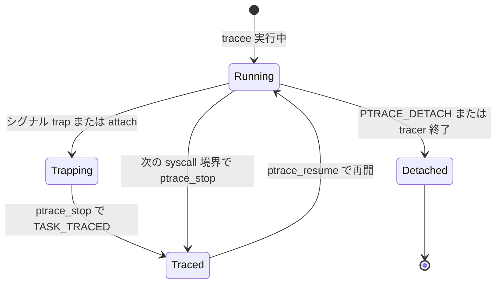

# 第7章 ptrace

> **本章で読むソース**
>
> - [`kernel/ptrace.c` L290-L357](https://github.com/gregkh/linux/blob/v6.18.38/kernel/ptrace.c#L290-L357)
> - [`kernel/ptrace.c` L419-L489](https://github.com/gregkh/linux/blob/v6.18.38/kernel/ptrace.c#L419-L489)
> - [`kernel/ptrace.c` L1146-L1188](https://github.com/gregkh/linux/blob/v6.18.38/kernel/ptrace.c#L1146-L1188)
> - [`kernel/ptrace.c` L1324-L1338](https://github.com/gregkh/linux/blob/v6.18.38/kernel/ptrace.c#L1324-L1338)
> - [`kernel/ptrace.c` L1397-L1431](https://github.com/gregkh/linux/blob/v6.18.38/kernel/ptrace.c#L1397-L1431)
> - [`kernel/signal.c` L2350-L2405](https://github.com/gregkh/linux/blob/v6.18.38/kernel/signal.c#L2350-L2405)
> - [`kernel/signal.c` L2475-L2498](https://github.com/gregkh/linux/blob/v6.18.38/kernel/signal.c#L2475-L2498)
> - [`include/linux/sched/jobctl.h` L25-L25](https://github.com/gregkh/linux/blob/v6.18.38/include/linux/sched/jobctl.h#L25-L25)

## この章の狙い

`ptrace` システムコールが tracer と tracee をどう結び、attach から停止、再開、リクエスト dispatch までを追う。
`ptrace_stop` が `TASK_TRACED` と `JOBCTL_TRACED` を立てる経路と、[シグナル配送](05-signal-delivery.md) の `ptrace_signal` との接続を押さえる。
LSM の `security_ptrace_access_check` が UID 判定のあとに掛かる境界も示す。

## 前提

[シグナル配送](05-signal-delivery.md) で `ptrace_signal` と job control の基本を読んでいること。
システムコール入口の trace フックは [全体像と横断基盤の entry-common](../../foundation/part02-syscall/07-entry-64-syscall-entry-exit.md) が扱う。

## アクセス権と LSM の境界

`__ptrace_may_access` は attach と `/proc` の機密読み取りの両方で使われる。
同一スレッドグループなら即許可し、それ以外は UID と GID の一致、または `CAP_SYS_PTRACE` を確認する。
最後に `task_still_dumpable` で dump 可否を見たあと、`security_ptrace_access_check` へ委譲する。

[`kernel/ptrace.c` L290-L357](https://github.com/gregkh/linux/blob/v6.18.38/kernel/ptrace.c#L290-L357)

```c
static int __ptrace_may_access(struct task_struct *task, unsigned int mode)
{
	const struct cred *cred = current_cred(), *tcred;
	kuid_t caller_uid;
	kgid_t caller_gid;

	if (!(mode & PTRACE_MODE_FSCREDS) == !(mode & PTRACE_MODE_REALCREDS)) {
		WARN(1, "denying ptrace access check without PTRACE_MODE_*CREDS\n");
		return -EPERM;
	}

	/* May we inspect the given task?
	 * This check is used both for attaching with ptrace
	 * and for allowing access to sensitive information in /proc.
	 *
	 * ptrace_attach denies several cases that /proc allows
	 * because setting up the necessary parent/child relationship
	 * or halting the specified task is impossible.
	 */

	/* Don't let security modules deny introspection */
	if (same_thread_group(task, current))
		return 0;
	rcu_read_lock();
	if (mode & PTRACE_MODE_FSCREDS) {
		caller_uid = cred->fsuid;
		caller_gid = cred->fsgid;
	} else {
		// ... (中略) ...
		caller_uid = cred->uid;
		caller_gid = cred->gid;
	}
	tcred = __task_cred(task);
	if (uid_eq(caller_uid, tcred->euid) &&
	    uid_eq(caller_uid, tcred->suid) &&
	    uid_eq(caller_uid, tcred->uid)  &&
	    gid_eq(caller_gid, tcred->egid) &&
	    gid_eq(caller_gid, tcred->sgid) &&
	    gid_eq(caller_gid, tcred->gid))
		goto ok;
	if (ptrace_has_cap(tcred->user_ns, mode))
		goto ok;
	rcu_read_unlock();
	return -EPERM;
ok:
	rcu_read_unlock();
	// ... (中略) ...
	smp_rmb();
	if (!task_still_dumpable(task, mode))
		return -EPERM;

	return security_ptrace_access_check(task, mode);
}
```

## ptrace_attach と tracee の初期停止

`PTRACE_ATTACH` と `PTRACE_SEIZE` は `ptrace_attach` に集約される。
`cred_guard_mutex` で exec 中の credential 計算と競合しないよう保護し、`tasklist_lock` 下で `task->ptrace` に `PT_PTRACED`（seize 時は `PT_SEIZED` も）を立て、`ptrace_link` で tracer を `parent` に差し替える。
`ptrace_set_stopped` が group stop 状態を trap 用に整え、`wait_on_bit(JOBCTL_TRAPPING)` で tracee が `TASK_TRACED` に入るまで tracer を待たせる。

[`kernel/ptrace.c` L419-L489](https://github.com/gregkh/linux/blob/v6.18.38/kernel/ptrace.c#L419-L489)

```c
static int ptrace_attach(struct task_struct *task, long request,
			 unsigned long addr,
			 unsigned long flags)
{
	bool seize = (request == PTRACE_SEIZE);
	int retval;

	if (seize) {
		if (addr != 0)
			return -EIO;
		// ... (中略) ...
		flags = PT_PTRACED | PT_SEIZED | (flags << PT_OPT_FLAG_SHIFT);
	} else {
		flags = PT_PTRACED;
	}

	audit_ptrace(task);

	if (unlikely(task->flags & PF_KTHREAD))
		return -EPERM;
	if (same_thread_group(task, current))
		return -EPERM;

	scoped_cond_guard (mutex_intr, return -ERESTARTNOINTR,
			   &task->signal->cred_guard_mutex) {

		scoped_guard (task_lock, task) {
			retval = __ptrace_may_access(task, PTRACE_MODE_ATTACH_REALCREDS);
			if (retval)
				return retval;
		}

		scoped_guard (write_lock_irq, &tasklist_lock) {
			if (unlikely(task->exit_state))
				return -EPERM;
			if (task->ptrace)
				return -EPERM;

			task->ptrace = flags;
			ptrace_link(task, current);
			ptrace_set_stopped(task, seize);
		}
	}

	wait_on_bit(&task->jobctl, JOBCTL_TRAPPING_BIT, TASK_KILLABLE);
	proc_ptrace_connector(task, PTRACE_ATTACH);

	return 0;
}
```

## ptrace_stop と TASK_TRACED

tracee が trap に入る本体は `kernel/signal.c` の `ptrace_stop` である。
`JOBCTL_TRACED_BIT` は jobctl 上で ptrace 停止を表す（`include/linux/sched/jobctl.h`）。
`set_special_state(TASK_TRACED)` と `JOBCTL_TRACED` を立て、`exit_code` と `ptrace_message` を tracer 向けに保存してから `schedule()` でスリープする。
復帰後は `recalc_sigpending_tsk` で停止中に積まれたシグナルを再評価する。

[`kernel/signal.c` L2350-L2405](https://github.com/gregkh/linux/blob/v6.18.38/kernel/signal.c#L2350-L2405)

```c
static int ptrace_stop(int exit_code, int why, unsigned long message,
		       kernel_siginfo_t *info)
	__releases(&current->sighand->siglock)
	__acquires(&current->sighand->siglock)
{
	bool gstop_done = false;

	if (arch_ptrace_stop_needed()) {
		// ... (中略) ...
		spin_unlock_irq(&current->sighand->siglock);
		arch_ptrace_stop();
		spin_lock_irq(&current->sighand->siglock);
	}

	// ... (中略) ...

	if (!current->ptrace || __fatal_signal_pending(current))
		return exit_code;

	set_special_state(TASK_TRACED);
	current->jobctl |= JOBCTL_TRACED;

	// ... (中略) ...

	smp_wmb();

	current->ptrace_message = message;
	current->last_siginfo = info;
	current->exit_code = exit_code;
```

[`kernel/signal.c` L2475-L2498](https://github.com/gregkh/linux/blob/v6.18.38/kernel/signal.c#L2475-L2498)

```c
	schedule();
	cgroup_leave_frozen(true);

	// ... (中略) ...

	spin_lock_irq(&current->sighand->siglock);
	exit_code = current->exit_code;
	current->last_siginfo = NULL;
	current->ptrace_message = 0;
	current->exit_code = 0;

	/* LISTENING can be set only during STOP traps, clear it */
	current->jobctl &= ~(JOBCTL_LISTENING | JOBCTL_PTRACE_FROZEN);

	// ... (中略) ...

	recalc_sigpending_tsk(current);
	return exit_code;
```

## ptrace システムコールの dispatch

`SYSCALL_DEFINE4(ptrace)` は `PTRACE_TRACEME` を自プロセスに `PT_PTRACED` を立てる経路、`PTRACE_ATTACH` と `PTRACE_SEIZE` を `ptrace_attach` へ渡す経路、その他を `ptrace_check_attach` のあと `arch_ptrace` と `ptrace_request` へ振り分ける。
アーキテクチャ固有のレジスタ操作は `arch_ptrace`、共通リクエストは `ptrace_request` の `switch` が担う。

[`kernel/ptrace.c` L1397-L1431](https://github.com/gregkh/linux/blob/v6.18.38/kernel/ptrace.c#L1397-L1431)

```c
SYSCALL_DEFINE4(ptrace, long, request, long, pid, unsigned long, addr,
		unsigned long, data)
{
	struct task_struct *child;
	long ret;

	if (request == PTRACE_TRACEME) {
		ret = ptrace_traceme();
		goto out;
	}

	child = find_get_task_by_vpid(pid);
	if (!child) {
		ret = -ESRCH;
		goto out;
	}

	if (request == PTRACE_ATTACH || request == PTRACE_SEIZE) {
		ret = ptrace_attach(child, request, addr, data);
		goto out_put_task_struct;
	}

	ret = ptrace_check_attach(child, request == PTRACE_KILL ||
				  request == PTRACE_INTERRUPT);
	if (ret < 0)
		goto out_put_task_struct;

	ret = arch_ptrace(child, request, addr, data);
	if (ret || request != PTRACE_DETACH)
		ptrace_unfreeze_traced(child);

 out_put_task_struct:
	put_task_struct(child);
 out:
	return ret;
}
```

## ptrace_request の主要分岐

`ptrace_request` はメモリ peek と poke、オプション設定、シグナル操作、`PTRACE_CONT` 系の再開をまとめる。
`PTRACE_CONT` と `PTRACE_SINGLESTEP`、`PTRACE_SYSCALL` は `ptrace_resume` に委譲し、tracee の `exit_code` を配送シグナル番号として消費する。
`PTRACE_KILL` は `SIGKILL` を tracee へ送るだけで、停止状態の解除は別経路に任せる。

[`kernel/ptrace.c` L1146-L1188](https://github.com/gregkh/linux/blob/v6.18.38/kernel/ptrace.c#L1146-L1188)

```c
int ptrace_request(struct task_struct *child, long request,
		   unsigned long addr, unsigned long data)
{
	bool seized = child->ptrace & PT_SEIZED;
	int ret = -EIO;
	kernel_siginfo_t siginfo, *si;
	void __user *datavp = (void __user *) data;
	unsigned long __user *datalp = datavp;
	unsigned long flags;

	switch (request) {
	case PTRACE_PEEKTEXT:
	case PTRACE_PEEKDATA:
		return generic_ptrace_peekdata(child, addr, data);
	case PTRACE_POKETEXT:
	case PTRACE_POKEDATA:
		return generic_ptrace_pokedata(child, addr, data);

#ifdef PTRACE_OLDSETOPTIONS
	case PTRACE_OLDSETOPTIONS:
#endif
	case PTRACE_SETOPTIONS:
		ret = ptrace_setoptions(child, data);
		break;
	case PTRACE_GETEVENTMSG:
		ret = put_user(child->ptrace_message, datalp);
		break;

	case PTRACE_PEEKSIGINFO:
		ret = ptrace_peek_siginfo(child, addr, data);
		break;

	case PTRACE_GETSIGINFO:
		ret = ptrace_getsiginfo(child, &siginfo);
		if (!ret)
			ret = copy_siginfo_to_user(datavp, &siginfo);
		break;
```

[`kernel/ptrace.c` L1324-L1338](https://github.com/gregkh/linux/blob/v6.18.38/kernel/ptrace.c#L1324-L1338)

```c
	case PTRACE_SINGLESTEP:
#ifdef PTRACE_SINGLEBLOCK
	case PTRACE_SINGLEBLOCK:
#endif
#ifdef PTRACE_SYSEMU
	case PTRACE_SYSEMU:
	case PTRACE_SYSEMU_SINGLESTEP:
#endif
	case PTRACE_SYSCALL:
	case PTRACE_CONT:
		return ptrace_resume(child, request, data);

	case PTRACE_KILL:
		send_sig_info(SIGKILL, SEND_SIG_NOINFO, child);
		return 0;
```

## 状態遷移の流れ



attach 直後は `JOBCTL_TRAPPING` ビットで tracer の `wait_on_bit` と tracee の `ptrace_stop` が握り合う。
`PTRACE_SYSCALL` は `ptrace_resume` で tracee を `TASK_RUNNING` に戻し、次の syscall 境界で再び `ptrace_stop` が `TASK_TRACED` を立てる。
シグナル配送経路では [第5章](05-signal-delivery.md) の `get_signal` 内 `ptrace_signal` が番号を書き換えてから `ptrace_stop` へ入る。

## 高速化と最適化の工夫

ptrace の hot path 自体はデバッガ向けであり、スループット最適化の対象ではない。
`TASK_TRACED` は `do_notify_parent_cldstop` による通知より前に `ptrace_stop` 内で既に設定される。
一方、`ptrace_stop` 末尾の `preempt_disable` と `preempt_enable_no_resched` は、tracee が `schedule()` で runqueue から外れるまでプリエンプトさせない同期である。
通知で起きた ptracer が `wait_task_inactive` で tracee をまだ runqueue 上と見て 1 HZ スリープする事態を避ける（`CONFIG_PREEMPT_RT` では無効）。

> **7.x 系での変化**
> `ptrace.c` は v6.18.38 から v7.1.3 で約13行の差分にとどまる（`autoreap` 時の `ignoring_children` 判定追加、RSEQ フィールド名の整理など）。
> attach と `ptrace_stop` の骨格は同じであり、本章の実行経路は 7.1.3 でもそのまま追える。

## まとめ

- **ptrace_attach** は権限確認のあと `task->ptrace` と tracer リンクを確立し、tracee を trap 状態へ送る。
- **ptrace_stop** が `TASK_TRACED` と jobctl フラグを更新し、`schedule()` で tracer の操作を待つ。
- **ptrace** システムコールは attach 系と `ptrace_request` に振り分け、シグナル章の配送書き換えと接続する。
- **security_ptrace_access_check** が UID 判定の外側で LSM ポリシーを適用する。

## 関連する章

- [シグナル配送](05-signal-delivery.md)
- [exit と wait](04-exit-wait.md)
- [全体像と横断基盤：entry_64.S の入口と出口](../../foundation/part02-syscall/07-entry-64-syscall-entry-exit.md)
