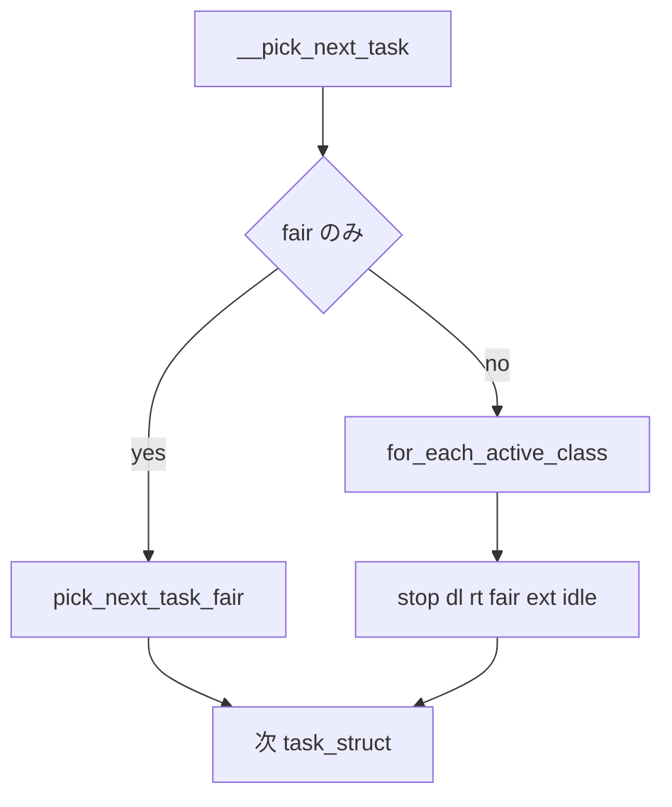

# 第5章 ランキューとスケジューリングクラスの階層

> **本章で読むソース**
>
> - [`kernel/sched/sched.h` L2405-L2476](https://github.com/gregkh/linux/blob/v6.18.38/kernel/sched/sched.h#L2405-L2476)
> - [`kernel/sched/sched.h` L2543-L2565](https://github.com/gregkh/linux/blob/v6.18.38/kernel/sched/sched.h#L2543-L2565)
> - [`kernel/sched/core.c` L8634-L8641](https://github.com/gregkh/linux/blob/v6.18.38/kernel/sched/core.c#L8634-L8641)
> - [`kernel/sched/core.c` L5961-L6011](https://github.com/gregkh/linux/blob/v6.18.38/kernel/sched/core.c#L5961-L6011)
> - [`kernel/sched/ext.c` L3342-L3354](https://github.com/gregkh/linux/blob/v6.18.38/kernel/sched/ext.c#L3342-L3354)
> - [`kernel/sched/fair.c` L13983-L14009](https://github.com/gregkh/linux/blob/v6.18.38/kernel/sched/fair.c#L13983-L14009)

## この章の狙い

per-CPU **ランキュー** `rq` と、優先度順に連なる `sched_class` の階層を押さえる。

## 前提

[第1章 task_struct の構造](../part00-process/01-task-struct.md) を読んでいること。

## sched_class の仮想関数

各クラスは `sched_class` が定義する任意 callback のうち、必要なものだけを実装する。
idle class は enqueue を持たず、pick も `pick_task` と `pick_next_task` のどちらか一方を使う。

[`kernel/sched/sched.h` L2405-L2476](https://github.com/gregkh/linux/blob/v6.18.38/kernel/sched/sched.h#L2405-L2476)

```c
struct sched_class {

#ifdef CONFIG_UCLAMP_TASK
	int uclamp_enabled;
#endif

	void (*enqueue_task) (struct rq *rq, struct task_struct *p, int flags);
	bool (*dequeue_task) (struct rq *rq, struct task_struct *p, int flags);
	void (*yield_task)   (struct rq *rq);
	bool (*yield_to_task)(struct rq *rq, struct task_struct *p);

	void (*wakeup_preempt)(struct rq *rq, struct task_struct *p, int flags);

	int (*balance)(struct rq *rq, struct task_struct *prev, struct rq_flags *rf);
	struct task_struct *(*pick_task)(struct rq *rq);
	struct task_struct *(*pick_next_task)(struct rq *rq, struct task_struct *prev);

	void (*put_prev_task)(struct rq *rq, struct task_struct *p, struct task_struct *next);
	void (*set_next_task)(struct rq *rq, struct task_struct *p, bool first);

	int  (*select_task_rq)(struct task_struct *p, int task_cpu, int flags);

	void (*migrate_task_rq)(struct task_struct *p, int new_cpu);

	void (*task_woken)(struct rq *this_rq, struct task_struct *task);

	void (*set_cpus_allowed)(struct task_struct *p, struct affinity_context *ctx);

	void (*rq_online)(struct rq *rq);
	void (*rq_offline)(struct rq *rq);

	struct rq *(*find_lock_rq)(struct task_struct *p, struct rq *rq);

	void (*task_tick)(struct rq *rq, struct task_struct *p, int queued);
	void (*task_fork)(struct task_struct *p);
	void (*task_dead)(struct task_struct *p);

	void (*switching_to) (struct rq *this_rq, struct task_struct *task);
	void (*switched_from)(struct rq *this_rq, struct task_struct *task);
	void (*switched_to)  (struct rq *this_rq, struct task_struct *task);
	void (*reweight_task)(struct rq *this_rq, struct task_struct *task,
			      const struct load_weight *lw);
	void (*prio_changed) (struct rq *this_rq, struct task_struct *task,
			      int oldprio);

	unsigned int (*get_rr_interval)(struct rq *rq,
					struct task_struct *task);

	void (*update_curr)(struct rq *rq);

#ifdef CONFIG_FAIR_GROUP_SCHED
	void (*task_change_group)(struct task_struct *p);
#endif

#ifdef CONFIG_SCHED_CORE
	int (*task_is_throttled)(struct task_struct *p, int cpu);
#endif
};
```

## クラス順序と sched_ext

`sched_init` の BUG_ON 群が示すとおり、優先度は stop、dl、rt、fair、ext、idle の順である。
`CONFIG_SCHED_CLASS_EXT` 有効時、fair と ext の間に ext クラスが挟まる。

[`kernel/sched/core.c` L8634-L8641](https://github.com/gregkh/linux/blob/v6.18.38/kernel/sched/core.c#L8634-L8641)

```c
	BUG_ON(!sched_class_above(&stop_sched_class, &dl_sched_class));
	BUG_ON(!sched_class_above(&dl_sched_class, &rt_sched_class));
	BUG_ON(!sched_class_above(&rt_sched_class, &fair_sched_class));
	BUG_ON(!sched_class_above(&fair_sched_class, &idle_sched_class));
#ifdef CONFIG_SCHED_CLASS_EXT
	BUG_ON(!sched_class_above(&fair_sched_class, &ext_sched_class));
	BUG_ON(!sched_class_above(&ext_sched_class, &idle_sched_class));
#endif
```

`next_active_class` は SCX が fair を全置換したとき fair を飛ばし、SCX 無効時は ext を飛ばす。

[`kernel/sched/sched.h` L2543-L2565](https://github.com/gregkh/linux/blob/v6.18.38/kernel/sched/sched.h#L2543-L2565)

```c
static inline const struct sched_class *next_active_class(const struct sched_class *class)
{
	class++;
#ifdef CONFIG_SCHED_CLASS_EXT
	if (scx_switched_all() && class == &fair_sched_class)
		class++;
	if (!scx_enabled() && class == &ext_sched_class)
		class++;
#endif
	return class;
}

#define for_active_class_range(class, _from, _to)				\
	for (class = (_from); class != (_to); class = next_active_class(class))

#define for_each_active_class(class)						\
	for_active_class_range(class, __sched_class_highest, __sched_class_lowest)
```

## ext_sched_class

BPF ベースの sched_ext が有効なとき、fair タスクの一部または全部を ext クラスが引き受ける。

[`kernel/sched/ext.c` L3342-L3354](https://github.com/gregkh/linux/blob/v6.18.38/kernel/sched/ext.c#L3342-L3354)

```c
DEFINE_SCHED_CLASS(ext) = {
	.enqueue_task		= enqueue_task_scx,
	.dequeue_task		= dequeue_task_scx,
	.yield_task		= yield_task_scx,
	.yield_to_task		= yield_to_task_scx,

	.wakeup_preempt		= wakeup_preempt_scx,

	.balance		= balance_scx,
	.pick_task		= pick_task_scx,

	.put_prev_task		= put_prev_task_scx,
	.set_next_task		= set_next_task_scx,
```

## __pick_next_task

[`kernel/sched/core.c` L5961-L6011](https://github.com/gregkh/linux/blob/v6.18.38/kernel/sched/core.c#L5961-L6011)

```c
static inline struct task_struct *
__pick_next_task(struct rq *rq, struct task_struct *prev, struct rq_flags *rf)
{
	const struct sched_class *class;
	struct task_struct *p;

	rq->dl_server = NULL;

	if (scx_enabled())
		goto restart;

	if (likely(!sched_class_above(prev->sched_class, &fair_sched_class) &&
		   rq->nr_running == rq->cfs.h_nr_queued)) {

		p = pick_next_task_fair(rq, prev, rf);
		if (unlikely(p == RETRY_TASK))
			goto restart;

		if (!p) {
			p = pick_task_idle(rq);
			put_prev_set_next_task(rq, prev, p);
		}

		return p;
	}

restart:
	prev_balance(rq, prev, rf);

	for_each_active_class(class) {
		if (class->pick_next_task) {
			p = class->pick_next_task(rq, prev);
			if (p)
				return p;
		} else {
			p = class->pick_task(rq);
			if (p) {
				put_prev_set_next_task(rq, prev, p);
				return p;
			}
		}
	}

	BUG(); /* The idle class should always have a runnable task. */
}
```

**最適化の工夫**：fair のみ Runnable の fast path は general class ループを省略する。
`RETRY_TASK` は load balance 後の再試行を示す sentinel である。

> **7.x 系での変化**
> [`kernel/sched/core.c` L6003-L6049](https://github.com/gregkh/linux/blob/v7.1.3/kernel/sched/core.c#L6003-L6049) では `pick_task` と `pick_next_task` が `rq_flags *rf` を受け取る。
> general path でも `RETRY_TASK` を処理する。
> [`kernel/sched/fair.c` L14207-L14232](https://github.com/gregkh/linux/blob/v7.1.3/kernel/sched/fair.c#L14207-L14232) から fair の `balance` callback が削除される。
> [`kernel/sched/core.c` L5981-L5999](https://github.com/gregkh/linux/blob/v7.1.3/kernel/sched/core.c#L5981-L5999) の `prev_balance` は `class->balance` を持つクラスだけを呼ぶ。
> fair の new-idle balance は [`kernel/sched/fair.c` L9295-L9309](https://github.com/gregkh/linux/blob/v7.1.3/kernel/sched/fair.c#L9295-L9309) の `pick_next_task_fair` 内 `sched_balance_newidle` へ移る。

## fair_sched_class

[`kernel/sched/fair.c` L13983-L14009](https://github.com/gregkh/linux/blob/v6.18.38/kernel/sched/fair.c#L13983-L14009)

```c
DEFINE_SCHED_CLASS(fair) = {

	.enqueue_task		= enqueue_task_fair,
	.dequeue_task		= dequeue_task_fair,
	.yield_task		= yield_task_fair,
	.yield_to_task		= yield_to_task_fair,

	.wakeup_preempt		= check_preempt_wakeup_fair,

	.pick_task		= pick_task_fair,
	.pick_next_task		= __pick_next_task_fair,
	.put_prev_task		= put_prev_task_fair,
	.set_next_task          = set_next_task_fair,

	.balance		= balance_fair,
	.select_task_rq		= select_task_rq_fair,
	.migrate_task_rq	= migrate_task_rq_fair,
```

## 処理の流れ



## まとめ

スケジューラはクラスごとにキュー操作を分割し、`__pick_next_task` が優先度順に統合する。
ext クラスは fair と idle の間に位置し、SCX 有効時だけ走査対象になる。

## 関連する章

- [__schedule とコンテキストスイッチ](06-schedule-context-switch.md)
- [enqueue と dequeue と pick_next_task](../part02-eevdf/10-enqueue-dequeue-pick.md)
