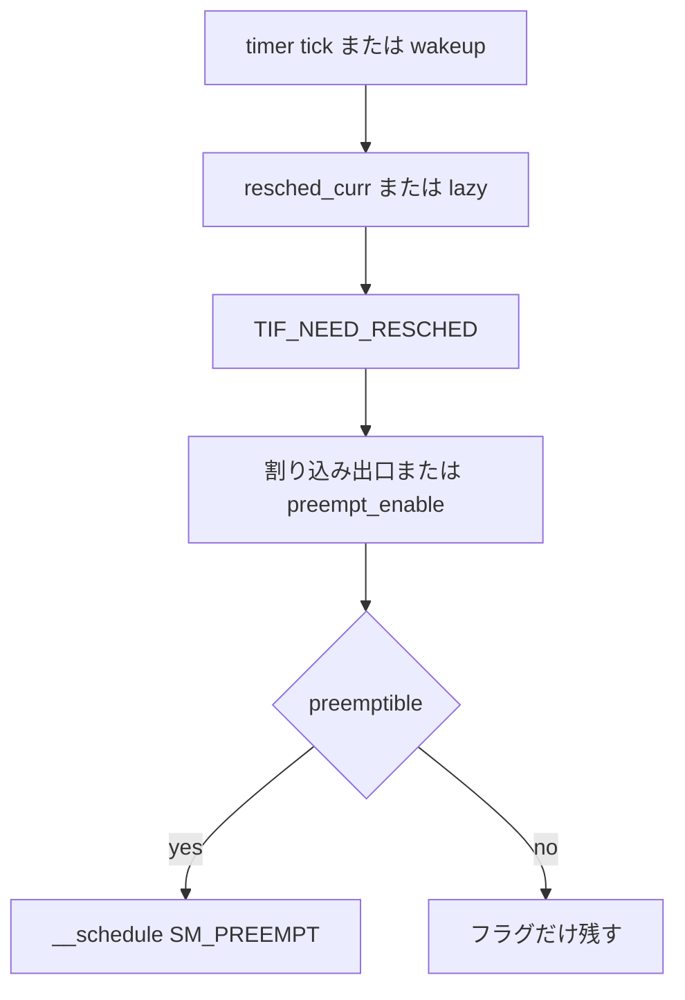

# 第7章 プリエンプションモデル（PREEMPT_NONE から PREEMPT_LAZY まで）

> **本章で読むソース**
>
> - [`kernel/Kconfig.preempt` L17-L87](https://github.com/gregkh/linux/blob/v6.18.38/kernel/Kconfig.preempt#L17-L87)
> - [`kernel/sched/core.c` L1170-L1173](https://github.com/gregkh/linux/blob/v6.18.38/kernel/sched/core.c#L1170-L1173)
> - [`kernel/sched/core.c` L7139-L7148](https://github.com/gregkh/linux/blob/v6.18.38/kernel/sched/core.c#L7139-L7148)
> - [`kernel/sched/fair.c` L1321-L1327](https://github.com/gregkh/linux/blob/v6.18.38/kernel/sched/fair.c#L1321-L1327)
> - [`include/linux/preempt.h` L126-L143](https://github.com/gregkh/linux/blob/v6.18.38/include/linux/preempt.h#L126-L143)
> - [`kernel/sched/core.c` L6764-L6768](https://github.com/gregkh/linux/blob/v6.18.38/kernel/sched/core.c#L6764-L6768)

## この章の狙い

ビルド時に選ぶ**プリエンプション**モデルが、カーネル内で強制 `schedule` される条件をどう変えるかを整理する。

## 前提

[__schedule とコンテキストスイッチ](06-schedule-context-switch.md) を読んでいること。

## Kconfig の四モデル

6.18.38 では `PREEMPT_NONE` が既定である。
`PREEMPT_VOLUNTARY` は明示的プリエンプション点を増やし、`PREEMPT` は非クリティカル区間を広く preemptible にする。

[`kernel/Kconfig.preempt` L17-L87](https://github.com/gregkh/linux/blob/v6.18.38/kernel/Kconfig.preempt#L17-L87)

```c
choice
	prompt "Preemption Model"
	default PREEMPT_NONE

config PREEMPT_NONE
	bool "No Forced Preemption (Server)"
	depends on !PREEMPT_RT
	select PREEMPT_NONE_BUILD if !PREEMPT_DYNAMIC
	help
	  This is the traditional Linux preemption model, geared towards
	  throughput. It will still provide good latencies most of the
	  time, but there are no guarantees and occasional longer delays
	  are possible.

config PREEMPT_VOLUNTARY
	bool "Voluntary Kernel Preemption (Desktop)"
	depends on !ARCH_NO_PREEMPT
	depends on !PREEMPT_RT
	select PREEMPT_VOLUNTARY_BUILD if !PREEMPT_DYNAMIC

config PREEMPT
	bool "Preemptible Kernel (Low-Latency Desktop)"
	depends on !ARCH_NO_PREEMPT
	select PREEMPT_BUILD if !PREEMPT_DYNAMIC

config PREEMPT_LAZY
	bool "Scheduler controlled preemption model"
	depends on !ARCH_NO_PREEMPT
	depends on ARCH_HAS_PREEMPT_LAZY
	select PREEMPT_BUILD if !PREEMPT_DYNAMIC
	help
	  This option provides a scheduler driven preemption model that
	  is fundamentally similar to full preemption, but is less
	  eager to preempt SCHED_NORMAL tasks in an attempt to
	  reduce lock holder preemption and recover some of the performance
	  gains seen from using Voluntary preemption.

endchoice
```

> **7.x 系での変化**
> [`kernel/Kconfig.preempt` L17-L20](https://github.com/gregkh/linux/blob/v7.1.3/kernel/Kconfig.preempt#L17-L20) では、`ARCH_HAS_PREEMPT_LAZY` を持つアーキテクチャで既定が `PREEMPT_LAZY` になる。
> 同ファイル L38-L41 では `PREEMPT_VOLUNTARY` が `!ARCH_HAS_PREEMPT_LAZY` に依存し、lazy 対応アーキテクチャでは voluntary モデルが選べなくなる。

## TIF_NEED_RESCHED と resched_curr

タイマ tick や wake-up は `resched_curr` で `TIF_NEED_RESCHED` を立てる。
帰還経路（割り込み出口、syscall 出口、`preempt_enable`）がフラグを見て `__schedule(SM_PREEMPT)` へ入る。

[`kernel/sched/core.c` L6764-L6768](https://github.com/gregkh/linux/blob/v6.18.38/kernel/sched/core.c#L6764-L6768)

```c
 *   2. TIF_NEED_RESCHED flag is checked on interrupt and userspace return
 *      paths. For example, see arch/x86/entry_64.S.
 *
 *      To drive preemption between tasks, the scheduler sets the flag in timer
 *      interrupt handler sched_tick().
```

## 遅延プリエンプション lazy preemption

EEVDF はスライス切れ時に `resched_curr_lazy` を使い、通常の即時 resched より穏やかにフラグを立てる。

[`kernel/sched/core.c` L1170-L1173](https://github.com/gregkh/linux/blob/v6.18.38/kernel/sched/core.c#L1170-L1173)

```c
void resched_curr_lazy(struct rq *rq)
{
	__resched_curr(rq, get_lazy_tif_bit());
}
```

[`kernel/sched/fair.c` L1321-L1327](https://github.com/gregkh/linux/blob/v6.18.38/kernel/sched/fair.c#L1321-L1327)

```c
	if (cfs_rq->nr_queued == 1)
		return;

	if (resched || !protect_slice(curr)) {
		resched_curr_lazy(rq);
		clear_buddies(cfs_rq, curr);
	}
```

**最適化の工夫**：ロック保持者の involuntary プリエンプションはキャッシュライン競合を増やす。
`PREEMPT_LAZY` と `resched_curr_lazy` の組み合わせは、スループットを維持しつつ wake latency を抑える折衷である。

## preempt_schedule

`CONFIG_PREEMPTION` 有効時、`preempt_enable` から `preempt_schedule` が呼ばれる。

[`kernel/sched/core.c` L7139-L7148](https://github.com/gregkh/linux/blob/v6.18.38/kernel/sched/core.c#L7139-L7148)

```c
asmlinkage __visible void __sched notrace preempt_schedule(void)
{
	if (likely(!preemptible()))
		return;
	preempt_schedule_common();
}
```

`preempt_count` が非零、または IRQ 無効時はプリエンプションしない。

## preempt_count

[`include/linux/preempt.h` L126-L143](https://github.com/gregkh/linux/blob/v6.18.38/include/linux/preempt.h#L126-L143)

```c
#define in_nmi()		(nmi_count())
#define in_hardirq()		(hardirq_count())
#define in_serving_softirq()	(softirq_count() & SOFTIRQ_OFFSET)
#ifdef CONFIG_PREEMPT_RT
# define in_task()		(!((preempt_count() & (NMI_MASK | HARDIRQ_MASK)) | in_serving_softirq()))
#else
# define in_task()		(!(preempt_count() & (NMI_MASK | HARDIRQ_MASK | SOFTIRQ_OFFSET)))
#endif

#define in_irq()		(hardirq_count())
#define in_softirq()		(softirq_count())
#define in_interrupt()		(irq_count())
```

スピンロック取得も preempt count を上げ、クリティカル区間でのタスク切替を防ぐ。

## 処理の流れ



## まとめ

プリエンプションモデルは「いつ強制 schedule できるか」の契約である。
6.18.38 は server 向けに `PREEMPT_NONE` 既定、7.1.3 は lazy 対応 CPU で `PREEMPT_LAZY` 既定へ移行している。

## 関連する章

- [__schedule とコンテキストスイッチ](06-schedule-context-switch.md)
- [vruntime と eligibility](../part02-eevdf/08-vruntime-eligibility.md)
- [全体像と横断基盤：entry_64.S の入口と出口](../../foundation/part02-syscall/07-entry-64-syscall-entry-exit.md)
