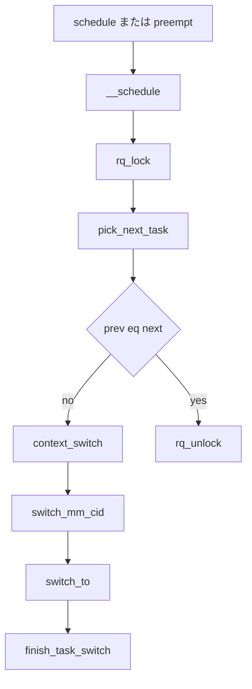

# 第9章 __schedule とコンテキストスイッチ

> **本章で読むソース**
>
> - [`kernel/sched/core.c` L6794-L6798](https://github.com/gregkh/linux/blob/v6.18.38/kernel/sched/core.c#L6794-L6798)
> - [`kernel/sched/core.c` L6825-L6879](https://github.com/gregkh/linux/blob/v6.18.38/kernel/sched/core.c#L6825-L6879)
> - [`kernel/sched/core.c` L6881-L6950](https://github.com/gregkh/linux/blob/v6.18.38/kernel/sched/core.c#L6881-L6950)
> - [`kernel/sched/core.c` L5280-L5340](https://github.com/gregkh/linux/blob/v6.18.38/kernel/sched/core.c#L5280-L5340)
> - [`kernel/sched/core.c` L5192-L5199](https://github.com/gregkh/linux/blob/v6.18.38/kernel/sched/core.c#L5192-L5199)
> - [`kernel/sched/core.c` L5070-L5080](https://github.com/gregkh/linux/blob/v6.18.38/kernel/sched/core.c#L5070-L5080)
> - [`kernel/sched/core.c` L7017-L7038](https://github.com/gregkh/linux/blob/v6.18.38/kernel/sched/core.c#L7017-L7038)
> - [`kernel/sched/core.c` L7051-L7064](https://github.com/gregkh/linux/blob/v6.18.38/kernel/sched/core.c#L7051-L7064)

## この章の狙い

スケジューラの中心 `__schedule` が、次タスク選出から `context_switch`、後片付けまでをどう進めるかを追う。

## 前提

[ランキューとスケジューリングクラスの階層](08-runqueue-sched-class.md) を読んでいること。

## __schedule の呼び出し契約

[`kernel/sched/core.c` L6794-L6798](https://github.com/gregkh/linux/blob/v6.18.38/kernel/sched/core.c#L6794-L6798)

```c
 * WARNING: must be called with preemption disabled!
 */
static void __sched notrace __schedule(int sched_mode)
{
	struct task_struct *prev, *next;
```

## rq ロックと prev 状態判定

IRQ を無効化し `rq_lock` のあと `update_rq_clock` で rq 時刻を進める。
`prev->__state` は `READ_ONCE` で1回だけ読み、`SM_IDLE` では空 rq なら switch せず `picked` へ進む。
`try_to_block_task` は pending signal と proxy-exec 条件を確認し、実際に block する場合だけ runqueue から外す。
block したときコンテキストスイッチ回数は `nvcsw` を数える。

[`kernel/sched/core.c` L6825-L6879](https://github.com/gregkh/linux/blob/v6.18.38/kernel/sched/core.c#L6825-L6879)

```c
	local_irq_disable();
	rcu_note_context_switch(preempt);

	/*
	 * Make sure that signal_pending_state()->signal_pending() below
	 * can't be reordered with __set_current_state(TASK_INTERRUPTIBLE)
	 * done by the caller to avoid the race with signal_wake_up():
	 *
	 * __set_current_state(@state)		signal_wake_up()
	 * schedule()				  set_tsk_thread_flag(p, TIF_SIGPENDING)
	 *					  wake_up_state(p, state)
	 *   LOCK rq->lock			    LOCK p->pi_state
	 *   smp_mb__after_spinlock()		    smp_mb__after_spinlock()
	 *     if (signal_pending_state())	    if (p->state & @state)
	 *
	 * Also, the membarrier system call requires a full memory barrier
	 * after coming from user-space, before storing to rq->curr; this
	 * barrier matches a full barrier in the proximity of the membarrier
	 * system call exit.
	 */
	rq_lock(rq, &rf);
	smp_mb__after_spinlock();

	/* Promote REQ to ACT */
	rq->clock_update_flags <<= 1;
	update_rq_clock(rq);
	rq->clock_update_flags = RQCF_UPDATED;

	switch_count = &prev->nivcsw;

	/* Task state changes only considers SM_PREEMPT as preemption */
	preempt = sched_mode == SM_PREEMPT;

	/*
	 * We must load prev->state once (task_struct::state is volatile), such
	 * that we form a control dependency vs deactivate_task() below.
	 */
	prev_state = READ_ONCE(prev->__state);
	if (sched_mode == SM_IDLE) {
		/* SCX must consult the BPF scheduler to tell if rq is empty */
		if (!rq->nr_running && !scx_enabled()) {
			next = prev;
			goto picked;
		}
	} else if (!preempt && prev_state) {
		/*
		 * We pass task_is_blocked() as the should_block arg
		 * in order to keep mutex-blocked tasks on the runqueue
		 * for slection with proxy-exec (without proxy-exec
		 * task_is_blocked() will always be false).
		 */
		try_to_block_task(rq, prev, &prev_state,
				  !task_is_blocked(prev));
		switch_count = &prev->nvcsw;
	}
```

## pick_next_task と context_switch

[`kernel/sched/core.c` L6881-L6950](https://github.com/gregkh/linux/blob/v6.18.38/kernel/sched/core.c#L6881-L6950)

```c
pick_again:
	next = pick_next_task(rq, rq->donor, &rf);
	rq_set_donor(rq, next);
	if (unlikely(task_is_blocked(next))) {
		next = find_proxy_task(rq, next, &rf);
		if (!next)
			goto pick_again;
		if (next == rq->idle)
			goto keep_resched;
	}
picked:
	clear_tsk_need_resched(prev);
	clear_preempt_need_resched();
keep_resched:
	rq->last_seen_need_resched_ns = 0;

	is_switch = prev != next;
	if (likely(is_switch)) {
		rq->nr_switches++;
		RCU_INIT_POINTER(rq->curr, next);

		if (!task_current_donor(rq, next))
			proxy_tag_curr(rq, next);

		++*switch_count;

		migrate_disable_switch(rq, prev);
		psi_account_irqtime(rq, prev, next);
		psi_sched_switch(prev, next, !task_on_rq_queued(prev) ||
					     prev->se.sched_delayed);

		trace_sched_switch(preempt, prev, next, prev_state);

		rq = context_switch(rq, prev, next, &rf);
	} else {
		/* In case next was already curr but just got blocked_donor */
		if (!task_current_donor(rq, next))
			proxy_tag_curr(rq, next);

		rq_unpin_lock(rq, &rf);
		__balance_callbacks(rq);
		raw_spin_rq_unlock_irq(rq);
	}
```

`prev == next` のときは MM 切替を省略し、`rq_unpin_lock` のあと balance callback を走らせてから unlock する。

**最適化の工夫**：`pick_again` ループは proxy-exec 等で donor と runnable が一致しない場合の再試行である。
通常経路は1回の pick で終わり、ロック保持時間を短く保つ。

## context_switch 全体

MM 切替、`switch_mm_cid`、`switch_to`、`finish_task_switch` までが一関数にまとまる。

[`kernel/sched/core.c` L5280-L5340](https://github.com/gregkh/linux/blob/v6.18.38/kernel/sched/core.c#L5280-L5340)

```c
static __always_inline struct rq *
context_switch(struct rq *rq, struct task_struct *prev,
	       struct task_struct *next, struct rq_flags *rf)
{
	prepare_task_switch(rq, prev, next);

	arch_start_context_switch(prev);

	if (!next->mm) {                                // to kernel
		enter_lazy_tlb(prev->active_mm, next);

		next->active_mm = prev->active_mm;
		if (prev->mm)                           // from user
			mmgrab_lazy_tlb(prev->active_mm);
		else
			prev->active_mm = NULL;
	} else {                                        // to user
		membarrier_switch_mm(rq, prev->active_mm, next->mm);
		switch_mm_irqs_off(prev->active_mm, next->mm, next);
		lru_gen_use_mm(next->mm);

		if (!prev->mm) {                        // from kernel
			rq->prev_mm = prev->active_mm;
			prev->active_mm = NULL;
		}
	}

	switch_mm_cid(rq, prev, next);

	prepare_lock_switch(rq, next, rf);

	switch_to(prev, next, prev);
	barrier();

	return finish_task_switch(prev);
}
```

## finish_task_switch

`switch_to` から戻ると `finish_task_switch` が perf、vtime、arch 後片付けを行い、最後に `finish_lock_switch` で `rq->lock` を解放する。

[`kernel/sched/core.c` L5192-L5199](https://github.com/gregkh/linux/blob/v6.18.38/kernel/sched/core.c#L5192-L5199)

```c
	prev_state = READ_ONCE(prev->__state);
	vtime_task_switch(prev);
	perf_event_task_sched_in(prev, current);
	finish_task(prev);
	tick_nohz_task_switch();
	finish_lock_switch(rq);
	finish_arch_post_lock_switch();
	kcov_finish_switch(current);
```

[`kernel/sched/core.c` L5070-L5080](https://github.com/gregkh/linux/blob/v6.18.38/kernel/sched/core.c#L5070-L5080)

```c
static inline void finish_lock_switch(struct rq *rq)
{
	/*
	 * If we are tracking spinlock dependencies then we have to
	 * fix up the runqueue lock - which gets 'carried over' from
	 * prev into current:
	 */
	spin_acquire(&__rq_lockp(rq)->dep_map, 0, 0, _THIS_IP_);
	__balance_callbacks(rq);
	raw_spin_rq_unlock_irq(rq);
}
```

## schedule ラッパ

[`kernel/sched/core.c` L7017-L7038](https://github.com/gregkh/linux/blob/v6.18.38/kernel/sched/core.c#L7017-L7038)

```c
static __always_inline void __schedule_loop(int sched_mode)
{
	do {
		preempt_disable();
		__schedule(sched_mode);
		sched_preempt_enable_no_resched();
	} while (need_resched());
}

asmlinkage __visible void __sched schedule(void)
{
	struct task_struct *tsk = current;

	if (!task_is_running(tsk))
		sched_submit_work(tsk);
	__schedule_loop(SM_NONE);
	sched_update_worker(tsk);
}
```

## schedule_idle 経路

[`kernel/sched/core.c` L7051-L7064](https://github.com/gregkh/linux/blob/v6.18.38/kernel/sched/core.c#L7051-L7064)

```c
void __sched schedule_idle(void)
{
	WARN_ON_ONCE(current->__state);
	do {
		__schedule(SM_IDLE);
	} while (need_resched());
}
```

## 処理の流れ



## まとめ

`__schedule` は per-CPU ランキューをロックし、クラス横断で次タスクを決め、必要なら MM 付きで切り替える。
`context_switch` は MM 更新からレジスタ切替、後片付けまでを一連の契約として束ねる。

## 関連する章

- [try_to_wake_up と wakeup の中核](10-try-to-wake-up.md)
- [プリエンプションモデル](11-preemption-model.md)
- [vruntime と eligibility](../part02-eevdf/12-vruntime-eligibility.md)
