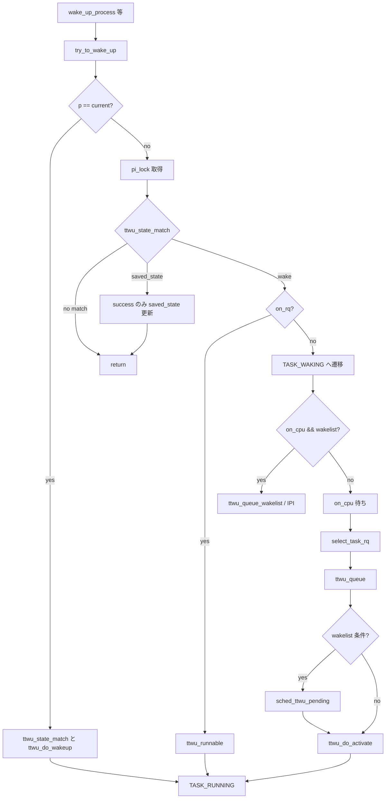

# 第10章 try_to_wake_up と wakeup の中核

> **本章で読むソース**
>
> - [`kernel/sched/core.c` L3572-L3596](https://github.com/gregkh/linux/blob/v6.18.38/kernel/sched/core.c#L3572-L3596)
> - [`kernel/sched/core.c` L3691-L3714](https://github.com/gregkh/linux/blob/v6.18.38/kernel/sched/core.c#L3691-L3714)
> - [`kernel/sched/core.c` L3764-L3787](https://github.com/gregkh/linux/blob/v6.18.38/kernel/sched/core.c#L3764-L3787)
> - [`kernel/sched/core.c` L3849-L3859](https://github.com/gregkh/linux/blob/v6.18.38/kernel/sched/core.c#L3849-L3859)
> - [`kernel/sched/core.c` L3904-L3951](https://github.com/gregkh/linux/blob/v6.18.38/kernel/sched/core.c#L3904-L3951)
> - [`kernel/sched/core.c` L3953-L3976](https://github.com/gregkh/linux/blob/v6.18.38/kernel/sched/core.c#L3953-L3976)
> - [`kernel/sched/core.c` L3996-L4025](https://github.com/gregkh/linux/blob/v6.18.38/kernel/sched/core.c#L3996-L4025)
> - [`kernel/sched/core.c` L4111-L4148](https://github.com/gregkh/linux/blob/v6.18.38/kernel/sched/core.c#L4111-L4148)
> - [`kernel/sched/core.c` L4150-L4217](https://github.com/gregkh/linux/blob/v6.18.38/kernel/sched/core.c#L4150-L4217)
> - [`kernel/sched/core.c` L4244-L4298](https://github.com/gregkh/linux/blob/v6.18.38/kernel/sched/core.c#L4244-L4298)
> - [`kernel/sched/core.c` L4417-L4431](https://github.com/gregkh/linux/blob/v6.18.38/kernel/sched/core.c#L4417-L4431)

## この章の狙い

スリープしたタスクを runnable に戻す中核経路 `try_to_wake_up` を、`wake_up_process` などの入口から `select_task_rq` と `ttwu_queue` まで追う。
waitqueue（`wait_event` や `wake_up` のキュー機構）は [同期と RCU](../../locking/README.md) 分冊の担当であり、本章ではスケジューラ側の wakeup 本体だけを扱う。

## 前提

[__schedule とコンテキストスイッチ](09-schedule-context-switch.md) を読んでいること。
`__schedule` がタスクを block して runqueue から外す流れと対になる処理である。

## 入口: wake_up_process

カーネル内の多くの wakeup は `wake_up_process` に集約される。
実体は `try_to_wake_up(p, TASK_NORMAL, 0)` の1行呼び出しである。

[`kernel/sched/core.c` L4417-L4431](https://github.com/gregkh/linux/blob/v6.18.38/kernel/sched/core.c#L4417-L4431)

```c
 * wake_up_process - Wake up a specific process
 * @p: The process to be woken up.
 *
 * Attempt to wake up the nominated process and move it to the set of runnable
 * processes.
 *
 * Return: 1 if the process was woken up, 0 if it was already running.
 *
 * This function executes a full memory barrier before accessing the task state.
 */
int wake_up_process(struct task_struct *p)
{
	return try_to_wake_up(p, TASK_NORMAL, 0);
}
EXPORT_SYMBOL(wake_up_process);
```

`wake_up_state` も同じ `try_to_wake_up` を state マスク付きで呼ぶ薄いラッパーである。

## try_to_wake_up の契約

`try_to_wake_up` は `schedule()` とアトミックに競合しながら、タスク状態を runnable に戻し、必要なら runqueue へ再投入する。
`p->pi_lock` で並行 wakeup を直列化し、性能のため `task_rq(p)->lock` の取得回数を最小化する設計である。

[`kernel/sched/core.c` L4111-L4148](https://github.com/gregkh/linux/blob/v6.18.38/kernel/sched/core.c#L4111-L4148)

```c
/**
 * try_to_wake_up - wake up a thread
 * @p: the thread to be awakened
 * @state: the mask of task states that can be woken
 * @wake_flags: wake modifier flags (WF_*)
 *
 * Conceptually does:
 *
 *   If (@state & @p->state) @p->state = TASK_RUNNING.
 *
 * If the task was not queued/runnable, also place it back on a runqueue.
 *
 * This function is atomic against schedule() which would dequeue the task.
 *
 * It issues a full memory barrier before accessing @p->state, see the comment
 * with set_current_state().
 *
 * Uses p->pi_lock to serialize against concurrent wake-ups.
 *
 * Relies on p->pi_lock stabilizing:
 *  - p->sched_class
 *  - p->cpus_ptr
 *  - p->sched_task_group
 * in order to do migration, see its use of select_task_rq()/set_task_cpu().
 *
 * Tries really hard to only take one task_rq(p)->lock for performance.
 * Takes rq->lock in:
 *  - ttwu_runnable()    -- old rq, unavoidable, see comment there;
 *  - ttwu_queue()       -- new rq, for enqueue of the task;
 *  - psi_ttwu_dequeue() -- much sadness :-( accounting will kill us.
 *
 * As a consequence we race really badly with just about everything. See the
 * many memory barriers and their comments for details.
 *
 * Return: %true if @p->state changes (an actual wakeup was done),
 *	   %false otherwise.
 */
int try_to_wake_up(struct task_struct *p, unsigned int state, int wake_flags)
```

## 本体: current 高速経路と pi_lock 下の分岐

関数本体は `guard(preempt)()` のあと `wake_flags |= WF_TTWU` を立てる。
`p == current` のときは `pi_lock` も rq ロックも取らず、`ttwu_state_match` と `ttwu_do_wakeup` だけで済ませる。

それ以外は `pi_lock` 下で `ttwu_state_match` を呼び、`on_rq` がまだ 1 なら `ttwu_runnable` で軽量 wakeup に分岐する。

[`kernel/sched/core.c` L4150-L4217](https://github.com/gregkh/linux/blob/v6.18.38/kernel/sched/core.c#L4150-L4217)

```c
	guard(preempt)();
	int cpu, success = 0;

	wake_flags |= WF_TTWU;

	if (p == current) {
		/*
		 * We're waking current, this means 'p->on_rq' and 'task_cpu(p)
		 * == smp_processor_id()'. Together this means we can special
		 * case the whole 'p->on_rq && ttwu_runnable()' case below
		 * without taking any locks.
		 *
		 * Specifically, given current runs ttwu() we must be before
		 * schedule()'s block_task(), as such this must not observe
		 * sched_delayed.
		 *
		 * In particular:
		 *  - we rely on Program-Order guarantees for all the ordering,
		 *  - we're serialized against set_special_state() by virtue of
		 *    it disabling IRQs (this allows not taking ->pi_lock).
		 */
		WARN_ON_ONCE(p->se.sched_delayed);
		if (!ttwu_state_match(p, state, &success))
			goto out;

		trace_sched_waking(p);
		ttwu_do_wakeup(p);
		goto out;
	}

	/*
	 * If we are going to wake up a thread waiting for CONDITION we
	 * need to ensure that CONDITION=1 done by the caller can not be
	 * reordered with p->state check below. This pairs with smp_store_mb()
	 * in set_current_state() that the waiting thread does.
	 */
	scoped_guard (raw_spinlock_irqsave, &p->pi_lock) {
		smp_mb__after_spinlock();
		if (!ttwu_state_match(p, state, &success))
			break;

		trace_sched_waking(p);

		/*
		 * Ensure we load p->on_rq _after_ p->state, otherwise it would
		 * be possible to, falsely, observe p->on_rq == 0 and get stuck
		 * in smp_cond_load_acquire() below.
		 *
		 * sched_ttwu_pending()			try_to_wake_up()
		 *   STORE p->on_rq = 1			  LOAD p->state
		 *   UNLOCK rq->lock
		 *
		 * __schedule() (switch to task 'p')
		 *   LOCK rq->lock			  smp_rmb();
		 *   smp_mb__after_spinlock();
		 *   UNLOCK rq->lock
		 *
		 * [task p]
		 *   STORE p->state = UNINTERRUPTIBLE	  LOAD p->on_rq
		 *
		 * Pairs with the LOCK+smp_mb__after_spinlock() on rq->lock in
		 * __schedule().  See the comment for smp_mb__after_spinlock().
		 *
		 * A similar smp_rmb() lives in __task_needs_rq_lock().
		 */
		smp_rmb();
		if (READ_ONCE(p->on_rq) && ttwu_runnable(p, wake_flags))
			break;
```

## ttwu_state_match と saved_state

`ttwu_state_match` は `__task_state_match` の結果を `success` に書き戻す。
`match < 0` のときは RT ロック待ちや freezer 由来の `saved_state` 一致であり、呼び出し元には成功に見えるがタスク本体は enqueue しない。

[`kernel/sched/core.c` L3996-L4025](https://github.com/gregkh/linux/blob/v6.18.38/kernel/sched/core.c#L3996-L4025)

```c
static __always_inline
bool ttwu_state_match(struct task_struct *p, unsigned int state, int *success)
{
	int match;

	if (IS_ENABLED(CONFIG_DEBUG_PREEMPT)) {
		WARN_ON_ONCE((state & TASK_RTLOCK_WAIT) &&
			     state != TASK_RTLOCK_WAIT);
	}

	*success = !!(match = __task_state_match(p, state));

	/*
	 * Saved state preserves the task state across blocking on
	 * an RT lock or TASK_FREEZABLE tasks.  If the state matches,
	 * set p::saved_state to TASK_RUNNING, but do not wake the task
	 * because it waits for a lock wakeup or __thaw_task(). Also
	 * indicate success because from the regular waker's point of
	 * view this has succeeded.
	 *
	 * After acquiring the lock the task will restore p::__state
	 * from p::saved_state which ensures that the regular
	 * wakeup is not lost. The restore will also set
	 * p::saved_state to TASK_RUNNING so any further tests will
	 * not result in false positives vs. @success
	 */
	if (match < 0)
		p->saved_state = TASK_RUNNING;

	return match > 0;
}
```

`saved_state` 経路では waker から見た戻り値は成功でも、この呼び出しでは enqueue せず、RT lock wakeup または `__thaw_task()` が本体の起床を担う。
`saved_state = TASK_RUNNING` は通常 wakeup の取りこぼしを防ぐための印である。

## 状態遷移と TASK_WAKING

`p == current` のときはロックなしの高速経路がある。
それ以外は `pi_lock` 下で `ttwu_state_match` が state を確認し、`on_rq` がまだ 1 なら `ttwu_runnable` で既存 rq 上の軽量 wakeup に分岐する。

runqueue から外れているタスクは、enqueue 前に `TASK_WAKING` へ遷移させる。
`pi_lock` を enqueue 処理の前に解放できるようにするための中間状態である。

[`kernel/sched/core.c` L4244-L4298](https://github.com/gregkh/linux/blob/v6.18.38/kernel/sched/core.c#L4244-L4298)

```c
		/*
		 * We're doing the wakeup (@success == 1), they did a dequeue (p->on_rq
		 * == 0), which means we need to do an enqueue, change p->state to
		 * TASK_WAKING such that we can unlock p->pi_lock before doing the
		 * enqueue, such as ttwu_queue_wakelist().
		 */
		WRITE_ONCE(p->__state, TASK_WAKING);

		// ... (中略) ...

		if (smp_load_acquire(&p->on_cpu) &&
		    ttwu_queue_wakelist(p, task_cpu(p), wake_flags))
			break;

		// ... (中略) ...

		smp_cond_load_acquire(&p->on_cpu, !VAL);

		cpu = select_task_rq(p, p->wake_cpu, &wake_flags);
		if (task_cpu(p) != cpu) {
			if (p->in_iowait) {
				delayacct_blkio_end(p);
				atomic_dec(&task_rq(p)->nr_iowait);
			}

			wake_flags |= WF_MIGRATED;
			psi_ttwu_dequeue(p);
			set_task_cpu(p, cpu);
		}

		ttwu_queue(p, cpu, wake_flags);
```

`on_cpu` がまだ 1 のときは remote CPU が `schedule()` 中である。
`ttwu_queue_wakelist` が IPI 経由で `sched_ttwu_pending` に処理を委譲し、waker 側のスピン待ちを避ける。

## select_task_rq との接続

配置 CPU の決定は `select_task_rq` が担う。
`pi_lock` 保持下で `p->sched_class->select_task_rq` を呼び、マルチ CPU 許可タスクだけがクラス固有の配置ロジックに入る。

[`kernel/sched/core.c` L3572-L3596](https://github.com/gregkh/linux/blob/v6.18.38/kernel/sched/core.c#L3572-L3596)

```c
int select_task_rq(struct task_struct *p, int cpu, int *wake_flags)
{
	lockdep_assert_held(&p->pi_lock);

	if (p->nr_cpus_allowed > 1 && !is_migration_disabled(p)) {
		cpu = p->sched_class->select_task_rq(p, cpu, *wake_flags);
		*wake_flags |= WF_RQ_SELECTED;
	} else {
		cpu = cpumask_any(p->cpus_ptr);
	}

	/*
	 * In order not to call set_task_cpu() on a blocking task we need
	 * to rely on ttwu() to place the task on a valid ->cpus_ptr
	 * CPU.
	 *
	 * Since this is common to all placement strategies, this lives here.
	 *
	 * [ this allows ->select_task() to simply return task_cpu(p) and
	 *   not worry about this generic constraint ]
	 */
	if (unlikely(!is_cpu_allowed(p, cpu)))
		cpu = select_fallback_rq(task_cpu(p), p);

	return cpu;
}
```

CPU が変わったときは `WF_MIGRATED` を立て、PSI 計上と `set_task_cpu` のあと新 rq へ enqueue する。

## ttwu_queue と remote wakeup

`ttwu_queue` は wakelist 経路と直接 activate の2分岐を持つ。
wakelist に載せた場合は rq ロックを取らずに return し、対象 CPU の `sched_ttwu_pending` が `ttwu_do_activate` を実行する。

[`kernel/sched/core.c` L3953-L3976](https://github.com/gregkh/linux/blob/v6.18.38/kernel/sched/core.c#L3953-L3976)

```c
static bool ttwu_queue_wakelist(struct task_struct *p, int cpu, int wake_flags)
{
	if (sched_feat(TTWU_QUEUE) && ttwu_queue_cond(p, cpu)) {
		sched_clock_cpu(cpu); /* Sync clocks across CPUs */
		__ttwu_queue_wakelist(p, cpu, wake_flags);
		return true;
	}

	return false;
}

static void ttwu_queue(struct task_struct *p, int cpu, int wake_flags)
{
	struct rq *rq = cpu_rq(cpu);
	struct rq_flags rf;

	if (ttwu_queue_wakelist(p, cpu, wake_flags))
		return;

	rq_lock(rq, &rf);
	update_rq_clock(rq);
	ttwu_do_activate(rq, p, wake_flags, &rf);
	rq_unlock(rq, &rf);
}
```

`__ttwu_queue_wakelist` は `ttwu_pending` フラグを立て、SMP では `__smp_call_single_queue` で対象 CPU に wake entry を送る。

[`kernel/sched/core.c` L3849-L3859](https://github.com/gregkh/linux/blob/v6.18.38/kernel/sched/core.c#L3849-L3859)

```c
static void __ttwu_queue_wakelist(struct task_struct *p, int cpu, int wake_flags)
{
	struct rq *rq = cpu_rq(cpu);

	p->sched_remote_wakeup = !!(wake_flags & WF_MIGRATED);

	WRITE_ONCE(rq->ttwu_pending, 1);
#ifdef CONFIG_SMP
	__smp_call_single_queue(cpu, &p->wake_entry.llist);
#endif
}
```

`ttwu_queue_cond` はキャッシュ共有、idle CPU、`nr_running` などを読んで wakelist 利用可否を判定する。
`nr_running` 自体は読むが、waker は remote rq ロック取得と enqueue 本体の write を避け、対象 CPU 側の `sched_ttwu_pending` に委譲する。

[`kernel/sched/core.c` L3904-L3951](https://github.com/gregkh/linux/blob/v6.18.38/kernel/sched/core.c#L3904-L3951)

```c
static inline bool ttwu_queue_cond(struct task_struct *p, int cpu)
{
	/* See SCX_OPS_ALLOW_QUEUED_WAKEUP. */
	if (!scx_allow_ttwu_queue(p))
		return false;

#ifdef CONFIG_SMP
	if (p->sched_class == &stop_sched_class)
		return false;
#endif

	/*
	 * Do not complicate things with the async wake_list while the CPU is
	 * in hotplug state.
	 */
	if (!cpu_active(cpu))
		return false;

	/* Ensure the task will still be allowed to run on the CPU. */
	if (!cpumask_test_cpu(cpu, p->cpus_ptr))
		return false;

	/*
	 * If the CPU does not share cache, then queue the task on the
	 * remote rqs wakelist to avoid accessing remote data.
	 */
	if (!cpus_share_cache(smp_processor_id(), cpu))
		return true;

	if (cpu == smp_processor_id())
		return false;

	/*
	 * If the wakee cpu is idle, or the task is descheduling and the
	 * only running task on the CPU, then use the wakelist to offload
	 * the task activation to the idle (or soon-to-be-idle) CPU as
	 * the current CPU is likely busy. nr_running is checked to
	 * avoid unnecessary task stacking.
	 *
	 * Note that we can only get here with (wakee) p->on_rq=0,
	 * p->on_cpu can be whatever, we've done the dequeue, so
	 * the wakee has been accounted out of ->nr_running.
	 */
	if (!cpu_rq(cpu)->nr_running)
		return true;

	return false;
}
```

`CONFIG_SCHED_CLASS_EXT` が有効なとき、SCX タスクは `scx_allow_ttwu_queue` により wakelist 利用が制限される場合がある。

## ttwu_runnable と ttwu_do_activate

タスクがまだ runqueue 上にいる場合（プリエンプト済みだが dequeue されていない）は、`ttwu_runnable` が rq ロック下で `wakeup_preempt` だけを行う。
完全な再 enqueue が不要な経路である。

[`kernel/sched/core.c` L3764-L3787](https://github.com/gregkh/linux/blob/v6.18.38/kernel/sched/core.c#L3764-L3787)

```c
static int ttwu_runnable(struct task_struct *p, int wake_flags)
{
	struct rq_flags rf;
	struct rq *rq;
	int ret = 0;

	rq = __task_rq_lock(p, &rf);
	if (task_on_rq_queued(p)) {
		update_rq_clock(rq);
		if (p->se.sched_delayed)
			enqueue_task(rq, p, ENQUEUE_NOCLOCK | ENQUEUE_DELAYED);
		if (!task_on_cpu(rq, p)) {
			/*
			 * When on_rq && !on_cpu the task is preempted, see if
			 * it should preempt the task that is current now.
			 */
			wakeup_preempt(rq, p, wake_flags);
		}
		ttwu_do_wakeup(p);
		ret = 1;
	}
	__task_rq_unlock(rq, &rf);

	return ret;
}
```

runqueue から外れているタスクは `ttwu_do_activate` が `activate_task` と `wakeup_preempt` をまとめて実行する。

[`kernel/sched/core.c` L3691-L3714](https://github.com/gregkh/linux/blob/v6.18.38/kernel/sched/core.c#L3691-L3714)

```c
ttwu_do_activate(struct rq *rq, struct task_struct *p, int wake_flags,
		 struct rq_flags *rf)
{
	int en_flags = ENQUEUE_WAKEUP | ENQUEUE_NOCLOCK;

	lockdep_assert_rq_held(rq);

	if (p->sched_contributes_to_load)
		rq->nr_uninterruptible--;

	if (wake_flags & WF_RQ_SELECTED)
		en_flags |= ENQUEUE_RQ_SELECTED;
	if (wake_flags & WF_MIGRATED)
		en_flags |= ENQUEUE_MIGRATED;
	else
	if (p->in_iowait) {
		delayacct_blkio_end(p);
		atomic_dec(&task_rq(p)->nr_iowait);
	}

	activate_task(rq, p, en_flags);
	wakeup_preempt(rq, p, wake_flags);

	ttwu_do_wakeup(p);
```

## 処理の流れ



## 高速化の工夫: wakelist による rq ロック回避

`try_to_wake_up` のコメントが強調するのは、可能な限り `task_rq(p)->lock` を1回だけ取ることである。
`ttwu_queue_wakelist` は waker が remote rq ロック取得と enqueue 本体の write を避け、IPI で対象 CPU に activate を委譲する。
`ttwu_queue_cond` は `cpu_rq(cpu)->nr_running` を読むが、判定だけに使い waker 自身は remote rq を更新しない。
キャッシュを共有しない CPU 間や idle CPU への wakeup で特に効く。

## まとめ

wakeup の中核は `try_to_wake_up` に集約され、`wake_up_process` はその薄い入口である。
状態は `TASK_WAKING` を経由して runnable に戻り、配置は `select_task_rq` がクラス固有ロジックへ委譲する。
enqueue は `ttwu_queue` が wakelist か直接 activate を選び、SMP では IPI による remote wakeup が性能上の要である。
waitqueue の待ち行列機構は locking 分冊で扱う。

## 関連する章

- [__schedule とコンテキストスイッチ](09-schedule-context-switch.md)
- [プリエンプションモデル](11-preemption-model.md)
- [ランキューとスケジューリングクラスの階層](08-runqueue-sched-class.md)
- [ext_sched_class と sched_ext_ops](../part03-sched-ext/15-ext-sched-class-ops.md)
