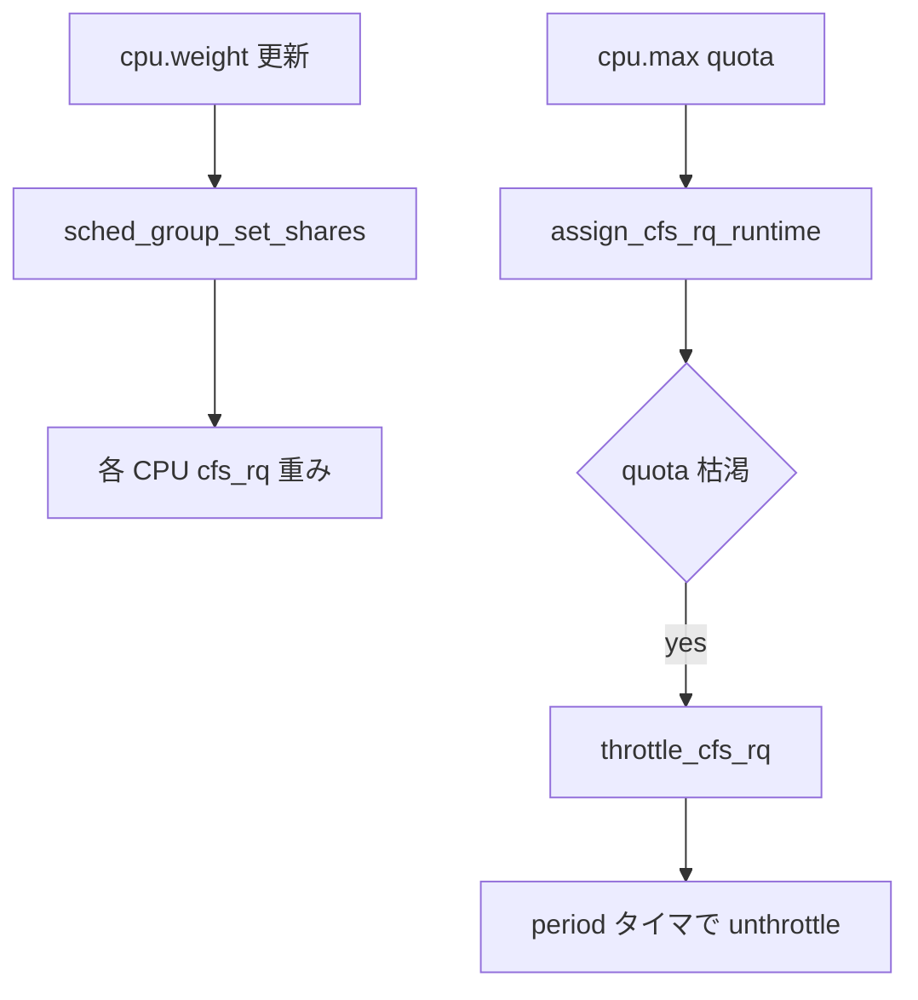

# 第11章 group scheduling と cgroup 階層

> **本章で読むソース**
>
> - [`kernel/sched/core.c` L10213-L10263](https://github.com/gregkh/linux/blob/v6.18.38/kernel/sched/core.c#L10213-L10263)
> - [`kernel/sched/core.c` L10265-L10277](https://github.com/gregkh/linux/blob/v6.18.38/kernel/sched/core.c#L10265-L10277)
> - [`kernel/sched/fair.c` L13883-L13897](https://github.com/gregkh/linux/blob/v6.18.38/kernel/sched/fair.c#L13883-L13897)
> - [`kernel/sched/fair.c` L5746-L5773](https://github.com/gregkh/linux/blob/v6.18.38/kernel/sched/fair.c#L5746-L5773)
> - [`kernel/sched/fair.c` L6040-L6078](https://github.com/gregkh/linux/blob/v6.18.38/kernel/sched/fair.c#L6040-L6078)
> - [`kernel/sched/fair.c` L6292-L6330](https://github.com/gregkh/linux/blob/v6.18.38/kernel/sched/fair.c#L6292-L6330)

## この章の狙い

**cgroup** の CPU コントローラが `task_group` 階層を通じて CPU 時間を配分する仕組みを読む。

## 前提

[enqueue と dequeue と pick_next_task](10-enqueue-dequeue-pick.md) を読んでいること。

## cpu cgroup ファイルと sched サブシステム

CPU コントローラの cgroup ファイルは `cpu_files` に定義され、`cpu_cgrp_subsys` へ登録される。
`cpu.weight` は相対配分、`cpu.max` は CFS bandwidth の上限である。

[`kernel/sched/core.c` L10213-L10263](https://github.com/gregkh/linux/blob/v6.18.38/kernel/sched/core.c#L10213-L10263)

```c
static struct cftype cpu_files[] = {
#ifdef CONFIG_GROUP_SCHED_WEIGHT
	{
		.name = "weight",
		.flags = CFTYPE_NOT_ON_ROOT,
		.read_u64 = cpu_weight_read_u64,
		.write_u64 = cpu_weight_write_u64,
	},
	{
		.name = "weight.nice",
		.flags = CFTYPE_NOT_ON_ROOT,
		.read_s64 = cpu_weight_nice_read_s64,
		.write_s64 = cpu_weight_nice_write_s64,
	},
	{
		.name = "idle",
		.flags = CFTYPE_NOT_ON_ROOT,
		.read_s64 = cpu_idle_read_s64,
		.write_s64 = cpu_idle_write_s64,
	},
#endif
#ifdef CONFIG_GROUP_SCHED_BANDWIDTH
	{
		.name = "max",
		.flags = CFTYPE_NOT_ON_ROOT,
		.seq_show = cpu_max_show,
		.write = cpu_max_write,
	},
	{
		.name = "max.burst",
		.flags = CFTYPE_NOT_ON_ROOT,
		.read_u64 = cpu_burst_read_u64,
		.write_u64 = cpu_burst_write_u64,
	},
#endif /* CONFIG_CFS_BANDWIDTH */
#ifdef CONFIG_UCLAMP_TASK_GROUP
	{
		.name = "uclamp.min",
		.flags = CFTYPE_NOT_ON_ROOT,
		.seq_show = cpu_uclamp_min_show,
		.write = cpu_uclamp_min_write,
	},
	{
		.name = "uclamp.max",
		.flags = CFTYPE_NOT_ON_ROOT,
		.seq_show = cpu_uclamp_max_show,
		.write = cpu_uclamp_max_write,
	},
#endif /* CONFIG_UCLAMP_TASK_GROUP */
	{ }	/* terminate */
};
```

[`kernel/sched/core.c` L10265-L10280](https://github.com/gregkh/linux/blob/v6.18.38/kernel/sched/core.c#L10265-L10280)

```c
struct cgroup_subsys cpu_cgrp_subsys = {
	.css_alloc	= cpu_cgroup_css_alloc,
	.css_online	= cpu_cgroup_css_online,
	.css_offline	= cpu_cgroup_css_offline,
	.css_released	= cpu_cgroup_css_released,
	.css_free	= cpu_cgroup_css_free,
	.css_extra_stat_show = cpu_extra_stat_show,
	.css_local_stat_show = cpu_local_stat_show,
	.can_attach	= cpu_cgroup_can_attach,
	.attach		= cpu_cgroup_attach,
	.cancel_attach	= cpu_cgroup_cancel_attach,
	.legacy_cftypes	= cpu_legacy_files,
	.dfl_cftypes	= cpu_files,
	.early_init	= true,
	.threaded	= true,
};
```

## sched_group_set_shares と weight

`cpu.weight` 書き込みは `sched_group_set_shares` 経由で各 CPU の `cfs_rq` 重みを更新する。
legacy の `cpu.shares` も同系統の API へ届く。

[`kernel/sched/fair.c` L13883-L13897](https://github.com/gregkh/linux/blob/v6.18.38/kernel/sched/fair.c#L13883-L13897)

```c
int sched_group_set_shares(struct task_group *tg, unsigned long shares)
{
	int ret;

	mutex_lock(&shares_mutex);
	if (tg_is_idle(tg))
		ret = -EINVAL;
	else
		ret = __sched_group_set_shares(tg, shares);
	mutex_unlock(&shares_mutex);

	return ret;
}
```

**最適化の工夫**：pick 時に prev と next が同一 cgroup にいる場合、親 hierarchy 全体の put、set を省略する（第9章 `pick_next_task_fair` 参照）。
頻繁な同一グループ切替で赤黒木操作を減らす。

## CFS bandwidth 割当

実行中タスクの delta が period quota を超えると、親 `cfs_bandwidth` から runtime を借りる。

[`kernel/sched/fair.c` L5746-L5773](https://github.com/gregkh/linux/blob/v6.18.38/kernel/sched/fair.c#L5746-L5773)

```c
static int assign_cfs_rq_runtime(struct cfs_rq *cfs_rq)
{
	struct cfs_bandwidth *cfs_b = tg_cfs_bandwidth(cfs_rq->tg);
	int ret;

	raw_spin_lock(&cfs_b->lock);
	ret = __assign_cfs_rq_runtime(cfs_b, cfs_rq, sched_cfs_bandwidth_slice());
	raw_spin_unlock(&cfs_b->lock);

	return ret;
}

static void __account_cfs_rq_runtime(struct cfs_rq *cfs_rq, u64 delta_exec)
{
	cfs_rq->runtime_remaining -= delta_exec;

	if (likely(cfs_rq->runtime_remaining > 0))
		return;

	if (cfs_rq->throttled)
		return;
	if (!assign_cfs_rq_runtime(cfs_rq) && likely(cfs_rq->curr))
		resched_curr(rq_of(cfs_rq));
}
```

## throttle_cfs_rq

quota 枯渇時、cfs_rq を throttled リストへ載せ、子 entity を dequeue する。

[`kernel/sched/fair.c` L6040-L6078](https://github.com/gregkh/linux/blob/v6.18.38/kernel/sched/fair.c#L6040-L6078)

```c
static bool throttle_cfs_rq(struct cfs_rq *cfs_rq)
{
	struct rq *rq = rq_of(cfs_rq);
	struct cfs_bandwidth *cfs_b = tg_cfs_bandwidth(cfs_rq->tg);
	int dequeue = 1;

	raw_spin_lock(&cfs_b->lock);
	if (__assign_cfs_rq_runtime(cfs_b, cfs_rq, 1)) {
		dequeue = 0;
	} else {
		list_add_tail_rcu(&cfs_rq->throttled_list,
				  &cfs_b->throttled_cfs_rq);
	}
	raw_spin_unlock(&cfs_b->lock);

	if (!dequeue)
		return false;  /* Throttle no longer required. */

	rcu_read_lock();
	walk_tg_tree_from(cfs_rq->tg, tg_throttle_down, tg_nop, (void *)rq);
	rcu_read_unlock();

	cfs_rq->throttled = 1;
	WARN_ON_ONCE(cfs_rq->throttled_clock);
	return true;
}
```

## period タイマと unthrottle

[`kernel/sched/fair.c` L6292-L6330](https://github.com/gregkh/linux/blob/v6.18.38/kernel/sched/fair.c#L6292-L6330)

```c
static int do_sched_cfs_period_timer(struct cfs_bandwidth *cfs_b, int overrun, unsigned long flags)
{
	int throttled;

	if (cfs_b->quota == RUNTIME_INF)
		goto out_deactivate;

	throttled = !list_empty(&cfs_b->throttled_cfs_rq);
	cfs_b->nr_periods += overrun;

	__refill_cfs_bandwidth_runtime(cfs_b);

	if (cfs_b->idle && !throttled)
		goto out_deactivate;

	if (!throttled) {
		cfs_b->idle = 1;
		return 0;
	}

	cfs_b->nr_throttled += overrun;

	while (throttled && cfs_b->runtime > 0) {
		raw_spin_unlock_irqrestore(&cfs_b->lock, flags);
		throttled = distribute_cfs_runtime(cfs_b);
		raw_spin_lock_irqsave(&cfs_b->lock, flags);
	}
```

## 処理の流れ



## まとめ

group scheduling は単一 cfs_rq を木構造に拡張し、コンテナ単位の公平性を実現する。
`cpu.weight` は相対配分、`cpu.max` は CFS bandwidth 上限であり、役割が異なる。

## 関連する章

- [ロードバランスと NUMA](../part05-smp-obs/17-load-balance-numa.md)
