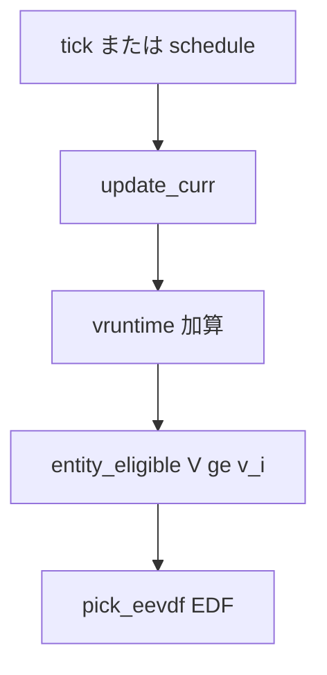

# 第11章 vruntime と eligibility（CFS から EEVDF への転換）

> **本章で読むソース**
>
> - [`kernel/sched/fair.c` L290-L296](https://github.com/gregkh/linux/blob/v6.18.38/kernel/sched/fair.c#L290-L296)
> - [`kernel/sched/fair.c` L715-L735](https://github.com/gregkh/linux/blob/v6.18.38/kernel/sched/fair.c#L715-L735)
> - [`kernel/sched/fair.c` L780-L816](https://github.com/gregkh/linux/blob/v6.18.38/kernel/sched/fair.c#L780-L816)
> - [`kernel/sched/fair.c` L1010-L1078](https://github.com/gregkh/linux/blob/v6.18.38/kernel/sched/fair.c#L1010-L1078)
> - [`kernel/sched/fair.c` L1281-L1302](https://github.com/gregkh/linux/blob/v6.18.38/kernel/sched/fair.c#L1281-L1302)
> - [`kernel/sched/fair.c` L767-L778](https://github.com/gregkh/linux/blob/v6.18.38/kernel/sched/fair.c#L767-L778)

## この章の狙い

公平スケジューラが **vruntime** と **eligibility** で「誰が走る資格を持つか」を判定する式を読む。

## 前提

[ランキューとスケジューリングクラスの階層](../part01-core/07-runqueue-sched-class.md) を読んでいること。

## calc_delta_fair と重み

[`kernel/sched/fair.c` L290-L296](https://github.com/gregkh/linux/blob/v6.18.38/kernel/sched/fair.c#L290-L296)

```c
static inline u64 calc_delta_fair(u64 delta, struct sched_entity *se)
{
	if (unlikely(se->load.weight != NICE_0_LOAD))
		delta = __calc_delta(delta, NICE_0_LOAD, &se->load);

	return delta;
}
```

## 重み付き平均 vruntime

`avg_vruntime` は cfs_rq 上の重み付き平均仮想実行時間 V を返す。
entity の lag が非負、すなわち `v_i <= V` なら eligible である。

[`kernel/sched/fair.c` L715-L735](https://github.com/gregkh/linux/blob/v6.18.38/kernel/sched/fair.c#L715-L735)

```c
u64 avg_vruntime(struct cfs_rq *cfs_rq)
{
	struct sched_entity *curr = cfs_rq->curr;
	long weight = cfs_rq->sum_weight;
	s64 delta = 0;

	if (curr && !curr->on_rq)
		curr = NULL;

	if (weight) {
		s64 runtime = cfs_rq->sum_w_vruntime;

		if (curr) {
			unsigned long w = scale_load_down(curr->load.weight);

			runtime += entity_key(cfs_rq, curr) * w;
			weight += w;
		}

		/* sign flips effective floor / ceiling */
```

[`kernel/sched/fair.c` L780-L816](https://github.com/gregkh/linux/blob/v6.18.38/kernel/sched/fair.c#L780-L816)

```c
 * Entity is eligible once it received less service than it ought to have,
 * eg. lag >= 0.
 *
 * lag_i = S - s_i = w_i*(V - v_i)
 *
 * lag_i >= 0 -> V >= v_i
 */
static int vruntime_eligible(struct cfs_rq *cfs_rq, u64 vruntime)
{
	struct sched_entity *curr = cfs_rq->curr;
	s64 avg = cfs_rq->sum_w_vruntime;
	long load = cfs_rq->sum_weight;

	if (curr && curr->on_rq) {
		unsigned long weight = scale_load_down(curr->load.weight);

		avg += entity_key(cfs_rq, curr) * weight;
		load += weight;
	}

	return avg >= vruntime_op(vruntime, "-", cfs_rq->zero_vruntime) * load;
}

int entity_eligible(struct cfs_rq *cfs_rq, struct sched_entity *se)
{
	return vruntime_eligible(cfs_rq, se->vruntime);
}
```

**最適化の工夫**：`sum_w_vruntime` と `sum_weight` を cfs_rq にキャッシュし、eligible 判定を O(1) に保つ。
赤黒木走査は pick 時だけ行う。

> **7.x 系での変化**
> [`kernel/sched/fair.c` L679-L724](https://github.com/gregkh/linux/blob/v7.1.3/kernel/sched/fair.c#L679-L724) では `sum_shift` による重み縮小と overflow 時の右シフトが追加されている。
> [`kernel/sched/fair.c` L920-L929](https://github.com/gregkh/linux/blob/v7.1.3/kernel/sched/fair.c#L920-L929) では `vruntime_eligible` が `__int128` または `check_mul_overflow` で積の overflow を扱う。
> [`kernel/sched/fair.c` L4068-L4125](https://github.com/gregkh/linux/blob/v7.1.3/kernel/sched/fair.c#L4068-L4125) では `reweight_entity` が vruntime rescale を担う。

## pick_eevdf

eligible 集合の中から deadline 最小の entity を EDF で選ぶ。

[`kernel/sched/fair.c` L1010-L1078](https://github.com/gregkh/linux/blob/v6.18.38/kernel/sched/fair.c#L1010-L1078)

```c
static struct sched_entity *pick_eevdf(struct cfs_rq *cfs_rq, bool protect)
{
	struct rb_node *node = cfs_rq->tasks_timeline.rb_root.rb_node;
	struct sched_entity *se = __pick_first_entity(cfs_rq);
	struct sched_entity *curr = cfs_rq->curr;
	struct sched_entity *best = NULL;

	if (cfs_rq->nr_queued == 1)
		return curr && curr->on_rq ? curr : se;

	if (sched_feat(PICK_BUDDY) &&
	    cfs_rq->next && entity_eligible(cfs_rq, cfs_rq->next)) {
		WARN_ON_ONCE(cfs_rq->next->sched_delayed);
		return cfs_rq->next;
	}

	if (curr && (!curr->on_rq || !entity_eligible(cfs_rq, curr)))
		curr = NULL;

	if (curr && protect && protect_slice(curr))
		return curr;

	if (se && entity_eligible(cfs_rq, se)) {
		best = se;
		goto found;
	}

	while (node) {
		struct rb_node *left = node->rb_left;

		if (left && vruntime_eligible(cfs_rq,
					__node_2_se(left)->min_vruntime)) {
			node = left;
			continue;
		}

		se = __node_2_se(node);

		if (entity_eligible(cfs_rq, se)) {
			best = se;
			break;
		}

		node = node->rb_right;
	}
found:
	if (!best || (curr && entity_before(curr, best)))
		best = curr;

	return best;
}
```

`min_vruntime` を各 node に持たせ、左部分木が eligible ならそちらへ prune する。

## update_curr と lag クランプ

[`kernel/sched/fair.c` L1281-L1302](https://github.com/gregkh/linux/blob/v6.18.38/kernel/sched/fair.c#L1281-L1302)

```c
static void update_curr(struct cfs_rq *cfs_rq)
{
	struct sched_entity *curr = cfs_rq->curr;
	struct rq *rq = rq_of(cfs_rq);
	s64 delta_exec;
	bool resched;

	if (unlikely(!curr))
		return;

	delta_exec = update_se(rq, curr);
	if (unlikely(delta_exec <= 0))
		return;

	curr->vruntime += calc_delta_fair(delta_exec, curr);
	resched = update_deadline(cfs_rq, curr);
```

[`kernel/sched/fair.c` L767-L778](https://github.com/gregkh/linux/blob/v6.18.38/kernel/sched/fair.c#L767-L778)

```c
static void update_entity_lag(struct cfs_rq *cfs_rq, struct sched_entity *se)
{
	u64 max_slice = cfs_rq_max_slice(cfs_rq) + TICK_NSEC;
	s64 vlag, limit;

	WARN_ON_ONCE(!se->on_rq);

	vlag = avg_vruntime(cfs_rq) - se->vruntime;
	limit = calc_delta_fair(max_slice, se);

	se->vlag = clamp(vlag, -limit, limit);
}
```

## 処理の流れ



## まとめ

CFS の「最小 vruntime を選ぶ」から、EEVDF の「eligible 集合の EDF」へ拡張されている。
eligible は `v_i <= V`、pick は `pick_eevdf` が担う。

## 関連する章

- [enqueue と dequeue と pick_next_task](12-enqueue-dequeue-pick.md)
- [プリエンプションモデル](../part01-core/10-preemption-model.md)
