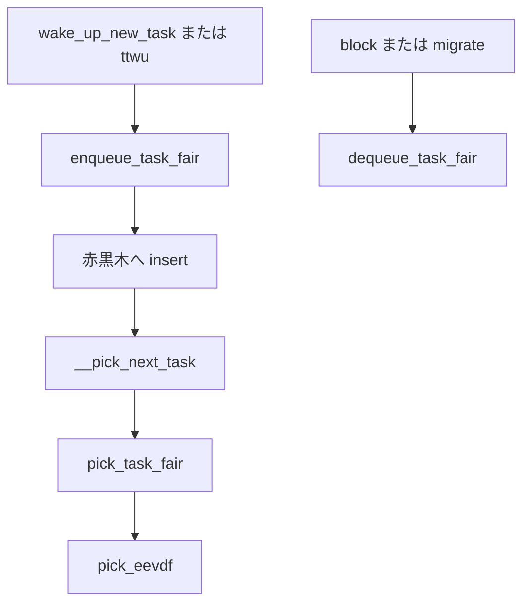

# 第13章 enqueue と dequeue と pick_next_task

> **本章で読むソース**
>
> - [`kernel/sched/fair.c` L6978-L7035](https://github.com/gregkh/linux/blob/v6.18.38/kernel/sched/fair.c#L6978-L7035)
> - [`kernel/sched/fair.c` L7220-L7239](https://github.com/gregkh/linux/blob/v6.18.38/kernel/sched/fair.c#L7220-L7239)
> - [`kernel/sched/fair.c` L5581-L5595](https://github.com/gregkh/linux/blob/v6.18.38/kernel/sched/fair.c#L5581-L5595)
> - [`kernel/sched/fair.c` L8996-L9027](https://github.com/gregkh/linux/blob/v6.18.38/kernel/sched/fair.c#L8996-L9027)
> - [`kernel/sched/fair.c` L9032-L9044](https://github.com/gregkh/linux/blob/v6.18.38/kernel/sched/fair.c#L9032-L9044)
> - [`kernel/sched/core.c` L5961-L5992](https://github.com/gregkh/linux/blob/v6.18.38/kernel/sched/core.c#L5961-L5992)

## この章の狙い

Runnable になったタスクがランキューに載り、pick され、降ろされる一連の fair クラス API を追う。

## 前提

[vruntime と eligibility](12-vruntime-eligibility.md) を読んでいること。

## enqueue_task_fair

[`kernel/sched/fair.c` L6978-L7035](https://github.com/gregkh/linux/blob/v6.18.38/kernel/sched/fair.c#L6978-L7035)

```c
static void
enqueue_task_fair(struct rq *rq, struct task_struct *p, int flags)
{
	struct cfs_rq *cfs_rq;
	struct sched_entity *se = &p->se;
	int h_nr_idle = task_has_idle_policy(p);
	int h_nr_runnable = 1;
	int task_new = !(flags & ENQUEUE_WAKEUP);
	int rq_h_nr_queued = rq->cfs.h_nr_queued;
	u64 slice = 0;

	if (task_is_throttled(p) && enqueue_throttled_task(p))
		return;

	if (!p->se.sched_delayed || (flags & ENQUEUE_DELAYED))
		util_est_enqueue(&rq->cfs, p);

	if (flags & ENQUEUE_DELAYED) {
		requeue_delayed_entity(se);
		return;
	}

	if (p->in_iowait)
		cpufreq_update_util(rq, SCHED_CPUFREQ_IOWAIT);

	for_each_sched_entity(se) {
		if (se->on_rq) {
			if (se->sched_delayed)
				requeue_delayed_entity(se);
			break;
		}
		cfs_rq = cfs_rq_of(se);
		if (slice) {
			se->slice = slice;
			se->custom_slice = 1;
		}
		enqueue_entity(cfs_rq, se, flags);
```

**最適化の工夫**：`in_iowait` 時に `SCHED_CPUFREQ_IOWAIT` を cpufreq governor へ渡し、I/O 待ちからの wake-up latency を下げる。

## dequeue_task_fair

[`kernel/sched/fair.c` L7220-L7239](https://github.com/gregkh/linux/blob/v6.18.38/kernel/sched/fair.c#L7220-L7239)

```c
static bool dequeue_task_fair(struct rq *rq, struct task_struct *p, int flags)
{
	if (task_is_throttled(p)) {
		dequeue_throttled_task(p, flags);
		return true;
	}

	if (!p->se.sched_delayed)
		util_est_dequeue(&rq->cfs, p);

	util_est_update(&rq->cfs, p, flags & DEQUEUE_SLEEP);
	if (dequeue_entities(rq, &p->se, flags) < 0)
		return false;

	hrtick_update(rq);
	return true;
}
```

## pick_next_entity と pick_eevdf

pick 直前の eligibility 判定は `pick_next_entity` が `pick_eevdf` を呼ぶ経路にある。

[`kernel/sched/fair.c` L5581-L5595](https://github.com/gregkh/linux/blob/v6.18.38/kernel/sched/fair.c#L5581-L5595)

```c
static struct sched_entity *
pick_next_entity(struct rq *rq, struct cfs_rq *cfs_rq, bool protect)
{
	struct sched_entity *se;

	se = pick_eevdf(cfs_rq, protect);
	if (se->sched_delayed) {
		dequeue_entities(rq, se, DEQUEUE_SLEEP | DEQUEUE_DELAYED);
		return NULL;
	}
	return se;
}
```

## pick_task_fair と pick_next_task_fair

[`kernel/sched/fair.c` L8996-L9027](https://github.com/gregkh/linux/blob/v6.18.38/kernel/sched/fair.c#L8996-L9027)

```c
static struct task_struct *pick_task_fair(struct rq *rq)
{
	struct sched_entity *se;
	struct cfs_rq *cfs_rq;
	struct task_struct *p;
	bool throttled;

again:
	cfs_rq = &rq->cfs;
	if (!cfs_rq->nr_queued)
		return NULL;

	throttled = false;

	do {
		if (cfs_rq->curr && cfs_rq->curr->on_rq)
			update_curr(cfs_rq);

		throttled |= check_cfs_rq_runtime(cfs_rq);

		se = pick_next_entity(rq, cfs_rq, true);
		if (!se)
			goto again;
		cfs_rq = group_cfs_rq(se);
	} while (cfs_rq);

	p = task_of(se);
	if (unlikely(throttled))
		task_throttle_setup_work(p);
	return p;
}
```

[`kernel/sched/fair.c` L9032-L9044](https://github.com/gregkh/linux/blob/v6.18.38/kernel/sched/fair.c#L9032-L9044)

```c
struct task_struct *
pick_next_task_fair(struct rq *rq, struct task_struct *prev, struct rq_flags *rf)
{
	struct sched_entity *se;
	struct task_struct *p;
	int new_tasks;

again:
	p = pick_task_fair(rq);
	if (!p)
		goto idle;
	se = &p->se;
```

load balance で新タスクが現れた場合 `RETRY_TASK` を返し、`__pick_next_task` が再試行する。

## __pick_next_task fast path

[`kernel/sched/core.c` L5961-L5992](https://github.com/gregkh/linux/blob/v6.18.38/kernel/sched/core.c#L5961-L5992)

```c
	if (likely(!sched_class_above(prev->sched_class, &fair_sched_class) &&
		   rq->nr_running == rq->cfs.h_nr_queued)) {

		p = pick_next_task_fair(rq, prev, rf);
		if (unlikely(p == RETRY_TASK))
			goto restart;

		if (!p) {
			p = pick_task_idle(rq);
			put_prev_set_next_task(rq, prev, p);
		}

		return p;
	}
```

> **7.x 系での変化**
> [`kernel/sched/core.c` L6003-L6049](https://github.com/gregkh/linux/blob/v7.1.3/kernel/sched/core.c#L6003-L6049) では general path でも `pick_next_task` が `rq_flags` を受け取り `RETRY_TASK` を処理する。
> fair の `balance` callback 削除後、new-idle balance は [`kernel/sched/fair.c` L9295-L9309](https://github.com/gregkh/linux/blob/v7.1.3/kernel/sched/fair.c#L9295-L9309) の `pick_next_task_fair` 内 `sched_balance_newidle` で行われる。
> `prev_balance`（[`core.c` L5981-L5999](https://github.com/gregkh/linux/blob/v7.1.3/kernel/sched/core.c#L5981-L5999)）は `class->balance` を持つクラスだけを呼ぶ。

## 処理の流れ



## まとめ

enqueue、dequeue、pick は fair クラスの三拍子である。
eligibility 判定は `pick_eevdf` に集約され、yield 末尾の条件分岐とは別経路である。

## 関連する章

- [group scheduling と cgroup 階層](14-group-scheduling-cgroup.md)
- [__schedule とコンテキストスイッチ](../part01-core/09-schedule-context-switch.md)
