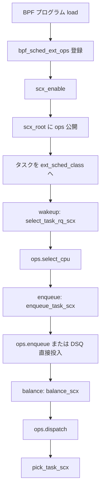

# 第15章 ext_sched_class と sched_ext_ops

> **本章で読むソース**
>
> - [`kernel/sched/ext_internal.h` L260-L308](https://github.com/gregkh/linux/blob/v6.18.38/kernel/sched/ext_internal.h#L260-L308)
> - [`kernel/sched/ext.c` L3342-L3376](https://github.com/gregkh/linux/blob/v6.18.38/kernel/sched/ext.c#L3342-L3376)
> - [`kernel/sched/ext.c` L3670-L3677](https://github.com/gregkh/linux/blob/v6.18.38/kernel/sched/ext.c#L3670-L3677)
> - [`kernel/sched/ext.c` L2551-L2585](https://github.com/gregkh/linux/blob/v6.18.38/kernel/sched/ext.c#L2551-L2585)
> - [`kernel/sched/ext.c` L5154-L5199](https://github.com/gregkh/linux/blob/v6.18.38/kernel/sched/ext.c#L5154-L5199)
> - [`kernel/sched/core.c` L8638-L8641](https://github.com/gregkh/linux/blob/v6.18.38/kernel/sched/core.c#L8638-L8641)

## この章の狙い

`CONFIG_SCHED_CLASS_EXT` が有効なとき追加される `ext_sched_class` と、BPF プログラムが実装する `sched_ext_ops` の接続を読む。
EEVDF（`fair_sched_class`）とは別の `sched_class` で、fair より優先度が低く idle より高い位置に置かれる。

## 前提

[ランキューとスケジューリングクラスの階層](../part01-core/08-runqueue-sched-class.md) と [try_to_wake_up と wakeup の中核](../part01-core/10-try-to-wake-up.md) を読んでいること。
`select_task_rq` が wakeup 時にクラスへ委譲する流れを知っていると、`select_task_rq_scx` の位置づけが明確になる。

## クラス階層での位置

`sched_init` の BUG_ON チェーンが、ext クラスが fair と idle のあいだに挿入されることを保証する。
`CONFIG_SCHED_CLASS_EXT` が無効なビルドではこの検査自体がコンパイルされない。

[`kernel/sched/core.c` L8638-L8641](https://github.com/gregkh/linux/blob/v6.18.38/kernel/sched/core.c#L8638-L8641)

```c
#ifdef CONFIG_SCHED_CLASS_EXT
	BUG_ON(!sched_class_above(&fair_sched_class, &ext_sched_class));
	BUG_ON(!sched_class_above(&ext_sched_class, &idle_sched_class));
#endif
```

通常の EEVDF タスクより優先度は低く、idle よりは高い。
RT や deadline には及ばない位置づけである。

## ext_sched_class の vtable

`DEFINE_SCHED_CLASS(ext)` がスケジューラコアから呼ばれるメソッド群を束ねる。
enqueue、pick、balance、wakeup 時の CPU 選択まで、通常の `sched_class` と同じインタフェースで BPF 側へ委譲する。

[`kernel/sched/ext.c` L3342-L3376](https://github.com/gregkh/linux/blob/v6.18.38/kernel/sched/ext.c#L3342-L3376)

```c
DEFINE_SCHED_CLASS(ext) = {
	.enqueue_task		= enqueue_task_scx,
	.dequeue_task		= dequeue_task_scx,
	.yield_task		= yield_task_scx,
	.yield_to_task		= yield_to_task_scx,

	.wakeup_preempt		= wakeup_preempt_scx,

	.balance		= balance_scx,
	.pick_task		= pick_task_scx,

	.put_prev_task		= put_prev_task_scx,
	.set_next_task		= set_next_task_scx,

	.select_task_rq		= select_task_rq_scx,
	.task_woken		= task_woken_scx,
	.set_cpus_allowed	= set_cpus_allowed_scx,

	.rq_online		= rq_online_scx,
	.rq_offline		= rq_offline_scx,

	.task_tick		= task_tick_scx,

	.switching_to		= switching_to_scx,
	.switched_from		= switched_from_scx,
	.switched_to		= switched_to_scx,
	.reweight_task		= reweight_task_scx,
	.prio_changed		= prio_changed_scx,

	.update_curr		= update_curr_scx,

#ifdef CONFIG_UCLAMP_TASK
	.uclamp_enabled		= 1,
#endif
};
```

## sched_ext_ops: BPF 側の操作テーブル

`struct sched_ext_ops` は BPF スケジューラが実装するコールバックの集合である。
`select_cpu` は wakeup 時の CPU 選択、`enqueue` は runnable 化、`dispatch` は DSQ への投入を担う。

[`kernel/sched/ext_internal.h` L260-L308](https://github.com/gregkh/linux/blob/v6.18.38/kernel/sched/ext_internal.h#L260-L308)

```c
 * struct sched_ext_ops - Operation table for BPF scheduler implementation
 *
 * A BPF scheduler can implement an arbitrary scheduling policy by
 * implementing and loading operations in this table. Note that a userland
 * scheduling policy can also be implemented using the BPF scheduler
 * as a shim layer.
 */
struct sched_ext_ops {
	/**
	 * @select_cpu: Pick the target CPU for a task which is being woken up
	 * @p: task being woken up
	 * @prev_cpu: the cpu @p was on before sleeping
	 * @wake_flags: SCX_WAKE_*
	 *
	 * Decision made here isn't final. @p may be moved to any CPU while it
	 * is getting dispatched for execution later. However, as @p is not on
	 * the rq at this point, getting the eventual execution CPU right here
	 * saves a small bit of overhead down the line.
	 *
	 * If an idle CPU is returned, the CPU is kicked and will try to
	 * dispatch. While an explicit custom mechanism can be added,
	 * select_cpu() serves as the default way to wake up idle CPUs.
	 *
	 * @p may be inserted into a DSQ directly by calling
	 * scx_bpf_dsq_insert(). If so, the ops.enqueue() will be skipped.
	 * Directly inserting into %SCX_DSQ_LOCAL will put @p in the local DSQ
	 * of the CPU returned by this operation.
	 *
	 * Note that select_cpu() is never called for tasks that can only run
	 * on a single CPU or tasks with migration disabled, as they don't have
	 * the option to select a different CPU. See select_task_rq() for
	 * details.
	 */
	s32 (*select_cpu)(struct task_struct *p, s32 prev_cpu, u64 wake_flags);

	/**
	 * @enqueue: Enqueue a task on the BPF scheduler
	 * @p: task being enqueued
	 * @enq_flags: %SCX_ENQ_*
	 *
	 * @p is ready to run. Insert directly into a DSQ by calling
	 * scx_bpf_dsq_insert() or enqueue on the BPF scheduler. If not directly
	 * inserted, the bpf scheduler owns @p and if it fails to dispatch @p,
	 * the task will stall.
	 *
	 * If @p was inserted into a DSQ from ops.select_cpu(), this callback is
	 * skipped.
	 */
	void (*enqueue)(struct task_struct *p, u64 enq_flags);
```

## BPF struct_ops への登録

カーネル内の `bpf_sched_ext_ops` が verifier と登録フックを束ね、ユーザー空間の BPF プログラムが `sched_ext_ops` の各フィールドを上書きできる。
デフォルト実装は `__bpf_ops_sched_ext_ops` に置かれ、未実装コールバックはスタブが呼ばれる。

[`kernel/sched/ext.c` L5154-L5199](https://github.com/gregkh/linux/blob/v6.18.38/kernel/sched/ext.c#L5154-L5199)

```c
static struct sched_ext_ops __bpf_ops_sched_ext_ops = {
	.select_cpu		= sched_ext_ops__select_cpu,
	.enqueue		= sched_ext_ops__enqueue,
	.dequeue		= sched_ext_ops__dequeue,
	.dispatch		= sched_ext_ops__dispatch,
	.tick			= sched_ext_ops__tick,
	.runnable		= sched_ext_ops__runnable,
	.running		= sched_ext_ops__running,
	.stopping		= sched_ext_ops__stopping,
	.quiescent		= sched_ext_ops__quiescent,
	.yield			= sched_ext_ops__yield,
	.core_sched_before	= sched_ext_ops__core_sched_before,
	.set_weight		= sched_ext_ops__set_weight,
	.set_cpumask		= sched_ext_ops__set_cpumask,
	.update_idle		= sched_ext_ops__update_idle,
	.cpu_acquire		= sched_ext_ops__cpu_acquire,
	.cpu_release		= sched_ext_ops__cpu_release,
	.init_task		= sched_ext_ops__init_task,
	.exit_task		= sched_ext_ops__exit_task,
	.enable			= sched_ext_ops__enable,
	.disable		= sched_ext_ops__disable,
	// ... (中略) ...
	.init			= sched_ext_ops__init,
	.exit			= sched_ext_ops__exit,
	.dump			= sched_ext_ops__dump,
	.dump_cpu		= sched_ext_ops__dump_cpu,
	.dump_task		= sched_ext_ops__dump_task,
};

static struct bpf_struct_ops bpf_sched_ext_ops = {
	.verifier_ops = &bpf_scx_verifier_ops,
	.reg = bpf_scx_reg,
	.unreg = bpf_scx_unreg,
	.check_member = bpf_scx_check_member,
	.init_member = bpf_scx_init_member,
```

## SCHED_EXT ポリシーと task_should_scx

タスクが ext クラスに載るかは `task_should_scx` が判定する。
`scx_switching_all` が立っているときは全タスクが対象となり、そうでなければ `SCHED_EXT` ポリシーのタスクだけが SCX へ移る。

[`kernel/sched/ext.c` L3670-L3677](https://github.com/gregkh/linux/blob/v6.18.38/kernel/sched/ext.c#L3670-L3677)

```c
bool task_should_scx(int policy)
{
	if (!scx_enabled() || unlikely(scx_enable_state() == SCX_DISABLING))
		return false;
	if (READ_ONCE(scx_switching_all))
		return true;
	return policy == SCHED_EXT;
}
```

`scx_enabled()` が false のビルドや無効時は、タスクは従来の fair クラスに留まる。

## wakeup 経路: select_task_rq_scx

`try_to_wake_up` から呼ばれる `select_task_rq` は、SCX タスクに対して `select_task_rq_scx` を実行する。
bypass 中はデフォルトの CPU 選択に落ち、通常時は BPF の `select_cpu` が呼ばれる。

[`kernel/sched/ext.c` L2551-L2585](https://github.com/gregkh/linux/blob/v6.18.38/kernel/sched/ext.c#L2551-L2585)

```c
	rq_bypass = scx_rq_bypassing(task_rq(p));
	if (likely(SCX_HAS_OP(sch, select_cpu)) && !rq_bypass) {
		s32 cpu;
		struct task_struct **ddsp_taskp;

		ddsp_taskp = this_cpu_ptr(&direct_dispatch_task);
		WARN_ON_ONCE(*ddsp_taskp);
		*ddsp_taskp = p;

		cpu = SCX_CALL_OP_TASK_RET(sch,
					   SCX_KF_ENQUEUE | SCX_KF_SELECT_CPU,
					   select_cpu, NULL, p, prev_cpu,
					   wake_flags);
		p->scx.selected_cpu = cpu;
		*ddsp_taskp = NULL;
		if (ops_cpu_valid(sch, cpu, "from ops.select_cpu()"))
			return cpu;
		else
			return prev_cpu;
	} else {
		s32 cpu;

		cpu = scx_select_cpu_dfl(p, prev_cpu, wake_flags, NULL, 0);
		if (cpu >= 0) {
			refill_task_slice_dfl(sch, p);
			p->scx.ddsp_dsq_id = SCX_DSQ_LOCAL;
		} else {
			cpu = prev_cpu;
		}
		p->scx.selected_cpu = cpu;

		if (rq_bypass)
			__scx_add_event(sch, SCX_EV_BYPASS_DISPATCH, 1);
		return cpu;
	}
```

`direct_dispatch_task` per-CPU 変数は、`select_cpu` 内から `scx_bpf_dsq_insert` で直接 DSQ 投入する経路を識別するために使われる。

## 処理の流れ



## 高速化の工夫: select_cpu での直接 DSQ 投入

`select_cpu` から `scx_bpf_dsq_insert` で DSQ に直接入れると、その後の `enqueue` コールバックがスキップされる。
wakeup から実行までのコールバック回数を減らし、配置とキューイングを1段にまとめる設計である。
`direct_dispatch_task` でどのタスクが直接投入中かをカーネル側が追跡する。

> **7.x 系での変化**
> 7.1.3 では `CONFIG_EXT_SUB_SCHED` が `SCHED_CLASS_EXT` と cgroup 有効時に既定で有効になり（[`init/Kconfig` L1193-L1195](https://github.com/gregkh/linux/blob/v7.1.3/init/Kconfig#L1193-L1195)）、単一の `scx_root` だけでなく cgroup 単位の sub-scheduler 階層が追加された。
> `sched_ext_ops` に `sub_attach` と `sub_detach` が加わり（[`kernel/sched/ext_internal.h` L744-L756](https://github.com/gregkh/linux/blob/v7.1.3/kernel/sched/ext_internal.h#L744-L756)）、`sub_cgroup_id` で接続先 cgroup を指定する（[`kernel/sched/ext_internal.h` L837-L841](https://github.com/gregkh/linux/blob/v7.1.3/kernel/sched/ext_internal.h#L837-L841)）。
> BPF 側から子 scheduler へ dispatch する入口は `scx_bpf_sub_dispatch` で、内部で `scx_dispatch_sched(child, ...)` を呼ぶ（[`kernel/sched/ext.c` L8655-L8690](https://github.com/gregkh/linux/blob/v7.1.3/kernel/sched/ext.c#L8655-L8690)）。

[`kernel/sched/ext.c` L8655-L8690](https://github.com/gregkh/linux/blob/v7.1.3/kernel/sched/ext.c#L8655-L8690)

```c
/**
 * scx_bpf_sub_dispatch - Trigger dispatching on a child scheduler
 * @cgroup_id: cgroup ID of the child scheduler to dispatch
 * @aux: implicit BPF argument to access bpf_prog_aux hidden from BPF progs
 *
 * Allows a parent scheduler to trigger dispatching on one of its direct
 * child schedulers. The child scheduler runs its dispatch operation to
 * move tasks from dispatch queues to the local runqueue.
 *
 * Returns: true on success, false if cgroup_id is invalid, not a direct
 * child, or caller lacks dispatch permission.
 */
__bpf_kfunc bool scx_bpf_sub_dispatch(u64 cgroup_id, const struct bpf_prog_aux *aux)
{
	struct rq *this_rq = this_rq();
	struct scx_sched *parent, *child;

	guard(rcu)();
	parent = scx_prog_sched(aux);
	if (unlikely(!parent))
		return false;

	child = scx_find_sub_sched(cgroup_id);

	if (unlikely(!child))
		return false;

	if (unlikely(scx_parent(child) != parent)) {
		scx_error(parent, "trying to dispatch a distant sub-sched on cgroup %llu",
			  cgroup_id);
		return false;
	}

	return scx_dispatch_sched(child, this_rq, this_rq->scx.sub_dispatch_prev,
				  true);
}
```

## まとめ

`ext_sched_class` は fair と idle のあいだに位置するスケジューリングクラスであり、実ポリシーは BPF が提供する `sched_ext_ops` に委譲される。
`bpf_struct_ops` 機構が verifier 付きで ops テーブルをユーザー空間から差し替える。
wakeup 時の CPU 選択は `select_task_rq_scx` 経由で `select_cpu` に届く。

## 関連する章

- [try_to_wake_up と wakeup の中核](../part01-core/10-try-to-wake-up.md)
- [DSQ とディスパッチ実行の流れ](16-dsq-dispatch-flow.md)
- [有効化と bypass](17-enable-bypass-idle.md)
- [ランキューとスケジューリングクラスの階層](../part01-core/08-runqueue-sched-class.md)
