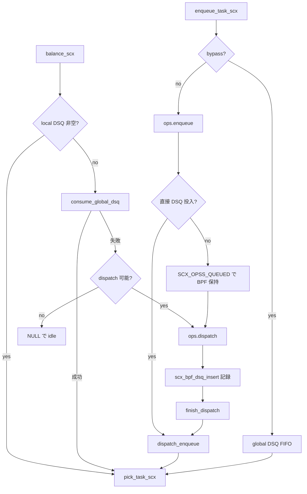

# 第16章 DSQ とディスパッチ実行の流れ

> **本章で読むソース**
>
> - [`kernel/sched/ext.c` L923-L945](https://github.com/gregkh/linux/blob/v6.18.38/kernel/sched/ext.c#L923-L945)
> - [`kernel/sched/ext.c` L1278-L1324](https://github.com/gregkh/linux/blob/v6.18.38/kernel/sched/ext.c#L1278-L1324)
> - [`kernel/sched/ext.c` L2058-L2071](https://github.com/gregkh/linux/blob/v6.18.38/kernel/sched/ext.c#L2058-L2071)
> - [`kernel/sched/ext.c` L2113-L2141](https://github.com/gregkh/linux/blob/v6.18.38/kernel/sched/ext.c#L2113-L2141)
> - [`kernel/sched/ext.c` L2418-L2490](https://github.com/gregkh/linux/blob/v6.18.38/kernel/sched/ext.c#L2418-L2490)
> - [`kernel/sched/ext_internal.h` L886-L896](https://github.com/gregkh/linux/blob/v6.18.38/kernel/sched/ext_internal.h#L886-L896)
> - [`kernel/sched/ext.c` L1874-L1879](https://github.com/gregkh/linux/blob/v6.18.38/kernel/sched/ext.c#L1874-L1879)
> - [`kernel/sched/ext.c` L1985-L1990](https://github.com/gregkh/linux/blob/v6.18.38/kernel/sched/ext.c#L1985-L1990)
> - [`kernel/sched/ext.c` L6024-L6032](https://github.com/gregkh/linux/blob/v6.18.38/kernel/sched/ext.c#L6024-L6032)

## この章の狙い

**ディスパッチキュー**（DSQ）への投入から `pick_task_scx` による実行タスク選出まで、SCX の実行経路を追う。
BPF スケジューラが `dispatch` で DSQ を埋め、カーネルが local DSQ からタスクを取り出す流れを読む。

## 前提

[ext_sched_class と sched_ext_ops](15-ext-sched-class-ops.md) を読んでいること。
`sched_ext_ops` の `enqueue` と `dispatch` の役割分担を知っていると、本章の DSQ 経路がつながる。

## DSQ の種類

DSQ には組み込みとユーザー定義がある。
`SCX_DSQ_LOCAL` は各 CPU の local DSQである。
`SCX_DSQ_GLOBAL` は論理的な global ID だが、スケーラビリティのため per-node DSQ に分割され、各 CPU は自ノードの global DSQ から消費する。
ユーザー DSQ の作成は `scx_bpf_create_dsq`、既存 DSQ への投入は `scx_bpf_dsq_insert` が担う。

`dispatch` コールバックは local DSQ が空のときに呼ばれ、BPF スケジューラがタスクを DSQ へ流し込む責務を持つ。

[`kernel/sched/ext_internal.h` L886-L896](https://github.com/gregkh/linux/blob/v6.18.38/kernel/sched/ext_internal.h#L886-L896)

```c
	/*
	 * Dispatch queues.
	 *
	 * The global DSQ (%SCX_DSQ_GLOBAL) is split per-node for scalability.
	 * This is to avoid live-locking in bypass mode where all tasks are
	 * dispatched to %SCX_DSQ_GLOBAL and all CPUs consume from it. If
	 * per-node split isn't sufficient, it can be further split.
	 */
	struct rhashtable	dsq_hash;
	struct scx_dispatch_q	**global_dsqs;
	struct scx_sched_pcpu __percpu *pcpu;
```

[`kernel/sched/ext.c` L1874-L1879](https://github.com/gregkh/linux/blob/v6.18.38/kernel/sched/ext.c#L1874-L1879)

```c
static bool consume_global_dsq(struct scx_sched *sch, struct rq *rq)
{
	int node = cpu_to_node(cpu_of(rq));

	return consume_dispatch_q(sch, rq, sch->global_dsqs[node]);
}
```

[`kernel/sched/ext.c` L6024-L6032](https://github.com/gregkh/linux/blob/v6.18.38/kernel/sched/ext.c#L6024-L6032)

```c
/**
 * scx_bpf_create_dsq - Create a custom DSQ
 * @dsq_id: DSQ to create
 * @node: NUMA node to allocate from
 *
 * Create a custom DSQ identified by @dsq_id. Can be called from any sleepable
 * scx callback, and any BPF_PROG_TYPE_SYSCALL prog.
 */
__bpf_kfunc s32 scx_bpf_create_dsq(u64 dsq_id, s32 node)
```

`dispatch` コールバックは local DSQ が空のときに呼ばれ、BPF スケジューラが `scx_bpf_dsq_insert` で既存 DSQ へ流し込む。

[`kernel/sched/ext_internal.h` L326-L347](https://github.com/gregkh/linux/blob/v6.18.38/kernel/sched/ext_internal.h#L326-L347)

```c
	/**
	 * @dispatch: Dispatch tasks from the BPF scheduler and/or user DSQs
	 * @cpu: CPU to dispatch tasks for
	 * @prev: previous task being switched out
	 *
	 * Called when a CPU's local dsq is empty. The operation should dispatch
	 * one or more tasks from the BPF scheduler into the DSQs using
	 * scx_bpf_dsq_insert() and/or move from user DSQs into the local DSQ
	 * using scx_bpf_dsq_move_to_local().
	 *
	 * The maximum number of times scx_bpf_dsq_insert() can be called
	 * without an intervening scx_bpf_dsq_move_to_local() is specified by
	 * ops.dispatch_max_batch. See the comments on top of the two functions
	 * for more details.
	 *
	 * When not %NULL, @prev is an SCX task with its slice depleted. If
	 * @prev is still runnable as indicated by set %SCX_TASK_QUEUED in
	 * @prev->scx.flags, it is not enqueued yet and will be enqueued after
	 * ops.dispatch() returns. To keep executing @prev, return without
	 * dispatching or moving any tasks. Also see %SCX_OPS_ENQ_LAST.
	 */
	void (*dispatch)(s32 cpu, struct task_struct *prev);
```

## enqueue 経路: BPF か DSQ か

`do_enqueue_task` は bypass 中でなければ `ops.enqueue` を呼ぶ。
BPF が DSQ に直接投入しなかったタスクは `SCX_OPSS_QUEUED` 状態で BPF 側のキューに残り、後続の `dispatch` が DSQ へ流す。

[`kernel/sched/ext.c` L1278-L1324](https://github.com/gregkh/linux/blob/v6.18.38/kernel/sched/ext.c#L1278-L1324)

```c
	if (scx_rq_bypassing(rq)) {
		__scx_add_event(sch, SCX_EV_BYPASS_DISPATCH, 1);
		goto global;
	}

	if (p->scx.ddsp_dsq_id != SCX_DSQ_INVALID)
		goto direct;

	// ... (中略) ...

	if (unlikely(!SCX_HAS_OP(sch, enqueue)))
		goto global;

	/* DSQ bypass didn't trigger, enqueue on the BPF scheduler */
	qseq = rq->scx.ops_qseq++ << SCX_OPSS_QSEQ_SHIFT;

	WARN_ON_ONCE(atomic_long_read(&p->scx.ops_state) != SCX_OPSS_NONE);
	atomic_long_set(&p->scx.ops_state, SCX_OPSS_QUEUEING | qseq);

	ddsp_taskp = this_cpu_ptr(&direct_dispatch_task);
	WARN_ON_ONCE(*ddsp_taskp);
	*ddsp_taskp = p;

	SCX_CALL_OP_TASK(sch, SCX_KF_ENQUEUE, enqueue, rq, p, enq_flags);

	*ddsp_taskp = NULL;
	if (p->scx.ddsp_dsq_id != SCX_DSQ_INVALID)
		goto direct;

	/*
	 * If not directly dispatched, QUEUEING isn't clear yet and dispatch or
	 * dequeue may be waiting. The store_release matches their load_acquire.
	 */
	atomic_long_set_release(&p->scx.ops_state, SCX_OPSS_QUEUED | qseq);
	return;
```

bypass 中は global DSQ への FIFO 投入に落ち、BPF の `enqueue` は呼ばれない。

## dispatch_enqueue と local DSQ 投入後の resched

`dispatch_enqueue` が DSQ リストへタスクを挿入したあと、`local_dsq_post_enq` が idle キックやプリエンプトを判断する。
`SCX_ENQ_PREEMPT` フラグ付き投入では実行中 SCX タスクの slice を 0 にして即 resched を促す。

[`kernel/sched/ext.c` L923-L945](https://github.com/gregkh/linux/blob/v6.18.38/kernel/sched/ext.c#L923-L945)

```c
static void local_dsq_post_enq(struct scx_dispatch_q *dsq, struct task_struct *p,
			       u64 enq_flags)
{
	struct rq *rq = container_of(dsq, struct rq, scx.local_dsq);
	bool preempt = false;

	/*
	 * If @rq is in balance, the CPU is already vacant and looking for the
	 * next task to run. No need to preempt or trigger resched after moving
	 * @p into its local DSQ.
	 */
	if (rq->scx.flags & SCX_RQ_IN_BALANCE)
		return;

	if ((enq_flags & SCX_ENQ_PREEMPT) && p != rq->curr &&
	    rq->curr->sched_class == &ext_sched_class) {
		rq->curr->scx.slice = 0;
		preempt = true;
	}

	if (preempt || sched_class_above(&ext_sched_class, rq->curr->sched_class))
		resched_curr(rq);
}
```

`SCX_RQ_IN_BALANCE` 中は balance ループがすでに次タスクを探しているため、余計な resched を抑える。

## balance_scx: dispatch ループ

`balance_one` は local DSQ、global DSQ、BPF `dispatch` の順でタスクを探す。
local DSQ が空で `dispatch` が実装されていれば、BPF へ制御が渡る。

[`kernel/sched/ext.c` L2113-L2141](https://github.com/gregkh/linux/blob/v6.18.38/kernel/sched/ext.c#L2113-L2141)

```c
	if (prev_on_scx) {
		update_curr_scx(rq);

		/*
		 * If @prev is runnable & has slice left, it has priority and
		 * fetching more just increases latency for the fetched tasks.
		 * Tell pick_task_scx() to keep running @prev. If the BPF
		 * scheduler wants to handle this explicitly, it should
		 * implement ->cpu_release().
		 *
		 * See scx_disable_workfn() for the explanation on the bypassing
		 * test.
		 */
		if (prev_on_rq && prev->scx.slice && !scx_rq_bypassing(rq)) {
			rq->scx.flags |= SCX_RQ_BAL_KEEP;
			goto has_tasks;
		}
	}

	/* if there already are tasks to run, nothing to do */
	if (rq->scx.local_dsq.nr)
		goto has_tasks;

	if (consume_global_dsq(sch, rq))
		goto has_tasks;

	if (unlikely(!SCX_HAS_OP(sch, dispatch)) ||
	    scx_rq_bypassing(rq) || !scx_rq_online(rq))
		goto no_tasks;
```

`prev` に slice が残り runnable なら `SCX_RQ_BAL_KEEP` を立て、無駄な dispatch を避ける。
bypass 中は slice を信用せず、常にキューから取り直す（次章参照）。

## dispatch バッファの二段階完了

`scx_bpf_dsq_insert` は per-CPU の dispatch バッファにエントリを記録し、`ops.dispatch` 返却後に `finish_dispatch` で実 DSQ へ反映する。
`ops.dispatch` 内で待機や rq ロックの持ち替えをするとロック順序が逆転しうるため、記録と完了を分離する。

[`kernel/sched/ext.c` L1985-L1990](https://github.com/gregkh/linux/blob/v6.18.38/kernel/sched/ext.c#L1985-L1990)

```c
 * Dispatching to local DSQs may need to wait for queueing to complete or
 * require rq lock dancing. As we don't wanna do either while inside
 * ops.dispatch() to avoid locking order inversion, we split dispatching into
 * two parts. scx_bpf_dsq_insert() which is called by ops.dispatch() records the
 * task and its qseq. Once ops.dispatch() returns, this function is called to
 * finish up.
```

[`kernel/sched/ext.c` L2058-L2071](https://github.com/gregkh/linux/blob/v6.18.38/kernel/sched/ext.c#L2058-L2071)

```c
static void flush_dispatch_buf(struct scx_sched *sch, struct rq *rq)
{
	struct scx_dsp_ctx *dspc = this_cpu_ptr(scx_dsp_ctx);
	u32 u;

	for (u = 0; u < dspc->cursor; u++) {
		struct scx_dsp_buf_ent *ent = &dspc->buf[u];

		finish_dispatch(sch, rq, ent->task, ent->qseq, ent->dsq_id,
				ent->enq_flags);
	}

	dspc->nr_tasks += dspc->cursor;
	dspc->cursor = 0;
}
```

`dispatch_max_batch` がバッチサイズの上限を決める。
`flush_dispatch_buf` は記録済みエントリを順に `finish_dispatch` へ渡す。

## pick_task_scx: local DSQ からの取出し

balance の結果として `SCX_RQ_BAL_KEEP` が立っていれば `prev` を継続実行する。
そうでなければ local DSQ の先頭タスクを取り出す。

[`kernel/sched/ext.c` L2418-L2490](https://github.com/gregkh/linux/blob/v6.18.38/kernel/sched/ext.c#L2418-L2490)

```c
static struct task_struct *pick_task_scx(struct rq *rq)
{
	struct task_struct *prev = rq->curr;
	struct task_struct *p;
	bool keep_prev = rq->scx.flags & SCX_RQ_BAL_KEEP;
	bool kick_idle = false;

	/* see kick_cpus_irq_workfn() */
	smp_store_release(&rq->scx.pnt_seq, rq->scx.pnt_seq + 1);

	// ... (中略) ...

	if (keep_prev) {
		p = prev;
		if (!p->scx.slice)
			refill_task_slice_dfl(rcu_dereference_sched(scx_root), p);
	} else {
		p = first_local_task(rq);
		if (!p) {
			if (kick_idle)
				scx_kick_cpu(rcu_dereference_sched(scx_root),
					     cpu_of(rq), SCX_KICK_IDLE);
			return NULL;
		}

		if (unlikely(!p->scx.slice)) {
			struct scx_sched *sch = rcu_dereference_sched(scx_root);

			if (!scx_rq_bypassing(rq) && !sch->warned_zero_slice) {
				printk_deferred(KERN_WARNING "sched_ext: %s[%d] has zero slice in %s()\n",
						p->comm, p->pid, __func__);
				sch->warned_zero_slice = true;
			}
			refill_task_slice_dfl(sch, p);
		}
	}

	return p;
}
```

local DSQ が空のまま idle に落ちる場合、`kick_idle` が立っていれば `scx_kick_cpu` が当該 CPU（`cpu_of(rq)`）を deferred kick する。

## 処理の流れ



## 高速化の工夫: dispatch バッファと BAL_KEEP

2つの最適化が重なる。
dispatch バッファは `ops.dispatch` 内で rq ロックの持ち替えを避け、ロック順序逆転を防ぐ二段階完了機構である。
`SCX_RQ_BAL_KEEP` は slice 残りの runnable タスクをわざわざ dequeue して dispatch し直さず、CPU で走り続けさせる。
後者は「BPF コールバック回数」と「DSQ 往復」を減らすための機構である。

## まとめ

SCX の実行は DSQ を介して進む。
enqueue は BPF 側の論理キューか直接 DSQ 投入に分岐し、balance が local と global DSQ を枯渇させたあと `dispatch` で補充する。
`pick_task_scx` は local DSQ 先頭か slice 残りの `prev` を選び、ここで実際のコンテキストスイッチ先が決まる。

> **7.x 系での変化**
> 7.1.3 では SCX runnable 開始時に `rq->ext_server` へ `dl_server_start` が呼ばれ（[`kernel/sched/ext.c` L2057-L2059](https://github.com/gregkh/linux/blob/v7.1.3/kernel/sched/ext.c#L2057-L2059)）、実行時間は `update_curr_scx` から `dl_server_update` で計上される（[`kernel/sched/ext.c` L1338-L1353](https://github.com/gregkh/linux/blob/v7.1.3/kernel/sched/ext.c#L1338-L1353)）。
> タスク選出は `ext_server_pick_task` が `do_pick_task_scx` を `force_scx` 付きで呼び、`ext_server_init` が `dl_server_init` と接続する（[`kernel/sched/ext.c` L3243-L3267](https://github.com/gregkh/linux/blob/v7.1.3/kernel/sched/ext.c#L3243-L3267)）。

## 関連する章

- [ext_sched_class と sched_ext_ops](15-ext-sched-class-ops.md)
- [有効化と bypass](17-enable-bypass-idle.md)
- [__schedule とコンテキストスイッチ](../part01-core/09-schedule-context-switch.md)
- [enqueue と dequeue と pick_next_task](../part02-eevdf/13-enqueue-dequeue-pick.md)
