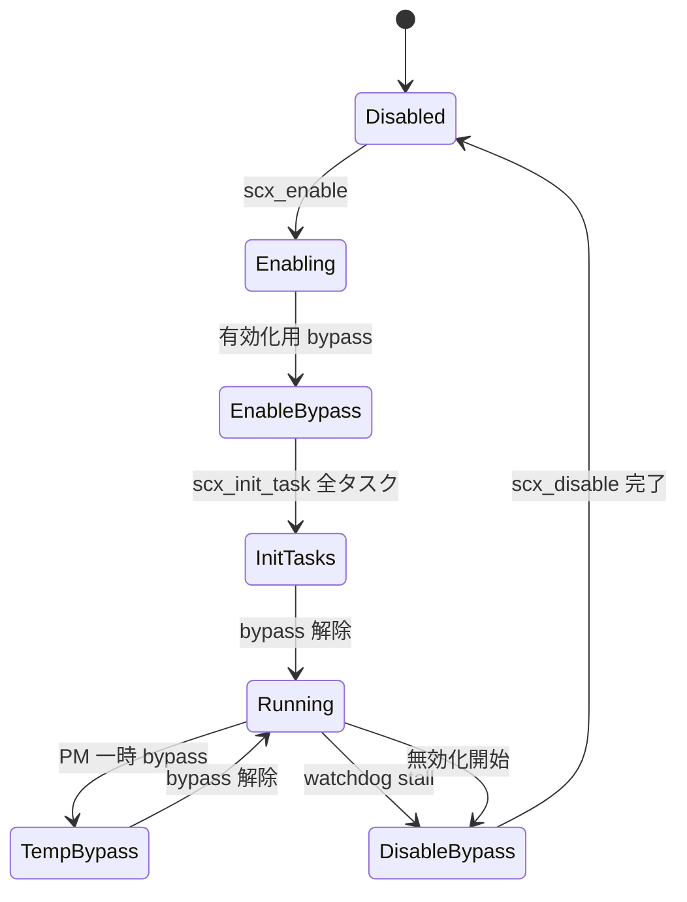

# 第17章 有効化と bypass、ext_idle

> **本章で読むソース**
>
> - [`kernel/sched/ext.c` L3771-L3819](https://github.com/gregkh/linux/blob/v6.18.38/kernel/sched/ext.c#L3771-L3819)
> - [`kernel/sched/ext.c` L4760-L4767](https://github.com/gregkh/linux/blob/v6.18.38/kernel/sched/ext.c#L4760-L4767)
> - [`kernel/sched/ext.c` L4836-L4837](https://github.com/gregkh/linux/blob/v6.18.38/kernel/sched/ext.c#L4836-L4837)
> - [`kernel/sched/ext.c` L4918-L4949](https://github.com/gregkh/linux/blob/v6.18.38/kernel/sched/ext.c#L4918-L4949)
> - [`kernel/sched/ext_idle.c` L797-L810](https://github.com/gregkh/linux/blob/v6.18.38/kernel/sched/ext_idle.c#L797-L810)
> - [`kernel/sched/ext_idle.c` L344-L405](https://github.com/gregkh/linux/blob/v6.18.38/kernel/sched/ext_idle.c#L344-L405)

## この章の狙い

BPF スケジューラの有効化シーケンスと、障害時や移行中に使う **bypass** モードを読む。
あわせて `ext_idle.c` が担う組み込み idle CPU 選択ポリシーの有効化も追う。

## 前提

[DSQ とディスパッチ実行の流れ](16-dsq-dispatch-flow.md) を読んでいること。
bypass 中の enqueue と dispatch の挙動変化を知っていると、本章の `scx_bypass` の意図が明確になる。

## scx_enable の入口

ユーザー空間からの有効化要求は `scx_enable` が受け、専用 kthread worker 上で `scx_enable_workfn` を実行する。
`isolcpus=` ドメイン分離とは非互換であり、早期に `-EINVAL` を返す。

[`kernel/sched/ext.c` L4918-L4949](https://github.com/gregkh/linux/blob/v6.18.38/kernel/sched/ext.c#L4918-L4949)

```c
static int scx_enable(struct sched_ext_ops *ops, struct bpf_link *link)
{
	static struct kthread_worker *helper;
	static DEFINE_MUTEX(helper_mutex);
	struct scx_enable_cmd cmd;

	if (!cpumask_equal(housekeeping_cpumask(HK_TYPE_DOMAIN),
			   cpu_possible_mask)) {
		pr_err("sched_ext: Not compatible with \"isolcpus=\" domain isolation\n");
		return -EINVAL;
	}

	if (!READ_ONCE(helper)) {
		mutex_lock(&helper_mutex);
		if (!helper) {
			helper = kthread_run_worker(0, "scx_enable_helper");
			if (IS_ERR_OR_NULL(helper)) {
				helper = NULL;
				mutex_unlock(&helper_mutex);
				return -ENOMEM;
			}
			sched_set_fifo(helper->task);
		}
		mutex_unlock(&helper_mutex);
	}

	kthread_init_work(&cmd.work, scx_enable_workfn);
	cmd.ops = ops;

	kthread_queue_work(READ_ONCE(helper), &cmd.work);
	kthread_flush_work(&cmd.work);
	return cmd.ret;
}
```

有効化本体はプロセスコンテキストで長時間かかるため、スケジューラの hot path から切り離されている。

## 有効化中の bypass

`scx_enable_workfn` は全タスクを SCX に移す前に `scx_bypass(true)` を呼ぶ。
BPF スケジューラがまだ全タスクを正しく扱えない段階でも、グローバル FIFO で前進を保証するためである。

[`kernel/sched/ext.c` L4760-L4767](https://github.com/gregkh/linux/blob/v6.18.38/kernel/sched/ext.c#L4760-L4767)

```c
	/*
	 * Once __scx_enabled is set, %current can be switched to SCX anytime.
	 * This can lead to stalls as some BPF schedulers (e.g. userspace
	 * scheduling) may not function correctly before all tasks are switched.
	 * Init in bypass mode to guarantee forward progress.
	 */
	scx_bypass(true);
	scx_bypassed_for_enable = true;
```

全タスクの初期化と `scx_enabled` の static branch 有効化のあと、最終的に bypass を解除する。
`scx_switching_all` は `SCX_OPS_SWITCH_PARTIAL` フラグの有無で全タスク切替か部分切替かを決める。

[`kernel/sched/ext.c` L4836-L4837](https://github.com/gregkh/linux/blob/v6.18.38/kernel/sched/ext.c#L4836-L4837)

```c
	WRITE_ONCE(scx_switching_all, !(ops->flags & SCX_OPS_SWITCH_PARTIAL));
	static_branch_enable(&__scx_enabled);
```

`CONFIG_SCHED_CLASS_EXT` が無効なカーネルでは本章の経路は存在しない。

## scx_bypass の意味

bypass は BPF スケジューラを信用せず、カーネル内蔵のグローバル FIFO へフォールバックするモードである。
`scx_bypass_depth` でネストを数え、深さが 0 に戻るまで bypass 状態を維持する。

[`kernel/sched/ext.c` L3771-L3819](https://github.com/gregkh/linux/blob/v6.18.38/kernel/sched/ext.c#L3771-L3819)

```c
 * scx_bypass - [Un]bypass scx_ops and guarantee forward progress
 * @bypass: true for bypass, false for unbypass
 *
 * Bypassing guarantees that all runnable tasks make forward progress without
 * trusting the BPF scheduler. We can't grab any mutexes or rwsems as they might
 * be held by tasks that the BPF scheduler is forgetting to run, which
 * unfortunately also excludes toggling the static branches.
 *
 * Let's work around by overriding a couple ops and modifying behaviors based on
 * the DISABLING state and then cycling the queued tasks through dequeue/enqueue
 * to force global FIFO scheduling.
 *
 * - ops.select_cpu() is ignored and the default select_cpu() is used.
 *
 * - ops.enqueue() is ignored and tasks are queued in simple global FIFO order.
 *   %SCX_OPS_ENQ_LAST is also ignored.
 *
 * - ops.dispatch() is ignored.
 *
 * - balance_scx() does not set %SCX_RQ_BAL_KEEP on non-zero slice as slice
 *   can't be trusted. Whenever a tick triggers, the running task is rotated to
 *   the tail of the queue with core_sched_at touched.
 *
 * - pick_next_task() suppresses zero slice warning.
 *
 * - scx_kick_cpu() is disabled to avoid irq_work malfunction during PM
 *   operations.
 *
 * - scx_prio_less() reverts to the default core_sched_at order.
 */
static void scx_bypass(bool bypass)
{
	static DEFINE_RAW_SPINLOCK(bypass_lock);
	static unsigned long bypass_timestamp;
	struct scx_sched *sch;
	unsigned long flags;
	int cpu;

	raw_spin_lock_irqsave(&bypass_lock, flags);
	sch = rcu_dereference_bh(scx_root);

	if (bypass) {
		scx_bypass_depth++;
		WARN_ON_ONCE(scx_bypass_depth <= 0);
		if (scx_bypass_depth != 1)
			goto unlock;
		bypass_timestamp = ktime_get_ns();
		if (sch)
			scx_add_event(sch, SCX_EV_BYPASS_ACTIVATE, 1);
```

各 rq の `SCX_RQ_BYPASSING` フラグを立て、全 runnable タスクを dequeue と enqueue で走査し直す。
mutex を取れない制約のため、static branch の切替ではなく per-rq フラグで挙動を上書きする。

無効化パスでは bypass が入り、watchdog タイムアウトは `scx_exit` を介してその無効化パスへ進む。
いずれも「BPF がタスクを忘れたままシステムが停止する」事態を避ける安全装置である。

## ext_idle: 組み込み idle CPU 選択

`ext_idle.c` は BPF スケジューラが `update_idle` を実装しない場合に使う、カーネル内蔵の idle CPU 追跡である。
`scx_idle_enable` が static branch で組み込みポリシーの有効化を切り替える。

[`kernel/sched/ext_idle.c` L797-L810](https://github.com/gregkh/linux/blob/v6.18.38/kernel/sched/ext_idle.c#L797-L810)

```c
void scx_idle_enable(struct sched_ext_ops *ops)
{
	if (!ops->update_idle || (ops->flags & SCX_OPS_KEEP_BUILTIN_IDLE))
		static_branch_enable_cpuslocked(&scx_builtin_idle_enabled);
	else
		static_branch_disable_cpuslocked(&scx_builtin_idle_enabled);

	if (ops->flags & SCX_OPS_BUILTIN_IDLE_PER_NODE)
		static_branch_enable_cpuslocked(&scx_builtin_idle_per_node);
	else
		static_branch_disable_cpuslocked(&scx_builtin_idle_per_node);

	reset_idle_masks(ops);
}
```

`update_idle` を BPF が提供し、かつ `SCX_OPS_KEEP_BUILTIN_IDLE` が無い場合は組み込み idle 追跡を無効にする。
NUMA ノード単位の idle マスクは `SCX_OPS_BUILTIN_IDLE_PER_NODE` で切り替わる。

トポロジ更新は `scx_idle_update_selcpu_topology` がオンライン CPU の LLC ドメイン数を見て、LLC や NUMA 向けの最適化を有効化する。

[`kernel/sched/ext_idle.c` L344-L405](https://github.com/gregkh/linux/blob/v6.18.38/kernel/sched/ext_idle.c#L344-L405)

```c
void scx_idle_update_selcpu_topology(struct sched_ext_ops *ops)
{
	bool enable_llc = false, enable_numa = false;
	unsigned int nr_cpus;
	s32 cpu = cpumask_first(cpu_online_mask);

	/*
	 * Enable LLC domain optimization only when there are multiple LLC
	 * domains among the online CPUs. If all online CPUs are part of a
	 * single LLC domain, the idle CPU selection logic can choose any
	 * online CPU without bias.
	 *
	 * Note that it is sufficient to check the LLC domain of the first
	 * online CPU to determine whether a single LLC domain includes all
	 * CPUs.
	 */
	rcu_read_lock();
	nr_cpus = llc_weight(cpu);
	if (nr_cpus > 0) {
		if (nr_cpus < num_online_cpus())
			enable_llc = true;
		pr_debug("sched_ext: LLC=%*pb weight=%u\n",
			 cpumask_pr_args(llc_span(cpu)), llc_weight(cpu));
	}

	/*
	 * Enable NUMA optimization only when there are multiple NUMA domains
	 * among the online CPUs and the NUMA domains don't perfectly overlaps
	 * with the LLC domains.
	 *
	 * If all CPUs belong to the same NUMA node and the same LLC domain,
	 * enabling both NUMA and LLC optimizations is unnecessary, as checking
	 * for an idle CPU in the same domain twice is redundant.
	 *
	 * If SCX_OPS_BUILTIN_IDLE_PER_NODE is enabled ignore the NUMA
	 * optimization, as we would naturally select idle CPUs within
	 * specific NUMA nodes querying the corresponding per-node cpumask.
	 */
	if (!(ops->flags & SCX_OPS_BUILTIN_IDLE_PER_NODE)) {
		nr_cpus = numa_weight(cpu);
		if (nr_cpus > 0) {
			if (nr_cpus < num_online_cpus() && llc_numa_mismatch())
				enable_numa = true;
			pr_debug("sched_ext: NUMA=%*pb weight=%u\n",
				 cpumask_pr_args(numa_span(cpu)), nr_cpus);
		}
	}
	rcu_read_unlock();

	pr_debug("sched_ext: LLC idle selection %s\n",
		 str_enabled_disabled(enable_llc));
	pr_debug("sched_ext: NUMA idle selection %s\n",
		 str_enabled_disabled(enable_numa));

	if (enable_llc)
		static_branch_enable_cpuslocked(&scx_selcpu_topo_llc);
	else
		static_branch_disable_cpuslocked(&scx_selcpu_topo_llc);
	if (enable_numa)
		static_branch_enable_cpuslocked(&scx_selcpu_topo_numa);
	else
		static_branch_disable_cpuslocked(&scx_selcpu_topo_numa);
}
```

`select_cpu` のデフォルト実装（`scx_select_cpu_dfl`）はこれらの idle マスクを参照し、アイドル CPU への wakeup を効率化する。

## 処理の流れ



PM 操作中は `scx_pm_handler` が `scx_bypass(true/false)` を対に呼び、解除後は Running に戻る（[`kernel/sched/ext.c` L5421-L5432](https://github.com/gregkh/linux/blob/v6.18.38/kernel/sched/ext.c#L5421-L5432)）。

[`kernel/sched/ext.c` L5421-L5432](https://github.com/gregkh/linux/blob/v6.18.38/kernel/sched/ext.c#L5421-L5432)

```c
	switch (event) {
	case PM_HIBERNATION_PREPARE:
	case PM_SUSPEND_PREPARE:
	case PM_RESTORE_PREPARE:
		scx_bypass(true);
		break;
	case PM_POST_HIBERNATION:
	case PM_POST_SUSPEND:
	case PM_POST_RESTORE:
		scx_bypass(false);
		break;
	}
```

watchdog timeout は bypass ではなく `scx_exit(..., SCX_EXIT_ERROR_STALL, ...)` を呼び、disable 側へ進む（[`kernel/sched/ext.c` L2675-L2687](https://github.com/gregkh/linux/blob/v6.18.38/kernel/sched/ext.c#L2675-L2687)、[`kernel/sched/ext.c` L2722-L2730](https://github.com/gregkh/linux/blob/v6.18.38/kernel/sched/ext.c#L2722-L2730)）。

[`kernel/sched/ext.c` L2675-L2687](https://github.com/gregkh/linux/blob/v6.18.38/kernel/sched/ext.c#L2675-L2687)

```c
	list_for_each_entry(p, &rq->scx.runnable_list, scx.runnable_node) {
		unsigned long last_runnable = p->scx.runnable_at;

		if (unlikely(time_after(jiffies,
					last_runnable + scx_watchdog_timeout))) {
			u32 dur_ms = jiffies_to_msecs(jiffies - last_runnable);

			scx_exit(sch, SCX_EXIT_ERROR_STALL, 0,
				 "%s[%d] failed to run for %u.%03us",
				 p->comm, p->pid, dur_ms / 1000, dur_ms % 1000);
			timed_out = true;
			break;
		}
	}
```

有効化中の bypass は全タスク移行が終わるまでの一時状態である。
無効化パスと watchdog stall は DisableBypass 経由で Disabled へ落ちる。

> **7.x 系での変化**
> 7.1.3 では bypass が global な `scx_bypass_depth` と per-rq フラグから、scheduler ごとの `bypass_depth` と per-CPU `bypass_dsq`、sub-sched 時の ancestor fallback へ再編された（[`kernel/sched/ext_internal.h` L986-L1033](https://github.com/gregkh/linux/blob/v7.1.3/kernel/sched/ext_internal.h#L986-L1033)、[`kernel/sched/ext.c` L348-L371](https://github.com/gregkh/linux/blob/v7.1.3/kernel/sched/ext.c#L348-L371)、[`kernel/sched/ext.c` L5323-L5477](https://github.com/gregkh/linux/blob/v7.1.3/kernel/sched/ext.c#L5323-L5477)）。
> `scx_bypass` は対象 `scx_sched` を引数に取り、子孫 scheduler へ bypass 状態を伝播する。

## 高速化の工夫: static branch による有効化判定

`scx_enabled()` は `static_branch` で hot path の分岐コストを抑える。
無効時は SCX 関連コードへの入り口自体がほぼ no-op に近づく。
有効化は一度きりの重い処理として worker に逃がし、平常時の `schedule` 経路への影響を局所化する設計である。

## まとめ

`scx_enable` は worker 上で全タスクを SCX へ移行し、その間は bypass で FIFO フォールバックを強制する。
bypass は BPF ops を無視して global DSQ へ流す安全モードであり、深さカウンタでネストを管理する。
`ext_idle.c` は BPF が idle 追跡を持たない場合の組み込み `select_cpu` 支援であり、トポロジフラグで LLC や NUMA 最適化を切り替える。

## 関連する章

- [ext_sched_class と sched_ext_ops](15-ext-sched-class-ops.md)
- [DSQ とディスパッチ実行の流れ](16-dsq-dispatch-flow.md)
- [try_to_wake_up と wakeup の中核](../part01-core/10-try-to-wake-up.md)
