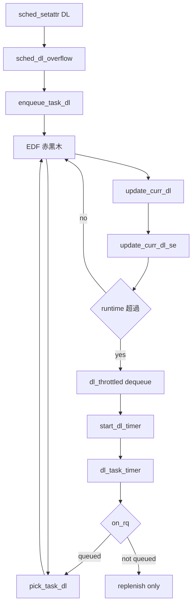

# 第16章 deadline クラス

> **本章で読むソース**
>
> - [`include/uapi/linux/sched.h` L119-L120](https://github.com/gregkh/linux/blob/v6.18.38/include/uapi/linux/sched.h#L119-L120)
> - [`kernel/sched/deadline.c` L804-L839](https://github.com/gregkh/linux/blob/v6.18.38/kernel/sched/deadline.c#L804-L839)
> - [`kernel/sched/deadline.c` L1397-L1419](https://github.com/gregkh/linux/blob/v6.18.38/kernel/sched/deadline.c#L1397-L1419)
> - [`kernel/sched/deadline.c` L1425-L1505](https://github.com/gregkh/linux/blob/v6.18.38/kernel/sched/deadline.c#L1425-L1505)
> - [`kernel/sched/deadline.c` L3432-L3463](https://github.com/gregkh/linux/blob/v6.18.38/kernel/sched/deadline.c#L3432-L3463)
> - [`kernel/sched/deadline.c` L2563-L2593](https://github.com/gregkh/linux/blob/v6.18.38/kernel/sched/deadline.c#L2563-L2593)

## この章の狙い

`SCHED_DEADLINE` の**deadline クラス**が CBS で CPU を割り当て、admission control で帯域を守る仕組みを読む。

## 前提

[RT クラス](15-rt-class.md) を読んでいること。

## SCHED_DEADLINE ポリシー

[`include/uapi/linux/sched.h` L119-L120](https://github.com/gregkh/linux/blob/v6.18.38/include/uapi/linux/sched.h#L119-L120)

```c
#define SCHED_IDLE		5
#define SCHED_DEADLINE		6
```

ユーザー空間は `sched_setattr` で runtime、deadline、period を指定する。

## CBS replenish

`replenish_dl_entity` は enqueue や timer から呼ばれ、runtime が尽きている間は period 単位で deadline と runtime を進める。
初回や defer overflow 時は `dl_deadline` から新しい period を開始する。

[`kernel/sched/deadline.c` L804-L839](https://github.com/gregkh/linux/blob/v6.18.38/kernel/sched/deadline.c#L804-L839)

```c
static void replenish_dl_entity(struct sched_dl_entity *dl_se)
{
	struct dl_rq *dl_rq = dl_rq_of_se(dl_se);
	struct rq *rq = rq_of_dl_rq(dl_rq);

	WARN_ON_ONCE(pi_of(dl_se)->dl_runtime <= 0);

	if (dl_se->dl_deadline == 0 ||
	    (dl_se->dl_defer_armed && dl_entity_overflow(dl_se, rq_clock(rq)))) {
		dl_se->deadline = rq_clock(rq) + pi_of(dl_se)->dl_deadline;
		dl_se->runtime = pi_of(dl_se)->dl_runtime;
	}

	if (dl_se->dl_yielded && dl_se->runtime > 0)
		dl_se->runtime = 0;

	while (dl_se->runtime <= 0) {
		dl_se->deadline += pi_of(dl_se)->dl_period;
		dl_se->runtime += pi_of(dl_se)->dl_runtime;
	}
```

## update_curr_dl_se と throttle

`update_curr_dl` は `update_curr_common` の delta を `update_curr_dl_se` へ渡す。
ここで runtime を減算し、超過または yield 時に `dl_throttled=1`、`dequeue_dl_entity`、`start_dl_timer` へ進む。
timer 発火後は `dl_task_timer` が `task_on_rq_queued` を見て分岐する。
runqueue 上なら `enqueue_task_dl(ENQUEUE_REPLENISH)` で replenish して再投入、sleep 中は replenish のみで次の wakeup/enqueue まで待つ。

[`kernel/sched/deadline.c` L1425-L1505](https://github.com/gregkh/linux/blob/v6.18.38/kernel/sched/deadline.c#L1425-L1505)

```c
static void update_curr_dl_se(struct rq *rq, struct sched_dl_entity *dl_se, s64 delta_exec)
{
	s64 scaled_delta_exec;

	if (unlikely(delta_exec <= 0)) {
		if (unlikely(dl_se->dl_yielded))
			goto throttle;
		return;
	}

	if (dl_server(dl_se) && dl_se->dl_throttled && !dl_se->dl_defer)
		return;

	if (dl_entity_is_special(dl_se))
		return;

	scaled_delta_exec = delta_exec;
	if (!dl_server(dl_se))
		scaled_delta_exec = dl_scaled_delta_exec(rq, dl_se, delta_exec);

	dl_se->runtime -= scaled_delta_exec;

	/*
	 * The fair server can consume its runtime while throttled (not queued/
	 * running as regular CFS).
	 *
	 * If the server consumes its entire runtime in this state. The server
	 * is not required for the current period. Thus, reset the server by
	 * starting a new period, pushing the activation.
	 */
	if (dl_se->dl_defer && dl_se->dl_throttled && dl_runtime_exceeded(dl_se)) {
		/*
		 * If the server was previously activated - the starving condition
		 * took place, it this point it went away because the fair scheduler
		 * was able to get runtime in background. So return to the initial
		 * state.
		 */
		dl_se->dl_defer_running = 0;

		hrtimer_try_to_cancel(&dl_se->dl_timer);

		replenish_dl_new_period(dl_se, dl_se->rq);

		/*
		 * Not being able to start the timer seems problematic. If it could not
		 * be started for whatever reason, we need to "unthrottle" the DL server
		 * and queue right away. Otherwise nothing might queue it. That's similar
		 * to what enqueue_dl_entity() does on start_dl_timer==0. For now, just warn.
		 */
		WARN_ON_ONCE(!start_dl_timer(dl_se));

		return;
	}

throttle:
	if (dl_runtime_exceeded(dl_se) || dl_se->dl_yielded) {
		dl_se->dl_throttled = 1;

		/* If requested, inform the user about runtime overruns. */
		if (dl_runtime_exceeded(dl_se) &&
		    (dl_se->flags & SCHED_FLAG_DL_OVERRUN))
			dl_se->dl_overrun = 1;

		dequeue_dl_entity(dl_se, 0);
		if (!dl_server(dl_se)) {
			update_stats_dequeue_dl(&rq->dl, dl_se, 0);
			dequeue_pushable_dl_task(rq, dl_task_of(dl_se));
		}

		if (unlikely(is_dl_boosted(dl_se) || !start_dl_timer(dl_se))) {
			if (dl_server(dl_se)) {
				replenish_dl_new_period(dl_se, rq);
				start_dl_timer(dl_se);
			} else {
				enqueue_task_dl(rq, dl_task_of(dl_se), ENQUEUE_REPLENISH);
			}
		}

		if (!is_leftmost(dl_se, &rq->dl))
			resched_curr(rq);
	}
```

## GRUB reclaim

`SCHED_FLAG_RECLAIM` 付きタスクは `dl_scaled_delta_exec` が `grub_reclaim` で inactive 帯域を見積もり、runtime 減算を調整する。

[`kernel/sched/deadline.c` L1397-L1419](https://github.com/gregkh/linux/blob/v6.18.38/kernel/sched/deadline.c#L1397-L1419)

```c
s64 dl_scaled_delta_exec(struct rq *rq, struct sched_dl_entity *dl_se, s64 delta_exec)
{
	s64 scaled_delta_exec;

	/*
	 * For tasks that participate in GRUB, we implement GRUB-PA: the
	 * spare reclaimed bandwidth is used to clock down frequency.
	 *
	 * For the others, we still need to scale reservation parameters
	 * according to current frequency and CPU maximum capacity.
	 */
	if (unlikely(dl_se->flags & SCHED_FLAG_RECLAIM)) {
		scaled_delta_exec = grub_reclaim(delta_exec, rq, dl_se);
	} else {
		int cpu = cpu_of(rq);
		unsigned long scale_freq = arch_scale_freq_capacity(cpu);
		unsigned long scale_cpu = arch_scale_cpu_capacity(cpu);

		scaled_delta_exec = cap_scale(delta_exec, scale_freq);
		scaled_delta_exec = cap_scale(scaled_delta_exec, scale_cpu);
	}

	return scaled_delta_exec;
}
```

**最適化の工夫**：GRUB は `rq->dl.this_bw` と `running_bw` の差から inactive 利用率を推定し、reclaim 可能分だけ runtime 減算を抑える。
帯域上限近くでも過剰 throttle を避ける。

## admission control

新しい DL タスクの帯域要求が root domain 容量を超えないか `sched_dl_overflow` が検査する。

[`kernel/sched/deadline.c` L3432-L3463](https://github.com/gregkh/linux/blob/v6.18.38/kernel/sched/deadline.c#L3432-L3463)

```c
int sched_dl_overflow(struct task_struct *p, int policy,
		      const struct sched_attr *attr)
{
	u64 period = attr->sched_period ?: attr->sched_deadline;
	u64 runtime = attr->sched_runtime;
	u64 new_bw = dl_policy(policy) ? to_ratio(period, runtime) : 0;
	int cpus, err = -1, cpu = task_cpu(p);
	struct dl_bw *dl_b = dl_bw_of(cpu);
	unsigned long cap;

	if (new_bw == p->dl.dl_bw && task_has_dl_policy(p))
		return 0;

	raw_spin_lock(&dl_b->lock);
	cpus = dl_bw_cpus(cpu);
	cap = dl_bw_capacity(cpu);

	if (dl_policy(policy) && !task_has_dl_policy(p) &&
	    !__dl_overflow(dl_b, cap, 0, new_bw)) {
		if (hrtimer_active(&p->dl.inactive_timer))
			__dl_sub(dl_b, p->dl.dl_bw, cpus);
		__dl_add(dl_b, new_bw, cpus);
		err = 0;
```

## pick_task_dl と dl_server

`dl_server` フラグ付き entity は fair タスク束などを server として扱い、`server_pick_task` で実タスクを選ぶ。

[`kernel/sched/deadline.c` L2563-L2593](https://github.com/gregkh/linux/blob/v6.18.38/kernel/sched/deadline.c#L2563-L2593)

```c
static struct task_struct *__pick_task_dl(struct rq *rq)
{
	struct sched_dl_entity *dl_se;
	struct dl_rq *dl_rq = &rq->dl;
	struct task_struct *p;

again:
	if (!sched_dl_runnable(rq))
		return NULL;

	dl_se = pick_next_dl_entity(dl_rq);
	WARN_ON_ONCE(!dl_se);

	if (dl_server(dl_se)) {
		p = dl_se->server_pick_task(dl_se);
		if (!p) {
			dl_server_stop(dl_se);
			goto again;
		}
		rq->dl_server = dl_se;
	} else {
		p = dl_task_of(dl_se);
	}

	return p;
}

static struct task_struct *pick_task_dl(struct rq *rq)
{
	return __pick_task_dl(rq);
}
```

> **7.x 系での変化**
> [`kernel/sched/deadline.c` L108-L119](https://github.com/gregkh/linux/blob/v7.1.3/kernel/sched/deadline.c#L108-L119) の `dl_get_type` が DL task、`fair_server`、`ext_server` を区別する。
> [`kernel/sched/deadline.c` L1836-L1871](https://github.com/gregkh/linux/blob/v7.1.3/kernel/sched/deadline.c#L1836-L1871) で `sched_init_dl_servers` が fair server と ext server を初期化する。
> replenish、throttle、update、server start/stop の tracepoint は [`L739`](https://github.com/gregkh/linux/blob/v7.1.3/kernel/sched/deadline.c#L739)、[`L1338`](https://github.com/gregkh/linux/blob/v7.1.3/kernel/sched/deadline.c#L1338)、[`L1502`](https://github.com/gregkh/linux/blob/v7.1.3/kernel/sched/deadline.c#L1502)、[`L1807`](https://github.com/gregkh/linux/blob/v7.1.3/kernel/sched/deadline.c#L1807) 付近で `dl_get_type` 引数付き `trace_sched_dl_*_tp` を呼ぶ。

## 処理の流れ



## まとめ

deadline クラスは CBS 的 runtime 管理、EDF pick、admission control を組み合わせる。
runtime 消費、throttle、timer のあと、runqueue 上の実行可能 task だけ replenish 後に再投入する。
sleep 中は replenish のみで、wakeup 時の enqueue まで待つ。

## 関連する章

- [RT クラス](15-rt-class.md)
- [vruntime と eligibility](../part02-eevdf/09-vruntime-eligibility.md)
