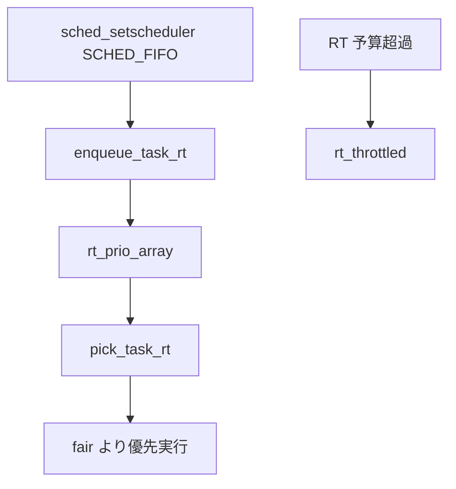

# 第17章 RT クラス

> **本章で読むソース**
>
> - [`include/uapi/linux/sched.h` L115-L116](https://github.com/gregkh/linux/blob/v6.18.38/include/uapi/linux/sched.h#L115-L116)
> - [`kernel/sched/rt.c` L1430-L1448](https://github.com/gregkh/linux/blob/v6.18.38/kernel/sched/rt.c#L1430-L1448)
> - [`kernel/sched/rt.c` L863-L904](https://github.com/gregkh/linux/blob/v6.18.38/kernel/sched/rt.c#L863-L904)
> - [`kernel/sched/rt.c` L1683-L1707](https://github.com/gregkh/linux/blob/v6.18.38/kernel/sched/rt.c#L1683-L1707)
> - [`kernel/sched/rt.c` L2234-L2278](https://github.com/gregkh/linux/blob/v6.18.38/kernel/sched/rt.c#L2234-L2278)
> - [`kernel/sched/core.c` L5994-L6011](https://github.com/gregkh/linux/blob/v6.18.38/kernel/sched/core.c#L5994-L6011)

## この章の狙い

`SCHED_FIFO` と `SCHED_RR` の**RT クラス**が固定優先度配列で CPU を奪う仕組みを読む。

## 前提

[ランキューとスケジューリングクラスの階層](../part01-core/07-runqueue-sched-class.md) を読んでいること。

## RT ポリシー定数

[`include/uapi/linux/sched.h` L115-L116](https://github.com/gregkh/linux/blob/v6.18.38/include/uapi/linux/sched.h#L115-L116)

```c
#define SCHED_FIFO		1
#define SCHED_RR		2
```

`SCHED_RR` はタイムスライス付き RTである。
`SCHED_FIFO` は同一優先度内でタイムスライスを持たず、block、yield、より高優先度 RT や deadline タスクの到着、RT throttling 等で実行を離れる。

## enqueue_task_rt

[`kernel/sched/rt.c` L1430-L1448](https://github.com/gregkh/linux/blob/v6.18.38/kernel/sched/rt.c#L1430-L1448)

```c
static void
enqueue_task_rt(struct rq *rq, struct task_struct *p, int flags)
{
	struct sched_rt_entity *rt_se = &p->rt;

	if (flags & ENQUEUE_WAKEUP)
		rt_se->timeout = 0;

	check_schedstat_required();
	update_stats_wait_start_rt(rt_rq_of_se(rt_se), rt_se);

	enqueue_rt_entity(rt_se, flags);

	if (task_is_blocked(p))
		return;

	if (!task_current(rq, p) && p->nr_cpus_allowed > 1)
		enqueue_pushable_task(rq, p);
}
```

## RT bandwidth throttling

`sched_rt_runtime_us` で設定した global RT 予算を超えると `rt_throttled` となり、RT キューから dequeue される。

[`kernel/sched/rt.c` L863-L904](https://github.com/gregkh/linux/blob/v6.18.38/kernel/sched/rt.c#L863-L904)

```c
static int sched_rt_runtime_exceeded(struct rt_rq *rt_rq)
{
	u64 runtime = sched_rt_runtime(rt_rq);

	if (rt_rq->rt_throttled)
		return rt_rq_throttled(rt_rq);

	if (runtime >= sched_rt_period(rt_rq))
		return 0;

	balance_runtime(rt_rq);
	runtime = sched_rt_runtime(rt_rq);
	if (runtime == RUNTIME_INF)
		return 0;

	if (rt_rq->rt_time > runtime) {
		struct rt_bandwidth *rt_b = sched_rt_bandwidth(rt_rq);

		if (likely(rt_b->rt_runtime)) {
			rt_rq->rt_throttled = 1;
			printk_deferred_once("sched: RT throttling activated\n");
		} else {
			rt_rq->rt_time = 0;
		}

		if (rt_rq_throttled(rt_rq)) {
			sched_rt_rq_dequeue(rt_rq);
			return 1;
		}
	}

	return 0;
}
```

**最適化の工夫**：RT pushable 機構は SMP で過負荷 CPU から RT タスクを救出する。
affinity 制約下でも実行可能 CPU が複数ある場合に負荷分散の起点になる。

## pull_rt_task

過負荷 CPU から RT タスクを引き取る pull 経路である。
`rto_mask` を走査し、より高優先度の pushable タスクがあれば `double_lock_balance` で移す。

[`kernel/sched/rt.c` L2234-L2278](https://github.com/gregkh/linux/blob/v6.18.38/kernel/sched/rt.c#L2234-L2278)

```c
static void pull_rt_task(struct rq *this_rq)
{
	int this_cpu = this_rq->cpu, cpu;
	bool resched = false;
	struct task_struct *p, *push_task;
	struct rq *src_rq;
	int rt_overload_count = rt_overloaded(this_rq);

	if (likely(!rt_overload_count))
		return;

	/*
	 * Match the barrier from rt_set_overloaded; this guarantees that if we
	 * see overloaded we must also see the rto_mask bit.
	 */
	smp_rmb();

	/* If we are the only overloaded CPU do nothing */
	if (rt_overload_count == 1 &&
	    cpumask_test_cpu(this_rq->cpu, this_rq->rd->rto_mask))
		return;

#ifdef HAVE_RT_PUSH_IPI
	if (sched_feat(RT_PUSH_IPI)) {
		tell_cpu_to_push(this_rq);
		return;
	}
#endif

	for_each_cpu(cpu, this_rq->rd->rto_mask) {
		if (this_cpu == cpu)
			continue;

		src_rq = cpu_rq(cpu);

		/*
		 * Don't bother taking the src_rq->lock if the next highest
		 * task is known to be lower-priority than our current task.
		 * This may look racy, but if this value is about to go
		 * logically higher, the src_rq will push this task away.
		 * And if its going logically lower, we do not care
		 */
		if (src_rq->rt.highest_prio.next >=
		    this_rq->rt.highest_prio.curr)
			continue;
```

## pick_task_rt

[`kernel/sched/rt.c` L1683-L1707](https://github.com/gregkh/linux/blob/v6.18.38/kernel/sched/rt.c#L1683-L1707)

```c
static struct task_struct *_pick_next_task_rt(struct rq *rq)
{
	struct sched_rt_entity *rt_se;
	struct rt_rq *rt_rq  = &rq->rt;

	do {
		rt_se = pick_next_rt_entity(rt_rq);
		if (unlikely(!rt_se))
			return NULL;
		rt_rq = group_rt_rq(rt_se);
	} while (rt_rq);

	return rt_task_of(rt_se);
}

static struct task_struct *pick_task_rt(struct rq *rq)
{
	struct task_struct *p;

	if (!sched_rt_runnable(rq))
		return NULL;

	p = _pick_next_task_rt(rq);

	return p;
}
```

## クラス走査順

general path では deadline クラスが RT より先、fair より前に評価される。

[`kernel/sched/core.c` L5994-L6011](https://github.com/gregkh/linux/blob/v6.18.38/kernel/sched/core.c#L5994-L6011)

```c
restart:
	prev_balance(rq, prev, rf);

	for_each_active_class(class) {
		if (class->pick_next_task) {
			p = class->pick_next_task(rq, prev);
			if (p)
				return p;
		} else {
			p = class->pick_task(rq);
			if (p) {
				put_prev_set_next_task(rq, prev, p);
				return p;
			}
		}
	}

	BUG(); /* The idle class should always have a runnable task. */
```

## 処理の流れ



## まとめ

RT クラスは EEVDF より厳格に優先される。
`sched_rt_runtime_us` による throttling により、RT 独占で fair タスクが飢餓する事態を抑える。

## 関連する章

- [deadline クラス](18-deadline-class.md)
- [ロードバランスと NUMA](../part05-smp-obs/21-load-balance-numa.md)
