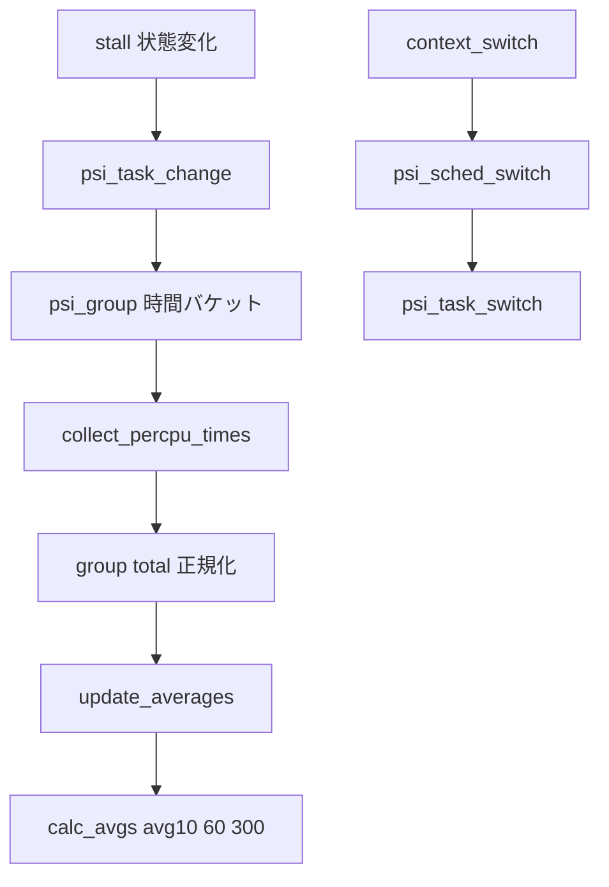

# 第18章 PSI と統計

> **本章で読むソース**
>
> - [`kernel/sched/psi.c` L179-L199](https://github.com/gregkh/linux/blob/v6.18.38/kernel/sched/psi.c#L179-L199)
> - [`kernel/sched/psi.c` L243-L268](https://github.com/gregkh/linux/blob/v6.18.38/kernel/sched/psi.c#L243-L268)
> - [`kernel/sched/psi.c` L362-L394](https://github.com/gregkh/linux/blob/v6.18.38/kernel/sched/psi.c#L362-L394)
> - [`kernel/sched/psi.c` L396-L415](https://github.com/gregkh/linux/blob/v6.18.38/kernel/sched/psi.c#L396-L415)
> - [`kernel/sched/psi.c` L525-L573](https://github.com/gregkh/linux/blob/v6.18.38/kernel/sched/psi.c#L525-L573)
> - [`kernel/sched/psi.c` L909-L924](https://github.com/gregkh/linux/blob/v6.18.38/kernel/sched/psi.c#L909-L924)
> - [`kernel/sched/stats.h` L218-L226](https://github.com/gregkh/linux/blob/v6.18.38/kernel/sched/stats.h#L218-L226)

## この章の狙い

**PSI**（Pressure Stall Information）が stall 状態から avg10、avg60、avg300 をどう計算するかを読む。

## 前提

[ロードバランスと NUMA](17-load-balance-numa.md) を読んでいること。

## seqcount による per-CPU 更新

PSI の hot path は per-CPU seqcount で書き込みと読み取りを協調する。
「per-CPU バッファ」という別構造ではない。

[`kernel/sched/psi.c` L179-L199](https://github.com/gregkh/linux/blob/v6.18.38/kernel/sched/psi.c#L179-L199)

```c
static DEFINE_PER_CPU(seqcount_t, psi_seq) = SEQCNT_ZERO(psi_seq);

static inline void psi_write_begin(int cpu)
{
	write_seqcount_begin(per_cpu_ptr(&psi_seq, cpu));
}

static inline void psi_write_end(int cpu)
{
	write_seqcount_end(per_cpu_ptr(&psi_seq, cpu));
}

static inline u32 psi_read_begin(int cpu)
{
	return read_seqcount_begin(per_cpu_ptr(&psi_seq, cpu));
}

static inline bool psi_read_retry(int cpu, u32 seq)
{
	return read_seqcount_retry(per_cpu_ptr(&psi_seq, cpu), seq);
}
```

## test_states

running、iowait、memstall カウントから CPU、IO、memory の some、full 状態を導く。

[`kernel/sched/psi.c` L243-L268](https://github.com/gregkh/linux/blob/v6.18.38/kernel/sched/psi.c#L243-L268)

```c
static u32 test_states(unsigned int *tasks, u32 state_mask)
{
	const bool oncpu = state_mask & PSI_ONCPU;

	if (tasks[NR_IOWAIT]) {
		state_mask |= BIT(PSI_IO_SOME);
		if (!tasks[NR_RUNNING])
			state_mask |= BIT(PSI_IO_FULL);
	}

	if (tasks[NR_MEMSTALL]) {
		state_mask |= BIT(PSI_MEM_SOME);
		if (tasks[NR_RUNNING] == tasks[NR_MEMSTALL_RUNNING])
			state_mask |= BIT(PSI_MEM_FULL);
	}

	if (tasks[NR_RUNNING] > oncpu)
		state_mask |= BIT(PSI_CPU_SOME);

	if (tasks[NR_RUNNING] && !oncpu)
		state_mask |= BIT(PSI_CPU_FULL);

	if (tasks[NR_IOWAIT] || tasks[NR_MEMSTALL] || tasks[NR_RUNNING])
		state_mask |= BIT(PSI_NONIDLE);

	return state_mask;
}
```

## collect_percpu_times と正規化

各 CPU の時間バケットを集約し、non-idle 時間で重み付けした delta を `group->total` へ正規化する。

[`kernel/sched/psi.c` L362-L394](https://github.com/gregkh/linux/blob/v6.18.38/kernel/sched/psi.c#L362-L394)

```c
static void collect_percpu_times(struct psi_group *group,
				 enum psi_aggregators aggregator,
				 u32 *pchanged_states)
{
	u64 deltas[NR_PSI_STATES - 1] = { 0, };
	unsigned long nonidle_total = 0;
	u32 changed_states = 0;
	int cpu;
	int s;

	for_each_possible_cpu(cpu) {
		u32 times[NR_PSI_STATES];
		u32 nonidle;
		u32 cpu_changed_states;

		get_recent_times(group, cpu, aggregator, times,
				&cpu_changed_states);
		changed_states |= cpu_changed_states;

		nonidle = nsecs_to_jiffies(times[PSI_NONIDLE]);
		nonidle_total += nonidle;

		for (s = 0; s < PSI_NONIDLE; s++)
			deltas[s] += (u64)times[s] * nonidle;
	}
```

[`kernel/sched/psi.c` L396-L415](https://github.com/gregkh/linux/blob/v6.18.38/kernel/sched/psi.c#L396-L415)

```c
	/*
	 * Integrate the sample into the running statistics that are
	 * reported to userspace: the cumulative stall times and the
	 * decaying averages.
	 *
	 * Pressure percentages are sampled at PSI_FREQ. We might be
	 * called more often when the user polls more frequently than
	 * that; we might be called less often when there is no task
	 * activity, thus no data, and clock ticks are sporadic. The
	 * below handles both.
	 */

	/* total= */
	for (s = 0; s < NR_PSI_STATES - 1; s++)
		group->total[aggregator][s] +=
				div_u64(deltas[s], max(nonidle_total, 1UL));

	if (pchanged_states)
		*pchanged_states = changed_states;
}
```

## update_averages と calc_avgs

`update_averages` は `group->total` と `avg_total` の差分を period で clamp し、`calc_avgs` で avg10、avg60、avg300 を更新する。

[`kernel/sched/psi.c` L525-L573](https://github.com/gregkh/linux/blob/v6.18.38/kernel/sched/psi.c#L525-L573)

```c
static u64 update_averages(struct psi_group *group, u64 now)
{
	unsigned long missed_periods = 0;
	u64 expires, period;
	u64 avg_next_update;
	int s;

	/* avgX= */
	expires = group->avg_next_update;
	if (now - expires >= psi_period)
		missed_periods = div_u64(now - expires, psi_period);

	/*
	 * The periodic clock tick can get delayed for various
	 * reasons, especially on loaded systems. To avoid clock
	 * drift, we schedule the clock in fixed psi_period intervals.
	 * But the deltas we sample out of the per-cpu buckets above
	 * are based on the actual time elapsing between clock ticks.
	 */
	avg_next_update = expires + ((1 + missed_periods) * psi_period);
	period = now - (group->avg_last_update + (missed_periods * psi_period));
	group->avg_last_update = now;

	for (s = 0; s < NR_PSI_STATES - 1; s++) {
		u32 sample;

		sample = group->total[PSI_AVGS][s] - group->avg_total[s];
		/*
		 * Due to the lockless sampling of the time buckets,
		 * recorded time deltas can slip into the next period,
		 * which under full pressure can result in samples in
		 * excess of the period length.
		 *
		 * We don't want to report non-sensical pressures in
		 * excess of 100%, nor do we want to drop such events
		 * on the floor. Instead we punt any overage into the
		 * future until pressure subsides. By doing this we
		 * don't underreport the occurring pressure curve, we
		 * just report it delayed by one period length.
		 *
		 * The error isn't cumulative. As soon as another
		 * delta slips from a period P to P+1, by definition
		 * it frees up its time T in P.
		 */
		if (sample > period)
			sample = period;
		group->avg_total[s] += sample;
		calc_avgs(group->avg[s], missed_periods, sample, period);
	}
```

[`kernel/sched/psi.c` L342-L360](https://github.com/gregkh/linux/blob/v6.18.38/kernel/sched/psi.c#L342-L360)

```c
static void calc_avgs(unsigned long avg[3], int missed_periods,
		      u64 time, u64 period)
{
	unsigned long pct;

	if (missed_periods) {
		avg[0] = calc_load_n(avg[0], EXP_10s, 0, missed_periods);
		avg[1] = calc_load_n(avg[1], EXP_60s, 0, missed_periods);
		avg[2] = calc_load_n(avg[2], EXP_300s, 0, missed_periods);
	}

	pct = div_u64(time * 100, period);
	pct *= FIXED_1;
	avg[0] = calc_load(avg[0], EXP_10s, pct);
	avg[1] = calc_load(avg[1], EXP_60s, pct);
	avg[2] = calc_load(avg[2], EXP_300s, pct);
}
```

**最適化の工夫**：`static_branch_likely(&psi_disabled)` で PSI 無効時は hot path コストを最小化する。

## psi_task_change と psi_sched_switch

stall ビット更新の本体は `psi_task_change` である。
`__schedule` からは inline ラッパー `psi_sched_switch` 経由で `psi_task_switch` が呼ばれる。

[`kernel/sched/psi.c` L909-L924](https://github.com/gregkh/linux/blob/v6.18.38/kernel/sched/psi.c#L909-L924)

```c
void psi_task_change(struct task_struct *task, int clear, int set)
{
	int cpu = task_cpu(task);
	u64 now;

	if (!task->pid)
		return;

	psi_flags_change(task, clear, set);

	psi_write_begin(cpu);
	now = cpu_clock(cpu);
	for_each_group(group, task_psi_group(task))
		psi_group_change(group, cpu, clear, set, now, true);
	psi_write_end(cpu);
}
```

[`kernel/sched/stats.h` L218-L226](https://github.com/gregkh/linux/blob/v6.18.38/kernel/sched/stats.h#L218-L226)

```c
static inline void psi_sched_switch(struct task_struct *prev,
				    struct task_struct *next,
				    bool sleep)
{
	if (static_branch_likely(&psi_disabled))
		return;

	psi_task_switch(prev, next, sleep);
}
```

## 処理の流れ



## まとめ

PSI は stall 状態の時間積分から avg10、avg60、avg300 を導く。
更新は per-CPU seqcount で協調し、context switch では `psi_sched_switch` が `psi_task_switch` を呼ぶ。

## 関連する章

- [exit と wait](../part00-process/04-exit-wait.md)
- [__schedule とコンテキストスイッチ](../part01-core/06-schedule-context-switch.md)
