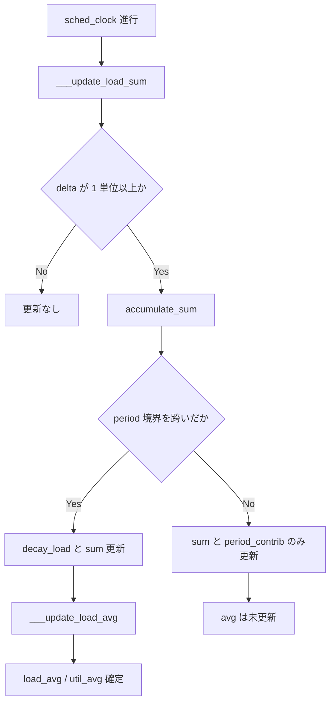

# 第20章 PELT による負荷追跡

> **本章で読むソース**
>
> - [`kernel/sched/pelt.c` L28-L56](https://github.com/gregkh/linux/blob/v6.18.38/kernel/sched/pelt.c#L28-L56)
> - [`kernel/sched/pelt.c` L58-L79](https://github.com/gregkh/linux/blob/v6.18.38/kernel/sched/pelt.c#L58-L79)
> - [`kernel/sched/pelt.c` L102-L150](https://github.com/gregkh/linux/blob/v6.18.38/kernel/sched/pelt.c#L102-L150)
> - [`kernel/sched/pelt.c` L180-L231](https://github.com/gregkh/linux/blob/v6.18.38/kernel/sched/pelt.c#L180-L231)
> - [`kernel/sched/pelt.c` L257-L268](https://github.com/gregkh/linux/blob/v6.18.38/kernel/sched/pelt.c#L257-L268)
> - [`kernel/sched/pelt.c` L307-L334](https://github.com/gregkh/linux/blob/v6.18.38/kernel/sched/pelt.c#L307-L334)
> - [`kernel/sched/pelt.c` L431-L469](https://github.com/gregkh/linux/blob/v6.18.38/kernel/sched/pelt.c#L431-L469)
> - [`include/linux/sched/topology.h` L213-L228](https://github.com/gregkh/linux/blob/v6.18.38/include/linux/sched/topology.h#L213-L228)

## この章の狙い

**PELT**（Per Entity Load Tracking）が、幾何級数で減衰する `load_sum` と `util_avg` をどう更新するかを読む。
ロードバランスや capacity 按分が参照する負荷指標の源泉を押さえる。

## 前提

[sched domain とトポロジ構築](19-topology-sched-domains.md) を読んでいること。
capacity の正規化は `arch_scale_cpu_capacity` と連動する。

## 幾何級数モデルと decay_load

PELT は約 1ms（1024us）ごとの区間に実行時間を分割し、古い区間ほど重み `y` で減衰させる。
`y^32` が約 0.5 になるよう選ばれており、32ms 程度で半減する履歴になる。

[`kernel/sched/pelt.c` L28-L56](https://github.com/gregkh/linux/blob/v6.18.38/kernel/sched/pelt.c#L28-L56)

```c
/*
 * Approximate:
 *   val * y^n,    where y^32 ~= 0.5 (~1 scheduling period)
 */
static u64 decay_load(u64 val, u64 n)
{
	unsigned int local_n;

	if (unlikely(n > LOAD_AVG_PERIOD * 63))
		return 0;

	/* after bounds checking we can collapse to 32-bit */
	local_n = n;

	/*
	 * As y^PERIOD = 1/2, we can combine
	 *    y^n = 1/2^(n/PERIOD) * y^(n%PERIOD)
	 * With a look-up table which covers y^n (n<PERIOD)
	 *
	 * To achieve constant time decay_load.
	 */
	if (unlikely(local_n >= LOAD_AVG_PERIOD)) {
		val >>= local_n / LOAD_AVG_PERIOD;
		local_n %= LOAD_AVG_PERIOD;
	}

	val = mul_u64_u32_shr(val, runnable_avg_yN_inv[local_n], 32);
	return val;
}
```

`n` が `LOAD_AVG_PERIOD`（32）以上のときはシフトで `y^32` の塊を落とし、余りは `runnable_avg_yN_inv` ルックアップテーブルで掛ける。
これにより減衰計算が **O(1)** で済む。

**最適化の工夫**：幾何級数の厳密累積は区間数に比例するが、周期ごとの折りたたみと 32 エントリの逆数テーブルで定数時間に近似する。
減衰そのものは乗算1回とシフトに収まる。

## accumulate_sum と区間の分割

`accumulate_sum` は直近の未完了区間（d1）、完全に経過した区間群（d2）、現在区間の寄与（d3）に分けて `load_sum` などを更新する。
`periods` が非ゼロのときだけ `decay_load` で古い寄与を減衰する。

[`kernel/sched/pelt.c` L102-L150](https://github.com/gregkh/linux/blob/v6.18.38/kernel/sched/pelt.c#L102-L150)

```c
static __always_inline u32
accumulate_sum(u64 delta, struct sched_avg *sa,
	       unsigned long load, unsigned long runnable, int running)
{
	u32 contrib = (u32)delta; /* p == 0 -> delta < 1024 */
	u64 periods;

	delta += sa->period_contrib;
	periods = delta / 1024; /* A period is 1024us (~1ms) */

	/*
	 * Step 1: decay old *_sum if we crossed period boundaries.
	 */
	if (periods) {
		sa->load_sum = decay_load(sa->load_sum, periods);
		sa->runnable_sum =
			decay_load(sa->runnable_sum, periods);
		sa->util_sum = decay_load((u64)(sa->util_sum), periods);

		/*
		 * Step 2
		 */
		delta %= 1024;
		if (load) {
			/*
			 * This relies on the:
			 *
			 * if (!load)
			 *	runnable = running = 0;
			 *
			 * clause from ___update_load_sum(); this results in
			 * the below usage of @contrib to disappear entirely,
			 * so no point in calculating it.
			 */
			contrib = __accumulate_pelt_segments(periods,
					1024 - sa->period_contrib, delta);
		}
	}
	sa->period_contrib = delta;

	if (load)
		sa->load_sum += load * contrib;
	if (runnable)
		sa->runnable_sum += runnable * contrib << SCHED_CAPACITY_SHIFT;
	if (running)
		sa->util_sum += contrib << SCHED_CAPACITY_SHIFT;

	return periods;
}
```

`__accumulate_pelt_segments` は閉形式で区間和を足し、ループを避ける。

[`kernel/sched/pelt.c` L58-L79](https://github.com/gregkh/linux/blob/v6.18.38/kernel/sched/pelt.c#L58-L79)

```c
static u32 __accumulate_pelt_segments(u64 periods, u32 d1, u32 d3)
{
	u32 c1, c2, c3 = d3; /* y^0 == 1 */

	/*
	 * c1 = d1 y^p
	 */
	c1 = decay_load((u64)d1, periods);

	/*
	 *            p-1
	 * c2 = 1024 \Sum y^n
	 *            n=1
	 *
	 *              inf        inf
	 *    = 1024 ( \Sum y^n - \Sum y^n - y^0 )
	 *              n=0        n=p
	 */
	c2 = LOAD_AVG_MAX - decay_load(LOAD_AVG_MAX, periods) - 1024;

	return c1 + c2 + c3;
}
```

## ___update_load_sum と平均値への変換

`___update_load_sum` は時刻差分を 1024ns 単位に切り下げ、1 単位以上あれば常に `accumulate_sum` を呼ぶ。
`periods` が 0 でも `period_contrib` と `*_sum` は更新され、`*_avg` への正規化は呼び出し側が `accumulate_sum` の戻り値を見て行う。
`load` が 0 なら runnable と running も 0 に落とし、dequeue 直後の不整合を防ぐ。

[`kernel/sched/pelt.c` L180-L231](https://github.com/gregkh/linux/blob/v6.18.38/kernel/sched/pelt.c#L180-L231)

```c
static __always_inline int
___update_load_sum(u64 now, struct sched_avg *sa,
		  unsigned long load, unsigned long runnable, int running)
{
	u64 delta;

	delta = now - sa->last_update_time;
	/*
	 * This should only happen when time goes backwards, which it
	 * unfortunately does during sched clock init when we swap over to TSC.
	 */
	if ((s64)delta < 0) {
		sa->last_update_time = now;
		return 0;
	}

	/*
	 * Use 1024ns as the unit of measurement since it's a reasonable
	 * approximation of 1us and fast to compute.
	 */
	delta >>= 10;
	if (!delta)
		return 0;

	sa->last_update_time += delta << 10;

	/*
	 * running is a subset of runnable (weight) so running can't be set if
	 * runnable is clear. But there are some corner cases where the current
	 * se has been already dequeued but cfs_rq->curr still points to it.
	 * This means that weight will be 0 but not running for a sched_entity
	 * but also for a cfs_rq if the latter becomes idle. As an example,
	 * this happens during sched_balance_newidle() which calls
	 * sched_balance_update_blocked_averages().
	 *
	 * Also see the comment in accumulate_sum().
	 */
	if (!load)
		runnable = running = 0;

	/*
	 * Now we know we crossed measurement unit boundaries. The *_avg
	 * accrues by two steps:
	 *
	 * Step 1: accumulate *_sum since last_update_time. If we haven't
	 * crossed period boundaries, finish.
	 */
	if (!accumulate_sum(delta, sa, load, runnable, running))
		return 0;

	return 1;
}
```

`___update_load_avg` は `get_pelt_divider` で正規化し、`load_avg`、`runnable_avg`、`util_avg` を得る。

[`kernel/sched/pelt.c` L257-L268](https://github.com/gregkh/linux/blob/v6.18.38/kernel/sched/pelt.c#L257-L268)

```c
static __always_inline void
___update_load_avg(struct sched_avg *sa, unsigned long load)
{
	u32 divider = get_pelt_divider(sa);

	sa->load_avg = div_u64(load * sa->load_sum, divider);
	sa->runnable_avg = div_u64(sa->runnable_sum, divider);
	WRITE_ONCE(sa->util_avg, sa->util_sum / divider);
}
```

- **load**：重み付き負荷（cgroup では子の重みが絡む）
- **runnable**：実行可能だった時間
- **util**：実際に CPU を占有した時間（`cfs_rq->curr == se` のとき running）

## sched_entity と cfs_rq への適用

`__update_load_avg_se` は `___update_load_sum` が非ゼロを返したときだけ `___update_load_avg` を呼ぶ。
つまり period 境界を跨がない更新では `*_sum` だけが進み、境界を跨ぐと `___update_load_sum` が非ゼロを返して、呼び出し側が `___update_load_avg` で平均値を更新する。

[`kernel/sched/pelt.c` L307-L334](https://github.com/gregkh/linux/blob/v6.18.38/kernel/sched/pelt.c#L307-L334)

```c
int __update_load_avg_se(u64 now, struct cfs_rq *cfs_rq, struct sched_entity *se)
{
	if (___update_load_sum(now, &se->avg, !!se->on_rq, se_runnable(se),
				cfs_rq->curr == se)) {

		___update_load_avg(&se->avg, se_weight(se));
		cfs_se_util_change(&se->avg);
		trace_pelt_se_tp(se);
		return 1;
	}

	return 0;
}

int __update_load_avg_cfs_rq(u64 now, struct cfs_rq *cfs_rq)
{
	if (___update_load_sum(now, &cfs_rq->avg,
				scale_load_down(cfs_rq->load.weight),
				cfs_rq->h_nr_runnable,
				cfs_rq->curr != NULL)) {

		___update_load_avg(&cfs_rq->avg, 1);
		trace_pelt_cfs_tp(cfs_rq);
		return 1;
	}

	return 0;
}
```

RT と deadline クラスも同ファイル内の別エントリで `avg_rt`、`avg_dl` を更新する。
IRQ 時間は `update_irq_load_avg` で `avg_irq` に積み、`arch_scale_freq_capacity` と `arch_scale_cpu_capacity` の両方で `cap_scale` する。

[`kernel/sched/pelt.c` L431-L469](https://github.com/gregkh/linux/blob/v6.18.38/kernel/sched/pelt.c#L431-L469)

```c
int update_irq_load_avg(struct rq *rq, u64 running)
{
	int ret = 0;

	/*
	 * We can't use clock_pelt because IRQ time is not accounted in
	 * clock_task. Instead we directly scale the running time to
	 * reflect the real amount of computation
	 */
	running = cap_scale(running, arch_scale_freq_capacity(cpu_of(rq)));
	running = cap_scale(running, arch_scale_cpu_capacity(cpu_of(rq)));

	/*
	 * We know the time that has been used by interrupt since last update
	 * but we don't when. Let be pessimistic and assume that interrupt has
	 * happened just before the update. This is not so far from reality
	 * because interrupt will most probably wake up task and trig an update
	 * of rq clock during which the metric is updated.
	 * We start to decay with normal context time and then we add the
	 * interrupt context time.
	 * We can safely remove running from rq->clock because
	 * rq->clock += delta with delta >= running
	 */
	ret = ___update_load_sum(rq->clock - running, &rq->avg_irq,
				0,
				0,
				0);
	ret += ___update_load_sum(rq->clock, &rq->avg_irq,
				1,
				1,
				1);

	if (ret) {
		___update_load_avg(&rq->avg_irq, 1);
		trace_pelt_irq_tp(rq);
	}

	return ret;
}
```

### 更新の流れ



## capacity との接続

`util_avg` は CPU capacity で正規化され、ロードバランスは「capacity あたりの利用率」で送信先を選ぶ。
デフォルトの `arch_scale_cpu_capacity` は均一に `SCHED_CAPACITY_SCALE` を返すが、DT や cpufreq 連携があるアーキテクチャでは CPU ごとに異なる。

[`include/linux/sched/topology.h` L213-L228](https://github.com/gregkh/linux/blob/v6.18.38/include/linux/sched/topology.h#L213-L228)

```c
static __always_inline
unsigned long arch_scale_cpu_capacity(int cpu)
{
	return SCHED_CAPACITY_SCALE;
}
```

非対称 capacity では第19章の `SD_ASYM_CPUCAPACITY` と組み合わせ、同じ `util_avg` でも実効スループットが異なる CPU へはより多くタスクを置ける。

## まとめ

PELT は 1024us 区間の幾何級数和を `decay_load` とルックアップテーブルで O(1) 更新する。
`load_avg`、`runnable_avg`、`util_avg` がロードバランスと capacity 按分の入力になる。

## 関連する章

- [sched domain とトポロジ構築](19-topology-sched-domains.md)
- [ロードバランスと NUMA](21-load-balance-numa.md)
