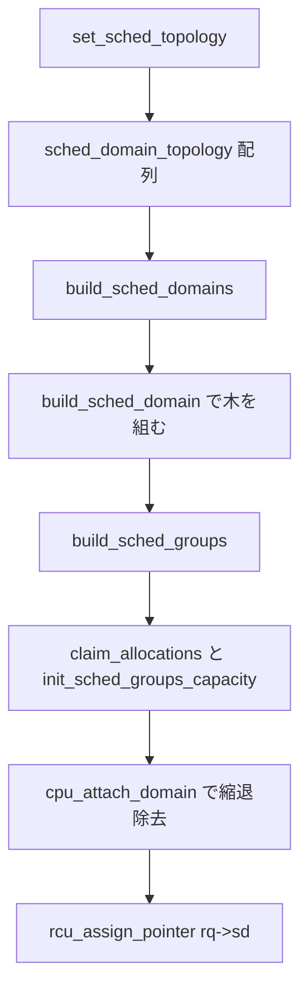

# 第20章 sched domain とトポロジ構築

> **本章で読むソース**
>
> - [`arch/x86/kernel/smpboot.c` L481-L491](https://github.com/gregkh/linux/blob/v6.18.38/arch/x86/kernel/smpboot.c#L481-L491)
> - [`include/linux/sched/topology.h` L191-L203](https://github.com/gregkh/linux/blob/v6.18.38/include/linux/sched/topology.h#L191-L203)
> - [`kernel/sched/topology.c` L2395-L2421](https://github.com/gregkh/linux/blob/v6.18.38/kernel/sched/topology.c#L2395-L2421)
> - [`kernel/sched/topology.c` L2484-L2535](https://github.com/gregkh/linux/blob/v6.18.38/kernel/sched/topology.c#L2484-L2535)
> - [`kernel/sched/topology.c` L2600-L2616](https://github.com/gregkh/linux/blob/v6.18.38/kernel/sched/topology.c#L2600-L2616)
> - [`kernel/sched/topology.c` L715-L776](https://github.com/gregkh/linux/blob/v6.18.38/kernel/sched/topology.c#L715-L776)
> - [`kernel/sched/topology.c` L1389-L1420](https://github.com/gregkh/linux/blob/v6.18.38/kernel/sched/topology.c#L1389-L1420)
> - [`kernel/sched/topology.c` L1271-L1316](https://github.com/gregkh/linux/blob/v6.18.38/kernel/sched/topology.c#L1271-L1316)

## この章の狙い

**sched_domain** 階層がどう構築されるかを、`sched_domain_topology_level` から `build_sched_domains` まで追う。
SD フラグ（`SD_NUMA`、`SD_ASYM_CPUCAPACITY` など）がロードバランスの振る舞いをどう変えるかの前提を置く。

## 前提

[ランキューとスケジューリングクラスの階層](../part01-core/08-runqueue-sched-class.md) を読んでいること。
ロードバランス本体は [ロードバランスと NUMA](22-load-balance-numa.md) の担当である。

## sched_domain_topology_level

各アーキテクチャは `set_sched_topology` で階層テーブルを登録する。
x86 では SMT、cluster（`CONFIG_SCHED_CLUSTER`）、MC（`CONFIG_SCHED_MC`）、package の順にマスク関数とフラグ関数を束ねる。

[`arch/x86/kernel/smpboot.c` L481-L491](https://github.com/gregkh/linux/blob/v6.18.38/arch/x86/kernel/smpboot.c#L481-L491)

```c
static struct sched_domain_topology_level x86_topology[] = {
	SDTL_INIT(tl_smt_mask, cpu_smt_flags, SMT),
#ifdef CONFIG_SCHED_CLUSTER
	SDTL_INIT(tl_cls_mask, x86_cluster_flags, CLS),
#endif
#ifdef CONFIG_SCHED_MC
	SDTL_INIT(tl_mc_mask, x86_core_flags, MC),
#endif
	SDTL_INIT(tl_pkg_mask, x86_sched_itmt_flags, PKG),
	{ NULL },
};
```

`SDTL_INIT` はマスク取得関数、フラグ付与関数、名前を1レベルにまとめるマクロである。

[`include/linux/sched/topology.h` L191-L203](https://github.com/gregkh/linux/blob/v6.18.38/include/linux/sched/topology.h#L191-L203)

```c
struct sched_domain_topology_level {
	sched_domain_mask_f mask;
	sched_domain_flags_f sd_flags;
	int		    numa_level;
	struct sd_data      data;
	char                *name;
};

#define SDTL_INIT(maskfn, flagsfn, dname) ((struct sched_domain_topology_level) \
	    { .mask = maskfn, .sd_flags = flagsfn, .name = #dname })
```

NUMA 距離に基づく追加レベルは `topology.c` 側で動的に挿入される。
パッケージ内に複数 NUMA ノードがある場合、x86 は PKG ドメインを無効化し SLIT 由来の NUMA ドメインに任せる。

## build_sched_domain と親子リンク

`build_sched_domains` は CPU 集合ごとに `sched_domain_topology` を下から上へ辿り、各 CPU に木を付ける。
`build_sched_domain` は子ドメインの親ポインタを張り、レベル番号を増やす。

[`kernel/sched/topology.c` L2395-L2421](https://github.com/gregkh/linux/blob/v6.18.38/kernel/sched/topology.c#L2395-L2421)

```c
static struct sched_domain *build_sched_domain(struct sched_domain_topology_level *tl,
		const struct cpumask *cpu_map, struct sched_domain_attr *attr,
		struct sched_domain *child, int cpu)
{
	struct sched_domain *sd = sd_init(tl, cpu_map, child, cpu);

	if (child) {
		sd->level = child->level + 1;
		sched_domain_level_max = max(sched_domain_level_max, sd->level);
		child->parent = sd;

		if (!cpumask_subset(sched_domain_span(child),
				    sched_domain_span(sd))) {
			pr_err("BUG: arch topology borken\n");
			// ... (中略) ...
			cpumask_or(sched_domain_span(sd),
				   sched_domain_span(sd),
				   sched_domain_span(child));
		}

	}
	set_domain_attribute(sd, attr);

	return sd;
}
```

[`kernel/sched/topology.c` L2484-L2535](https://github.com/gregkh/linux/blob/v6.18.38/kernel/sched/topology.c#L2484-L2535)

```c
static int
build_sched_domains(const struct cpumask *cpu_map, struct sched_domain_attr *attr)
{
	enum s_alloc alloc_state = sa_none;
	struct sched_domain *sd;
	struct s_data d;
	struct rq *rq = NULL;
	int i, ret = -ENOMEM;
	bool has_asym = false;
	bool has_cluster = false;

	if (WARN_ON(cpumask_empty(cpu_map)))
		goto error;

	alloc_state = __visit_domain_allocation_hell(&d, cpu_map);
	if (alloc_state != sa_rootdomain)
		goto error;

	for_each_cpu(i, cpu_map) {
		struct sched_domain_topology_level *tl;

		sd = NULL;
		for_each_sd_topology(tl) {

			sd = build_sched_domain(tl, cpu_map, attr, sd, i);

			has_asym |= sd->flags & SD_ASYM_CPUCAPACITY;

			if (tl == sched_domain_topology)
				*per_cpu_ptr(d.sd, i) = sd;
			if (cpumask_equal(cpu_map, sched_domain_span(sd)))
				break;
		}
	}
	// ... (中略) ...

	for_each_cpu(i, cpu_map) {
		for (sd = *per_cpu_ptr(d.sd, i); sd; sd = sd->parent) {
			sd->span_weight = cpumask_weight(sched_domain_span(sd));
			if (sd->flags & SD_NUMA) {
				if (build_overlap_sched_groups(sd, i))
					goto error;
			} else {
				if (build_sched_groups(sd, i))
					goto error;
			}
		}
	}
```

構築後半では各 CPU について `claim_allocations` と `init_sched_groups_capacity` を走らせ、最後に `cpu_attach_domain` で `rq->sd` へリンクする。

[`kernel/sched/topology.c` L2600-L2616](https://github.com/gregkh/linux/blob/v6.18.38/kernel/sched/topology.c#L2600-L2616)

```c
		for (sd = *per_cpu_ptr(d.sd, i); sd; sd = sd->parent) {
			claim_allocations(i, sd);
			init_sched_groups_capacity(i, sd);
		}
	}

	/* Attach the domains */
	rcu_read_lock();
	for_each_cpu(i, cpu_map) {
		rq = cpu_rq(i);
		sd = *per_cpu_ptr(d.sd, i);

		cpu_attach_domain(sd, d.rd, i);

		if (lowest_flag_domain(i, SD_CLUSTER))
			has_cluster = true;
	}
```

`cpu_attach_domain` はスケジューリングに寄与しない親や基底 domain を `sd_parent_degenerate` と `sd_degenerate` で除去し、縮退した階層を破棄してから `rq_attach_root` と `rcu_assign_pointer(rq->sd, sd)` を行う。

[`kernel/sched/topology.c` L715-L776](https://github.com/gregkh/linux/blob/v6.18.38/kernel/sched/topology.c#L715-L776)

```c
static void
cpu_attach_domain(struct sched_domain *sd, struct root_domain *rd, int cpu)
{
	struct rq *rq = cpu_rq(cpu);
	struct sched_domain *tmp;

	/* Remove the sched domains which do not contribute to scheduling. */
	for (tmp = sd; tmp; ) {
		struct sched_domain *parent = tmp->parent;
		if (!parent)
			break;

		if (sd_parent_degenerate(tmp, parent)) {
			tmp->parent = parent->parent;

			if (parent->parent) {
				parent->parent->child = tmp;
				parent->parent->groups->flags = tmp->flags;
			}

			/*
			 * Transfer SD_PREFER_SIBLING down in case of a
			 * degenerate parent; the spans match for this
			 * so the property transfers.
			 */
			if (parent->flags & SD_PREFER_SIBLING)
				tmp->flags |= SD_PREFER_SIBLING;
			destroy_sched_domain(parent);
		} else
			tmp = tmp->parent;
	}

	if (sd && sd_degenerate(sd)) {
		tmp = sd;
		sd = sd->parent;
		destroy_sched_domain(tmp);
		if (sd) {
			struct sched_group *sg = sd->groups;

			/*
			 * sched groups hold the flags of the child sched
			 * domain for convenience. Clear such flags since
			 * the child is being destroyed.
			 */
			do {
				sg->flags = 0;
			} while (sg != sd->groups);

			sd->child = NULL;
		}
	}

	sched_domain_debug(sd, cpu);

	rq_attach_root(rq, rd);
	tmp = rq->sd;
	rcu_assign_pointer(rq->sd, sd);
	dirty_sched_domain_sysctl(cpu);
	destroy_sched_domains(tmp);

	update_top_cache_domain(cpu);
}
```

ドメイン構築のあと `sched_group` を作り、各グループの `cpu_capacity` を初期化する。
`SD_NUMA` ドメインだけ `build_overlap_sched_groups` を使い、ノード跨ぎの重複を許す。

### 構築の流れ



## SD フラグと非対称 capacity

`SD_ASYM_CPUCAPACITY` は big.LITTLE のように同一 span 内で CPU 性能が異なるときに立つ。
`asym_cpu_capacity_classify` は span 内のユニークな capacity 数を数え、全種が含まれるかでフラグを決める。

[`kernel/sched/topology.c` L1389-L1420](https://github.com/gregkh/linux/blob/v6.18.38/kernel/sched/topology.c#L1389-L1420)

```c
static inline int
asym_cpu_capacity_classify(const struct cpumask *sd_span,
			   const struct cpumask *cpu_map)
{
	struct asym_cap_data *entry;
	int count = 0, miss = 0;

	list_for_each_entry(entry, &asym_cap_list, link) {
		if (cpumask_intersects(sd_span, cpu_capacity_span(entry)))
			++count;
		else if (cpumask_intersects(cpu_map, cpu_capacity_span(entry)))
			++miss;
	}

	WARN_ON_ONCE(!count && !list_empty(&asym_cap_list));

	if (count < 2)
		return 0;
	if (miss)
		return SD_ASYM_CPUCAPACITY;

	return SD_ASYM_CPUCAPACITY | SD_ASYM_CPUCAPACITY_FULL;
}
```

capacity 値そのものは `arch_scale_cpu_capacity` で正規化され、スケジューラは `SCHED_CAPACITY_SCALE` を基準に負荷を按分する。

## sched_group の cpu_capacity

グループ容量はロードバランスで「どのグループがどれだけ引き受けるか」の重みになる。
非対称トポロジでは高 capacity グループがより多くの load を受け取る。

[`kernel/sched/topology.c` L1271-L1316](https://github.com/gregkh/linux/blob/v6.18.38/kernel/sched/topology.c#L1271-L1316)

```c
/*
 * Initialize sched groups cpu_capacity.
 *
 * cpu_capacity indicates the capacity of sched group, which is used while
 * distributing the load between different sched groups in a sched domain.
 * Typically cpu_capacity for all the groups in a sched domain will be same
 * unless there are asymmetries in the topology. If there are asymmetries,
 * group having more cpu_capacity will pickup more load compared to the
 * group having less cpu_capacity.
 */
static void init_sched_groups_capacity(int cpu, struct sched_domain *sd)
{
	struct sched_group *sg = sd->groups;
	struct cpumask *mask = sched_domains_tmpmask2;

	WARN_ON(!sg);

	do {
		int cpu, cores = 0, max_cpu = -1;

		sg->group_weight = cpumask_weight(sched_group_span(sg));

		cpumask_copy(mask, sched_group_span(sg));
		for_each_cpu(cpu, mask) {
			cores++;
#ifdef CONFIG_SCHED_SMT
			cpumask_andnot(mask, mask, cpu_smt_mask(cpu));
#endif
		}
		sg->cores = cores;
		// ... (中略) ...
next:
		sg = sg->next;
	} while (sg != sd->groups);
```

**最適化の工夫**：トポロジ構築はスケジューラのホットパス外で走り、実行時のロードバランスは構築済みの `sched_group` とフラグだけを読む。
再構築は CPU ホットプラグ、cpufreq、cpuset 変更による `partition_sched_domains` など複数トリガーがあり得るが、いずれも実行中の pick 経路ではなく構築フェーズに閉じる。

> **7.x 系での変化**
> 7.1.3 では [`arch_sched_node_distance`](https://github.com/gregkh/linux/blob/v7.1.3/kernel/sched/topology.c#L1972-L1977) により NUMA ドメイン構築用のノード距離をアーキテクチャが上書きできる。
> 縮退親の除去時に [`cpu_attach_domain`](https://github.com/gregkh/linux/blob/v7.1.3/kernel/sched/topology.c#L735-L743) が `parent->shared` を子へ継承する処理が追加されている。

## まとめ

sched domain はアーキテクチャ登録のトポロジテーブルを元に `build_sched_domains` で構築される。
SD フラグと `cpu_capacity` がロードバランスの探索範囲と按分比率を決める。
次章の PELT が測る負荷値を、第22章が domain 階層に沿って移動する。

## 関連する章

- [ランキューとスケジューリングクラスの階層](../part01-core/08-runqueue-sched-class.md)
- [PELT による負荷追跡](21-pelt-load-tracking.md)
- [ロードバランスと NUMA](22-load-balance-numa.md)
