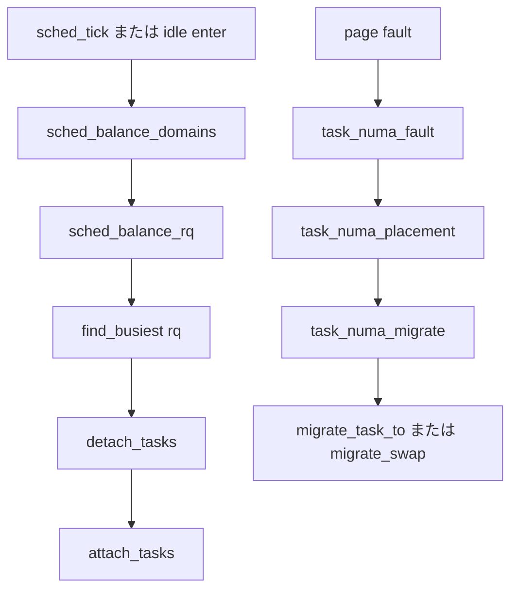

# 第22章 ロードバランスと NUMA

> **本章で読むソース**
>
> - [`kernel/sched/fair.c` L12386-L12431](https://github.com/gregkh/linux/blob/v6.18.38/kernel/sched/fair.c#L12386-L12431)
> - [`kernel/sched/fair.c` L11920-L12015](https://github.com/gregkh/linux/blob/v6.18.38/kernel/sched/fair.c#L11920-L12015)
> - [`kernel/sched/fair.c` L9706-L9750](https://github.com/gregkh/linux/blob/v6.18.38/kernel/sched/fair.c#L9706-L9750)
> - [`kernel/sched/fair.c` L9871-L9887](https://github.com/gregkh/linux/blob/v6.18.38/kernel/sched/fair.c#L9871-L9887)
> - [`kernel/sched/fair.c` L2951-L2974](https://github.com/gregkh/linux/blob/v6.18.38/kernel/sched/fair.c#L2951-L2974)
> - [`kernel/sched/fair.c` L3223-L3254](https://github.com/gregkh/linux/blob/v6.18.38/kernel/sched/fair.c#L3223-L3254)
> - [`kernel/sched/fair.c` L2561-L2619](https://github.com/gregkh/linux/blob/v6.18.38/kernel/sched/fair.c#L2561-L2619)
> - [`kernel/sched/fair.c` L2672-L2693](https://github.com/gregkh/linux/blob/v6.18.38/kernel/sched/fair.c#L2672-L2693)

## この章の狙い

SMP 環境で per-CPU ランキューの負荷を **sched_domain** 階層に沿って均す load balance と、NUMA auto balancing を追う。

## 前提

[sched domain とトポロジ構築](20-topology-sched-domains.md) と [PELT による負荷追跡](21-pelt-load-tracking.md) を読んでいること。
[group scheduling と cgroup 階層](../part02-eevdf/14-group-scheduling-cgroup.md) も参照する。

## sched_balance_domains

各 CPU の `sched_domain` 木を上向きに走査し、interval 経過時に `sched_balance_rq` を呼ぶ。

[`kernel/sched/fair.c` L12386-L12431](https://github.com/gregkh/linux/blob/v6.18.38/kernel/sched/fair.c#L12386-L12431)

```c
static void sched_balance_domains(struct rq *rq, enum cpu_idle_type idle)
{
	int continue_balancing = 1;
	int cpu = rq->cpu;
	int busy = idle != CPU_IDLE && !sched_idle_cpu(cpu);
	unsigned long interval;
	struct sched_domain *sd;
	unsigned long next_balance = jiffies + 60*HZ;
	int update_next_balance = 0;
	int need_decay = 0;
	u64 max_cost = 0;

	rcu_read_lock();
	for_each_domain(cpu, sd) {
		need_decay = update_newidle_cost(sd, 0, 0);
		max_cost += sd->max_newidle_lb_cost;

		if (!continue_balancing) {
			if (need_decay)
				continue;
			break;
		}

		interval = get_sd_balance_interval(sd, busy);
		if (time_after_eq(jiffies, sd->last_balance + interval)) {
			if (sched_balance_rq(cpu, rq, sd, idle, &continue_balancing)) {
				idle = idle_cpu(cpu);
				busy = !idle && !sched_idle_cpu(cpu);
			}
			sd->last_balance = jiffies;
			interval = get_sd_balance_interval(sd, busy);
		}
```

**最適化の工夫**：超大規模 NUMA では NODE 以上の balance を `sched_balance_running` で直列化し、冗長走査を抑える。

## sched_balance_rq と find_busiest

imbalance があれば busiest rq からタスクを detach し、dst rq へ attach する。

[`kernel/sched/fair.c` L11920-L12015](https://github.com/gregkh/linux/blob/v6.18.38/kernel/sched/fair.c#L11920-L12015)

```c
static int sched_balance_rq(int this_cpu, struct rq *this_rq,
			struct sched_domain *sd, enum cpu_idle_type idle,
			int *continue_balancing)
{
	int ld_moved, cur_ld_moved, active_balance = 0;
	struct sched_domain *sd_parent = sd->parent;
	struct sched_group *group;
	struct rq *busiest;
	struct rq_flags rf;
	struct cpumask *cpus = this_cpu_cpumask_var_ptr(load_balance_mask);
	struct lb_env env = {
		.sd		= sd,
		.dst_cpu	= this_cpu,
		.dst_rq		= this_rq,
		.dst_grpmask    = group_balance_mask(sd->groups),
		.idle		= idle,
		.loop_break	= SCHED_NR_MIGRATE_BREAK,
		.cpus		= cpus,
		.fbq_type	= all,
		.tasks		= LIST_HEAD_INIT(env.tasks),
	};
	bool need_unlock = false;

	cpumask_and(cpus, sched_domain_span(sd), cpu_active_mask);

	schedstat_inc(sd->lb_count[idle]);

redo:
	if (!should_we_balance(&env)) {
		*continue_balancing = 0;
		goto out_balanced;
	}

	if (!need_unlock && (sd->flags & SD_SERIALIZE)) {
		int zero = 0;
		if (!atomic_try_cmpxchg_acquire(&sched_balance_running, &zero, 1))
			goto out_balanced;

		need_unlock = true;
	}

	group = sched_balance_find_src_group(&env);
	if (!group) {
		schedstat_inc(sd->lb_nobusyg[idle]);
		goto out_balanced;
	}

	busiest = sched_balance_find_src_rq(&env, group);
	if (!busiest) {
		schedstat_inc(sd->lb_nobusyq[idle]);
		goto out_balanced;
	}

	WARN_ON_ONCE(busiest == env.dst_rq);

	update_lb_imbalance_stat(&env, sd, idle);

	env.src_cpu = busiest->cpu;
	env.src_rq = busiest;

	ld_moved = 0;
	/* Clear this flag as soon as we find a pullable task */
	env.flags |= LBF_ALL_PINNED;
	if (busiest->nr_running > 1) {
		/*
		 * Attempt to move tasks. If sched_balance_find_src_group has found
		 * an imbalance but busiest->nr_running <= 1, the group is
		 * still unbalanced. ld_moved simply stays zero, so it is
		 * correctly treated as an imbalance.
		 */
		env.loop_max  = min(sysctl_sched_nr_migrate, busiest->nr_running);

more_balance:
		rq_lock_irqsave(busiest, &rf);
		update_rq_clock(busiest);

		/*
		 * cur_ld_moved - load moved in current iteration
		 * ld_moved     - cumulative load moved across iterations
		 */
		cur_ld_moved = detach_tasks(&env);

		/*
		 * We've detached some tasks from busiest_rq. Every
		 * task is masked "TASK_ON_RQ_MIGRATING", so we can safely
		 * unlock busiest->lock, and we are able to be sure
		 * that nobody can manipulate the tasks in parallel.
		 * See task_rq_lock() family for the details.
		 */

		rq_unlock(busiest, &rf);

		if (cur_ld_moved) {
			attach_tasks(&env);
			ld_moved += cur_ld_moved;
		}
```

## detach_tasks と attach_tasks

[`kernel/sched/fair.c` L9706-L9750](https://github.com/gregkh/linux/blob/v6.18.38/kernel/sched/fair.c#L9706-L9750)

```c
static int detach_tasks(struct lb_env *env)
{
	struct list_head *tasks = &env->src_rq->cfs_tasks;
	unsigned long util, load;
	struct task_struct *p;
	int detached = 0;

	lockdep_assert_rq_held(env->src_rq);

	/*
	 * Source run queue has been emptied by another CPU, clear
	 * LBF_ALL_PINNED flag as we will not test any task.
	 */
	if (env->src_rq->nr_running <= 1) {
		env->flags &= ~LBF_ALL_PINNED;
		return 0;
	}

	if (env->imbalance <= 0)
		return 0;

	while (!list_empty(tasks)) {
		/*
		 * We don't want to steal all, otherwise we may be treated likewise,
		 * which could at worst lead to a livelock crash.
		 */
		if (env->idle && env->src_rq->nr_running <= 1)
			break;

		env->loop++;
		/* We've more or less seen every task there is, call it quits */
		if (env->loop > env->loop_max)
			break;

		/* take a breather every nr_migrate tasks */
		if (env->loop > env->loop_break) {
			env->loop_break += SCHED_NR_MIGRATE_BREAK;
			env->flags |= LBF_NEED_BREAK;
			break;
		}

		p = list_last_entry(tasks, struct task_struct, se.group_node);

		if (!can_migrate_task(p, env))
			goto next;
```

[`kernel/sched/fair.c` L9871-L9887](https://github.com/gregkh/linux/blob/v6.18.38/kernel/sched/fair.c#L9871-L9887)

```c
static void attach_tasks(struct lb_env *env)
{
	struct list_head *tasks = &env->tasks;
	struct task_struct *p;
	struct rq_flags rf;

	rq_lock(env->dst_rq, &rf);
	update_rq_clock(env->dst_rq);

	while (!list_empty(tasks)) {
		p = list_first_entry(tasks, struct task_struct, se.group_node);
		list_del_init(&p->se.group_node);

		attach_task(env->dst_rq, p);
	}

	rq_unlock(env->dst_rq, &rf);
}
```

## NUMA auto balancing

ページフォルト統計から最適 node を推定し、タスクを移す。

[`kernel/sched/fair.c` L3223-L3254](https://github.com/gregkh/linux/blob/v6.18.38/kernel/sched/fair.c#L3223-L3254)

```c
void task_numa_fault(int last_cpupid, int mem_node, int pages, int flags)
{
	struct task_struct *p = current;
	bool migrated = flags & TNF_MIGRATED;
	int cpu_node = task_node(current);
	int local = !!(flags & TNF_FAULT_LOCAL);
	struct numa_group *ng;
	int priv;

	if (!static_branch_likely(&sched_numa_balancing))
		return;

	if (!p->mm)
		return;

	if (!node_is_toptier(mem_node) &&
	    (sysctl_numa_balancing_mode & NUMA_BALANCING_MEMORY_TIERING ||
	     !cpupid_valid(last_cpupid)))
		return;

	if (unlikely(!p->numa_faults)) {
		int size = sizeof(*p->numa_faults) *
			   NR_NUMA_HINT_FAULT_BUCKETS * nr_node_ids;

		p->numa_faults = kzalloc(size, GFP_KERNEL|__GFP_NOWARN);
		if (!p->numa_faults)
			return;
```

[`kernel/sched/fair.c` L2951-L2974](https://github.com/gregkh/linux/blob/v6.18.38/kernel/sched/fair.c#L2951-L2974)

```c
static void task_numa_placement(struct task_struct *p)
{
	int seq, nid, max_nid = NUMA_NO_NODE;
	unsigned long max_faults = 0;
	unsigned long fault_types[2] = { 0, 0 };
	unsigned long total_faults;
	u64 runtime, period;
	spinlock_t *group_lock = NULL;
	struct numa_group *ng;

	seq = READ_ONCE(p->mm->numa_scan_seq);
	if (p->numa_scan_seq == seq)
		return;
	p->numa_scan_seq = seq;
	p->numa_scan_period_max = task_scan_max(p);

	total_faults = p->numa_faults_locality[0] +
		       p->numa_faults_locality[1];
	runtime = numa_get_avg_runtime(p, &period);
```

## task_numa_migrate

`task_numa_placement` で決まった preferred node を起点に、`task_numa_migrate` が移動先 CPU を探索する。
`task_numa_find_cpu` で best CPU を選び、空きがあれば `migrate_task_to`、なければ `migrate_swap` で実際に移す。

[`kernel/sched/fair.c` L2561-L2619](https://github.com/gregkh/linux/blob/v6.18.38/kernel/sched/fair.c#L2561-L2619)

```c
static int task_numa_migrate(struct task_struct *p)
{
	struct task_numa_env env = {
		.p = p,

		.src_cpu = task_cpu(p),
		.src_nid = task_node(p),

		.imbalance_pct = 112,

		.best_task = NULL,
		.best_imp = 0,
		.best_cpu = -1,
	};
	unsigned long taskweight, groupweight;
	struct sched_domain *sd;
	long taskimp, groupimp;
	struct numa_group *ng;
	struct rq *best_rq;
	int nid, ret, dist;

	/*
	 * Pick the lowest SD_NUMA domain, as that would have the smallest
	 * imbalance and would be the first to start moving tasks about.
	 *
	 * And we want to avoid any moving of tasks about, as that would create
	 * random movement of tasks -- counter the numa conditions we're trying
	 * to satisfy here.
	 */
	rcu_read_lock();
	sd = rcu_dereference(per_cpu(sd_numa, env.src_cpu));
	if (sd) {
		env.imbalance_pct = 100 + (sd->imbalance_pct - 100) / 2;
		env.imb_numa_nr = sd->imb_numa_nr;
	}
	rcu_read_unlock();

	/*
	 * Cpusets can break the scheduler domain tree into smaller
	 * balance domains, some of which do not cross NUMA boundaries.
	 * Tasks that are "trapped" in such domains cannot be migrated
	 * elsewhere, so there is no point in (re)trying.
	 */
	if (unlikely(!sd)) {
		sched_setnuma(p, task_node(p));
		return -EINVAL;
	}

	env.dst_nid = p->numa_preferred_nid;
	dist = env.dist = node_distance(env.src_nid, env.dst_nid);
	taskweight = task_weight(p, env.src_nid, dist);
	groupweight = group_weight(p, env.src_nid, dist);
	update_numa_stats(&env, &env.src_stats, env.src_nid, false);
	taskimp = task_weight(p, env.dst_nid, dist) - taskweight;
	groupimp = group_weight(p, env.dst_nid, dist) - groupweight;
	update_numa_stats(&env, &env.dst_stats, env.dst_nid, true);

	/* Try to find a spot on the preferred nid. */
	task_numa_find_cpu(&env, taskimp, groupimp);
```

[`kernel/sched/fair.c` L2672-L2693](https://github.com/gregkh/linux/blob/v6.18.38/kernel/sched/fair.c#L2672-L2693)

```c
	/* No better CPU than the current one was found. */
	if (env.best_cpu == -1) {
		trace_sched_stick_numa(p, env.src_cpu, NULL, -1);
		return -EAGAIN;
	}

	best_rq = cpu_rq(env.best_cpu);
	if (env.best_task == NULL) {
		ret = migrate_task_to(p, env.best_cpu);
		WRITE_ONCE(best_rq->numa_migrate_on, 0);
		if (ret != 0)
			trace_sched_stick_numa(p, env.src_cpu, NULL, env.best_cpu);
		return ret;
	}

	ret = migrate_swap(p, env.best_task, env.best_cpu, env.src_cpu);
	WRITE_ONCE(best_rq->numa_migrate_on, 0);

	if (ret != 0)
		trace_sched_stick_numa(p, env.src_cpu, env.best_task, env.best_cpu);
	put_task_struct(env.best_task);
	return ret;
}
```

## 処理の流れ



## まとめ

load balance は sched_domain 木と busiest rq 探索でタスクを移す。
NUMA auto balancing は fault 統計から preferred node を決め、`task_numa_migrate` で CPU を選んで移す。

## 関連する章

- [sched domain とトポロジ構築](20-topology-sched-domains.md)
- [PELT による負荷追跡](21-pelt-load-tracking.md)
- [enqueue と dequeue と pick_next_task](../part02-eevdf/13-enqueue-dequeue-pick.md)
- [PSI と統計](23-psi-stats.md)
