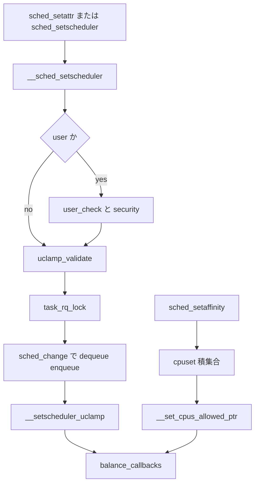

# 第24章 スケジューラ操作 API

> **本章で読むソース**
>
> - [`kernel/sched/syscalls.c` L356-L388](https://github.com/gregkh/linux/blob/v6.18.38/kernel/sched/syscalls.c#L356-L388)
> - [`kernel/sched/syscalls.c` L416-L454](https://github.com/gregkh/linux/blob/v6.18.38/kernel/sched/syscalls.c#L416-L454)
> - [`kernel/sched/syscalls.c` L531-L591](https://github.com/gregkh/linux/blob/v6.18.38/kernel/sched/syscalls.c#L531-L591)
> - [`kernel/sched/syscalls.c` L719-L738](https://github.com/gregkh/linux/blob/v6.18.38/kernel/sched/syscalls.c#L719-L738)
> - [`kernel/sched/syscalls.c` L962-L968](https://github.com/gregkh/linux/blob/v6.18.38/kernel/sched/syscalls.c#L962-L968)
> - [`kernel/sched/syscalls.c` L1158-L1210](https://github.com/gregkh/linux/blob/v6.18.38/kernel/sched/syscalls.c#L1158-L1210)
> - [`kernel/sched/syscalls.c` L1219-L1262](https://github.com/gregkh/linux/blob/v6.18.38/kernel/sched/syscalls.c#L1219-L1262)
> - [`kernel/sched/syscalls.c` L1284-L1297](https://github.com/gregkh/linux/blob/v6.18.38/kernel/sched/syscalls.c#L1284-L1297)
> - [`kernel/sched/core.c` L1629-L1691](https://github.com/gregkh/linux/blob/v6.18.38/kernel/sched/core.c#L1629-L1691)

## この章の狙い

ユーザー空間からの `sched_setscheduler`、`sched_setaffinity`、`sched_setattr` がカーネル内部の `__sched_setscheduler` と `__sched_setaffinity` にどう落ちるかを追う。
`CONFIG_UCLAMP_TASK` 有効時の **uclamp**（utilization clamp）検証、タスクへの反映、ランキュー上の集約までを読む。

## 前提

[ランキューとスケジューリングクラスの階層](../part01-core/08-runqueue-sched-class.md) と [group scheduling と cgroup 階層](../part02-eevdf/14-group-scheduling-cgroup.md) を読んでいること。
cpuset による CPU 制限は affinity 設定と交差する。

## sched_setscheduler から __sched_setscheduler

レガシー API の `sched_setscheduler` は `do_sched_setscheduler` でユーザーパラメータをコピーし、`_sched_setscheduler` 経由で `__sched_setscheduler` に入る。
`sched_setattr` は `sched_attr` を受け取り、uclamp や deadline パラメータも同じ本体で処理する。

[`kernel/sched/syscalls.c` L962-L968](https://github.com/gregkh/linux/blob/v6.18.38/kernel/sched/syscalls.c#L962-L968)

```c
SYSCALL_DEFINE3(sched_setscheduler, pid_t, pid, int, policy, struct sched_param __user *, param)
{
	if (policy < 0)
		return -EINVAL;

	return do_sched_setscheduler(pid, policy, param);
}
```

`__sched_setscheduler` はポリシー妥当性、権限（`user_check_sched_setscheduler` と `security_task_setscheduler`）、uclamp 検証のあと `task_rq_lock` を取る。
クラス変更時は `sched_change` ガード内で dequeue と enqueue を行い、`__setscheduler_uclamp` で clamp 要求をタスクに書き込む。

[`kernel/sched/syscalls.c` L531-L591](https://github.com/gregkh/linux/blob/v6.18.38/kernel/sched/syscalls.c#L531-L591)

```c
int __sched_setscheduler(struct task_struct *p,
			 const struct sched_attr *attr,
			 bool user, bool pi)
{
	int oldpolicy = -1, policy = attr->sched_policy;
	int retval, oldprio, newprio;
	const struct sched_class *prev_class, *next_class;
	struct balance_callback *head;
	struct rq_flags rf;
	int reset_on_fork;
	int queue_flags = DEQUEUE_SAVE | DEQUEUE_MOVE | DEQUEUE_NOCLOCK;
	struct rq *rq;
	bool cpuset_locked = false;

	BUG_ON(pi && in_interrupt());
recheck:
	// ... (中略) ...
	if (attr->sched_priority > MAX_RT_PRIO-1)
		return -EINVAL;
	if ((dl_policy(policy) && !__checkparam_dl(attr)) ||
	    (rt_policy(policy) != (attr->sched_priority != 0)))
		return -EINVAL;

	if (user) {
		retval = user_check_sched_setscheduler(p, attr, policy, reset_on_fork);
		if (retval)
			return retval;

		if (attr->sched_flags & SCHED_FLAG_SUGOV)
			return -EINVAL;

		retval = security_task_setscheduler(p);
		if (retval)
			return retval;
	}

	/* Update task specific "requested" clamps */
	if (attr->sched_flags & SCHED_FLAG_UTIL_CLAMP) {
		retval = uclamp_validate(p, attr);
		if (retval)
			return retval;
	}
```

[`kernel/sched/syscalls.c` L719-L738](https://github.com/gregkh/linux/blob/v6.18.38/kernel/sched/syscalls.c#L719-L738)

```c
	scoped_guard (sched_change, p, queue_flags) {

		if (!(attr->sched_flags & SCHED_FLAG_KEEP_PARAMS)) {
			__setscheduler_params(p, attr);
			p->sched_class = next_class;
			p->prio = newprio;
			__setscheduler_dl_pi(newprio, policy, p, scope);
		}
		__setscheduler_uclamp(p, attr);
		check_class_changing(rq, p, prev_class);

		if (scope->queued) {
			if (oldprio < p->prio)
				scope->flags |= ENQUEUE_HEAD;
		}
	}
```

## uclamp の検証とタスクへの反映

`uclamp_validate` は min と max の範囲と min ≤ max を確認し、`sched_uclamp_enable` で static branch を有効化する（ロック保持中に branch を触れないため、検証段階で行う）。
`__setscheduler_uclamp` はフラグに応じて `p->uclamp_req` を更新し、RT タスクの min には `sysctl_sched_uclamp_util_min_rt_default` を当てる。

[`kernel/sched/syscalls.c` L356-L388](https://github.com/gregkh/linux/blob/v6.18.38/kernel/sched/syscalls.c#L356-L388)

```c
static int uclamp_validate(struct task_struct *p,
			   const struct sched_attr *attr)
{
	int util_min = p->uclamp_req[UCLAMP_MIN].value;
	int util_max = p->uclamp_req[UCLAMP_MAX].value;

	if (attr->sched_flags & SCHED_FLAG_UTIL_CLAMP_MIN) {
		util_min = attr->sched_util_min;

		if (util_min + 1 > SCHED_CAPACITY_SCALE + 1)
			return -EINVAL;
	}

	if (attr->sched_flags & SCHED_FLAG_UTIL_CLAMP_MAX) {
		util_max = attr->sched_util_max;

		if (util_max + 1 > SCHED_CAPACITY_SCALE + 1)
			return -EINVAL;
	}

	if (util_min != -1 && util_max != -1 && util_min > util_max)
		return -EINVAL;

	sched_uclamp_enable();

	return 0;
}
```

[`kernel/sched/syscalls.c` L416-L454](https://github.com/gregkh/linux/blob/v6.18.38/kernel/sched/syscalls.c#L416-L454)

```c
static void __setscheduler_uclamp(struct task_struct *p,
				  const struct sched_attr *attr)
{
	enum uclamp_id clamp_id;

	for_each_clamp_id(clamp_id) {
		struct uclamp_se *uc_se = &p->uclamp_req[clamp_id];
		unsigned int value;

		if (!uclamp_reset(attr, clamp_id, uc_se))
			continue;

		if (unlikely(rt_task(p) && clamp_id == UCLAMP_MIN))
			value = sysctl_sched_uclamp_util_min_rt_default;
		else
			value = uclamp_none(clamp_id);

		uclamp_se_set(uc_se, value, false);

	}

	if (likely(!(attr->sched_flags & SCHED_FLAG_UTIL_CLAMP)))
		return;

	if (attr->sched_flags & SCHED_FLAG_UTIL_CLAMP_MIN &&
	    attr->sched_util_min != -1) {
		uclamp_se_set(&p->uclamp_req[UCLAMP_MIN],
			      attr->sched_util_min, true);
	}

	if (attr->sched_flags & SCHED_FLAG_UTIL_CLAMP_MAX &&
	    attr->sched_util_max != -1) {
		uclamp_se_set(&p->uclamp_req[UCLAMP_MAX],
			      attr->sched_util_max, true);
	}
}
```

## uclamp の有効値とランキュー集約

タスクが enqueue されるとき、`uclamp_eff_get` がタスク要求、cgroup 制限、システム既定の順で有効 clamp を決める。
`uclamp_rq_inc_id` は bucket ごとの refcount と「ローカル max 集約」で `rq->uclamp` を更新する。
PELT が追跡する utilization 自体を clamp するわけではない。
[PELT による負荷追跡](21-pelt-load-tracking.md) で得た `task_util_est` などの値と、`uclamp_eff_value` で得た effective clamp を併用し、fair クラスの CPU 選択（`task_fits_cpu` や `select_idle_capacity`）、misfit 判定、energy-aware な配置判断が行われる。

[`kernel/sched/core.c` L1629-L1691](https://github.com/gregkh/linux/blob/v6.18.38/kernel/sched/core.c#L1629-L1691)

```c
static inline struct uclamp_se
uclamp_eff_get(struct task_struct *p, enum uclamp_id clamp_id)
{
	struct uclamp_se uc_req = uclamp_tg_restrict(p, clamp_id);
	struct uclamp_se uc_max = uclamp_default[clamp_id];

	if (unlikely(uc_req.value > uc_max.value))
		return uc_max;

	return uc_req;
}

unsigned long uclamp_eff_value(struct task_struct *p, enum uclamp_id clamp_id)
{
	struct uclamp_se uc_eff;

	if (p->uclamp[clamp_id].active)
		return (unsigned long)p->uclamp[clamp_id].value;

	uc_eff = uclamp_eff_get(p, clamp_id);

	return (unsigned long)uc_eff.value;
}

static inline void uclamp_rq_inc_id(struct rq *rq, struct task_struct *p,
				    enum uclamp_id clamp_id)
{
	struct uclamp_rq *uc_rq = &rq->uclamp[clamp_id];
	struct uclamp_se *uc_se = &p->uclamp[clamp_id];
	struct uclamp_bucket *bucket;

	lockdep_assert_rq_held(rq);

	p->uclamp[clamp_id] = uclamp_eff_get(p, clamp_id);

	bucket = &uc_rq->bucket[uc_se->bucket_id];
	bucket->tasks++;
	uc_se->active = true;

	uclamp_idle_reset(rq, clamp_id, uc_se->value);

	if (bucket->tasks == 1 || uc_se->value > bucket->value)
		bucket->value = uc_se->value;

	if (uc_se->value > uclamp_rq_get(rq, clamp_id))
		uclamp_rq_set(rq, clamp_id, uc_se->value);
}
```

## sched_setaffinity とマスク検証

`sched_setaffinity` は `security_task_setscheduler` のあと、ユーザーマスクを `affinity_context` に載せて `__sched_setaffinity` へ渡す。
`__sched_setaffinity` は cpuset で許可された CPU との積集合を取り、`dl_task_check_affinity` で deadline タスクの span 制約を確認する。
設定後に cpuset が競合更新した場合はマスクを戻し `-EINVAL` を返す（TOCTOU 対策）。

[`kernel/sched/syscalls.c` L1158-L1210](https://github.com/gregkh/linux/blob/v6.18.38/kernel/sched/syscalls.c#L1158-L1210)

```c
int __sched_setaffinity(struct task_struct *p, struct affinity_context *ctx)
{
	int retval;
	cpumask_var_t cpus_allowed, new_mask;

	if (!alloc_cpumask_var(&cpus_allowed, GFP_KERNEL))
		return -ENOMEM;

	if (!alloc_cpumask_var(&new_mask, GFP_KERNEL)) {
		retval = -ENOMEM;
		goto out_free_cpus_allowed;
	}

	cpuset_cpus_allowed(p, cpus_allowed);
	cpumask_and(new_mask, ctx->new_mask, cpus_allowed);

	ctx->new_mask = new_mask;
	ctx->flags |= SCA_CHECK;

	retval = dl_task_check_affinity(p, new_mask);
	if (retval)
		goto out_free_new_mask;

	retval = __set_cpus_allowed_ptr(p, ctx);
	if (retval)
		goto out_free_new_mask;

	cpuset_cpus_allowed(p, cpus_allowed);
	if (!cpumask_subset(new_mask, cpus_allowed)) {
		/*
		 * We must have raced with a concurrent cpuset update.
		 * Just reset the cpumask to the cpuset's cpus_allowed.
		 */
		cpumask_copy(new_mask, cpus_allowed);

		/*
		 * If SCA_USER is set, a 2nd call to __set_cpus_allowed_ptr()
		 * will restore the previous user_cpus_ptr value.
		 *
		 * In the unlikely event a previous user_cpus_ptr exists,
		 * we need to further restrict the mask to what is allowed
		 * by that old user_cpus_ptr.
		 */
		if (unlikely((ctx->flags & SCA_USER) && ctx->user_mask)) {
			bool empty = !cpumask_and(new_mask, new_mask,
						  ctx->user_mask);

			if (empty)
				cpumask_copy(new_mask, cpus_allowed);
		}
		__set_cpus_allowed_ptr(p, ctx);
		retval = -EINVAL;
	}
```

[`kernel/sched/syscalls.c` L1219-L1262](https://github.com/gregkh/linux/blob/v6.18.38/kernel/sched/syscalls.c#L1219-L1262)

```c
long sched_setaffinity(pid_t pid, const struct cpumask *in_mask)
{
	struct affinity_context ac;
	struct cpumask *user_mask;
	int retval;

	CLASS(find_get_task, p)(pid);
	if (!p)
		return -ESRCH;

	if (p->flags & PF_NO_SETAFFINITY)
		return -EINVAL;

	if (!check_same_owner(p)) {
		guard(rcu)();
		if (!ns_capable(__task_cred(p)->user_ns, CAP_SYS_NICE))
			return -EPERM;
	}

	retval = security_task_setscheduler(p);
	if (retval)
		return retval;

	user_mask = alloc_user_cpus_ptr(NUMA_NO_NODE);
	if (user_mask) {
		cpumask_copy(user_mask, in_mask);
	} else {
		return -ENOMEM;
	}

	ac = (struct affinity_context){
		.new_mask  = in_mask,
		.user_mask = user_mask,
		.flags     = SCA_USER,
	};

	retval = __sched_setaffinity(p, &ac);
	kfree(ac.user_mask);

	return retval;
}
```

システムコール入口はユーザーマスクのコピーだけを行い、実処理は `sched_setaffinity` に委譲する。

[`kernel/sched/syscalls.c` L1284-L1298](https://github.com/gregkh/linux/blob/v6.18.38/kernel/sched/syscalls.c#L1284-L1298)

```c
SYSCALL_DEFINE3(sched_setaffinity, pid_t, pid, unsigned int, len,
		unsigned long __user *, user_mask_ptr)
{
	cpumask_var_t new_mask;
	int retval;

	if (!alloc_cpumask_var(&new_mask, GFP_KERNEL))
		return -ENOMEM;

	retval = get_user_cpu_mask(user_mask_ptr, len, new_mask);
	if (retval == 0)
		retval = sched_setaffinity(pid, new_mask);
	free_cpumask_var(new_mask);
	return retval;
}
```

## 処理の流れ



## 高速化と最適化の工夫

uclamp は `CONFIG_UCLAMP_TASK` 無効時はスタブになり、ランタイムコストをゼロに近づける。
有効化は `sched_uclamp_enable` が static branch を一度だけ立てる方式で、毎タスクの分岐コストを避ける。
affinity 更新は `__set_cpus_allowed_ptr` に集約され、マイグレーションとランキュー操作を一括で行う（詳細は wakeup 章の CPU 制約と同型）。

> **7.x 系での変化**
> [`kernel/sched/syscalls.c`](https://github.com/gregkh/linux/blob/v7.1.3/kernel/sched/syscalls.c) は v6.18.38 から約100行の差分がある。
> `sched_set_stop_task` 周辺の idle 判定簡略化、`sched_change` の `DEQUEUE_CLASS` フラグ化、`sched_set_fifo_secondary` 追加などが主で、本章が追う syscall 入口と uclamp、affinity の骨格は同じである。

## まとめ

- **sched_setscheduler** 系は `__sched_setscheduler` に集約され、ポリシー変更と uclamp 更新をランキューロック下で原子的に行う。
- **uclamp** は検証段階で static branch を有効化し、enqueue 時にランキュー bucket へ集約する。
- **sched_setaffinity** は cpuset との積集合と deadline span チェックを通してから CPU 許可マスクを更新する。

## 関連する章

- [group scheduling と cgroup 階層](../part02-eevdf/14-group-scheduling-cgroup.md)
- [PELT による負荷追跡](21-pelt-load-tracking.md)
- [ロードバランスと NUMA](22-load-balance-numa.md)
