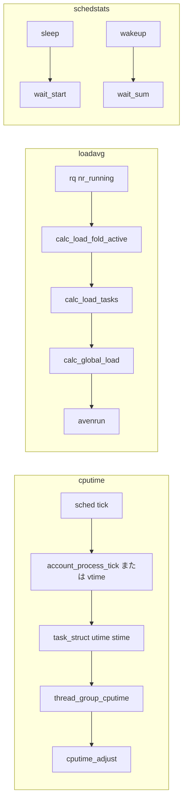

# 第25章 cputime、loadavg、schedstats

> **本章で読むソース**
>
> - [`kernel/sched/cputime.c` L122-L137](https://github.com/gregkh/linux/blob/v6.18.38/kernel/sched/cputime.c#L122-L137)
> - [`kernel/sched/cputime.c` L313-L352](https://github.com/gregkh/linux/blob/v6.18.38/kernel/sched/cputime.c#L313-L352)
> - [`kernel/sched/cputime.c` L475-L501](https://github.com/gregkh/linux/blob/v6.18.38/kernel/sched/cputime.c#L475-L501)
> - [`kernel/sched/cputime.c` L546-L593](https://github.com/gregkh/linux/blob/v6.18.38/kernel/sched/cputime.c#L546-L593)
> - [`kernel/sched/cputime.c` L844-L881](https://github.com/gregkh/linux/blob/v6.18.38/kernel/sched/cputime.c#L844-L881)
> - [`kernel/sched/loadavg.c` L80-L93](https://github.com/gregkh/linux/blob/v6.18.38/kernel/sched/loadavg.c#L80-L93)
> - [`kernel/sched/loadavg.c` L351-L381](https://github.com/gregkh/linux/blob/v6.18.38/kernel/sched/loadavg.c#L351-L381)
> - [`kernel/sched/loadavg.c` L387-L399](https://github.com/gregkh/linux/blob/v6.18.38/kernel/sched/loadavg.c#L387-L399)
> - [`kernel/sched/stats.h` L37-L45](https://github.com/gregkh/linux/blob/v6.18.38/kernel/sched/stats.h#L37-L45)
> - [`kernel/sched/stats.c` L7-L45](https://github.com/gregkh/linux/blob/v6.18.38/kernel/sched/stats.c#L7-L45)

## この章の狙い

**cputime** の tick ベース集計と `CONFIG_VIRT_CPU_ACCOUNTING_GEN` 時の `task_cputime`、スレッドグループ合算、load average の per-CPU 差分折りたたみ、**schedstats** の待機時間計測を読む。
[PSI と統計](23-psi-stats.md) が stall 情報を扱うのに対し、本章は従来の CPU 時間と `/proc/loadavg`、`/proc/schedstat` の土台を扱う。

## 前提

[task_struct の構造](../part00-process/01-task-struct.md) で `utime` と `stime` を押さえていること。
POSIX CPU タイマーが cputime を消費する応用例は [割り込みと時間の POSIX CPU タイマー](../../irq-time/part04-posix/18-posix-cpu-timers.md) を参照する。

## tick ベースの account_process_tick

`CONFIG_VIRT_CPU_ACCOUNTING_NATIVE` でない構成では、sched tick から `account_process_tick` が呼ばれる。
`vtime_accounting_enabled_this_cpu` が真なら tick 集計はスキップし、仮想計上 path に任せる。
通常 path では `TICK_NSEC` を steal 時間と IRQ 時間で差し引いたあと、user か system か idle へ振り分ける。

[`kernel/sched/cputime.c` L475-L501](https://github.com/gregkh/linux/blob/v6.18.38/kernel/sched/cputime.c#L475-L501)

```c
void account_process_tick(struct task_struct *p, int user_tick)
{
	u64 cputime, steal;

	if (vtime_accounting_enabled_this_cpu())
		return;

	if (irqtime_enabled()) {
		irqtime_account_process_tick(p, user_tick, 1);
		return;
	}

	cputime = TICK_NSEC;
	steal = steal_account_process_time(ULONG_MAX);

	if (steal >= cputime)
		return;

	cputime -= steal;

	if (user_tick)
		account_user_time(p, cputime);
	else if ((p != this_rq()->idle) || (irq_count() != HARDIRQ_OFFSET))
		account_system_time(p, HARDIRQ_OFFSET, cputime);
	else
		account_idle_time(cputime);
}
```

`account_user_time` は `p->utime` と per-CPU `kcpustat`、cgroup フィールドへ同じ delta を積む。

[`kernel/sched/cputime.c` L122-L137](https://github.com/gregkh/linux/blob/v6.18.38/kernel/sched/cputime.c#L122-L137)

```c
void account_user_time(struct task_struct *p, u64 cputime)
{
	int index;

	p->utime += cputime;
	account_group_user_time(p, cputime);

	index = (task_nice(p) > 0) ? CPUTIME_NICE : CPUTIME_USER;

	task_group_account_field(p, index, cputime);

	acct_account_cputime(p);
}
```

## VIRT_CPU_ACCOUNTING と task_cputime

`CONFIG_VIRT_CPU_ACCOUNTING_GEN` では `task_cputime` が `vtime` seqcount を読み、実行中タスクの未反映分を `utime` または `stime` に加算する。
スリープ中はスナップショット済みの `t->utime` と `t->stime` だけを返す。

[`kernel/sched/cputime.c` L844-L881](https://github.com/gregkh/linux/blob/v6.18.38/kernel/sched/cputime.c#L844-L881)

```c
bool task_cputime(struct task_struct *t, u64 *utime, u64 *stime)
{
	struct vtime *vtime = &t->vtime;
	unsigned int seq;
	u64 delta;
	int ret;

	if (!vtime_accounting_enabled()) {
		*utime = t->utime;
		*stime = t->stime;
		return false;
	}

	do {
		ret = false;
		seq = read_seqcount_begin(&vtime->seqcount);

		*utime = t->utime;
		*stime = t->stime;

		if (vtime->state < VTIME_SYS)
			continue;

		ret = true;
		delta = vtime_delta(vtime);

		if (vtime->state == VTIME_SYS)
			*stime += vtime->stime + delta;
		else
			*utime += vtime->utime + delta;
	} while (read_seqcount_retry(&vtime->seqcount, seq));

	return ret;
}
```

## スレッドグループ合算と cputime_adjust

`thread_group_cputime` は `signal_struct` の退避済み時間に、生きているスレッドの `task_cputime` を足し合わせる。
seqlock で `stats_lock` を使い、読み取り側は lockless 試行のあと競合時にロックへフォールバックする。

[`kernel/sched/cputime.c` L313-L352](https://github.com/gregkh/linux/blob/v6.18.38/kernel/sched/cputime.c#L313-L352)

```c
void thread_group_cputime(struct task_struct *tsk, struct task_cputime *times)
{
	struct signal_struct *sig = tsk->signal;
	u64 utime, stime;
	struct task_struct *t;
	unsigned int seq, nextseq;
	unsigned long flags;

	if (same_thread_group(current, tsk))
		(void) task_sched_runtime(current);

	rcu_read_lock();
	nextseq = 0;
	do {
		seq = nextseq;
		flags = read_seqbegin_or_lock_irqsave(&sig->stats_lock, &seq);
		times->utime = sig->utime;
		times->stime = sig->stime;
		times->sum_exec_runtime = sig->sum_sched_runtime;

		for_each_thread(tsk, t) {
			task_cputime(t, &utime, &stime);
			times->utime += utime;
			times->stime += stime;
			times->sum_exec_runtime += read_sum_exec_runtime(t);
		}
		nextseq = 1;
	} while (need_seqretry(&sig->stats_lock, seq));
	done_seqretry_irqrestore(&sig->stats_lock, seq, flags);
	rcu_read_unlock();
}
```

tick ベースの `utime` と `stime` は sched tick の切れ目で誤差が出るため、`cputime_adjust` がスケジューラが計上した `sum_exec_runtime` に比例して user と system を再配分し、単調性を保証する。

[`kernel/sched/cputime.c` L546-L621](https://github.com/gregkh/linux/blob/v6.18.38/kernel/sched/cputime.c#L546-L621)

```c
void cputime_adjust(struct task_cputime *curr, struct prev_cputime *prev,
		    u64 *ut, u64 *st)
{
	u64 rtime, stime, utime;
	unsigned long flags;

	/* Serialize concurrent callers such that we can honour our guarantees */
	raw_spin_lock_irqsave(&prev->lock, flags);
	rtime = curr->sum_exec_runtime;

	/*
	 * This is possible under two circumstances:
	 *  - rtime isn't monotonic after all (a bug);
	 *  - we got reordered by the lock.
	 *
	 * In both cases this acts as a filter such that the rest of the code
	 * can assume it is monotonic regardless of anything else.
	 */
	if (prev->stime + prev->utime >= rtime)
		goto out;

	stime = curr->stime;
	utime = curr->utime;

	/*
	 * If either stime or utime are 0, assume all runtime is userspace.
	 * Once a task gets some ticks, the monotonicity code at 'update:'
	 * will ensure things converge to the observed ratio.
	 */
	if (stime == 0) {
		utime = rtime;
		goto update;
	}

	if (utime == 0) {
		stime = rtime;
		goto update;
	}

	stime = mul_u64_u64_div_u64(stime, rtime, stime + utime);
	/*
	 * Because mul_u64_u64_div_u64() can approximate on some
	 * achitectures; enforce the constraint that: a*b/(b+c) <= a.
	 */
	if (unlikely(stime > rtime))
		stime = rtime;

update:
	/*
	 * Make sure stime doesn't go backwards; this preserves monotonicity
	 * for utime because rtime is monotonic.
	 *
	 *  utime_i+1 = rtime_i+1 - stime_i
	 *            = rtime_i+1 - (rtime_i - utime_i)
	 *            = (rtime_i+1 - rtime_i) + utime_i
	 *            >= utime_i
	 */
	if (stime < prev->stime)
		stime = prev->stime;
	utime = rtime - stime;

	/*
	 * Make sure utime doesn't go backwards; this still preserves
	 * monotonicity for stime, analogous argument to above.
	 */
	if (utime < prev->utime) {
		utime = prev->utime;
		stime = rtime - utime;
	}

	prev->stime = stime;
	prev->utime = utime;
out:
	*ut = prev->utime;
	*st = prev->stime;
	raw_spin_unlock_irqrestore(&prev->lock, flags);
}
```

## loadavg の per-CPU 差分と指数移動平均

グローバル load average は `nr_running + nr_uninterruptible` の指数移動平均である。
全 CPU を毎 tick 走査する代わりに、各 `rq` が `calc_load_fold_active` で差分だけを `calc_load_tasks` に足す。
`calc_global_load` が `LOAD_FREQ` ごとに `avenrun[3]` を更新し、NO_HZ 時は `calc_load_nohz` バッファで欠落 tick を補う。

[`kernel/sched/loadavg.c` L80-L93](https://github.com/gregkh/linux/blob/v6.18.38/kernel/sched/loadavg.c#L80-L93)

```c
long calc_load_fold_active(struct rq *this_rq, long adjust)
{
	long nr_active, delta = 0;

	nr_active = this_rq->nr_running - adjust;
	nr_active += (long)this_rq->nr_uninterruptible;

	if (nr_active != this_rq->calc_load_active) {
		delta = nr_active - this_rq->calc_load_active;
		this_rq->calc_load_active = nr_active;
	}

	return delta;
}
```

[`kernel/sched/loadavg.c` L351-L381](https://github.com/gregkh/linux/blob/v6.18.38/kernel/sched/loadavg.c#L351-L381)

```c
void calc_global_load(void)
{
	unsigned long sample_window;
	long active, delta;

	sample_window = READ_ONCE(calc_load_update);
	if (time_before(jiffies, sample_window + 10))
		return;

	delta = calc_load_nohz_read();
	if (delta)
		atomic_long_add(delta, &calc_load_tasks);

	active = atomic_long_read(&calc_load_tasks);
	active = active > 0 ? active * FIXED_1 : 0;

	avenrun[0] = calc_load(avenrun[0], EXP_1, active);
	avenrun[1] = calc_load(avenrun[1], EXP_5, active);
	avenrun[2] = calc_load(avenrun[2], EXP_15, active);

	WRITE_ONCE(calc_load_update, sample_window + LOAD_FREQ);

	calc_global_nohz();
}
```

sched tick 側は CPU ごとに `calc_global_load_tick` で差分を送る。

[`kernel/sched/loadavg.c` L387-L399](https://github.com/gregkh/linux/blob/v6.18.38/kernel/sched/loadavg.c#L387-L399)

```c
void calc_global_load_tick(struct rq *this_rq)
{
	long delta;

	if (time_before(jiffies, this_rq->calc_load_update))
		return;

	delta  = calc_load_fold_active(this_rq, 0);
	if (delta)
		atomic_long_add(delta, &calc_load_tasks);

	this_rq->calc_load_update += LOAD_FREQ;
}
```

## schedstats の待機時間

`CONFIG_SCHEDSTATS` が有効なとき、`schedstat_enabled` は static branch で計測の有無を切り替える。
`schedstat_*` マクロは branch が無効なら通常は patched NOP となり、`__schedstat_*` は無条件更新用である。
`CONFIG_SCHEDSTATS` 無効ビルドではマクロ自体が空になり、runtime で無効化した場合はホット path 負担を最小化する、までが保証される。
タスクが sleep に入るとき `__update_stats_wait_start` が `rq_clock` を記録し、wake 時の `__update_stats_wait_end` が `wait_sum` と `wait_max` を更新する。

[`kernel/sched/stats.h` L37-L45](https://github.com/gregkh/linux/blob/v6.18.38/kernel/sched/stats.h#L37-L45)

```c
#define   schedstat_enabled()		static_branch_unlikely(&sched_schedstats)
#define __schedstat_inc(var)		do { var++; } while (0)
#define   schedstat_inc(var)		do { if (schedstat_enabled()) { var++; } } while (0)
#define __schedstat_add(var, amt)	do { var += (amt); } while (0)
#define   schedstat_add(var, amt)	do { if (schedstat_enabled()) { var += (amt); } } while (0)
#define __schedstat_set(var, val)	do { var = (val); } while (0)
#define   schedstat_set(var, val)	do { if (schedstat_enabled()) { var = (val); } } while (0)
#define   schedstat_val(var)		(var)
#define   schedstat_val_or_zero(var)	((schedstat_enabled()) ? (var) : 0)
```

[`kernel/sched/stats.c` L7-L45](https://github.com/gregkh/linux/blob/v6.18.38/kernel/sched/stats.c#L7-L45)

```c
void __update_stats_wait_start(struct rq *rq, struct task_struct *p,
			       struct sched_statistics *stats)
{
	u64 wait_start, prev_wait_start;

	wait_start = rq_clock(rq);
	prev_wait_start = schedstat_val(stats->wait_start);

	if (p && likely(wait_start > prev_wait_start))
		wait_start -= prev_wait_start;

	__schedstat_set(stats->wait_start, wait_start);
}

void __update_stats_wait_end(struct rq *rq, struct task_struct *p,
			     struct sched_statistics *stats)
{
	u64 delta = rq_clock(rq) - schedstat_val(stats->wait_start);

	if (p) {
		if (task_on_rq_migrating(p)) {
			__schedstat_set(stats->wait_start, delta);

			return;
		}

		trace_sched_stat_wait(p, delta);
	}

	__schedstat_set(stats->wait_max,
			max(schedstat_val(stats->wait_max), delta));
	__schedstat_inc(stats->wait_count);
	__schedstat_add(stats->wait_sum, delta);
	__schedstat_set(stats->wait_start, 0);
}
```

`/proc/schedstat` は `stats.c` の seq_file 実装から CPU ごとの yield 回数、ttwu 回数、domain 統計を出力する（[PSI と統計](23-psi-stats.md) の PSI とは別チャネル）。

## データの流れ



## 高速化と最適化の工夫

load average は全 CPU スキャンを避け、per-CPU の active 数差分だけを atomic に足す分散集計を採用する（コメントが述べる通り、大規模 SMP での IRQ オフ走査を避ける）。
`nr_uninterruptible` は wakeup CPU と sleep CPU が異なっても合計だけ正しければよい設計で、wake path への cache line 競合を減らす。
schedstats は runtime 無効時でも static key 分岐を通るが、通常は patched NOP でホット path 負担を最小化する。
`CONFIG_SCHEDSTATS` 無効ビルドではマクロ自体がコンパイルアウトされる。

> **7.x 系での変化**
> [`kernel/sched/loadavg.c`](https://github.com/gregkh/linux/blob/v7.1.3/kernel/sched/loadavg.c) は v6.18.38 と同一である（diff 0行）。
> [`kernel/sched/cputime.c`](https://github.com/gregkh/linux/blob/v7.1.3/kernel/sched/cputime.c) は約58行の差分がある。
> `sched_clock_irqtime` の static key 化と `thread_group_cputime` の seqlock 読み取り簡略化が主である。
> 集計の意味は変わらない。

## まとめ

- **cputime** は tick 集計と仮想計上の二系統があり、`task_cputime` と `cputime_adjust` が読み取り精度を補う。
- **loadavg** は per-CPU 差分の atomic 加算と指数平滑で `/proc/loadavg` を維持する。
- **schedstats** は static branch で計測を切り替え、runtime 無効時はホット path 負担を最小化する。

## 関連する章

- [task_struct の構造](../part00-process/01-task-struct.md)
- [PSI と統計](23-psi-stats.md)
- [割り込みと時間：POSIX CPU タイマー](../../irq-time/part04-posix/18-posix-cpu-timers.md)
