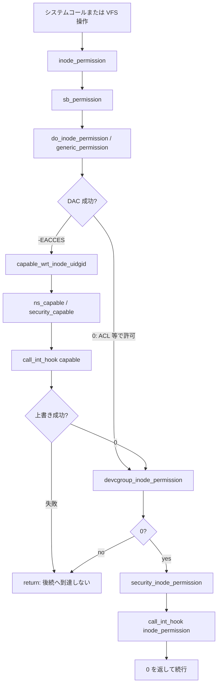

# 第1章 カーネルセキュリティの層構造と判定経路

> **本章で読むソース**
>
> - [`fs/namei.c` L464-L507](https://github.com/gregkh/linux/blob/v6.18.38/fs/namei.c#L464-L507)
> - [`kernel/capability.c` L473-L480](https://github.com/gregkh/linux/blob/v6.18.38/kernel/capability.c#L473-L480)
> - [`kernel/capability.c` L331-L347](https://github.com/gregkh/linux/blob/v6.18.38/kernel/capability.c#L331-L347)
> - [`fs/namei.c` L521-L533](https://github.com/gregkh/linux/blob/v6.18.38/fs/namei.c#L521-L533)
> - [`fs/namei.c` L568-L601](https://github.com/gregkh/linux/blob/v6.18.38/fs/namei.c#L568-L601)
> - [`security/security.c` L1209-L1215](https://github.com/gregkh/linux/blob/v6.18.38/security/security.c#L1209-L1215)
> - [`security/security.c` L2392-L2397](https://github.com/gregkh/linux/blob/v6.18.38/security/security.c#L2392-L2397)

## この章の狙い

カーネルがアクセス可否を判定するとき、**DAC**、**capability**、**LSM** がどの順序で積み重なるかを地図として押さえる。
以降の章で `cred`、LSM フレームワーク、seccomp、Landlock、keys を読む前提として、VFS の代表経路 `inode_permission` を例に示す。

## 前提

- [全体像と横断基盤](../../foundation/README.md) のシステムコール入口と `task_struct` の概観
- [VFS とページキャッシュ](../../vfs/README.md) のパス解決と inode の基本

## 本分冊が扱う機構

Linux カーネルの強制は単一のゲートではなく、用途ごとに層が分かれている。

| 層 | 役割 | 主なソース（本分冊） |
|---|---|---|
| DAC | UID/GID とファイルモードによる Unix 権限 | `fs/namei.c` の `generic_permission` |
| capability | 特権操作の細分化と user namespace 越え | `kernel/capability.c`、`security/commoncap.c` |
| LSM | MAC ポリシー（SELinux 等）の差し込み | `security/security.c`、各 LSM 実装 |
| seccomp | システムコール自体の許可/拒否 | `kernel/seccomp.c` |
| Landlock | プロセス自身が課す追加制限 | `security/landlock/` |
| keys | 鍵と keyring の管理 | `security/keys/` |

SELinux のポリシー評価本体は [SELinux userspace](../../../selinux/README.md) 分冊へ委譲する。
BPF LSM のプログラムロードは [BPF とトレーシング](../../bpf/README.md) 分冊へ委譲する。
device cgroup は [namespace と cgroup](../../ns-cgroup/README.md) 分冊へ委譲する。

## DAC：generic_permission

VFS は inode 操作のたびに `inode_permission` を呼び、最終段の手前で DAC を `generic_permission` に委ねる。
DAC は inode の所有者とグループ、モードビット、補助グループを照合する。

[`fs/namei.c` L464-L507](https://github.com/gregkh/linux/blob/v6.18.38/fs/namei.c#L464-L507)

```c
int generic_permission(struct mnt_idmap *idmap, struct inode *inode,
		       int mask)
{
	int ret;

	/*
	 * Do the basic permission checks.
	 */
	ret = acl_permission_check(idmap, inode, mask);
	if (ret != -EACCES)
		return ret;

	if (S_ISDIR(inode->i_mode)) {
		/* DACs are overridable for directories */
		if (!(mask & MAY_WRITE))
			if (capable_wrt_inode_uidgid(idmap, inode,
						     CAP_DAC_READ_SEARCH))
				return 0;
		if (capable_wrt_inode_uidgid(idmap, inode,
					     CAP_DAC_OVERRIDE))
			return 0;
		return -EACCES;
	}

	/*
	 * Searching includes executable on directories, else just read.
	 */
	mask &= MAY_READ | MAY_WRITE | MAY_EXEC;
	if (mask == MAY_READ)
		if (capable_wrt_inode_uidgid(idmap, inode,
					     CAP_DAC_READ_SEARCH))
			return 0;
	/*
	 * Read/write DACs are always overridable.
	 * Executable DACs are overridable when there is
	 * at least one exec bit set.
	 */
	if (!(mask & MAY_EXEC) || (inode->i_mode & S_IXUGO))
		if (capable_wrt_inode_uidgid(idmap, inode,
					     CAP_DAC_OVERRIDE))
			return 0;

	return -EACCES;
}
```

`acl_permission_check` が 0 を返せばその時点で許可となり、capability 判定は呼ばれない。
`-EACCES` のときだけ `CAP_DAC_READ_SEARCH` や `CAP_DAC_OVERRIDE` による上書きが試され、ここで初めて **capability** 層が DAC に介入する。

## capable_wrt_inode_uidgid：DAC から capability へ

`generic_permission` は `capable_wrt_inode_uidgid` を呼び、現在タスクの user namespace と inode の UID/GID マッピングを確認したうえで capability 判定へ進む。

[`kernel/capability.c` L473-L480](https://github.com/gregkh/linux/blob/v6.18.38/kernel/capability.c#L473-L480)

```c
bool capable_wrt_inode_uidgid(struct mnt_idmap *idmap,
			      const struct inode *inode, int cap)
{
	struct user_namespace *ns = current_user_ns();

	return ns_capable(ns, cap) &&
	       privileged_wrt_inode_uidgid(ns, idmap, inode);
}
```

`current_user_ns()` で取得した namespace に対し `ns_capable` が `security_capable` を呼ぶ。
inode 側の ID が現在の user namespace にマップされていることも併せて要求する。

## security_capable から call_int_hook へ

`ns_capable_common` は `current_cred()` を `security_capable` に渡し、LSM の `capable` フック列へ接続する。

[`kernel/capability.c` L331-L347](https://github.com/gregkh/linux/blob/v6.18.38/kernel/capability.c#L331-L347)

```c
static bool ns_capable_common(struct user_namespace *ns,
			      int cap,
			      unsigned int opts)
{
	int capable;

	if (unlikely(!cap_valid(cap))) {
		pr_crit("capable() called with invalid cap=%u\n", cap);
		BUG();
	}

	capable = security_capable(current_cred(), ns, cap, opts);
	if (capable == 0) {
		current->flags |= PF_SUPERPRIV;
		return true;
	}
	return false;
}
```

[`security/security.c` L1209-L1215](https://github.com/gregkh/linux/blob/v6.18.38/security/security.c#L1209-L1215)

```c
int security_capable(const struct cred *cred,
		     struct user_namespace *ns,
		     int cap,
		     unsigned int opts)
{
	return call_int_hook(capable, cred, ns, cap, opts);
}
```

DAC 上書き用の capability 判定も、inode 操作末尾の `security_inode_permission` も、最終的には `call_int_hook` で LSM 実装へ届く。

## DAC の fast path：IOP_FASTPERM

`do_inode_permission` は、inode 専用の `permission` 演算子が無い通常ファイルに対して `generic_permission` へ直行する。
`inode->i_opflags` に `IOP_FASTPERM` を立て、以降の呼び出しで分岐を省略する。

[`fs/namei.c` L521-L533](https://github.com/gregkh/linux/blob/v6.18.38/fs/namei.c#L521-L533)

```c
static inline int do_inode_permission(struct mnt_idmap *idmap,
				      struct inode *inode, int mask)
{
	if (unlikely(!(inode->i_opflags & IOP_FASTPERM))) {
		if (likely(inode->i_op->permission))
			return inode->i_op->permission(idmap, inode, mask);

		/* This gets set once for the inode lifetime */
		spin_lock(&inode->i_lock);
		inode->i_opflags |= IOP_FASTPERM;
		spin_unlock(&inode->i_lock);
	}
	return generic_permission(idmap, inode, mask);
}
```

権限チェックはホットパスであるため、ファイルシステム種別ごとの演算子探索を一度だけに抑える。

## inode_permission の層の積み上げ

`inode_permission` は superblock 検査、immutable 属性、DAC、device cgroup、LSM の順に進む。
DAC が 0 を返したときだけ device cgroup と LSM へ進み、DAC 失敗（`-EACCES` 等）で capability 上書きも通らなければ後続には到達しない。

[`fs/namei.c` L568-L601](https://github.com/gregkh/linux/blob/v6.18.38/fs/namei.c#L568-L601)

```c
int inode_permission(struct mnt_idmap *idmap,
		     struct inode *inode, int mask)
{
	int retval;

	retval = sb_permission(inode->i_sb, inode, mask);
	if (unlikely(retval))
		return retval;

	if (unlikely(mask & MAY_WRITE)) {
		/*
		 * Nobody gets write access to an immutable file.
		 */
		if (unlikely(IS_IMMUTABLE(inode)))
			return -EPERM;

		/*
		 * Updating mtime will likely cause i_uid and i_gid to be
		 * written back improperly if their true value is unknown
		 * to the vfs.
		 */
		if (unlikely(HAS_UNMAPPED_ID(idmap, inode)))
			return -EACCES;
	}

	retval = do_inode_permission(idmap, inode, mask);
	if (unlikely(retval))
		return retval;

	retval = devcgroup_inode_permission(inode, mask);
	if (unlikely(retval))
		return retval;

	return security_inode_permission(inode, mask);
}
```

device cgroup の詳細は ns-cgroup 分冊で扱う。
本章では「DAC の後、LSM の直前に挟まる層」として位置づける。

## LSM への入口：security_inode_permission

LSM フレームワークは `security_inode_permission` 経由で inode アクセスを検査する。
プライベート inode は早期 return し、それ以外は `inode_permission` フックへ委ねる。

[`security/security.c` L2392-L2397](https://github.com/gregkh/linux/blob/v6.18.38/security/security.c#L2392-L2397)

```c
int security_inode_permission(struct inode *inode, int mask)
{
	if (unlikely(IS_PRIVATE(inode)))
		return 0;
	return call_int_hook(inode_permission, inode, mask);
}
```

`call_int_hook` の内部（静的呼び出しと登録済み LSM の列挙）は第3章で読む。

## 判定経路の全体像



システムコール入口では、seccomp がカーネル関数に到達する前にフィルタする（第10章）。
Landlock は LSM の一種として同じフック経路に載る（第13章以降）。

## 高速化と最適化の工夫

`inode_permission` は `unlikely` で分岐のコストを抑え、通常パスを細い直線に保つ。
`do_inode_permission` の `IOP_FASTPERM` は、inode 寿命中に一度だけ `i_op->permission` の有無を確定させ、以降の DAC 判定をインライン化可能な形に固定する。
LSM 側も第3章で読むとおり、従来の連結リスト走査から **static call** と **jump label** へ移行し、有効な LSM が無いフックではコストをほぼゼロに近づけている。

## まとめ

カーネルセキュリティは DAC、capability、device cgroup、LSM などが順に積み重なる。
`inode_permission` はその縮図であり、DAC 成功時は capability を経由せず後段へ進み、DAC 失敗時だけ `capable_wrt_inode_uidgid` 経由で capability 上書きを試みる。
本分冊はこの積層を `cred` と LSM フレームワークから順に読み下ろす。

## 関連する章

- [`cred` と権限判定の入口](02-cred-capable-entry.md)
- [LSM フック定義と静的呼び出し機構](../part01-lsm/03-lsm-hooks-static-calls.md)
- [namespace と cgroup：user namespace](../../ns-cgroup/part01-namespaces/06-user-namespace.md)
