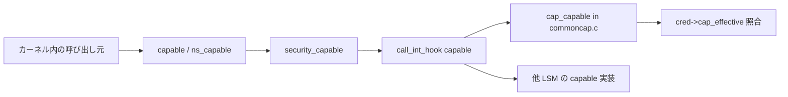

# 第2章 `cred` と権限判定の入口

> **本章で読むソース**
>
> - [`include/linux/cred.h` L111-L147](https://github.com/gregkh/linux/blob/v6.18.38/include/linux/cred.h#L111-L147)
> - [`include/linux/cred.h` L268-L297](https://github.com/gregkh/linux/blob/v6.18.38/include/linux/cred.h#L268-L297)
> - [`kernel/cred.c` L44-L63](https://github.com/gregkh/linux/blob/v6.18.38/kernel/cred.c#L44-L63)
> - [`kernel/cred.c` L206-L250](https://github.com/gregkh/linux/blob/v6.18.38/kernel/cred.c#L206-L250)
> - [`kernel/cred.c` L392-L439](https://github.com/gregkh/linux/blob/v6.18.38/kernel/cred.c#L392-L439)
> - [`kernel/capability.c` L331-L347](https://github.com/gregkh/linux/blob/v6.18.38/kernel/capability.c#L331-L347)
> - [`kernel/capability.c` L361-L364](https://github.com/gregkh/linux/blob/v6.18.38/kernel/capability.c#L361-L364)
> - [`kernel/capability.c` L414-L417](https://github.com/gregkh/linux/blob/v6.18.38/kernel/capability.c#L414-L417)
> - [`security/security.c` L1209-L1215](https://github.com/gregkh/linux/blob/v6.18.38/security/security.c#L1209-L1215)
> - [`security/commoncap.c` L68-L82](https://github.com/gregkh/linux/blob/v6.18.38/security/commoncap.c#L68-L82)
> - [`security/commoncap.c` L124-L132](https://github.com/gregkh/linux/blob/v6.18.38/security/commoncap.c#L124-L132)

## この章の狙い

タスクの権限情報を束ねる **`struct cred`** と、特権判定の入口 **`capable`** 系 API が `security_capable` へどう接続するかを読む。
第1章で触れた DAC 上書きや LSM フックは、いずれも `cred` を引数に取る。

## 前提

- [第1章：カーネルセキュリティの層構造と判定経路](01-security-layers-overview.md)
- [プロセスとスケジューラ](../../sched/README.md) の `fork` と `copy_process` の概観

## struct cred：権限のコンテナ

`task_struct` は `cred`（主観的）と `real_cred`（客観的）の二つのポインタを持つ。
capability セット、user namespace、LSM blob、keyring への参照はすべて `struct cred` に集約される。

[`include/linux/cred.h` L111-L147](https://github.com/gregkh/linux/blob/v6.18.38/include/linux/cred.h#L111-L147)

```c
struct cred {
	atomic_long_t	usage;
	kuid_t		uid;		/* real UID of the task */
	kgid_t		gid;		/* real GID of the task */
	kuid_t		suid;		/* saved UID of the task */
	kgid_t		sgid;		/* saved GID of the task */
	kuid_t		euid;		/* effective UID of the task */
	kgid_t		egid;		/* effective GID of the task */
	kuid_t		fsuid;		/* UID for VFS ops */
	kgid_t		fsgid;		/* GID for VFS ops */
	unsigned	securebits;	/* SUID-less security management */
	kernel_cap_t	cap_inheritable; /* caps our children can inherit */
	kernel_cap_t	cap_permitted;	/* caps we're permitted */
	kernel_cap_t	cap_effective;	/* caps we can actually use */
	kernel_cap_t	cap_bset;	/* capability bounding set */
	kernel_cap_t	cap_ambient;	/* Ambient capability set */
#ifdef CONFIG_KEYS
	unsigned char	jit_keyring;	/* default keyring to attach requested
					 * keys to */
	struct key	*session_keyring; /* keyring inherited over fork */
	struct key	*process_keyring; /* keyring private to this process */
	struct key	*thread_keyring; /* keyring private to this thread */
	struct key	*request_key_auth; /* assumed request_key authority */
#endif
#ifdef CONFIG_SECURITY
	void		*security;	/* LSM security */
#endif
	struct user_struct *user;	/* real user ID subscription */
	struct user_namespace *user_ns; /* user_ns the caps and keyrings are relative to. */
	struct ucounts *ucounts;
	struct group_info *group_info;	/* supplementary groups for euid/fsgid */
	/* RCU deletion */
	union {
		int non_rcu;			/* Can we skip RCU deletion? */
		struct rcu_head	rcu;		/* RCU deletion hook */
	};
} __randomize_layout;
```

`cap_effective` が実際に使える capability を表し、`user_ns` はその解釈の基準 namespace である。
`security` ポインタは LSM ごとの blob 領域への入口であり、第6章で割り当て経路を読む。

## init_cred：初期タスクのフル特権

ブート時の初期タスクは `init_cred` を共有し、全 capability を保持する。

[`kernel/cred.c` L44-L63](https://github.com/gregkh/linux/blob/v6.18.38/kernel/cred.c#L44-L63)

```c
struct cred init_cred = {
	.usage			= ATOMIC_INIT(4),
	.uid			= GLOBAL_ROOT_UID,
	.gid			= GLOBAL_ROOT_GID,
	.suid			= GLOBAL_ROOT_UID,
	.sgid			= GLOBAL_ROOT_GID,
	.euid			= GLOBAL_ROOT_UID,
	.egid			= GLOBAL_ROOT_GID,
	.fsuid			= GLOBAL_ROOT_UID,
	.fsgid			= GLOBAL_ROOT_GID,
	.securebits		= SECUREBITS_DEFAULT,
	.cap_inheritable	= CAP_EMPTY_SET,
	.cap_permitted		= CAP_FULL_SET,
	.cap_effective		= CAP_FULL_SET,
	.cap_bset		= CAP_FULL_SET,
	.user			= INIT_USER,
	.user_ns		= &init_user_ns,
	.group_info		= &init_groups,
	.ucounts		= &init_ucounts,
};
```

## 変更はコピーしてから commit

`cred` は複数タスクで共有されうるため、変更時は in-place 更新ではなくコピーを作る。
`prepare_creds` が現行 `cred` を複製し、`security_prepare_creds` で LSM 側の準備を行う。

[`kernel/cred.c` L206-L250](https://github.com/gregkh/linux/blob/v6.18.38/kernel/cred.c#L206-L250)

```c
struct cred *prepare_creds(void)
{
	struct task_struct *task = current;
	const struct cred *old;
	struct cred *new;

	new = kmem_cache_alloc(cred_jar, GFP_KERNEL);
	if (!new)
		return NULL;

	kdebug("prepare_creds() alloc %p", new);

	old = task->cred;
	memcpy(new, old, sizeof(struct cred));

	new->non_rcu = 0;
	atomic_long_set(&new->usage, 1);
	get_group_info(new->group_info);
	get_uid(new->user);
	get_user_ns(new->user_ns);

#ifdef CONFIG_KEYS
	key_get(new->session_keyring);
	key_get(new->process_keyring);
	key_get(new->thread_keyring);
	key_get(new->request_key_auth);
#endif

#ifdef CONFIG_SECURITY
	new->security = NULL;
#endif

	new->ucounts = get_ucounts(new->ucounts);
	if (!new->ucounts)
		goto error;

	if (security_prepare_creds(new, old, GFP_KERNEL_ACCOUNT) < 0)
		goto error;

	return new;

error:
	abort_creds(new);
	return NULL;
}
```

確定は `commit_creds` が担い、`task->cred` と `task->real_cred` を RCU で差し替える。

[`kernel/cred.c` L392-L439](https://github.com/gregkh/linux/blob/v6.18.38/kernel/cred.c#L392-L439)

```c
int commit_creds(struct cred *new)
{
	struct task_struct *task = current;
	const struct cred *old = task->real_cred;

	kdebug("commit_creds(%p{%ld})", new,
	       atomic_long_read(&new->usage));

	BUG_ON(task->cred != old);
	BUG_ON(atomic_long_read(&new->usage) < 1);

	get_cred(new); /* we will require a ref for the subj creds too */

	/* dumpability changes */
	if (!uid_eq(old->euid, new->euid) ||
	    !gid_eq(old->egid, new->egid) ||
	    !uid_eq(old->fsuid, new->fsuid) ||
	    !gid_eq(old->fsgid, new->fsgid) ||
	    !cred_cap_issubset(old, new)) {
		if (task->mm)
			set_dumpable(task->mm, suid_dumpable);
		task->pdeath_signal = 0;
		/*
		 * If a task drops privileges and becomes nondumpable,
		 * the dumpability change must become visible before
		 * the credential change; otherwise, a __ptrace_may_access()
		 * racing with this change may be able to attach to a task it
		 * shouldn't be able to attach to (as if the task had dropped
		 * privileges without becoming nondumpable).
		 * Pairs with a read barrier in __ptrace_may_access().
		 */
		smp_wmb();
	}

	/* alter the thread keyring */
	if (!uid_eq(new->fsuid, old->fsuid))
		key_fsuid_changed(new);
	if (!gid_eq(new->fsgid, old->fsgid))
		key_fsgid_changed(new);

	/* do it
	 * RLIMIT_NPROC limits on user->processes have already been checked
	 * in set_user().
	 */
	if (new->user != old->user || new->user_ns != old->user_ns)
		inc_rlimit_ucounts(new->ucounts, UCOUNT_RLIMIT_NPROC, 1);
	rcu_assign_pointer(task->real_cred, new);
	rcu_assign_pointer(task->cred, new);
```

`commit_creds` は `rcu_assign_pointer` で新しい `cred` を公開する。
公開後、他タスクが `task->cred` を読むときは RCU read-side クリティカルセクション内で `__task_cred` を使うか、`get_task_cred` で参照を pin する必要がある。

[`include/linux/cred.h` L268-L297](https://github.com/gregkh/linux/blob/v6.18.38/include/linux/cred.h#L268-L297)

```c
/**
 * current_cred - Access the current task's subjective credentials
 *
 * Access the subjective credentials of the current task.  RCU-safe,
 * since nobody else can modify it.
 */
#define current_cred() \
	rcu_dereference_protected(current->cred, 1)

/**
 * current_real_cred - Access the current task's objective credentials
 *
 * Access the objective credentials of the current task.  RCU-safe,
 * since nobody else can modify it.
 */
#define current_real_cred() \
	rcu_dereference_protected(current->real_cred, 1)

/**
 * __task_cred - Access a task's objective credentials
 * @task: The task to query
 *
 * Access the objective credentials of a task.  The caller must hold the RCU
 * readlock.
 *
 * The result of this function should not be passed directly to get_cred();
 * rather get_task_cred() should be used instead.
 */
#define __task_cred(task)	\
	rcu_dereference((task)->real_cred)
```

現在タスク自身が `current_cred()` で自分の `cred` を読む場合は、他者から同時に差し替えられないため明示的な RCU read-side ロックは不要である。
`rcu_dereference_protected` は「現在タスク以外がこのポインタを変更しない」前提をコンパイル時に固定する。

## capable 系 API の入口

カーネル内の特権判定は `ns_capable` や `capable` が入口になる。
いずれも `ns_capable_common` を経由して `security_capable` を呼ぶ。

[`kernel/capability.c` L331-L347](https://github.com/gregkh/linux/blob/v6.18.38/kernel/capability.c#L331-L347)

```c
static bool ns_capable_common(struct user_namespace *ns,
			      int cap,
			      unsigned int opts)
{
	int capable;

	if (unlikely(!cap_valid(cap))) {
		pr_crit("capable() called with invalid cap=%u\n", cap);
		BUG();
	}

	capable = security_capable(current_cred(), ns, cap, opts);
	if (capable == 0) {
		current->flags |= PF_SUPERPRIV;
		return true;
	}
	return false;
}
```

[`kernel/capability.c` L361-L364](https://github.com/gregkh/linux/blob/v6.18.38/kernel/capability.c#L361-L364)

```c
bool ns_capable(struct user_namespace *ns, int cap)
{
	return ns_capable_common(ns, cap, CAP_OPT_NONE);
}
```

[`kernel/capability.c` L414-L417](https://github.com/gregkh/linux/blob/v6.18.38/kernel/capability.c#L414-L417)

```c
bool capable(int cap)
{
	return ns_capable(&init_user_ns, cap);
}
```

`security_capable` の戻り値は LSM 慣習に従い、許可なら 0、拒否なら負の errno である。
`capable` はそれを bool に翻訳し、成功時に `PF_SUPERPRIV` を立てる。

## security_capable から LSM フックへ

`security_capable` は `capable` フックを静的呼び出しで列挙する薄いラッパである。

[`security/security.c` L1209-L1215](https://github.com/gregkh/linux/blob/v6.18.38/security/security.c#L1209-L1215)

```c
int security_capable(const struct cred *cred,
		     struct user_namespace *ns,
		     int cap,
		     unsigned int opts)
{
	return call_int_hook(capable, cred, ns, cap, opts);
}
```

## commoncap：capable フックの既定実装

`security/commoncap.c` が `capable` フックの本体を提供する。
`cap_capable_helper` は target user namespace を親方向へ辿り、`cred->cap_effective` を照合する。

[`security/commoncap.c` L68-L82](https://github.com/gregkh/linux/blob/v6.18.38/security/commoncap.c#L68-L82)

```c
static inline int cap_capable_helper(const struct cred *cred,
				     struct user_namespace *target_ns,
				     const struct user_namespace *cred_ns,
				     int cap)
{
	struct user_namespace *ns = target_ns;

	/* See if cred has the capability in the target user namespace
	 * by examining the target user namespace and all of the target
	 * user namespace's parents.
	 */
	for (;;) {
		/* Do we have the necessary capabilities? */
		if (likely(ns == cred_ns))
			return cap_raised(cred->cap_effective, cap) ? 0 : -EPERM;
```

[`security/commoncap.c` L124-L132](https://github.com/gregkh/linux/blob/v6.18.38/security/commoncap.c#L124-L132)

```c
int cap_capable(const struct cred *cred, struct user_namespace *target_ns,
		int cap, unsigned int opts)
{
	const struct user_namespace *cred_ns = cred->user_ns;
	int ret = cap_capable_helper(cred, target_ns, cred_ns, cap);

	trace_cap_capable(cred, target_ns, cred_ns, cap, ret);
	return ret;
}
```

`likely(ns == cred_ns)` は、同一 user namespace 内の判定が最頻であることを前提に分岐予測を助ける。
user namespace の階層をまたぐ場合はループが続き、親 namespace の owner 特権など別経路で許可されうる（第8章で詳述）。

## 判定の接続図



## 高速化と最適化の工夫

`cred` の更新はコピーオンライトと `commit_creds` による RCU 公開で行う。
他タスクからの読取は RCU または `get_task_cred` で保護し、現在タスクは `current_cred()` で追加ロック無しに参照できる。
`commit_creds` の `smp_wmb` は、特権低下と dumpable 変更の可視順序を ptrace 競合から守るためのメモリバリアである。
`cap_capable_helper` の `likely(ns == cred_ns)` は、コンテナ内の通常操作が同一 user namespace に閉じるというワークロード特性を利用する。

## まとめ

`struct cred` は UID/GID、capability セット、user namespace、LSM blob を一括で運ぶ。
`capable` 系 API は `security_capable` を経由して LSM の `capable` フックへ到達し、既定実装は `commoncap` が担う。
次章から LSM フレームワーク本体（フック定義と静的呼び出し）を読む。

## 関連する章

- [capability ビットマップと `capget`/`capset`](../part02-capabilities/08-capability-bitmap-syscalls.md)
- [`commoncap` と VFS file capabilities](../part02-capabilities/09-commoncap-file-caps.md)
- [LSM フック定義と静的呼び出し機構](../part01-lsm/03-lsm-hooks-static-calls.md)
