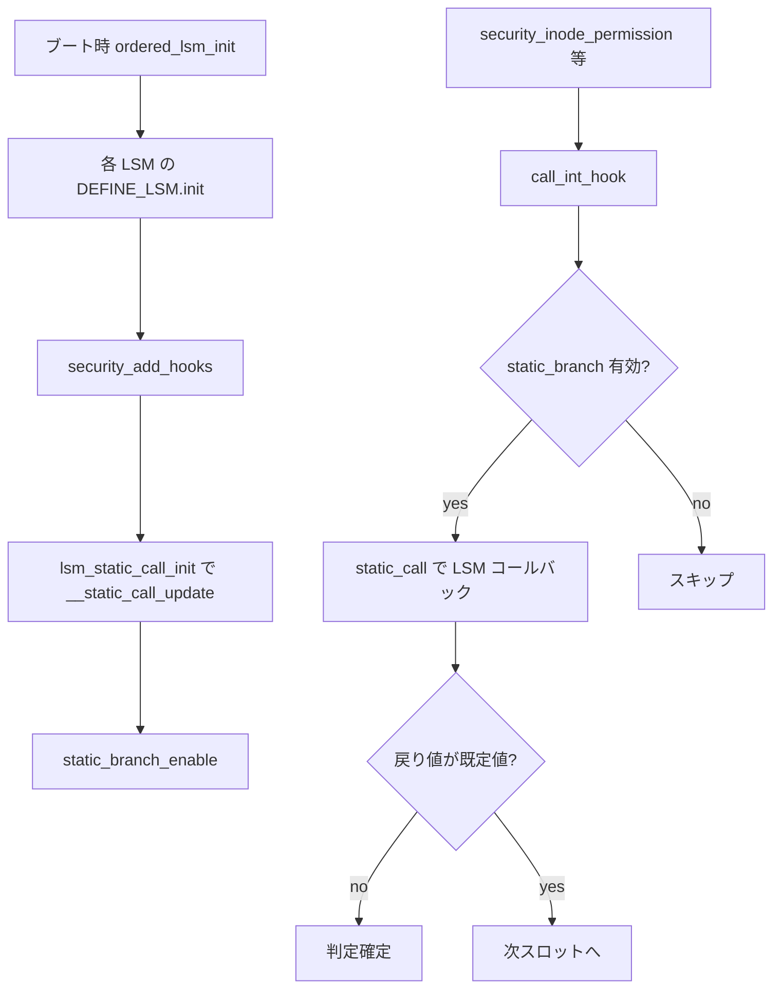

# 第3章 LSM フック定義と静的呼び出し機構

> **本章で読むソース**
>
> - [`include/linux/lsm_hook_defs.h` L17-L45](https://github.com/gregkh/linux/blob/v6.18.38/include/linux/lsm_hook_defs.h#L17-L45)
> - [`include/linux/lsm_hooks.h` L38-L43](https://github.com/gregkh/linux/blob/v6.18.38/include/linux/lsm_hooks.h#L38-L43)
> - [`include/linux/lsm_hooks.h` L95-L99](https://github.com/gregkh/linux/blob/v6.18.38/include/linux/lsm_hooks.h#L95-L99)
> - [`include/linux/lsm_hooks.h` L137-L141](https://github.com/gregkh/linux/blob/v6.18.38/include/linux/lsm_hooks.h#L137-L141)
> - [`include/linux/lsm_hooks.h` L164-L167](https://github.com/gregkh/linux/blob/v6.18.38/include/linux/lsm_hooks.h#L164-L167)
> - [`security/security.c` L123-L132](https://github.com/gregkh/linux/blob/v6.18.38/security/security.c#L123-L132)
> - [`security/security.c` L145-L160](https://github.com/gregkh/linux/blob/v6.18.38/security/security.c#L145-L160)
> - [`security/security.c` L411-L428](https://github.com/gregkh/linux/blob/v6.18.38/security/security.c#L411-L428)
> - [`security/security.c` L629-L649](https://github.com/gregkh/linux/blob/v6.18.38/security/security.c#L629-L649)
> - [`security/security.c` L1033-L1050](https://github.com/gregkh/linux/blob/v6.18.38/security/security.c#L1033-L1050)
> - [`security/landlock/setup.c` L77-L81](https://github.com/gregkh/linux/blob/v6.18.38/security/landlock/setup.c#L77-L81)

## この章の狙い

**LSM** がカーネルに差し込む接点を、`lsm_hook_defs.h` のマクロ展開と `security.c` の **static call** 機構から読む。
コメントに残る `security_hook_heads` は過去の連結リスト設計の名残であり、6.18 系の実行時は `static_calls_table` が実体である。

## 前提

- [第2章：`cred` と権限判定の入口](../part00-foundation/02-cred-capable-entry.md)
- [同期と RCU](../../locking/README.md) の jump label と静的鍵の概観

## LSM_HOOK マクロとフック一覧

各フックは `LSM_HOOK(戻り値型, 既定値, 名前, 引数...)` で一行ずつ宣言される。
`lsm_hook_defs.h` を include することで、フック名の列挙が複数のデータ構造へ再利用される。

[`include/linux/lsm_hook_defs.h` L17-L45](https://github.com/gregkh/linux/blob/v6.18.38/include/linux/lsm_hook_defs.h#L17-L45)

```c
/*
 * The macro LSM_HOOK is used to define the data structures required by
 * the LSM framework using the pattern:
 *
 *	LSM_HOOK(<return_type>, <default_value>, <hook_name>, args...)
 *
 * struct security_hook_heads {
 *   #define LSM_HOOK(RET, DEFAULT, NAME, ...) struct hlist_head NAME;
 *   #include <linux/lsm_hook_defs.h>
 *   #undef LSM_HOOK
 * };
 */
LSM_HOOK(int, 0, binder_set_context_mgr, const struct cred *mgr)
LSM_HOOK(int, 0, binder_transaction, const struct cred *from,
	 const struct cred *to)
LSM_HOOK(int, 0, binder_transfer_binder, const struct cred *from,
	 const struct cred *to)
LSM_HOOK(int, 0, binder_transfer_file, const struct cred *from,
	 const struct cred *to, const struct file *file)
LSM_HOOK(int, 0, ptrace_access_check, struct task_struct *child,
	 unsigned int mode)
LSM_HOOK(int, 0, ptrace_traceme, struct task_struct *parent)
LSM_HOOK(int, 0, capget, const struct task_struct *target, kernel_cap_t *effective,
	 kernel_cap_t *inheritable, kernel_cap_t *permitted)
LSM_HOOK(int, 0, capset, struct cred *new, const struct cred *old,
	 const kernel_cap_t *effective, const kernel_cap_t *inheritable,
	 const kernel_cap_t *permitted)
LSM_HOOK(int, 0, capable, const struct cred *cred, struct user_namespace *ns,
	 int cap, unsigned int opts)
```

`capable` や `inode_permission` など、第1章と第2章で触れた入口も同じ一覧に含まれる。
フック数は Kconfig で有効な LSM 数に応じて `MAX_LSM_COUNT` が決まる（`include/linux/lsm_count.h`）。

## union security_list_options と security_hook_list

各 LSM はフック関数へのポインタを `union security_list_options` に格納する。
実行時テーブル `security_hook_list` は、対応する static call 配列への入口を `scalls` に持つ。

[`include/linux/lsm_hooks.h` L38-L43](https://github.com/gregkh/linux/blob/v6.18.38/include/linux/lsm_hooks.h#L38-L43)

```c
union security_list_options {
	#define LSM_HOOK(RET, DEFAULT, NAME, ...) RET (*NAME)(__VA_ARGS__);
	#include "lsm_hook_defs.h"
	#undef LSM_HOOK
	void *lsm_func_addr;
};
```

[`include/linux/lsm_hooks.h` L95-L99](https://github.com/gregkh/linux/blob/v6.18.38/include/linux/lsm_hooks.h#L95-L99)

```c
struct security_hook_list {
	struct lsm_static_call *scalls;
	union security_list_options hook;
	const struct lsm_id *lsmid;
} __randomize_layout;
```

## DEFINE_LSM と LSM_HOOK_INIT

LSM モジュールは `DEFINE_LSM` で `lsm_info` をリンクセクションに登録し、初期化時に `init` コールバックが呼ばれる。
フック配列の要素は `LSM_HOOK_INIT` で static call テーブル上の位置と結び付ける。

[`include/linux/lsm_hooks.h` L137-L141](https://github.com/gregkh/linux/blob/v6.18.38/include/linux/lsm_hooks.h#L137-L141)

```c
#define LSM_HOOK_INIT(NAME, HOOK)			\
	{						\
		.scalls = static_calls_table.NAME,	\
		.hook = { .NAME = HOOK }		\
	}
```

[`include/linux/lsm_hooks.h` L164-L167](https://github.com/gregkh/linux/blob/v6.18.38/include/linux/lsm_hooks.h#L164-L167)

```c
#define DEFINE_LSM(lsm)							\
	static struct lsm_info __lsm_##lsm				\
		__used __section(".lsm_info.init")			\
		__aligned(sizeof(unsigned long))
```

Landlock の登録例は次のとおりである。

[`security/landlock/setup.c` L77-L81](https://github.com/gregkh/linux/blob/v6.18.38/security/landlock/setup.c#L77-L81)

```c
DEFINE_LSM(LANDLOCK_NAME) = {
	.name = LANDLOCK_NAME,
	.init = landlock_init,
	.blobs = &landlock_blob_sizes,
};
```

## static call キーと static_calls_table の生成

`security.c` は `lsm_hook_defs.h` を再度 include し、フックごとに `MAX_LSM_COUNT` 個の static call と jump label を機械生成する。

[`security/security.c` L123-L132](https://github.com/gregkh/linux/blob/v6.18.38/security/security.c#L123-L132)

```c
#define DEFINE_LSM_STATIC_CALL(NUM, NAME, RET, ...)			\
	DEFINE_STATIC_CALL_NULL(LSM_STATIC_CALL(NAME, NUM),		\
				*((RET(*)(__VA_ARGS__))NULL));		\
	DEFINE_STATIC_KEY_FALSE(SECURITY_HOOK_ACTIVE_KEY(NAME, NUM));

#define LSM_HOOK(RET, DEFAULT, NAME, ...)				\
	LSM_DEFINE_UNROLL(DEFINE_LSM_STATIC_CALL, NAME, RET, __VA_ARGS__)
#include <linux/lsm_hook_defs.h>
#undef LSM_HOOK
#undef DEFINE_LSM_STATIC_CALL
```

初期化済みテーブル `static_calls_table` はフック名をキーに、`lsm_static_call` の配列を保持する。

[`security/security.c` L145-L160](https://github.com/gregkh/linux/blob/v6.18.38/security/security.c#L145-L160)

```c
struct lsm_static_calls_table
	static_calls_table __ro_after_init __aligned(sizeof(u64)) = {
#define INIT_LSM_STATIC_CALL(NUM, NAME)					\
	(struct lsm_static_call) {					\
		.key = &STATIC_CALL_KEY(LSM_STATIC_CALL(NAME, NUM)),	\
		.trampoline = LSM_HOOK_TRAMP(NAME, NUM),		\
		.active = &SECURITY_HOOK_ACTIVE_KEY(NAME, NUM),		\
	},
#define LSM_HOOK(RET, DEFAULT, NAME, ...)				\
	.NAME = {							\
		LSM_DEFINE_UNROLL(INIT_LSM_STATIC_CALL, NAME)		\
	},
#include <linux/lsm_hook_defs.h>
#undef LSM_HOOK
#undef INIT_LSM_STATIC_CALL
	};
```

`__aligned(sizeof(u64))` は早期初期化時のアライン欠損によるフォールトを避けるための配慮である。

## security_add_hooks：登録と static call の配線

LSM の `init` から `security_add_hooks` が呼ばれ、各 `security_hook_list` に LSM ID が付き、空き static call スロットへコールバックが書き込まれる。

[`security/security.c` L629-L649](https://github.com/gregkh/linux/blob/v6.18.38/security/security.c#L629-L649)

```c
void __init security_add_hooks(struct security_hook_list *hooks, int count,
			       const struct lsm_id *lsmid)
{
	int i;

	/*
	 * A security module may call security_add_hooks() more
	 * than once during initialization, and LSM initialization
	 * is serialized. Landlock is one such case.
	 * Look at the previous entry, if there is one, for duplication.
	 */
	if (lsm_active_cnt == 0 || lsm_idlist[lsm_active_cnt - 1] != lsmid) {
		if (lsm_active_cnt >= MAX_LSM_COUNT)
			panic("%s Too many LSMs registered.\n", __func__);
		lsm_idlist[lsm_active_cnt++] = lsmid;
	}

	for (i = 0; i < count; i++) {
		hooks[i].lsmid = lsmid;
		lsm_static_call_init(&hooks[i]);
	}
```

[`security/security.c` L411-L428](https://github.com/gregkh/linux/blob/v6.18.38/security/security.c#L411-L428)

```c
static void __init lsm_static_call_init(struct security_hook_list *hl)
{
	struct lsm_static_call *scall = hl->scalls;
	int i;

	for (i = 0; i < MAX_LSM_COUNT; i++) {
		/* Update the first static call that is not used yet */
		if (!scall->hl) {
			__static_call_update(scall->key, scall->trampoline,
					     hl->hook.lsm_func_addr);
			scall->hl = hl;
			static_branch_enable(scall->active);
			return;
		}
		scall++;
	}
	panic("%s - Ran out of static slots.\n", __func__);
}
```

登録順序は `lsm=` ブートパラメータと `CONFIG_LSM` の並びで決まり、第4章で読む。

## call_int_hook：実行時のフック走査

`security_*` ラッパは `call_int_hook` を使い、有効な static call だけを順に呼ぶ。
戻り値がフックの既定値（多くは 0）と異なれば、その時点で判定が確定する。

[`security/security.c` L1033-L1050](https://github.com/gregkh/linux/blob/v6.18.38/security/security.c#L1033-L1050)

```c
#define __CALL_STATIC_INT(NUM, R, HOOK, LABEL, ...)			     \
do {									     \
	if (static_branch_unlikely(&SECURITY_HOOK_ACTIVE_KEY(HOOK, NUM))) {  \
		R = static_call(LSM_STATIC_CALL(HOOK, NUM))(__VA_ARGS__);    \
		if (R != LSM_RET_DEFAULT(HOOK))				     \
			goto LABEL;					     \
	}								     \
} while (0);

#define call_int_hook(HOOK, ...)					\
({									\
	__label__ OUT;							\
	int RC = LSM_RET_DEFAULT(HOOK);					\
									\
	LSM_LOOP_UNROLL(__CALL_STATIC_INT, RC, HOOK, OUT, __VA_ARGS__);	\
OUT:									\
	RC;								\
})
```

`static_branch_unlikely` が偽なら、そのスロットは未登録のため `static_call` 本体へ入らず、jump label 上の NOP 相当の経路を通る。
`LSM_LOOP_UNROLL` はコンパイル時に `MAX_LSM_COUNT` 回分の分岐を展開するだけであり、スロットの有効化そのものは行わない。

## 初期化から実行までの流れ



## 高速化と最適化の工夫

旧来の `security_hook_heads`（各フックに `hlist_head` を置き、実行時にリスト走査する設計）は、ポインタ追跡と間接呼び出しがホットパスに残っていた。
6.18 系は **static call** で呼び出し先を直接化する。
各スロットには `DEFINE_STATIC_KEY_FALSE` で jump label が置かれ、未登録時は分岐が偽のまま実行コード上 NOP 相当となる。
`lsm_static_call_init` の `static_branch_enable` が LSM 登録時に text patching で分岐を有効化する。
コンパイラが未使用スロットを除去するのではなく、実行時に jump label で素通りさせる設計である。
`LSM_LOOP_UNROLL` による完全展開はコンパイル時のコード生成であり、各スロットの有効化は初期化時の static key patching で別途行われる。

## まとめ

`lsm_hook_defs.h` がフック名の単一の真実の源であり、`security.c` が static call テーブルと `call_int_hook` を生成する。
`security_add_hooks` が LSM コールバックをスロットへ配線し、`static_branch_enable` で jump label を有効化する。
実行時は未登録スロットを jump label で素通りさせ、登録済みスロットだけ static call で呼ぶ。
次章では LSM の登録順序と `lsm=` ブートパラメータを読む。

## 関連する章

- [LSM 登録、`lsm=` ブート順序、lockdown](04-lsm-init-order-lockdown.md)
- [`security_*` ラッパとフック実行規約](05-security-wrappers-call-convention.md)
- [第1章：カーネルセキュリティの層構造と判定経路](../part00-foundation/01-security-layers-overview.md)
