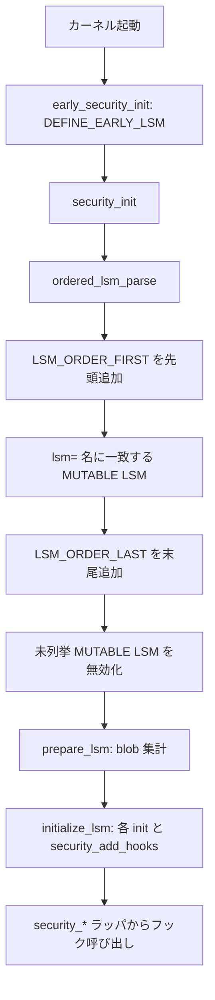

# 第4章 LSM 登録、`lsm=` ブート順序、lockdown

> **本章で読むソース**
>
> - [`security/security.c` L107-L111](https://github.com/gregkh/linux/blob/v6.18.38/security/security.c#L107-L111)
> - [`security/security.c` L216-L232](https://github.com/gregkh/linux/blob/v6.18.38/security/security.c#L216-L232)
> - [`security/security.c` L235-L248](https://github.com/gregkh/linux/blob/v6.18.38/security/security.c#L235-L248)
> - [`security/security.c` L337-L341](https://github.com/gregkh/linux/blob/v6.18.38/security/security.c#L337-L341)
> - [`security/security.c` L367-L381](https://github.com/gregkh/linux/blob/v6.18.38/security/security.c#L367-L381)
> - [`security/security.c` L393-L406](https://github.com/gregkh/linux/blob/v6.18.38/security/security.c#L393-L406)
> - [`security/security.c` L454-L471](https://github.com/gregkh/linux/blob/v6.18.38/security/security.c#L454-L471)
> - [`security/security.c` L536-L558](https://github.com/gregkh/linux/blob/v6.18.38/security/security.c#L536-L558)
> - [`security/security.c` L570-L575](https://github.com/gregkh/linux/blob/v6.18.38/security/security.c#L570-L575)
> - [`security/lockdown/lockdown.c` L27-L36](https://github.com/gregkh/linux/blob/v6.18.38/security/lockdown/lockdown.c#L27-L36)
> - [`security/lockdown/lockdown.c` L59-L73](https://github.com/gregkh/linux/blob/v6.18.38/security/lockdown/lockdown.c#L59-L73)
> - [`security/lockdown/lockdown.c` L84-L94](https://github.com/gregkh/linux/blob/v6.18.38/security/lockdown/lockdown.c#L84-L94)
> - [`security/lockdown/lockdown.c` L166-L173](https://github.com/gregkh/linux/blob/v6.18.38/security/lockdown/lockdown.c#L166-L173)

## この章の狙い

各 **LSM** がブート時にどの順序で有効化され、フックへ登録されるかを `ordered_lsm_init` から読む。
併せて **lockdown** LSM がカーネル機能のロックダウンをどう強制するかを押さえる。

## 前提

- [第3章：LSM フック定義と静的呼び出し機構](03-lsm-hooks-static-calls.md)
- [全体像と横断基盤](../../foundation/README.md) のカーネル起動と initcall の概観

## ブートパラメータと既定順序

`CONFIG_LSM` はビルド時の既定 LSM 列を文字列で持つ。
`lsm=` ブート引数があればそれが優先され、旧来の `security=` は major LSM 単体指定用として残る。

[`security/security.c` L107-L111](https://github.com/gregkh/linux/blob/v6.18.38/security/security.c#L107-L111)

```c
static __initconst const char *const builtin_lsm_order = CONFIG_LSM;

/* Ordered list of LSMs to initialize. */
static __initdata struct lsm_info *ordered_lsms[MAX_LSM_COUNT + 1];
static __initdata struct lsm_info *exclusive;
```

[`security/security.c` L570-L575](https://github.com/gregkh/linux/blob/v6.18.38/security/security.c#L570-L575)

```c
static int __init choose_lsm_order(char *str)
{
	chosen_lsm_order = str;
	return 1;
}
__setup("lsm=", choose_lsm_order);
```

`lsm=` に列挙されていない `LSM_ORDER_MUTABLE` の LSM は初期化対象から外れ、`set_enabled(lsm, false)` で無効化される。
`LSM_ORDER_FIRST` と `LSM_ORDER_LAST` は列挙の有無によらず `ordered_lsm_parse` がそれぞれ先頭と末尾へ追加する。

## ordered_lsms への追加

`append_ordered_lsm` は重複を無視し、`MAX_LSM_COUNT` を超えたら警告して打ち切る。
選択された LSM は `ordered_lsms[]` に順番に積まれる。

[`security/security.c` L216-L232](https://github.com/gregkh/linux/blob/v6.18.38/security/security.c#L216-L232)

```c
static void __init append_ordered_lsm(struct lsm_info *lsm, const char *from)
{
	/* Ignore duplicate selections. */
	if (exists_ordered_lsm(lsm))
		return;

	if (WARN(last_lsm == MAX_LSM_COUNT, "%s: out of LSM static calls!?\n", from))
		return;

	/* Enable this LSM, if it is not already set. */
	if (!lsm->enabled)
		lsm->enabled = &lsm_enabled_true;
	ordered_lsms[last_lsm++] = lsm;

	init_debug("%s ordered: %s (%s)\n", from, lsm->name,
		   is_enabled(lsm) ? "enabled" : "disabled");
}
```

## LSM_ORDER と exclusive 制約

`lsm_allowed` は無効 LSM を除外し、`LSM_FLAG_EXCLUSIVE` を持つ LSM が既に選ばれていると後続の exclusive LSM を拒否する。
SELinux は `LSM_FLAG_LEGACY_MAJOR | LSM_FLAG_EXCLUSIVE` を持ち、同種の major LSM と共存しない。

[`security/security.c` L235-L248](https://github.com/gregkh/linux/blob/v6.18.38/security/security.c#L235-L248)

```c
static bool __init lsm_allowed(struct lsm_info *lsm)
{
	/* Skip if the LSM is disabled. */
	if (!is_enabled(lsm))
		return false;

	/* Not allowed if another exclusive LSM already initialized. */
	if ((lsm->flags & LSM_FLAG_EXCLUSIVE) && exclusive) {
		init_debug("exclusive disabled: %s\n", lsm->name);
		return false;
	}

	return true;
}
```

## ordered_lsm_parse の三段構え

`ordered_lsm_parse` は次の順でリストを組み立てる。

1. `LSM_ORDER_FIRST`（capabilities）を常に先頭へ
2. `lsm=` または `CONFIG_LSM` のカンマ区切り名に一致する `LSM_ORDER_MUTABLE` LSM
3. `LSM_ORDER_LAST`（integrity 系）を常に末尾へ

[`security/security.c` L337-L341](https://github.com/gregkh/linux/blob/v6.18.38/security/security.c#L337-L341)

```c
	/* LSM_ORDER_FIRST is always first. */
	for (lsm = __start_lsm_info; lsm < __end_lsm_info; lsm++) {
		if (lsm->order == LSM_ORDER_FIRST)
			append_ordered_lsm(lsm, "  first");
	}
```

[`security/security.c` L367-L381](https://github.com/gregkh/linux/blob/v6.18.38/security/security.c#L367-L381)

```c
	while ((name = strsep(&next, ",")) != NULL) {
		bool found = false;

		for (lsm = __start_lsm_info; lsm < __end_lsm_info; lsm++) {
			if (strcmp(lsm->name, name) == 0) {
				if (lsm->order == LSM_ORDER_MUTABLE)
					append_ordered_lsm(lsm, origin);
				found = true;
			}
		}

		if (!found)
			init_debug("%s ignored: %s (not built into kernel)\n",
				   origin, name);
	}
```

[`security/security.c` L393-L406](https://github.com/gregkh/linux/blob/v6.18.38/security/security.c#L393-L406)

```c
	/* LSM_ORDER_LAST is always last. */
	for (lsm = __start_lsm_info; lsm < __end_lsm_info; lsm++) {
		if (lsm->order == LSM_ORDER_LAST)
			append_ordered_lsm(lsm, "   last");
	}

	/* Disable all LSMs not in the ordered list. */
	for (lsm = __start_lsm_info; lsm < __end_lsm_info; lsm++) {
		if (exists_ordered_lsm(lsm))
			continue;
		set_enabled(lsm, false);
		init_debug("%s skipped: %s (not in requested order)\n",
			   origin, lsm->name);
	}
```

## ordered_lsm_init と security_init

`ordered_lsm_init` はパース後に各 LSM へ `prepare_lsm`（blob サイズ集計）を行い、`report_lsm_order` で dmesg に順序を出力してから `initialize_lsm` で `init` コールバックを呼ぶ。

[`security/security.c` L454-L471](https://github.com/gregkh/linux/blob/v6.18.38/security/security.c#L454-L471)

```c
static void __init ordered_lsm_init(void)
{
	struct lsm_info **lsm;

	if (chosen_lsm_order) {
		if (chosen_major_lsm) {
			pr_warn("security=%s is ignored because it is superseded by lsm=%s\n",
				chosen_major_lsm, chosen_lsm_order);
			chosen_major_lsm = NULL;
		}
		ordered_lsm_parse(chosen_lsm_order, "cmdline");
	} else
		ordered_lsm_parse(builtin_lsm_order, "builtin");

	for (lsm = ordered_lsms; *lsm; lsm++)
		prepare_lsm(*lsm);

	report_lsm_order();
```

[`security/security.c` L536-L558](https://github.com/gregkh/linux/blob/v6.18.38/security/security.c#L536-L558)

```c
int __init security_init(void)
{
	struct lsm_info *lsm;

	init_debug("legacy security=%s\n", chosen_major_lsm ? : " *unspecified*");
	init_debug("  CONFIG_LSM=%s\n", builtin_lsm_order);
	init_debug("boot arg lsm=%s\n", chosen_lsm_order ? : " *unspecified*");

	/*
	 * Append the names of the early LSM modules now that kmalloc() is
	 * available
	 */
	for (lsm = __start_early_lsm_info; lsm < __end_early_lsm_info; lsm++) {
		init_debug("  early started: %s (%s)\n", lsm->name,
			   is_enabled(lsm) ? "enabled" : "disabled");
		if (lsm->enabled)
			lsm_append(lsm->name, &lsm_names);
	}

	/* Load LSMs in specified order. */
	ordered_lsm_init();

	return 0;
}
```

`early_security_init` は `DEFINE_EARLY_LSM` 登録分を kmalloc 以前に先行初期化する経路である。

## lockdown LSM

lockdown はカーネル全体のロックダウンレベルを保持し、`locked_down` フックで各操作を拒否する。
`lockdown=` ブート引数または Kconfig 強制で integrity / confidentiality レベルが設定される。

[`security/lockdown/lockdown.c` L27-L36](https://github.com/gregkh/linux/blob/v6.18.38/security/lockdown/lockdown.c#L27-L36)

```c
static int lock_kernel_down(const char *where, enum lockdown_reason level)
{
	if (kernel_locked_down >= level)
		return -EPERM;

	kernel_locked_down = level;
	pr_notice("Kernel is locked down from %s; see man kernel_lockdown.7\n",
		  where);
	return 0;
}
```

[`security/lockdown/lockdown.c` L59-L73](https://github.com/gregkh/linux/blob/v6.18.38/security/lockdown/lockdown.c#L59-L73)

```c
static int lockdown_is_locked_down(enum lockdown_reason what)
{
	if (WARN(what >= LOCKDOWN_CONFIDENTIALITY_MAX,
		 "Invalid lockdown reason"))
		return -EPERM;

	if (kernel_locked_down >= what) {
		if (lockdown_reasons[what])
			pr_notice_ratelimited("Lockdown: %s: %s is restricted; see man kernel_lockdown.7\n",
				  current->comm, lockdown_reasons[what]);
		return -EPERM;
	}

	return 0;
}
```

`lockdown_reasons` 配列は `security.c` に置かれ、監査メッセージの文言を全 LSM で共有する。

[`security/lockdown/lockdown.c` L84-L94](https://github.com/gregkh/linux/blob/v6.18.38/security/lockdown/lockdown.c#L84-L94)

```c
static int __init lockdown_lsm_init(void)
{
#if defined(CONFIG_LOCK_DOWN_KERNEL_FORCE_INTEGRITY)
	lock_kernel_down("Kernel configuration", LOCKDOWN_INTEGRITY_MAX);
#elif defined(CONFIG_LOCK_DOWN_KERNEL_FORCE_CONFIDENTIALITY)
	lock_kernel_down("Kernel configuration", LOCKDOWN_CONFIDENTIALITY_MAX);
#endif
	security_add_hooks(lockdown_hooks, ARRAY_SIZE(lockdown_hooks),
			   &lockdown_lsmid);
	return 0;
}
```

lockdown は `CONFIG_SECURITY_LOCKDOWN_LSM_EARLY` が有効なら `DEFINE_EARLY_LSM` で早期登録される。

[`security/lockdown/lockdown.c` L166-L173](https://github.com/gregkh/linux/blob/v6.18.38/security/lockdown/lockdown.c#L166-L173)

```c
#ifdef CONFIG_SECURITY_LOCKDOWN_LSM_EARLY
DEFINE_EARLY_LSM(lockdown) = {
#else
DEFINE_LSM(lockdown) = {
#endif
	.name = "lockdown",
	.init = lockdown_lsm_init,
};
```

カーネル各所は `security_locked_down(LOCKDOWN_*)` を呼び、第5章で読む `call_int_hook(locked_down, ...)` 経由で lockdown フックへ到達する。

## 初期化の流れ



## 7.x 系での変化

7.1.3 では lockdown の `DEFINE_LSM` が `.name` 文字列から `.id = &lockdown_lsmid` へ移り、securityfs 作成が `core_initcall` から `initcall_core` コールバックへ統合されている。

[`security/lockdown/lockdown.c` L167-L172](https://github.com/gregkh/linux/blob/v7.1.3/security/lockdown/lockdown.c#L167-L172)

```c
DEFINE_LSM(lockdown) = {
#endif
	.id = &lockdown_lsmid,
	.init = lockdown_lsm_init,
	.initcall_core = lockdown_secfs_init,
};
```

6.18 系の読者は、securityfs の `lockdown` ファイルが `core_initcall(lockdown_secfs_init)` で別途登録されている点が対比になる。

## 高速化と最適化の工夫

`ordered_lsm_parse` 終盤で未列挙の `LSM_ORDER_MUTABLE` LSM をまとめて `set_enabled(false)` にするのは、実行時に無効 LSM の static call を走らせないための事前剪定である。
`lsm=` で順序を固定することで、不要な LSM の blob 集計と `init` コール自体を省略できる。
lockdown の `pr_notice_ratelimited` は、拒否が連発する経路でのログ洪水を抑える。

## まとめ

LSM の有効順序は `lsm=` または `CONFIG_LSM` で決まり、`LSM_ORDER_FIRST` と `LSM_ORDER_LAST` が枠を固定する。
未列挙で無効化されるのは `LSM_ORDER_MUTABLE` のみである。
`prepare_lsm` と `initialize_lsm` の二段階で blob 準備とフック登録が完了する。
lockdown は独立した LSM として `locked_down` フックを提供し、カーネル機能の段階的制限を担う。

## 関連する章

- [`security_*` ラッパとフック実行規約](05-security-wrappers-call-convention.md)
- [blob 割り当てと `lsm_*_alloc`](06-lsm-blob-alloc.md)
- [主要 LSM の概観と SELinux カーネル接続点](07-lsm-implementations-selinux-bridge.md)
