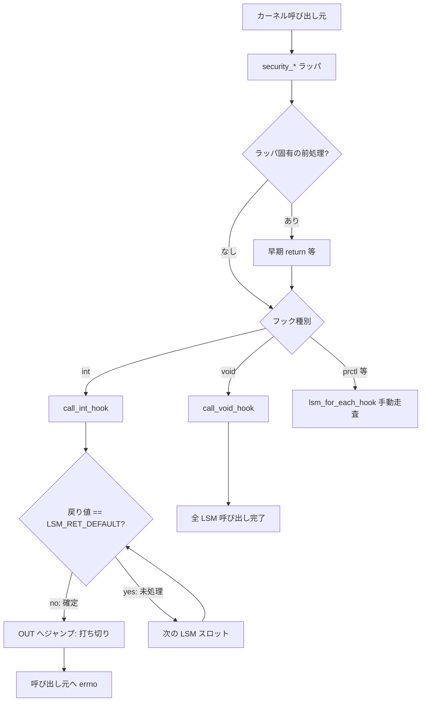

# 第5章 `security_*` ラッパとフック実行規約

> **本章で読むソース**
>
> - [`security/security.c` L1001-L1009](https://github.com/gregkh/linux/blob/v6.18.38/security/security.c#L1001-L1009)
> - [`security/security.c` L1020-L1050](https://github.com/gregkh/linux/blob/v6.18.38/security/security.c#L1020-L1050)
> - [`security/security.c` L1209-L1215](https://github.com/gregkh/linux/blob/v6.18.38/security/security.c#L1209-L1215)
> - [`security/security.c` L2392-L2397](https://github.com/gregkh/linux/blob/v6.18.38/security/security.c#L2392-L2397)
> - [`security/security.c` L3418-L3429](https://github.com/gregkh/linux/blob/v6.18.38/security/security.c#L3418-L3429)
> - [`security/security.c` L3871-L3887](https://github.com/gregkh/linux/blob/v6.18.38/security/security.c#L3871-L3887)
> - [`security/security.c` L6027-L6030](https://github.com/gregkh/linux/blob/v6.18.38/security/security.c#L6027-L6030)

## この章の狙い

カーネル各所から呼ばれる `security_*` 関数が、`call_int_hook` と `call_void_hook` を通じて LSM フックへどう委譲するかを読む。
戻り値の **既定値** と **bail-on-fail**（非既定値で打ち切り）の規約を押さえる。

## 前提

- [第3章：LSM フック定義と静的呼び出し機構](03-lsm-hooks-static-calls.md)
- [第4章：LSM 登録、`lsm=` ブート順序、lockdown](04-lsm-init-order-lockdown.md)

## LSM_RET_DEFAULT：フックごとの既定戻り値

各フックの第二引数（`LSM_HOOK` マクロの `DEFAULT`）は、LSM が「判定に関与しなかった」とみなす値である。
`lsm_hook_defs.h` の `LSM_HOOK(int, 0, capable, ...)` なら、capable フックの既定値は 0（許可）になる。

[`security/security.c` L1001-L1009](https://github.com/gregkh/linux/blob/v6.18.38/security/security.c#L1001-L1009)

```c
#define LSM_RET_DEFAULT(NAME) (NAME##_default)
#define DECLARE_LSM_RET_DEFAULT_void(DEFAULT, NAME)
#define DECLARE_LSM_RET_DEFAULT_int(DEFAULT, NAME) \
	static const int __maybe_unused LSM_RET_DEFAULT(NAME) = (DEFAULT);
#define LSM_HOOK(RET, DEFAULT, NAME, ...) \
	DECLARE_LSM_RET_DEFAULT_##RET(DEFAULT, NAME)

#include <linux/lsm_hook_defs.h>
#undef LSM_HOOK
```

int 戻り値フックの打ち切り条件は、戻り値が `LSM_RET_DEFAULT(HOOK)` と異なることである。
既定値が 0 のフック（`capable` や `inode_permission` 等）では、0 は既定値と同じなので走査を継続し、非 0 で打ち切る。
既定値が `-EOPNOTSUPP` や `-ENOPARAM` のフックでは、0 は既定値と異なり成功確定として打ち切り、既定値を返した LSM は未処理とみなされ走査が続く。

## call_int_hook：bail-on-fail 走査

`call_int_hook` は `RC` を既定値で初期化し、登録済み static call を順に呼ぶ。
ある LSM が既定値と異なる戻り値を返したら `goto OUT` で残りをスキップする。

[`security/security.c` L1020-L1050](https://github.com/gregkh/linux/blob/v6.18.38/security/security.c#L1020-L1050)

```c
#define __CALL_STATIC_VOID(NUM, HOOK, ...)				     \
do {									     \
	if (static_branch_unlikely(&SECURITY_HOOK_ACTIVE_KEY(HOOK, NUM))) {    \
		static_call(LSM_STATIC_CALL(HOOK, NUM))(__VA_ARGS__);	     \
	}								     \
} while (0);

#define call_void_hook(HOOK, ...)                                 \
	do {                                                      \
		LSM_LOOP_UNROLL(__CALL_STATIC_VOID, HOOK, __VA_ARGS__); \
	} while (0)


#define __CALL_STATIC_INT(NUM, R, HOOK, LABEL, ...)			     \
do {									     \
	if (static_branch_unlikely(&SECURITY_HOOK_ACTIVE_KEY(HOOK, NUM))) {  \
		R = static_call(LSM_STATIC_CALL(HOOK, NUM))(__VA_ARGS__);    \
		if (R != LSM_RET_DEFAULT(HOOK))				     \
			goto LABEL;					     \
	}								     \
} while (0);

#define call_int_hook(HOOK, ...)					\
({									\
	__label__ OUT;							\
	int RC = LSM_RET_DEFAULT(HOOK);					\
									\
	LSM_LOOP_UNROLL(__CALL_STATIC_INT, RC, HOOK, OUT, __VA_ARGS__);	\
OUT:									\
	RC;								\
})
```

戻り値が `LSM_RET_DEFAULT(HOOK)` と同じなら走査を継続し、異なればその値で確定して打ち切る。
許可判定フック（既定値 0）では非 0 返却が拒否となり、全 LSM が既定値を返せば最終的に許可となる。

## call_void_hook：戻り値を持たない通知

`call_void_hook` は全有効 LSM を必ず呼び、戻り値による打ち切りはない。
`cred_free` や `inode_free_security` のような後片付け、属性伝播の通知に使われる。

## 典型ラッパ：security_capable と security_inode_permission

薄いラッパは `call_int_hook` 一行で終わる。

[`security/security.c` L1209-L1215](https://github.com/gregkh/linux/blob/v6.18.38/security/security.c#L1209-L1215)

```c
int security_capable(const struct cred *cred,
		     struct user_namespace *ns,
		     int cap,
		     unsigned int opts)
{
	return call_int_hook(capable, cred, ns, cap, opts);
}
```

[`security/security.c` L2392-L2397](https://github.com/gregkh/linux/blob/v6.18.38/security/security.c#L2392-L2397)

```c
int security_inode_permission(struct inode *inode, int mask)
{
	if (unlikely(IS_PRIVATE(inode)))
		return 0;
	return call_int_hook(inode_permission, inode, mask);
}
```

`security_inode_permission` はフック呼び出し前にプライベート inode を除外する、ラッパ固有の前処理を挟んでいる。

## 失敗時の後始末：security_prepare_creds

blob 確保後にフックが失敗した場合、ラッパがリソースを解放する責務を持つ。

[`security/security.c` L3418-L3429](https://github.com/gregkh/linux/blob/v6.18.38/security/security.c#L3418-L3429)

```c
int security_prepare_creds(struct cred *new, const struct cred *old, gfp_t gfp)
{
	int rc = lsm_cred_alloc(new, gfp);

	if (rc)
		return rc;

	rc = call_int_hook(cred_prepare, new, old, gfp);
	if (unlikely(rc))
		security_cred_free(new);
	return rc;
}
```

`lsm_cred_alloc` 失敗と LSM 拒否を呼び出し元へそのまま返す。
LSM 拒否時だけ `security_cred_free` で部分初期化済み blob を掃除する。

## 例外：security_task_prctl の集約規約

`task_prctl` フックは既定の `-ENOSYS` を「誰も処理しなかった」意味に使い、全 LSM を走査して最後の非既定値を集約する。
拒否（非ゼロ）が出たら `break` するが、0 を返した LSM がいても走査を続けうる。

[`security/security.c` L3871-L3887](https://github.com/gregkh/linux/blob/v6.18.38/security/security.c#L3871-L3887)

```c
int security_task_prctl(int option, unsigned long arg2, unsigned long arg3,
			unsigned long arg4, unsigned long arg5)
{
	int thisrc;
	int rc = LSM_RET_DEFAULT(task_prctl);
	struct lsm_static_call *scall;

	lsm_for_each_hook(scall, task_prctl) {
		thisrc = scall->hl->hook.task_prctl(option, arg2, arg3, arg4, arg5);
		if (thisrc != LSM_RET_DEFAULT(task_prctl)) {
			rc = thisrc;
			if (thisrc != 0)
				break;
		}
	}
	return rc;
}
```

`call_int_hook` の単純な bail-on-fail では表現できないセマンティクスであるため、手動ループが残っている。

## lockdown への適用

[`security/security.c` L6027-L6030](https://github.com/gregkh/linux/blob/v6.18.38/security/security.c#L6027-L6030)

```c
int security_locked_down(enum lockdown_reason what)
{
	return call_int_hook(locked_down, what);
}
```

ドライバやサブシステムは `security_locked_down` を直呼びし、lockdown LSM が `-EPERM` を返せば操作全体が拒否される。

## 呼び出し規約の整理



## 高速化と最適化の工夫

`call_int_hook` の `goto OUT` は、戻り値が `LSM_RET_DEFAULT(HOOK)` と異なる時点で残りの static call 展開を実行しない。
既定値と同じ戻り値なら次の LSM スロットへ進む。
`static_branch_unlikely` と組み合わさり、未登録スロットはジャンプ先評価すら避ける。
一方 `call_void_hook` は打ち切りが無いため、登録数に比例するが、後片付けフックは拒否判定ほど高頻度ではない。

## まとめ

`security_*` ラッパは LSM フックへの単一入口であり、int フックは `LSM_RET_DEFAULT` との比較で bail-on-fail する。
戻り値が既定値と同じなら走査継続、異なれば確定して打ち切る。
`call_void_hook` は全 LSM へ通知し、戻り値による短絡は行わない。
`security_prepare_creds` のように、ラッパが失敗後始末まで担うパターンもある。

## 関連する章

- [blob 割り当てと `lsm_*_alloc`](06-lsm-blob-alloc.md)
- [第2章：`cred` と権限判定の入口](../part00-foundation/02-cred-capable-entry.md)
- [第4章：LSM 登録、`lsm=` ブート順序、lockdown](04-lsm-init-order-lockdown.md)
