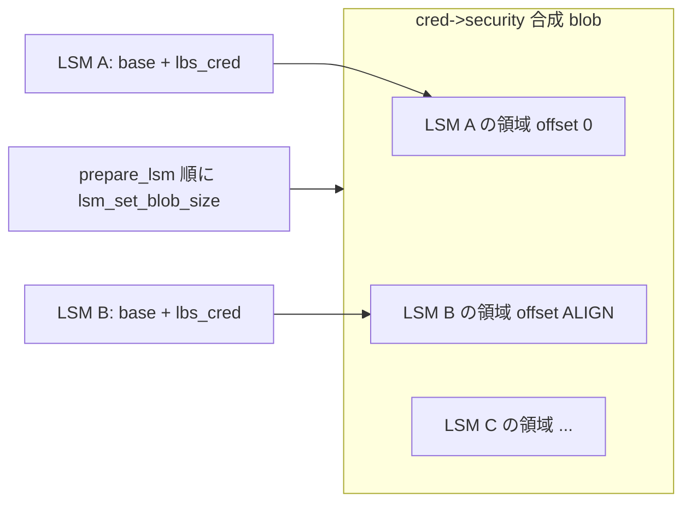

# 第6章 blob 割り当てと `lsm_*_alloc`

> **本章で読むソース**
>
> - [`include/linux/lsm_hooks.h` L104-L123](https://github.com/gregkh/linux/blob/v6.18.38/include/linux/lsm_hooks.h#L104-L123)
> - [`security/security.c` L250-L260](https://github.com/gregkh/linux/blob/v6.18.38/security/security.c#L250-L260)
> - [`security/security.c` L295-L310](https://github.com/gregkh/linux/blob/v6.18.38/security/security.c#L295-L310)
> - [`security/security.c` L716-L727](https://github.com/gregkh/linux/blob/v6.18.38/security/security.c#L716-L727)
> - [`security/security.c` L738-L741](https://github.com/gregkh/linux/blob/v6.18.38/security/security.c#L738-L741)
> - [`security/security.c` L3418-L3429](https://github.com/gregkh/linux/blob/v6.18.38/security/security.c#L3418-L3429)
> - [`security/landlock/setup.c` L30-L35](https://github.com/gregkh/linux/blob/v6.18.38/security/landlock/setup.c#L30-L35)
> - [`security/landlock/cred.h` L62-L66](https://github.com/gregkh/linux/blob/v6.18.38/security/landlock/cred.h#L62-L66)
> - [`security/selinux/hooks.c` L7250-L7255](https://github.com/gregkh/linux/blob/v6.18.38/security/selinux/hooks.c#L7250-L7255)

## この章の狙い

複数 LSM がオブジェクトにぶら下げる **blob**（`cred->security` 等）が、一塊のメモリとしてどう割り当てられ、各 LSM が相対オフセットで自分の領域を参照するかを読む。

## 前提

- [第4章：LSM 登録、`lsm=` ブート順序、lockdown](04-lsm-init-order-lockdown.md)
- [第5章：`security_*` ラッパとフック実行規約](05-security-wrappers-call-convention.md)

## lsm_blob_sizes：オブジェクト種別ごとの要求

各 LSM は `DEFINE_LSM` の `.blobs` に、必要な blob サイズを `struct lsm_blob_sizes` で宣言する。

[`include/linux/lsm_hooks.h` L104-L123](https://github.com/gregkh/linux/blob/v6.18.38/include/linux/lsm_hooks.h#L104-L123)

```c
struct lsm_blob_sizes {
	int lbs_cred;
	int lbs_file;
	int lbs_backing_file;
	int lbs_ib;
	int lbs_inode;
	int lbs_sock;
	int lbs_superblock;
	int lbs_ipc;
	int lbs_key;
	int lbs_msg_msg;
	int lbs_perf_event;
	int lbs_task;
	int lbs_xattr_count; /* number of xattr slots in new_xattrs array */
	int lbs_tun_dev;
	int lbs_bdev;
	int lbs_bpf_map;
	int lbs_bpf_prog;
	int lbs_bpf_token;
};
```

フレームワーク側の `blob_sizes` は全 LSM 分を足し合わせた合成サイズを保持する。

## lsm_set_blob_size：オフセットへの変換

`prepare_lsm` は各 LSM の `blobs` フィールドを走査し、`lsm_set_blob_size` で合成 blob 内の **相対オフセット** に書き換える。
同時にフレームワーク全体の累積サイズ `blob_sizes.lbs_*` を更新する。

[`security/security.c` L250-L260](https://github.com/gregkh/linux/blob/v6.18.38/security/security.c#L250-L260)

```c
static void __init lsm_set_blob_size(int *need, int *lbs)
{
	int offset;

	if (*need <= 0)
		return;

	offset = ALIGN(*lbs, sizeof(void *));
	*lbs = offset + *need;
	*need = offset;
}
```

[`security/security.c` L295-L310](https://github.com/gregkh/linux/blob/v6.18.38/security/security.c#L295-L310)

```c
static void __init prepare_lsm(struct lsm_info *lsm)
{
	int enabled = lsm_allowed(lsm);

	/* Record enablement (to handle any following exclusive LSMs). */
	set_enabled(lsm, enabled);

	/* If enabled, do pre-initialization work. */
	if (enabled) {
		if ((lsm->flags & LSM_FLAG_EXCLUSIVE) && !exclusive) {
			exclusive = lsm;
			init_debug("exclusive chosen:   %s\n", lsm->name);
		}

		lsm_set_blob_sizes(lsm->blobs);
	}
}
```

`ordered_lsms` の順序どおりに `prepare_lsm` が呼ばれるため、先に初期化される LSM ほど小さいオフセットを得る。

## 各 LSM の宣言例

Landlock は cred、file、inode、superblock に blob を要求する。

[`security/landlock/setup.c` L30-L35](https://github.com/gregkh/linux/blob/v6.18.38/security/landlock/setup.c#L30-L35)

```c
struct lsm_blob_sizes landlock_blob_sizes __ro_after_init = {
	.lbs_cred = sizeof(struct landlock_cred_security),
	.lbs_file = sizeof(struct landlock_file_security),
	.lbs_inode = sizeof(struct landlock_inode_security),
	.lbs_superblock = sizeof(struct landlock_superblock_security),
};
```

SELinux も同様に各 `*_security_struct` のサイズを登録する（ポリシー評価本体は SELinux 分冊へ委譲）。

[`security/selinux/hooks.c` L7250-L7255](https://github.com/gregkh/linux/blob/v6.18.38/security/selinux/hooks.c#L7250-L7255)

```c
struct lsm_blob_sizes selinux_blob_sizes __ro_after_init = {
	.lbs_cred = sizeof(struct cred_security_struct),
	.lbs_task = sizeof(struct task_security_struct),
	.lbs_file = sizeof(struct file_security_struct),
	.lbs_backing_file = sizeof(struct backing_file_security_struct),
	.lbs_inode = sizeof(struct inode_security_struct),
```

ブート後、`lbs_cred` 等の値は sizeof ではなく **オフセット** として解釈される。

## アクセサ：base ポインタ + オフセット

Landlock は `cred->security`（合成 blob 先頭）に自 LSM のオフセットを加えて型付きポインタを得る。

[`security/landlock/cred.h` L62-L66](https://github.com/gregkh/linux/blob/v6.18.38/security/landlock/cred.h#L62-L66)

```c
static inline struct landlock_cred_security *
landlock_cred(const struct cred *cred)
{
	return cred->security + landlock_blob_sizes.lbs_cred;
}
```

SELinux も `selinux_cred()` で同じパターンを使う。
各 LSM は自前の `*_blob_sizes.lbs_*` に記録されたオフセットだけを知ればよい。

## lsm_blob_alloc と lsm_cred_alloc

合成サイズが 0 なら割り当てはスキップされ、ポインタは NULL のままである。
非ゼロなら `kzalloc` で一塊確保する。

[`security/security.c` L716-L727](https://github.com/gregkh/linux/blob/v6.18.38/security/security.c#L716-L727)

```c
static int lsm_blob_alloc(void **dest, size_t size, gfp_t gfp)
{
	if (size == 0) {
		*dest = NULL;
		return 0;
	}

	*dest = kzalloc(size, gfp);
	if (*dest == NULL)
		return -ENOMEM;
	return 0;
}
```

[`security/security.c` L738-L741](https://github.com/gregkh/linux/blob/v6.18.38/security/security.c#L738-L741)

```c
static int lsm_cred_alloc(struct cred *cred, gfp_t gfp)
{
	return lsm_blob_alloc(&cred->security, blob_sizes.lbs_cred, gfp);
}
```

`file` と `inode` は合成サイズに応じた kmem_cache を `ordered_lsm_init` で作り、`lsm_file_alloc` / `lsm_inode_alloc` がキャッシュから切り出す（高頻度オブジェクト向け）。

## security_prepare_creds との接続

`cred` 複製時は、まず合成 blob を確保し、その後 `cred_prepare` フックで各 LSM が自分のオフセット位置を初期化する。

[`security/security.c` L3418-L3429](https://github.com/gregkh/linux/blob/v6.18.38/security/security.c#L3418-L3429)

```c
int security_prepare_creds(struct cred *new, const struct cred *old, gfp_t gfp)
{
	int rc = lsm_cred_alloc(new, gfp);

	if (rc)
		return rc;

	rc = call_int_hook(cred_prepare, new, old, gfp);
	if (unlikely(rc))
		security_cred_free(new);
	return rc;
}
```

blob 確保と LSM 初期化の失敗はラッパが分離して扱い、後者の失敗時だけ `security_cred_free` で合成 blob 全体を解放する。

## blob レイアウトの概念図



## 高速化と最適化の工夫

複数 LSM へ個別 `kmalloc` する代わりに、オブジェクト種別ごとに **一塊の合成 blob** を割り当てる。
ポインタ追跡が一つに収まり、キャッシュラインもまとまりやすい。
`file` / `inode` は kmem_cache でサイズ固定の合成 blob を再利用し、高頻度割り当てのコストを抑える。
`lsm_set_blob_size` の `ALIGN(..., sizeof(void *))` は、各 LSM 構造体へのポインタアクセスがアライン要件を満たすためのパディングである。

## まとめ

`lsm_blob_sizes` はブート時にオフセットへ変換され、合成 blob 内で各 LSM が隣接配置される。
`lsm_*_alloc` は種別ごとの累積サイズ `blob_sizes` に基づき一塊を確保する。
Landlock や SELinux のアクセサは `base + offset` で自 LSM データだけを型安全に辿る。

## 関連する章

- [主要 LSM の概観と SELinux カーネル接続点](07-lsm-implementations-selinux-bridge.md)
- [第2章：`cred` と権限判定の入口](../part00-foundation/02-cred-capable-entry.md)
- [Landlock ruleset と domain](../part04-landlock/14-landlock-ruleset-domain.md)
