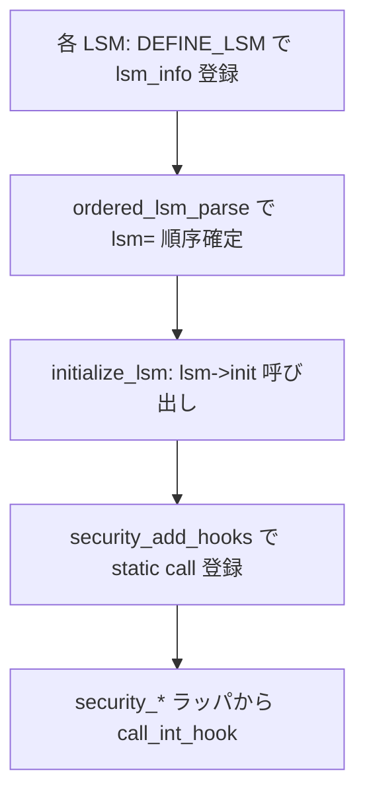

# 第7章 主要 LSM の概観と SELinux カーネル接続点

> **本章で読むソース**
>
> - [`include/linux/lsm_hooks.h` L155-L172](https://github.com/gregkh/linux/blob/v6.18.38/include/linux/lsm_hooks.h#L155-L172)
> - [`security/commoncap.c` L1500-L1511](https://github.com/gregkh/linux/blob/v6.18.38/security/commoncap.c#L1500-L1511)
> - [`security/selinux/hooks.c` L7385-L7388](https://github.com/gregkh/linux/blob/v6.18.38/security/selinux/hooks.c#L7385-L7388)
> - [`security/selinux/hooks.c` L7721-L7722](https://github.com/gregkh/linux/blob/v6.18.38/security/selinux/hooks.c#L7721-L7722)
> - [`security/selinux/hooks.c` L7754-L7762](https://github.com/gregkh/linux/blob/v6.18.38/security/selinux/hooks.c#L7754-L7762)
> - [`security/apparmor/lsm.c` L2535-L2536](https://github.com/gregkh/linux/blob/v6.18.38/security/apparmor/lsm.c#L2535-L2536)
> - [`security/apparmor/lsm.c` L2562-L2568](https://github.com/gregkh/linux/blob/v6.18.38/security/apparmor/lsm.c#L2562-L2568)
> - [`security/smack/smack_lsm.c` L5344](https://github.com/gregkh/linux/blob/v6.18.38/security/smack/smack_lsm.c#L5344)
> - [`security/smack/smack_lsm.c` L5373-L5378](https://github.com/gregkh/linux/blob/v6.18.38/security/smack/smack_lsm.c#L5373-L5378)
> - [`security/tomoyo/tomoyo.c` L603-L604](https://github.com/gregkh/linux/blob/v6.18.38/security/tomoyo/tomoyo.c#L603-L604)
> - [`security/tomoyo/tomoyo.c` L614-L620](https://github.com/gregkh/linux/blob/v6.18.38/security/tomoyo/tomoyo.c#L614-L620)
> - [`security/landlock/setup.c` L77-L81](https://github.com/gregkh/linux/blob/v6.18.38/security/landlock/setup.c#L77-L81)
> - [`security/bpf/hooks.c` L35-L39](https://github.com/gregkh/linux/blob/v6.18.38/security/bpf/hooks.c#L35-L39)
> - [`security/yama/yama_lsm.c` L478-L481](https://github.com/gregkh/linux/blob/v6.18.38/security/yama/yama_lsm.c#L478-L481)

## この章の狙い

組み込み **LSM** が `DEFINE_LSM` でどう登録され、`init` から `security_add_hooks` へ接続するかを概観する。
**SELinux** は `selinux_init` とフック登録の接続点だけを読み、AVC やポリシー評価の内部は [SELinux userspace](../../../selinux/README.md) 分冊へ委譲する。
AppArmor、SMACK、TOMOYO も同じ登録パターンの実装例として触れる。

## 前提

- [第4章：LSM 登録、`lsm=` ブート順序、lockdown](04-lsm-init-order-lockdown.md)
- [第6章：blob 割り当てと `lsm_*_alloc`](06-lsm-blob-alloc.md)

## DEFINE_LSM と lsm_info

各 LSM は `struct lsm_info` を `.lsm_info.init` セクションに置き、ブート時に `ordered_lsm_init` が走査する。
`DEFINE_LSM` マクロはセクション配置とアラインメントを担い、フィールド初期化は直後の `{ ... }` で行う。

[`include/linux/lsm_hooks.h` L155-L172](https://github.com/gregkh/linux/blob/v6.18.38/include/linux/lsm_hooks.h#L155-L172)

```c
struct lsm_info {
	const char *name;	/* Required. */
	enum lsm_order order;	/* Optional: default is LSM_ORDER_MUTABLE */
	unsigned long flags;	/* Optional: flags describing LSM */
	int *enabled;		/* Optional: controlled by CONFIG_LSM */
	int (*init)(void);	/* Required. */
	struct lsm_blob_sizes *blobs; /* Optional: for blob sharing. */
};

#define DEFINE_LSM(lsm)							\
	static struct lsm_info __lsm_##lsm				\
		__used __section(".lsm_info.init")			\
		__aligned(sizeof(unsigned long))

#define DEFINE_EARLY_LSM(lsm)						\
	static struct lsm_info __early_lsm_##lsm			\
		__used __section(".early_lsm_info.init")		\
		__aligned(sizeof(unsigned long))
```

`LSM_FLAG_LEGACY_MAJOR` は従来の major MAC（SELinux 等）を示し、`LSM_FLAG_EXCLUSIVE` は同時に一つだけ有効化できる LSM を表す。
`LSM_ORDER_FIRST` を持つ LSM は常に列の先頭へ挿入される。

## capability LSM：常に先頭の組み込み LSM

POSIX capability の実装は `commoncap.c` が担い、`LSM_ORDER_FIRST` で他 LSM より先に初期化される。
`capability_init` は `security_add_hooks` で `capable` や `capget` 等のフックを登録する。

[`security/commoncap.c` L1500-L1511](https://github.com/gregkh/linux/blob/v6.18.38/security/commoncap.c#L1500-L1511)

```c
static int __init capability_init(void)
{
	security_add_hooks(capability_hooks, ARRAY_SIZE(capability_hooks),
			   &capability_lsmid);
	return 0;
}

DEFINE_LSM(capability) = {
	.name = "capability",
	.order = LSM_ORDER_FIRST,
	.init = capability_init,
};
```

## 主要 LSM の位置づけ

| LSM | ソース | 役割の概観 |
|---|---|---|
| capability | `security/commoncap.c` | POSIX capability、file cap、bounding set |
| lockdown | `security/lockdown/` | カーネル機能のロックダウン（第4章） |
| selinux | `security/selinux/` | FLASK/TE ベースの MAC（本章は接続点のみ） |
| apparmor | `security/apparmor/` | パスベースのプロファイル強制 |
| smack | `security/smack/` | 単純ラベルによる MAC |
| tomoyo | `security/tomoyo/` | 学習型アクセス制御 |
| landlock | `security/landlock/` | 非特権サンドボックス（第4部） |
| yama | `security/yama/` | ptrace 制限などの補助 LSM |
| bpf | `security/bpf/hooks.c` | BPF プログラムによる LSM フック（[BPF 分冊](../../bpf/README.md) へ委譲） |

IMA、EVM、IPE、loadpin、safesetid 等も同じ `DEFINE_LSM` パターンで登録されるが、本分冊では上表の接続点に留める。

## SELinux：LSM 登録とフック接続

SELinux のカーネル実装は `security/selinux/hooks.c` に集約される（v6.18.38 で 7,839 行）。
本章では `selinux_lsmid`、`selinux_init` 内の `security_add_hooks`、`DEFINE_LSM(selinux)` の三箇所だけを読む。

### lsm_id

[`security/selinux/hooks.c` L7385-L7388](https://github.com/gregkh/linux/blob/v6.18.38/security/selinux/hooks.c#L7385-L7388)

```c
static const struct lsm_id selinux_lsmid = {
	.name = "selinux",
	.id = LSM_ID_SELINUX,
};
```

### selinux_init からのフック登録

`selinux_init` は AVC やハッシュテーブルの初期化のあと、巨大な `selinux_hooks[]` をフレームワークへ渡す。
ポリシー読み込みや `avc_has_perm` の詳細は SELinux 分冊へ委譲する。

[`security/selinux/hooks.c` L7721-L7722](https://github.com/gregkh/linux/blob/v6.18.38/security/selinux/hooks.c#L7721-L7722)

```c
	security_add_hooks(selinux_hooks, ARRAY_SIZE(selinux_hooks),
			   &selinux_lsmid);
```

### DEFINE_LSM(selinux)

SELinux は early init が必要な major LSM として `LSM_FLAG_LEGACY_MAJOR | LSM_FLAG_EXCLUSIVE` を付与する。
`selinux_enabled_boot` でブート時無効化も可能である。

[`security/selinux/hooks.c` L7754-L7762](https://github.com/gregkh/linux/blob/v6.18.38/security/selinux/hooks.c#L7754-L7762)

```c
/* SELinux requires early initialization in order to label
   all processes and objects when they are created. */
DEFINE_LSM(selinux) = {
	.name = "selinux",
	.flags = LSM_FLAG_LEGACY_MAJOR | LSM_FLAG_EXCLUSIVE,
	.enabled = &selinux_enabled_boot,
	.blobs = &selinux_blob_sizes,
	.init = selinux_init,
};
```

## 他 major LSM の登録パターン

AppArmor、SMACK、TOMOYO も `init` 内で `security_add_hooks` を呼び、`DEFINE_LSM` で同型のフィールドを埋める。
ポリシーエンジン本体はここでは読まない。

AppArmor:

[`security/apparmor/lsm.c` L2535-L2536](https://github.com/gregkh/linux/blob/v6.18.38/security/apparmor/lsm.c#L2535-L2536)

```c
	security_add_hooks(apparmor_hooks, ARRAY_SIZE(apparmor_hooks),
				&apparmor_lsmid);
```

[`security/apparmor/lsm.c` L2562-L2568](https://github.com/gregkh/linux/blob/v6.18.38/security/apparmor/lsm.c#L2562-L2568)

```c
DEFINE_LSM(apparmor) = {
	.name = "apparmor",
	.flags = LSM_FLAG_LEGACY_MAJOR | LSM_FLAG_EXCLUSIVE,
	.enabled = &apparmor_enabled,
	.blobs = &apparmor_blob_sizes,
	.init = apparmor_init,
};
```

SMACK:

[`security/smack/smack_lsm.c` L5344](https://github.com/gregkh/linux/blob/v6.18.38/security/smack/smack_lsm.c#L5344)

```c
	security_add_hooks(smack_hooks, ARRAY_SIZE(smack_hooks), &smack_lsmid);
```

[`security/smack/smack_lsm.c` L5373-L5378](https://github.com/gregkh/linux/blob/v6.18.38/security/smack/smack_lsm.c#L5373-L5378)

```c
DEFINE_LSM(smack) = {
	.name = "smack",
	.flags = LSM_FLAG_LEGACY_MAJOR | LSM_FLAG_EXCLUSIVE,
	.blobs = &smack_blob_sizes,
	.init = smack_init,
};
```

TOMOYO は `LSM_FLAG_EXCLUSIVE` を持たない。
他 major LSM と併用可能である。

[`security/tomoyo/tomoyo.c` L603-L604](https://github.com/gregkh/linux/blob/v6.18.38/security/tomoyo/tomoyo.c#L603-L604)

```c
	security_add_hooks(tomoyo_hooks, ARRAY_SIZE(tomoyo_hooks),
			   &tomoyo_lsmid);
```

[`security/tomoyo/tomoyo.c` L614-L620](https://github.com/gregkh/linux/blob/v6.18.38/security/tomoyo/tomoyo.c#L614-L620)

```c
DEFINE_LSM(tomoyo) = {
	.name = "tomoyo",
	.enabled = &tomoyo_enabled,
	.flags = LSM_FLAG_LEGACY_MAJOR,
	.blobs = &tomoyo_blob_sizes,
	.init = tomoyo_init,
};
```

## 現行スタック LSM の例

Landlock は major フラグを持たない現行スタック LSM の代表である。
blob 要求と `landlock_init` を `DEFINE_LSM` に束ねる（ruleset の詳細は第4部）。

[`security/landlock/setup.c` L77-L81](https://github.com/gregkh/linux/blob/v6.18.38/security/landlock/setup.c#L77-L81)

```c
DEFINE_LSM(LANDLOCK_NAME) = {
	.name = LANDLOCK_NAME,
	.init = landlock_init,
	.blobs = &landlock_blob_sizes,
};
```

BPF LSM は verifier や map の話を [BPF 分冊](../../bpf/README.md) へ委譲し、ここでは登録だけ示す。

[`security/bpf/hooks.c` L35-L39](https://github.com/gregkh/linux/blob/v6.18.38/security/bpf/hooks.c#L35-L39)

```c
DEFINE_LSM(bpf) = {
	.name = "bpf",
	.init = bpf_lsm_init,
	.blobs = &bpf_lsm_blob_sizes
};
```

Yama は blob も major フラグも持たない小さな補助 LSM である。

[`security/yama/yama_lsm.c` L478-L481](https://github.com/gregkh/linux/blob/v6.18.38/security/yama/yama_lsm.c#L478-L481)

```c
DEFINE_LSM(yama) = {
	.name = "yama",
	.init = yama_init,
};
```

## LSM 登録からフック実行まで



## 7.x 系での変化

7.1.3 では SELinux の `DEFINE_LSM` が `.name` 文字列から `.id = &selinux_lsmid` へ移り、`initcall_device` コールバックが追加されている。

[`security/selinux/hooks.c` L7896-L7904](https://github.com/gregkh/linux/blob/v7.1.3/security/selinux/hooks.c#L7896-L7904)

```c
DEFINE_LSM(selinux) = {
	.id = &selinux_lsmid,
	.flags = LSM_FLAG_LEGACY_MAJOR | LSM_FLAG_EXCLUSIVE,
	.enabled = &selinux_enabled_boot,
	.blobs = &selinux_blob_sizes,
	.init = selinux_init,
	.initcall_device = selinux_initcall,
};
```

6.18 系の読者は、LSM 名が `lsm_info.name` 直書きから `lsm_id` 構造体参照へ統合されつつある点が対比になる。
lockdown も同趣旨であり、第4章を参照する。

## 高速化と最適化の工夫

各 LSM の `init` はブート時一度だけ走り、登録済みフックは **static call** と jump label で呼び出しコストを抑える（第3章）。
`LSM_FLAG_EXCLUSIVE` による major LSM の排他選択は、無効な巨大フック列を実行時に載せないための事前剪定である。
`selinux_hooks[]` は `__ro_after_init` に置かれ、初期化後は読み取り専用ページに収まる。

## まとめ

`DEFINE_LSM` は `.lsm_info.init` セクションへ `lsm_info` を載せ、第4章の `ordered_lsm_init` が順に `init` を呼ぶ。
各 `init` の定番終端は `security_add_hooks` で、SELinux も AppArmor も同じ接続形を取る。
SELinux 内部のポリシー評価は本分冊の範囲外とし、カーネル接続点だけを地図として押さえる。

## 関連する章

- [capability ビットマップと `capget`/`capset`](../part02-capabilities/08-capability-bitmap-syscalls.md)
- [第3章：LSM フック定義と静的呼び出し機構](03-lsm-hooks-static-calls.md)
- [Landlock ruleset と domain](../part04-landlock/13-landlock-ruleset-domain.md)
