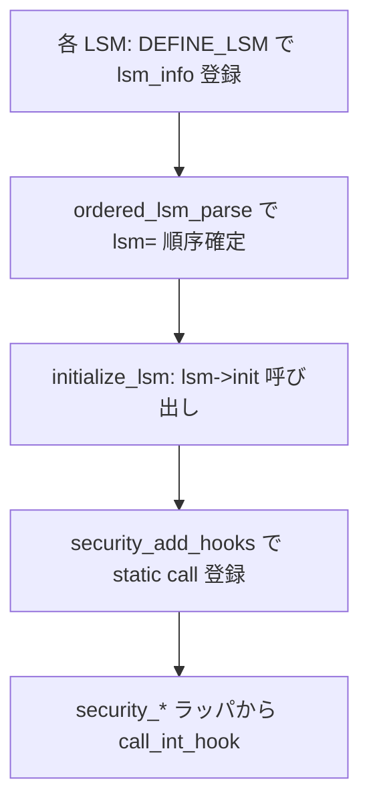

# 第7章 主要 LSM の概観と SELinux カーネル接続点

> **本章で読むソース**
>
> - [`include/linux/lsm_hooks.h` L155-L172](https://github.com/gregkh/linux/blob/v6.18.38/include/linux/lsm_hooks.h#L155-L172)
> - [`security/commoncap.c` L1500-L1511](https://github.com/gregkh/linux/blob/v6.18.38/security/commoncap.c#L1500-L1511)
> - [`security/selinux/hooks.c` L7385-L7388](https://github.com/gregkh/linux/blob/v6.18.38/security/selinux/hooks.c#L7385-L7388)
> - [`security/selinux/hooks.c` L7721-L7722](https://github.com/gregkh/linux/blob/v6.18.38/security/selinux/hooks.c#L7721-L7722)
> - [`security/selinux/hooks.c` L7754-L7762](https://github.com/gregkh/linux/blob/v6.18.38/security/selinux/hooks.c#L7754-L7762)
> - [`security/apparmor/lsm.c` L2535-L2536](https://github.com/gregkh/linux/blob/v6.18.38/security/apparmor/lsm.c#L2535-L2536)
> - [`security/apparmor/lsm.c` L2562-L2568](https://github.com/gregkh/linux/blob/v6.18.38/security/apparmor/lsm.c#L2562-L2568)
> - [`security/smack/smack_lsm.c` L5344](https://github.com/gregkh/linux/blob/v6.18.38/security/smack/smack_lsm.c#L5344)
> - [`security/smack/smack_lsm.c` L5373-L5378](https://github.com/gregkh/linux/blob/v6.18.38/security/smack/smack_lsm.c#L5373-L5378)
> - [`security/tomoyo/tomoyo.c` L603-L604](https://github.com/gregkh/linux/blob/v6.18.38/security/tomoyo/tomoyo.c#L603-L604)
> - [`security/tomoyo/tomoyo.c` L614-L620](https://github.com/gregkh/linux/blob/v6.18.38/security/tomoyo/tomoyo.c#L614-L620)
> - [`security/landlock/setup.c` L77-L81](https://github.com/gregkh/linux/blob/v6.18.38/security/landlock/setup.c#L77-L81)
> - [`security/bpf/hooks.c` L35-L39](https://github.com/gregkh/linux/blob/v6.18.38/security/bpf/hooks.c#L35-L39)
> - [`security/yama/yama_lsm.c` L478-L481](https://github.com/gregkh/linux/blob/v6.18.38/security/yama/yama_lsm.c#L478-L481)
> - [`security/safesetid/lsm.c` L148-L184](https://github.com/gregkh/linux/blob/v6.18.38/security/safesetid/lsm.c#L148-L184)
> - [`security/safesetid/lsm.c` L191-L213](https://github.com/gregkh/linux/blob/v6.18.38/security/safesetid/lsm.c#L191-L213)
> - [`security/loadpin/loadpin.c` L216-L220](https://github.com/gregkh/linux/blob/v6.18.38/security/loadpin/loadpin.c#L216-L220)
> - [`security/loadpin/loadpin.c` L136-L141](https://github.com/gregkh/linux/blob/v6.18.38/security/loadpin/loadpin.c#L136-L141)
> - [`security/loadpin/loadpin.c` L157-L187](https://github.com/gregkh/linux/blob/v6.18.38/security/loadpin/loadpin.c#L157-L187)
> - [`security/safesetid/lsm.h` L30-L33](https://github.com/gregkh/linux/blob/v6.18.38/security/safesetid/lsm.h#L30-L33)

## この章の狙い

組み込み **LSM** が `DEFINE_LSM` でどう登録され、`init` から `security_add_hooks` へ接続するかを概観する。
**SELinux** は `selinux_init` とフック登録の接続点だけを読み、AVC やポリシー評価の内部は [SELinux userspace](../../../selinux/README.md) 分冊へ委譲する。
AppArmor、SMACK、TOMOYO も同じ登録パターンの実装例として触れる。

## 前提

- [第4章：LSM 登録、`lsm=` ブート順序、lockdown](04-lsm-init-order-lockdown.md)
- [第6章：blob 割り当てと `lsm_*_alloc`](06-lsm-blob-alloc.md)

## DEFINE_LSM と lsm_info

各 LSM は `struct lsm_info` を `.lsm_info.init` セクションに置き、ブート時に `ordered_lsm_init` が走査する。
`DEFINE_LSM` マクロはセクション配置とアラインメントを担い、フィールド初期化は直後の `{ ... }` で行う。

[`include/linux/lsm_hooks.h` L155-L172](https://github.com/gregkh/linux/blob/v6.18.38/include/linux/lsm_hooks.h#L155-L172)

```c
struct lsm_info {
	const char *name;	/* Required. */
	enum lsm_order order;	/* Optional: default is LSM_ORDER_MUTABLE */
	unsigned long flags;	/* Optional: flags describing LSM */
	int *enabled;		/* Optional: controlled by CONFIG_LSM */
	int (*init)(void);	/* Required. */
	struct lsm_blob_sizes *blobs; /* Optional: for blob sharing. */
};

#define DEFINE_LSM(lsm)							\
	static struct lsm_info __lsm_##lsm				\
		__used __section(".lsm_info.init")			\
		__aligned(sizeof(unsigned long))

#define DEFINE_EARLY_LSM(lsm)						\
	static struct lsm_info __early_lsm_##lsm			\
		__used __section(".early_lsm_info.init")		\
		__aligned(sizeof(unsigned long))
```

`LSM_FLAG_LEGACY_MAJOR` は従来の major MAC（SELinux 等）を示し、`LSM_FLAG_EXCLUSIVE` は同時に一つだけ有効化できる LSM を表す。
`LSM_ORDER_FIRST` を持つ LSM は常に列の先頭へ挿入される。

## capability LSM：常に先頭の組み込み LSM

POSIX capability の実装は `commoncap.c` が担い、`LSM_ORDER_FIRST` で他 LSM より先に初期化される。
`capability_init` は `security_add_hooks` で `capable` や `capget` 等のフックを登録する。

[`security/commoncap.c` L1500-L1511](https://github.com/gregkh/linux/blob/v6.18.38/security/commoncap.c#L1500-L1511)

```c
static int __init capability_init(void)
{
	security_add_hooks(capability_hooks, ARRAY_SIZE(capability_hooks),
			   &capability_lsmid);
	return 0;
}

DEFINE_LSM(capability) = {
	.name = "capability",
	.order = LSM_ORDER_FIRST,
	.init = capability_init,
};
```

## 主要 LSM の位置づけ

| LSM | ソース | 役割の概観 |
|---|---|---|
| capability | `security/commoncap.c` | POSIX capability、file cap、bounding set |
| lockdown | `security/lockdown/` | カーネル機能のロックダウン（第4章） |
| selinux | `security/selinux/` | FLASK/TE ベースの MAC（本章は接続点のみ） |
| apparmor | `security/apparmor/` | パスベースのプロファイル強制 |
| smack | `security/smack/` | 単純ラベルによる MAC |
| tomoyo | `security/tomoyo/` | 学習型アクセス制御 |
| landlock | `security/landlock/` | 非特権サンドボックス（第4部） |
| yama | `security/yama/` | ptrace 制限などの補助 LSM |
| bpf | `security/bpf/hooks.c` | BPF プログラムによる LSM フック（[BPF 分冊](../../bpf/README.md) へ委譲） |

IMA、EVM、IPE 等も同じ `DEFINE_LSM` パターンで登録されるが、本分冊では上表の接続点に留める（SafeSetID と LoadPin は次節で個別に扱う）。

## SELinux：LSM 登録とフック接続

SELinux のカーネル実装は `security/selinux/hooks.c` に集約される（v6.18.38 で 7,839 行）。
本章では `selinux_lsmid`、`selinux_init` 内の `security_add_hooks`、`DEFINE_LSM(selinux)` の三箇所だけを読む。

### lsm_id

[`security/selinux/hooks.c` L7385-L7388](https://github.com/gregkh/linux/blob/v6.18.38/security/selinux/hooks.c#L7385-L7388)

```c
static const struct lsm_id selinux_lsmid = {
	.name = "selinux",
	.id = LSM_ID_SELINUX,
};
```

### selinux_init からのフック登録

`selinux_init` は AVC やハッシュテーブルの初期化のあと、巨大な `selinux_hooks[]` をフレームワークへ渡す。
ポリシー読み込みや `avc_has_perm` の詳細は SELinux 分冊へ委譲する。

[`security/selinux/hooks.c` L7721-L7722](https://github.com/gregkh/linux/blob/v6.18.38/security/selinux/hooks.c#L7721-L7722)

```c
	security_add_hooks(selinux_hooks, ARRAY_SIZE(selinux_hooks),
			   &selinux_lsmid);
```

### DEFINE_LSM(selinux)

SELinux は early init が必要な major LSM として `LSM_FLAG_LEGACY_MAJOR | LSM_FLAG_EXCLUSIVE` を付与する。
`selinux_enabled_boot` でブート時無効化も可能である。

[`security/selinux/hooks.c` L7754-L7762](https://github.com/gregkh/linux/blob/v6.18.38/security/selinux/hooks.c#L7754-L7762)

```c
/* SELinux requires early initialization in order to label
   all processes and objects when they are created. */
DEFINE_LSM(selinux) = {
	.name = "selinux",
	.flags = LSM_FLAG_LEGACY_MAJOR | LSM_FLAG_EXCLUSIVE,
	.enabled = &selinux_enabled_boot,
	.blobs = &selinux_blob_sizes,
	.init = selinux_init,
};
```

## 他 major LSM の登録パターン

AppArmor、SMACK、TOMOYO も `init` 内で `security_add_hooks` を呼び、`DEFINE_LSM` で同型のフィールドを埋める。
ポリシーエンジン本体はここでは読まない。

AppArmor:

[`security/apparmor/lsm.c` L2535-L2536](https://github.com/gregkh/linux/blob/v6.18.38/security/apparmor/lsm.c#L2535-L2536)

```c
	security_add_hooks(apparmor_hooks, ARRAY_SIZE(apparmor_hooks),
				&apparmor_lsmid);
```

[`security/apparmor/lsm.c` L2562-L2568](https://github.com/gregkh/linux/blob/v6.18.38/security/apparmor/lsm.c#L2562-L2568)

```c
DEFINE_LSM(apparmor) = {
	.name = "apparmor",
	.flags = LSM_FLAG_LEGACY_MAJOR | LSM_FLAG_EXCLUSIVE,
	.enabled = &apparmor_enabled,
	.blobs = &apparmor_blob_sizes,
	.init = apparmor_init,
};
```

SMACK:

[`security/smack/smack_lsm.c` L5344](https://github.com/gregkh/linux/blob/v6.18.38/security/smack/smack_lsm.c#L5344)

```c
	security_add_hooks(smack_hooks, ARRAY_SIZE(smack_hooks), &smack_lsmid);
```

[`security/smack/smack_lsm.c` L5373-L5378](https://github.com/gregkh/linux/blob/v6.18.38/security/smack/smack_lsm.c#L5373-L5378)

```c
DEFINE_LSM(smack) = {
	.name = "smack",
	.flags = LSM_FLAG_LEGACY_MAJOR | LSM_FLAG_EXCLUSIVE,
	.blobs = &smack_blob_sizes,
	.init = smack_init,
};
```

TOMOYO は `LSM_FLAG_EXCLUSIVE` を持たない。
他 major LSM と併用可能である。

[`security/tomoyo/tomoyo.c` L603-L604](https://github.com/gregkh/linux/blob/v6.18.38/security/tomoyo/tomoyo.c#L603-L604)

```c
	security_add_hooks(tomoyo_hooks, ARRAY_SIZE(tomoyo_hooks),
			   &tomoyo_lsmid);
```

[`security/tomoyo/tomoyo.c` L614-L620](https://github.com/gregkh/linux/blob/v6.18.38/security/tomoyo/tomoyo.c#L614-L620)

```c
DEFINE_LSM(tomoyo) = {
	.name = "tomoyo",
	.enabled = &tomoyo_enabled,
	.flags = LSM_FLAG_LEGACY_MAJOR,
	.blobs = &tomoyo_blob_sizes,
	.init = tomoyo_init,
};
```

## 現行スタック LSM の例

Landlock は major フラグを持たない現行スタック LSM の代表である。
blob 要求と `landlock_init` を `DEFINE_LSM` に束ねる（ruleset の詳細は第4部）。

[`security/landlock/setup.c` L77-L81](https://github.com/gregkh/linux/blob/v6.18.38/security/landlock/setup.c#L77-L81)

```c
DEFINE_LSM(LANDLOCK_NAME) = {
	.name = LANDLOCK_NAME,
	.init = landlock_init,
	.blobs = &landlock_blob_sizes,
};
```

BPF LSM は verifier や map の話を [BPF 分冊](../../bpf/README.md) へ委譲し、ここでは登録だけ示す。

[`security/bpf/hooks.c` L35-L39](https://github.com/gregkh/linux/blob/v6.18.38/security/bpf/hooks.c#L35-L39)

```c
DEFINE_LSM(bpf) = {
	.name = "bpf",
	.init = bpf_lsm_init,
	.blobs = &bpf_lsm_blob_sizes
};
```

Yama は blob も major フラグも持たない小さな補助 LSM である。

[`security/yama/yama_lsm.c` L478-L481](https://github.com/gregkh/linux/blob/v6.18.38/security/yama/yama_lsm.c#L478-L481)

```c
DEFINE_LSM(yama) = {
	.name = "yama",
	.init = yama_init,
};
```

### SafeSetID：setid 遷移の制限

SafeSetID は、ポリシーで制約された source ID がどの destination ID へ setuid/setgid/setgroups できるかを許可リスト形式で制限する LSM である。
旧 RUID にポリシーエントリが無く `setid_policy_lookup` が `SIDPOL_DEFAULT` を返す場合は制約なしで通す。
ポリシーに1件でもエントリを持つ constrained な source に限り、既存 cred が持つ ID か明示的に許可された遷移先だけを許す。
setgid と setgroups も、`safesetid_task_fix_setgid` と `safesetid_task_fix_setgroups` が入口でポリシーの有無を旧 RGID（`old->gid`）基準で判定する点は UID 経路と同型である。
ただし宛先検査は非対称であり、後述の `id_permitted_for_cred` は `new_type` が GID であっても `setid_policy_lookup` へ常に `(kid_t){.uid = old->uid}` を渡す。

[`security/safesetid/lsm.h` L30-L33](https://github.com/gregkh/linux/blob/v6.18.38/security/safesetid/lsm.h#L30-L33)

```c
typedef union {
	kuid_t uid;
	kgid_t gid;
} kid_t;
```

`kid_t` は `kuid_t`/`kgid_t` の union であるため、GID 遷移の許可可否は old の RGID ではなく old の RUID の数値をキーに GID ポリシーを引いた結果で決まる。

強制点は `task_fix_setuid` などのフックである。
`kernel/sys.c` の `__sys_setuid` は `prepare_creds` で new cred を組み立て、値を設定したうえで `security_task_fix_setuid` を呼び、成功時だけ `commit_creds` で確定する。
失敗時は `abort_creds` で破棄する。
SafeSetID フックは commit 直前の最終候補を検査する強制点である。
`safesetid_security_capable` は setid 目的以外での `CAP_SETUID`/`CAP_SETGID` 利用を拒否する補助チェックであり、遷移可否は `task_fix_set*` 側の `id_permitted_for_cred` が決める。
ポリシーは `CAP_MAC_ADMIN` 保持者のみが securityfs 経由で更新でき、`rcu_replace_pointer` で `safesetid_setuid_rules` などを差し替える。

`id_permitted_for_cred` は、new の ID が旧 cred の該当フィールド（UID なら uid/euid/suid、GID なら gid/egid/sgid）のいずれかと一致するかをまず見て、一致しなければ `setid_policy_lookup` で許可された遷移かを判定する中核である。
コード中の `(kid_t){.uid = old->uid}` が示すとおり、この2段目の判定は `new_type` によらず old の RUID を鍵に使う。

[`security/safesetid/lsm.c` L148-L184](https://github.com/gregkh/linux/blob/v6.18.38/security/safesetid/lsm.c#L148-L184)

```c
static bool id_permitted_for_cred(const struct cred *old, kid_t new_id, enum setid_type new_type)
{
	bool permitted;

	/* If our old creds already had this ID in it, it's fine. */
	if (new_type == UID) {
		if (uid_eq(new_id.uid, old->uid) || uid_eq(new_id.uid, old->euid) ||
			uid_eq(new_id.uid, old->suid))
			return true;
	} else if (new_type == GID){
		if (gid_eq(new_id.gid, old->gid) || gid_eq(new_id.gid, old->egid) ||
			gid_eq(new_id.gid, old->sgid))
			return true;
	} else /* Error, new_type is an invalid type */
		return false;

	/*
	 * Transitions to new UIDs require a check against the policy of the old
	 * RUID.
	 */
	permitted =
	    setid_policy_lookup((kid_t){.uid = old->uid}, new_id, new_type) != SIDPOL_CONSTRAINED;

	if (!permitted) {
		if (new_type == UID) {
			pr_warn("UID transition ((%d,%d,%d) -> %d) blocked\n",
				__kuid_val(old->uid), __kuid_val(old->euid),
				__kuid_val(old->suid), __kuid_val(new_id.uid));
		} else if (new_type == GID) {
			pr_warn("GID transition ((%d,%d,%d) -> %d) blocked\n",
				__kgid_val(old->gid), __kgid_val(old->egid),
				__kgid_val(old->sgid), __kgid_val(new_id.gid));
		} else /* Error, new_type is an invalid type */
			return false;
	}
	return permitted;
}
```

`safesetid_task_fix_setuid` は new の uid/euid/suid/fsuid 全てが `id_permitted_for_cred` を通らなければ `force_sig(SIGKILL)` と `-EACCES` を返す。
コメントが示すとおり、許可リストの記載漏れで特権プロセスが低権限へ落ちそこねる事態を避けるため、プロセスごと終了させる設計である。

[`security/safesetid/lsm.c` L191-L213](https://github.com/gregkh/linux/blob/v6.18.38/security/safesetid/lsm.c#L191-L213)

```c
static int safesetid_task_fix_setuid(struct cred *new,
				     const struct cred *old,
				     int flags)
{

	/* Do nothing if there are no setuid restrictions for our old RUID. */
	if (setid_policy_lookup((kid_t){.uid = old->uid}, INVALID_ID, UID) == SIDPOL_DEFAULT)
		return 0;

	if (id_permitted_for_cred(old, (kid_t){.uid = new->uid}, UID) &&
	    id_permitted_for_cred(old, (kid_t){.uid = new->euid}, UID) &&
	    id_permitted_for_cred(old, (kid_t){.uid = new->suid}, UID) &&
	    id_permitted_for_cred(old, (kid_t){.uid = new->fsuid}, UID))
		return 0;

	/*
	 * Kill this process to avoid potential security vulnerabilities
	 * that could arise from a missing allowlist entry preventing a
	 * privileged process from dropping to a lesser-privileged one.
	 */
	force_sig(SIGKILL);
	return -EACCES;
}
```

登録は `task_fix_setuid`、`task_fix_setgid`、`task_fix_setgroups`、`capable` の4フックを `security_add_hooks` で束ねる既存パターンと同型である。
ポリシー参照は `hash_for_each_possible` で src ID から bucket を絞り、同一 bucket 内を線形走査する。

### LoadPin：kernel file load の固定

LoadPin は、カーネルが読み込むモジュールやファームウェアなど `kernel_read_file_id` で識別される種別が、最初に pin を決めた `super_block` と同じ filesystem から来ているかだけを見る狭い LSM である。
ポリシーエンジンではなく、起点となる1つの `super_block` への固定のみを行う。

`loadpin_hooks[]` は `kernel_read_file` と `kernel_load_data` の2経路を登録する。

[`security/loadpin/loadpin.c` L216-L220](https://github.com/gregkh/linux/blob/v6.18.38/security/loadpin/loadpin.c#L216-L220)

```c
static struct security_hook_list loadpin_hooks[] __ro_after_init = {
	LSM_HOOK_INIT(sb_free_security, loadpin_sb_free_security),
	LSM_HOOK_INIT(kernel_read_file, loadpin_read_file),
	LSM_HOOK_INIT(kernel_load_data, loadpin_load_data),
};
```

`loadpin_read_file` は実 `file` の `super_block` を検査する。
`loadpin_load_data` は `file == NULL` で `loadpin_check` に入り、filesystem 比較には至らない。
旧 `init_module` API や in-memory ロードは `enforce` が真なら `-EPERM`、偽ならログして許可する分岐に落ちる。
除外対象の `kernel_read_file_id` は `ignore_read_file_id` で早期成功し、`pinned_root` の検査に至る前に `return 0` する。

[`security/loadpin/loadpin.c` L136-141](https://github.com/gregkh/linux/blob/v6.18.38/security/loadpin/loadpin.c#L136-L141)

```c
	/* If the file id is excluded, ignore the pinning. */
	if ((unsigned int)id < ARRAY_SIZE(ignore_read_file_id) &&
	    ignore_read_file_id[id]) {
		report_load(origin, file, "pinning-excluded");
		return 0;
	}
```

最初の非 excluded かつ file-backed な呼び出しの `super_block` が、書き込み可否にかかわらず `pinned_root` になる。
2回目以降は `load_root != pinned_root` かつ dm-verity 信頼済みブロックデバイスでもない場合、`enforce` 時に `-EPERM` を返す。

[`security/loadpin/loadpin.c` L157-L187](https://github.com/gregkh/linux/blob/v6.18.38/security/loadpin/loadpin.c#L157-L187)

```c
	/* First loaded module/firmware defines the root for all others. */
	spin_lock(&pinned_root_spinlock);
	/*
	 * pinned_root is only NULL at startup or when the pinned root has
	 * been unmounted while we are not in enforcing mode. Otherwise, it
	 * is either a valid reference, or an ERR_PTR.
	 */
	if (!pinned_root) {
		pinned_root = load_root;
		first_root_pin = true;
	}
	spin_unlock(&pinned_root_spinlock);

	if (first_root_pin) {
		report_writable(pinned_root, load_root_writable);
		set_sysctl(load_root_writable);
		report_load(origin, file, "pinned");
	}

	if (IS_ERR_OR_NULL(pinned_root) ||
	    ((load_root != pinned_root) && !dm_verity_loadpin_is_bdev_trusted(load_root->s_bdev))) {
		if (unlikely(!enforce)) {
			report_load(origin, file, "pinning-ignored");
			return 0;
		}

		report_load(origin, file, "denied");
		return -EPERM;
	}
```

`enforce == 0` で pinned filesystem が unmount されると `loadpin_sb_free_security` が `pinned_root = NULL` に戻し、次の対象で再確定できる。
`enforce` が真のまま unmount されると `pinned_root = ERR_PTR(-EIO)` に固定される。
ただし `loadpin_check` は前掲（L136-141）のとおり exclude 判定を `pinned_root` の検査より先に行うため、EIO 固定後も exclude 指定された `kernel_read_file_id` のロードは早期 `return 0` で許可され続ける。
拒否されるのは非 exclude のロードだけである。
`enforce` フラグと `report_load` のログにより、観測モードから enforce へ段階導入しやすい。

## LSM 登録からフック実行まで



## 7.x 系での変化

7.1.3 では SELinux の `DEFINE_LSM` が `.name` 文字列から `.id = &selinux_lsmid` へ移り、`initcall_device` コールバックが追加されている。

[`security/selinux/hooks.c` L7896-L7904](https://github.com/gregkh/linux/blob/v7.1.3/security/selinux/hooks.c#L7896-L7904)

```c
DEFINE_LSM(selinux) = {
	.id = &selinux_lsmid,
	.flags = LSM_FLAG_LEGACY_MAJOR | LSM_FLAG_EXCLUSIVE,
	.enabled = &selinux_enabled_boot,
	.blobs = &selinux_blob_sizes,
	.init = selinux_init,
	.initcall_device = selinux_initcall,
};
```

6.18 系の読者は、LSM 名が `lsm_info.name` 直書きから `lsm_id` 構造体参照へ統合されつつある点が対比になる。
lockdown も同趣旨であり、第4章を参照する。

SafeSetID と LoadPin も `.id = &..._lsmid` へ移り、securityfs 初期化は `initcall_fs` スロットへ統合された。
旧来の `fs_initcall` 手書き登録は削除される。

[`security/safesetid/lsm.c` L289-L293](https://github.com/gregkh/linux/blob/v7.1.3/security/safesetid/lsm.c#L289-L293)

```c
DEFINE_LSM(safesetid_security_init) = {
	.id = &safesetid_lsmid,
	.init = safesetid_security_init,
	.initcall_fs = safesetid_init_securityfs,
};
```

[`security/loadpin/loadpin.c` L430-L436](https://github.com/gregkh/linux/blob/v7.1.3/security/loadpin/loadpin.c#L430-L436)

```c
DEFINE_LSM(loadpin) = {
	.id = &loadpin_lsmid,
	.init = loadpin_init,
#ifdef CONFIG_SECURITY_LOADPIN_VERITY
	.initcall_fs = init_loadpin_securityfs,
#endif /* CONFIG_SECURITY_LOADPIN_VERITY */
};
```

LoadPin の sysctl は 6.18.38 が `set_sysctl` で `extra1` を動的に書き換える方式だったのに対し、7.1.3 は `loadpin_root_writable` フラグと専用 `proc_handler_loadpin` で書き込みパスをガードする実装へ変わる。

## 高速化と最適化の工夫

各 LSM の `init` はブート時一度だけ走り、登録済みフックは **static call** と jump label で呼び出しコストを抑える（第3章）。
`LSM_FLAG_EXCLUSIVE` による major LSM の排他選択は、無効な巨大フック列を実行時に載せないための事前剪定である。
`selinux_hooks[]` は `__ro_after_init` に置かれ、初期化後は読み取り専用ページに収まる。

## まとめ

`DEFINE_LSM` は `.lsm_info.init` セクションへ `lsm_info` を載せ、第4章の `ordered_lsm_init` が順に `init` を呼ぶ。
各 `init` の定番終端は `security_add_hooks` で、SELinux も AppArmor も同じ接続形を取る。
SELinux 内部のポリシー評価は本分冊の範囲外とし、カーネル接続点だけを地図として押さえる。
SafeSetID や LoadPin のように、setid 遷移の可否や kernel file load の起点固定という単一の判定だけを担う LSM も、SELinux と同じ `DEFINE_LSM`/`security_add_hooks` の枠組みに乗る。
フックの粒度は LSM ごとに大きく異なる。

## 関連する章

- [capability ビットマップと `capget`/`capset`](../part02-capabilities/09-capability-bitmap-syscalls.md)
- [第3章：LSM フック定義と静的呼び出し機構](03-lsm-hooks-static-calls.md)
- [Landlock ruleset と domain](../part04-landlock/14-landlock-ruleset-domain.md)
