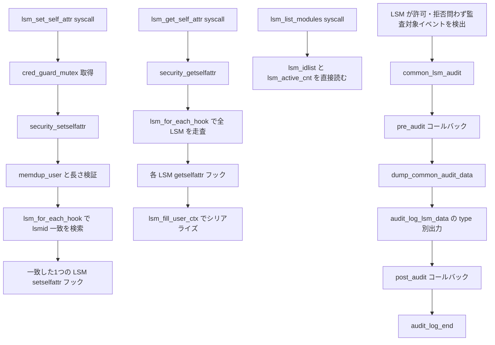

# 第8章 LSM userspace API と共通 audit

> **本章で読むソース**
>
> - [`security/lsm_syscalls.c` L55-L66](https://github.com/gregkh/linux/blob/v6.18.38/security/lsm_syscalls.c#L55-L66)
> - [`security/lsm_syscalls.c` L103-L127](https://github.com/gregkh/linux/blob/v6.18.38/security/lsm_syscalls.c#L103-L127)
> - [`security/security.c` L328-L329](https://github.com/gregkh/linux/blob/v6.18.38/security/security.c#L328-L329)
> - [`security/security.c` L954-L990](https://github.com/gregkh/linux/blob/v6.18.38/security/security.c#L954-L990)
> - [`security/security.c` L4296-L4353](https://github.com/gregkh/linux/blob/v6.18.38/security/security.c#L4296-L4353)
> - [`security/security.c` L4373-L4408](https://github.com/gregkh/linux/blob/v6.18.38/security/security.c#L4373-L4408)
> - [`include/uapi/linux/lsm.h` L35-L41](https://github.com/gregkh/linux/blob/v6.18.38/include/uapi/linux/lsm.h#L35-L41)
> - [`include/uapi/linux/lsm.h` L53-L67](https://github.com/gregkh/linux/blob/v6.18.38/include/uapi/linux/lsm.h#L53-L67)
> - [`security/lsm_audit.c` L188-L208](https://github.com/gregkh/linux/blob/v6.18.38/security/lsm_audit.c#L188-L208)
> - [`security/lsm_audit.c` L433-L457](https://github.com/gregkh/linux/blob/v6.18.38/security/lsm_audit.c#L433-L457)
> - [`include/linux/lsm_audit.h` L61-L80](https://github.com/gregkh/linux/blob/v6.18.38/include/linux/lsm_audit.h#L61-L80)
> - [`security/selinux/avc.c` L650-L658](https://github.com/gregkh/linux/blob/v6.18.38/security/selinux/avc.c#L650-L658)
> - [`include/linux/lsm_hook_defs.h` L297-L300](https://github.com/gregkh/linux/blob/v6.18.38/include/linux/lsm_hook_defs.h#L297-L300)

## この章の狙い

第1部の末尾として、個別 LSM のポリシー本体ではなくフレームワークの「出口」を読む。
`lsm_set_self_attr`、`lsm_get_self_attr`、`lsm_list_modules` の3システムコールが `security_*` ラッパへどう接続するかを押さえる。
併せて `common_lsm_audit` が各 LSM の監査対象イベント（許可・拒否を問わない）を共通 audit レコードへどう載せるかを追う。

## 前提

- [第3章：LSM フック定義と静的呼び出し機構](03-lsm-hooks-static-calls.md)
- [第5章：`security_*` ラッパとフック実行規約](05-security-wrappers-call-convention.md)
- [第4章：LSM 登録、`lsm=` ブート順序、lockdown](04-lsm-init-order-lockdown.md)
- [第7章：主要 LSM の概観と SELinux カーネル接続点](07-lsm-implementations-selinux-bridge.md)

## uAPI の `struct lsm_ctx`

ユーザー空間 ABI は `include/uapi/linux/lsm.h` の `struct lsm_ctx` に固定される。
`id` は `LSM_ID_*` 定数、`len` と `ctx_len` は可変長ペイロード `ctx[]` の境界を表す。

[`include/uapi/linux/lsm.h` L35-L41](https://github.com/gregkh/linux/blob/v6.18.38/include/uapi/linux/lsm.h#L35-L41)

```c
struct lsm_ctx {
	__u64 id;
	__u64 flags;
	__u64 len;
	__u64 ctx_len;
	__u8 ctx[] __counted_by(ctx_len);
};
```

`LSM_ID_*` は 100 番台から採番され、capability から IPE まで列挙される。

[`include/uapi/linux/lsm.h` L53-L67](https://github.com/gregkh/linux/blob/v6.18.38/include/uapi/linux/lsm.h#L53-L67)

```c
#define LSM_ID_UNDEF		0
#define LSM_ID_CAPABILITY	100
#define LSM_ID_SELINUX		101
#define LSM_ID_SMACK		102
#define LSM_ID_TOMOYO		103
#define LSM_ID_APPARMOR		104
#define LSM_ID_YAMA		105
#define LSM_ID_LOADPIN		106
#define LSM_ID_SAFESETID	107
#define LSM_ID_LOCKDOWN		108
#define LSM_ID_BPF		109
#define LSM_ID_LANDLOCK		110
#define LSM_ID_IMA		111
#define LSM_ID_EVM		112
#define LSM_ID_IPE		113
```

属性種別は `LSM_ATTR_CURRENT` など別の定数空間で渡す。
`LSM_FLAG_SINGLE` は取得時に対象 LSM を1つに絞るフラグである。

## 3つの LSM システムコール

### `lsm_set_self_attr` と `cred_guard_mutex`

書き込み系 syscall は `current->signal->cred_guard_mutex` を割り込み可能に取得してから `security_setselfattr` へ委譲する。
このミューテックスは `/proc/PID/attr` への書き込みと同型で、ptrace や execve といった credential 遷移と属性設定を直列化する。

[`security/lsm_syscalls.c` L55-L66](https://github.com/gregkh/linux/blob/v6.18.38/security/lsm_syscalls.c#L55-L66)

```c
SYSCALL_DEFINE4(lsm_set_self_attr, unsigned int, attr, struct lsm_ctx __user *,
		ctx, u32, size, u32, flags)
{
	int rc;

	rc = mutex_lock_interruptible(&current->signal->cred_guard_mutex);
	if (rc < 0)
		return rc;
	rc = security_setselfattr(attr, ctx, size, flags);
	mutex_unlock(&current->signal->cred_guard_mutex);
	return rc;
}
```

### `lsm_get_self_attr` は薄いラッパ

読み取り syscall は追加ロックを取らず `security_getselfattr` へそのまま入る。
各 `getselfattr` フックが current を各自の参照規約で読むため、syscall 層では委譲に留める。

### `lsm_list_modules` はフレームワーク状態を直接読む

`lsm_list_modules` だけは `security_*` ラッパを経由しない。
`lsm_active_cnt` と `lsm_idlist[]` を直接読み、2段階の可変長プロトコルでユーザー空間へ返す。

[`security/lsm_syscalls.c` L103-L127](https://github.com/gregkh/linux/blob/v6.18.38/security/lsm_syscalls.c#L103-L127)

```c
SYSCALL_DEFINE3(lsm_list_modules, u64 __user *, ids, u32 __user *, size,
		u32, flags)
{
	u32 total_size = lsm_active_cnt * sizeof(*ids);
	u32 usize;
	int i;

	if (flags)
		return -EINVAL;

	if (get_user(usize, size))
		return -EFAULT;

	if (put_user(total_size, size) != 0)
		return -EFAULT;

	if (usize < total_size)
		return -E2BIG;

	for (i = 0; i < lsm_active_cnt; i++)
		if (put_user(lsm_idlist[i]->id, ids++))
			return -EFAULT;

	return lsm_active_cnt;
}
```

配列本体は `security_add_hooks` 登録時に `lsm_idlist` へ積まれる（第4章）。
一覧は個別 LSM のフックではなくフレームワークの静的登録状態そのものだから、直接読む設計になる。

[`security/security.c` L328-L329](https://github.com/gregkh/linux/blob/v6.18.38/security/security.c#L328-L329)

```c
u32 lsm_active_cnt __ro_after_init;
const struct lsm_id *lsm_idlist[MAX_LSM_COUNT];
```

`security_list_modules` というラッパ関数は存在しない。

## `lsm_name_to_attr` と procfs 旧 API

同ファイルの `lsm_name_to_attr` は属性名文字列を `LSM_ATTR_*` へ変換する。
3つの新 syscall からは呼ばれず、`/proc/PID/attr/*` を扱う各 LSM の `getprocattr`/`setprocattr` 実装側のヘルパである。
SELinux、AppArmor、SMACK が文字列名を数値属性へ写すときに利用する。
ファイル配置上は syscall と同居しているが、経路は分離されている。

## `security_getselfattr` の集約走査

`security_getselfattr` は `lsm_for_each_hook` で全 active な `getselfattr` フックを回す。
`LSM_FLAG_SINGLE` 指定時はユーザー空間の `lsm_ctx.id` で対象 LSM を1つに絞る。

[`security/security.c` L4296-L4353](https://github.com/gregkh/linux/blob/v6.18.38/security/security.c#L4296-L4353)

```c
	if (flags) {
		/*
		 * Only flag supported is LSM_FLAG_SINGLE
		 */
		if (flags != LSM_FLAG_SINGLE || !uctx)
			return -EINVAL;
		if (copy_from_user(&lctx, uctx, sizeof(lctx)))
			return -EFAULT;
		/*
		 * If the LSM ID isn't specified it is an error.
		 */
		if (lctx.id == LSM_ID_UNDEF)
			return -EINVAL;
		single = true;
	}

	/*
	 * In the usual case gather all the data from the LSMs.
	 * In the single case only get the data from the LSM specified.
	 */
	lsm_for_each_hook(scall, getselfattr) {
		if (single && lctx.id != scall->hl->lsmid->id)
			continue;
		entrysize = left;
		if (base)
			uctx = (struct lsm_ctx __user *)(base + total);
		rc = scall->hl->hook.getselfattr(attr, uctx, &entrysize, flags);
		if (rc == -EOPNOTSUPP)
			continue;
		if (rc == -E2BIG) {
			rc = 0;
			left = 0;
			toobig = true;
		} else if (rc < 0)
			return rc;
		else
			left -= entrysize;

		total += entrysize;
		count += rc;
		if (single)
			break;
	}
	if (put_user(total, size))
		return -EFAULT;
	if (toobig)
		return -E2BIG;
	if (count == 0)
		return LSM_RET_DEFAULT(getselfattr);
	return count;
```

`-EOPNOTSUPP` は「この LSM は当該属性を持たない」として `continue` する。
`-E2BIG` は `toobig` を立ててサイズ積算だけ続け、最終的に必要長を返す。
全フックが `-EOPNOTSUPP` だけで終われば `LSM_RET_DEFAULT(getselfattr)` が返る。
`getselfattr` と `setselfattr` はどちらもフック未実装時のデフォルト値が `-EOPNOTSUPP` と定義されており、対応するフックを持つ LSM が1つも無い環境では `lsm_get_self_attr`/`lsm_set_self_attr` syscall はユーザー空間へ「非対応」として `-EOPNOTSUPP` を返す。

[`include/linux/lsm_hook_defs.h` L297-L300](https://github.com/gregkh/linux/blob/v6.18.38/include/linux/lsm_hook_defs.h#L297-L300)

```c
LSM_HOOK(int, -EOPNOTSUPP, getselfattr, unsigned int attr,
	 struct lsm_ctx __user *ctx, u32 *size, u32 flags)
LSM_HOOK(int, -EOPNOTSUPP, setselfattr, unsigned int attr,
	 struct lsm_ctx *ctx, u32 size, u32 flags)
```

## `security_setselfattr` の非対称

書き込み側は `memdup_user` で `lsm_ctx` をカーネルへコピーし、`lctx->id` が一致する1つの LSM だけへ委譲する。
`getselfattr` が複数 LSM を集約するのに対し、設定は ID 指定の一点委譲になる。

[`security/security.c` L4373-L4408](https://github.com/gregkh/linux/blob/v6.18.38/security/security.c#L4373-L4408)

```c
int security_setselfattr(unsigned int attr, struct lsm_ctx __user *uctx,
			 u32 size, u32 flags)
{
	struct lsm_static_call *scall;
	struct lsm_ctx *lctx;
	int rc = LSM_RET_DEFAULT(setselfattr);
	u64 required_len;

	if (flags)
		return -EINVAL;
	if (size < sizeof(*lctx))
		return -EINVAL;
	if (size > PAGE_SIZE)
		return -E2BIG;

	lctx = memdup_user(uctx, size);
	if (IS_ERR(lctx))
		return PTR_ERR(lctx);

	if (size < lctx->len ||
	    check_add_overflow(sizeof(*lctx), lctx->ctx_len, &required_len) ||
	    lctx->len < required_len) {
		rc = -EINVAL;
		goto free_out;
	}

	lsm_for_each_hook(scall, setselfattr)
		if ((scall->hl->lsmid->id) == lctx->id) {
			rc = scall->hl->hook.setselfattr(attr, lctx, size, flags);
			break;
		}

free_out:
	kfree(lctx);
	return rc;
}
```

`lctx->id` に一致する LSM が見つからなければ `rc` は初期値の `LSM_RET_DEFAULT(setselfattr)`（`-EOPNOTSUPP`）のまま `free_out` へ落ち、ユーザー空間には非対応として返る。

## `lsm_fill_user_ctx` とシリアライズ分担

`security_getselfattr` 自身はユーザー空間へのコピーを行わない。
各 LSM の `getselfattr` フックが `lsm_fill_user_ctx` を呼び、`struct lsm_ctx` を組み立てて `copy_to_user` する。

[`security/security.c` L954-L990](https://github.com/gregkh/linux/blob/v6.18.38/security/security.c#L954-L990)

```c
int lsm_fill_user_ctx(struct lsm_ctx __user *uctx, u32 *uctx_len,
		      void *val, size_t val_len,
		      u64 id, u64 flags)
{
	struct lsm_ctx *nctx = NULL;
	size_t nctx_len;
	int rc = 0;

	nctx_len = ALIGN(struct_size(nctx, ctx, val_len), sizeof(void *));
	if (nctx_len > *uctx_len) {
		rc = -E2BIG;
		goto out;
	}

	/* no buffer - return success/0 and set @uctx_len to the req size */
	if (!uctx)
		goto out;

	nctx = kzalloc(nctx_len, GFP_KERNEL);
	if (nctx == NULL) {
		rc = -ENOMEM;
		goto out;
	}
	nctx->id = id;
	nctx->flags = flags;
	nctx->len = nctx_len;
	nctx->ctx_len = val_len;
	memcpy(nctx->ctx, val, val_len);

	if (copy_to_user(uctx, nctx, nctx_len))
		rc = -EFAULT;

out:
	kfree(nctx);
	*uctx_len = nctx_len;
	return rc;
}
```

`uctx == NULL` でも先に `nctx_len > *uctx_len` を検査する。
入力長が足りなければ `-E2BIG` を返し、十分な長さが渡された NULL バッファなら alloc を省いて必要長だけ返す。

## 処理の流れ



## 共通 audit 出力

`struct common_audit_data` は `type` タグ付き union で PATH、NET、TASK など18種の定数を持つ。

[`include/linux/lsm_audit.h` L61-L80](https://github.com/gregkh/linux/blob/v6.18.38/include/linux/lsm_audit.h#L61-L80)

```c
struct common_audit_data {
	char type;
#define LSM_AUDIT_DATA_PATH	1
#define LSM_AUDIT_DATA_NET	2
#define LSM_AUDIT_DATA_CAP	3
#define LSM_AUDIT_DATA_IPC	4
#define LSM_AUDIT_DATA_TASK	5
#define LSM_AUDIT_DATA_KEY	6
#define LSM_AUDIT_DATA_NONE	7
#define LSM_AUDIT_DATA_KMOD	8
#define LSM_AUDIT_DATA_INODE	9
#define LSM_AUDIT_DATA_DENTRY	10
#define LSM_AUDIT_DATA_IOCTL_OP	11
#define LSM_AUDIT_DATA_FILE	12
#define LSM_AUDIT_DATA_IBPKEY	13
#define LSM_AUDIT_DATA_IBENDPORT 14
#define LSM_AUDIT_DATA_LOCKDOWN 15
#define LSM_AUDIT_DATA_NOTIFICATION 16
#define LSM_AUDIT_DATA_ANONINODE	17
#define LSM_AUDIT_DATA_NLMSGTYPE	18
```

定数は18個あるが、`audit_log_lsm_data` の switch は全種を網羅しない。
`LSM_AUDIT_DATA_NOTIFICATION` には case がなく、Smack の notification audit は `pre_audit` 側の固有出力に委ねられる。
代表 case として PATH と CAP を抜粋する。

[`security/lsm_audit.c` L188-L208](https://github.com/gregkh/linux/blob/v6.18.38/security/lsm_audit.c#L188-L208)

```c
	switch (a->type) {
	case LSM_AUDIT_DATA_NONE:
		return;
	case LSM_AUDIT_DATA_IPC:
		audit_log_format(ab, " ipc_key=%d ", a->u.ipc_id);
		break;
	case LSM_AUDIT_DATA_CAP:
		audit_log_format(ab, " capability=%d ", a->u.cap);
		break;
	case LSM_AUDIT_DATA_PATH: {
		struct inode *inode;

		audit_log_d_path(ab, " path=", &a->u.path);

		inode = d_backing_inode(a->u.path.dentry);
		if (inode) {
			audit_log_format(ab, " dev=");
			audit_log_untrustedstring(ab, inode->i_sb->s_id);
			audit_log_format(ab, " ino=%lu", inode->i_ino);
		}
		break;
	}
```

`common_lsm_audit` は `AUDIT_AVC` バッファを確保し、`pre_audit`、共通フィールド出力、`post_audit` の順で連結する。

[`security/lsm_audit.c` L433-L457](https://github.com/gregkh/linux/blob/v6.18.38/security/lsm_audit.c#L433-L457)

```c
void common_lsm_audit(struct common_audit_data *a,
	void (*pre_audit)(struct audit_buffer *, void *),
	void (*post_audit)(struct audit_buffer *, void *))
{
	struct audit_buffer *ab;

	if (a == NULL)
		return;
	/* we use GFP_ATOMIC so we won't sleep */
	ab = audit_log_start(audit_context(), GFP_ATOMIC | __GFP_NOWARN,
			     AUDIT_AVC);

	if (ab == NULL)
		return;

	if (pre_audit)
		pre_audit(ab, a);

	dump_common_audit_data(ab, a);

	if (post_audit)
		post_audit(ab, a);

	audit_log_end(ab);
}
```

`dump_common_audit_data` は pid と comm を先頭に付け、続けて `audit_log_lsm_data` を呼ぶ。
各 LSM は SELinux の SID など固有フィールドを `pre_audit`/`post_audit` で差し込み、共通コードは inode 番号やパスなど機械共有可能な部分だけを担う。

`common_lsm_audit` は拒否イベント専用ではない。
SELinux が `pre_audit` に渡す `avc_audit_pre_callback` は、許可（granted）と拒否（denied）のどちらでも呼ばれ、`sad->denied` の真偽で出力する文字列を切り替えているだけである。

[`security/selinux/avc.c` L650-L658](https://github.com/gregkh/linux/blob/v6.18.38/security/selinux/avc.c#L650-L658)

```c
static void avc_audit_pre_callback(struct audit_buffer *ab, void *a)
{
	struct common_audit_data *ad = a;
	struct selinux_audit_data *sad = ad->selinux_audit_data;
	u32 av = sad->audited, perm;
	const char *const *perms;
	u32 i;

	audit_log_format(ab, "avc:  %s ", sad->denied ? "denied" : "granted");
```

## 高速化と最適化の工夫

`security_getselfattr` の `-EOPNOTSUPP`/`-E2BIG`/`single` の3値プロトコルは、第5章の bail-on-fail 型 `call_int_hook` とは別の集約規約である。
非対応 LSM は `continue` で飛ばし、バッファ不足は `toobig` で握りつぶしてサイズ積算を続ける。
途中で打ち切らず最終的な必要バイト数を返すため、ユーザー空間は1回のサイズ問い合わせと1回の本取得で全 LSM の属性を読める。
`LSM_FLAG_SINGLE` 指定時は対象 LSM が見つかった時点で `break` し、不要なフック呼び出しを省く。

## 7.x 系での変化

`audit_log_lsm_data` の inode 番号出力は 6.18.38 では `ino=%lu`、7.1.3 では `ino=%llu` へ変わる。
背景は `struct inode.i_ino` が `unsigned long` から `u64` へ拡張されたことである。

[`include/linux/fs.h` L814](https://github.com/gregkh/linux/blob/v6.18.38/include/linux/fs.h#L814)（6.18.38）、[`include/linux/fs.h` L787](https://github.com/gregkh/linux/blob/v7.1.3/include/linux/fs.h#L787)（7.1.3）、[`security/lsm_audit.c` L205](https://github.com/gregkh/linux/blob/v7.1.3/security/lsm_audit.c#L205)（7.1.3 の `%llu` 出力）。

6.18.38 では `lsm_active_cnt` と `lsm_idlist[]` の `extern` 宣言が公開ヘッダ `include/linux/security.h` に置かれていた。
7.1.3 は内部ヘッダ [`security/lsm.h` L23-L25](https://github.com/gregkh/linux/blob/v7.1.3/security/lsm.h#L23-L25) へ移し、`lsm_syscalls.c` が `#include "lsm.h"` で参照する。
公開ヘッダに露出していた内部状態の宣言を非公開化した整理である。
`lsm_fill_user_ctx`、`security_getselfattr`、`security_setselfattr` のロジック自体は同一で、行番号のみ変動する。

## まとめ

3つの LSM syscall は属性の読み書きと active モジュール一覧をユーザー空間へ出す出口である。
`lsm_list_modules` だけが `security_*` ラッパを迂回し、登録済み `lsm_idlist` を直接読む。
属性取得は `security_getselfattr` が複数 LSM を走査し、シリアライズは各 LSM が `lsm_fill_user_ctx` を呼ぶ分担になる。
監査対象イベントは許可・拒否を問わず `common_lsm_audit` が共通フィールドを出力し、LSM 固有部分はコールバックで連結する。

## 関連する章

- [第5章：`security_*` ラッパとフック実行規約](05-security-wrappers-call-convention.md)
- [第7章：主要 LSM の概観と SELinux カーネル接続点](07-lsm-implementations-selinux-bridge.md)
- [capability ビットマップと `capget`/`capset`](../part02-capabilities/09-capability-bitmap-syscalls.md)
